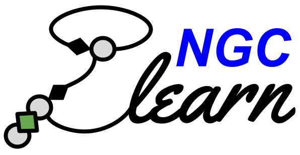
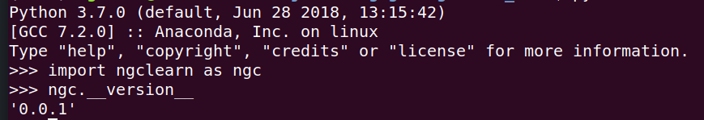

<!--  -->
<!--  -->
<!--  -->

<b>ngc-learn</b> is a Python library for building arbitrary predictive 
processing models based on the neural generative coding (NGC) computational
framework. This toolkit is built on top of Tensorflow 2 and is distributed 
under the 3-Clause BSD license.

It is currently maintained by the 
<a href="https://www.cs.rit.edu/~ago/nac_lab.html">Neural Adaptive Computing (NAC) laboratory</a>.

## <b>Installation:</b>

<i>Setup:</i> Ensure that you have installed the following base dependencies in 
your system. Note that this library was developed and tested on 
Ubuntu 18.04. 
ngc-learn requires:
1) Python (>=3.7)
2) Numpy (>=1.20.0)
3) Tensorflow 2.0.0, specifically, tensorflow-gpu>=2.0.0
4) scikit-learn (>=0.24.2) if using ngclearn.density (needed for the examples/)

Then run the setup script at the top of the <code>ngclearn</code> directory
to have the <code>ngclearn</code> package install on your system using the
following bash command:
<pre>
$ python setup.py install
</pre>

If the installation was successful, you should see the following if you test
it against your Python interpreter, i.e., run the <code>$ python</code> command
and complete the following sequence of steps as depicted in the screenshot below: 

## <b>Documentation</b>

Official documentation, including some tutorials, can be found <a href="">here</a>.

<!--The technical report going over the theoretical underpinnings of the 
    NGC framework can be found here. TO BE RELEASED SOON. -->

<b>Source Code</b>
You can check/pull the latest source code for this library via:
<pre>
$ git clone https://github.com/ngc-learn/ngc-learn.git
</pre>

<b>Attribution:</b>

If you use this code in any form in your project(s), please cite its source
paper:
<pre>
@article{Ororbia2022,
  author={Ororbia, Alexander and Kifer, Daniel},
  title={The neural coding framework for learning generative models},
  journal={Nature Communications},
  year={2022},
  month={Apr},
  day={19},
  volume={13},
  number={1},
  pages={2064},
  issn={2041-1723},
  doi={10.1038/s41467-022-29632-7},
  url={https://doi.org/10.1038/s41467-022-29632-7}
}
</pre>

<b>Development:</b>

Information/updates coming soon on community contributions.

Version:  
0.0.1 Alpha

Author:
Alexander G. Ororbia II
Director, Neural Adaptive Computing (NAC) Laboratory
Rochester Institute of Technology, Department of Computer Science

<b>Copyright:</b>

Copyright (C) 2021 Alexander G. Ororbia II - All Rights Reserved
You may use, distribute and modify this code under the
terms of the BSD 3-clause license.

You should have received a copy of the BSD 3-clause license with
this software. 
If not, please write to: ago@cs.rit.edu 
