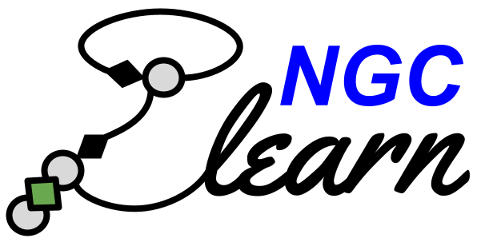

[](https://www.python.org/downloads)[](https://opensource.org/licenses/BSD-3-Clause)[](https://GitHub.com/Naereen/StrapDown.js/graphs/commit-activity)[](http://ngc-learn.readthedocs.io/en/latest/?badge=latest)[](https://zenodo.org/badge/latestdoi/483413212)

<!--  -->


<b>ngc-learn</b> is a Python library for building, simulating, and analyzing biophysical / neurobiological systems, spiking neuronal networks, predictive coding circuitry, and biomimetic (NeuroAI) agents that learn in a biologically-plausible manner. This simulation toolkit, meant to support computational neuroscience and brain-inspired computing research, is built on top of JAX and is distributed under the 3-Clause BSD license.

It is currently maintained by the
<a href="https://www.cs.rit.edu/~ago/nac_lab.html">Neural Adaptive Computing (NAC) laboratory</a>.

## <b>Documentation</b>

Official documentation, including tutorials, can be found
<a href="https://ngc-learn.readthedocs.io/en/latest/#">here</a>. The model museum repo (ngc-museum),
which implements several historical models, can be found
<a href="https://github.com/NACLab/ngc-museum">here</a>.

The official blog-post related to the source paper behind this software library
can be found 
<a href="https://go.nature.com/3rgl1K8">here</a>.<br>
You can find the related paper <a href="https://www.nature.com/articles/s41467-022-29632-7">right here</a>, which
was selected to appear in the Nature <i>Neuromorphic Hardware and Computing Collection</i> in 2023 and was
chosen as one of the <i>Editors' Highlights for Applied Physics and Mathematics</i> in 2022.

## Installation

### Dependencies

ngc-learn requires:
1) Python (>=3.12)
2) NumPy (>=2.5.2)
3) SciPy (>=1.18.1)
4) ngcsimlib (>=3.1.1), (visit official page <a href="https://github.com/NACLab/ngc-sim-lib">here</a>)
5) JAX (>=0.11.1) (to enable GPU use, make sure to install one of the CUDA variants)
<!--
6) networkx  (>=2.6.3) (currently optional but required if using `ngclearn.utils.experimental.viz_utils`)
7) pyviz (>=0.2.0) (currently optional but required if using `ngclearn.utils.experimental.viz_utils`)
-->

---
ngc-learn 3.2.3 and later require Python 3.12 or newer as well as ngcsimlib >=3.1.1. 
ngc-learn's plotting capabilities (routines within `ngclearn.utils.viz`) require
Matplotlib (>=3.11.1) and imageio (>=2.37.4) and both plotting and density estimation
tools (routines within ``ngclearn.utils.density``) will require Scikit-learn (>=1.9.0).
Many of the tutorials will require Matplotlib (>=3.11.1), imageio (>=2.37.4), and Scikit-learn (>=1.9.0).

<i>Note</i>: If you are working with Cuda 12 and want to use jax/jaxlib versions > 0.4.28, you might need to 
check that you are working with the right version of Cudnn (e.g., `nvidia-cudnn-cu12==9.10.2.21`) to ensure 
that all of ngc-learn's internal supported tools, like in-built convolution/deconvolution, compile 
correctly onto the GPU (if using an architecture based on Pascal GPUs, i.e., Compute Capability 6.1, 
combined with NVIDIA Driver 580+). 

**Important Note for Legacy GPU Users (Pascal Architecture)**
> If you are running JAX (`> 0.4.28`) on **CUDA 12** using an older 
> **Pascal-generation GPU** (Compute Capability 6.1, e.g., GTX 1080/1080Ti, Titan X) 
> combined with **NVIDIA Driver 580+**, you might encounter compilation crashes during 
> convolution/deconvolution operations (such as `unknown cudnn status: 5003`).
> 
> Newer versions of `nvidia-cudnn-cu12` have dropped critical hardware support for 
> these legacy architectures. To fix this and ensure `ngclearn` compiles correctly 
> on your GPU, you will need to explicitly "pin" your cuDNN library version using 
> this command (after installing Cuda-12 JAX):
>
> ```bash
> pip install --force-reinstall "nvidia-cudnn-cu12==9.10.2.21"
> ```

### User Installation

<i>Setup</i>: The easiest way to install ngc-learn is through <code>pip</code>:
<pre>
$ pip install ngclearn
</pre>

Note that installing the official pip package without any form of JAX installed
on your system will default to downloading the CPU version of ngc-learn; make
sure you have installed the Cuda 12 version of Jax/Jaxlib on your system before
running the above pip command if you want to use the GPU version.

The documentation includes more detailed
<a href="https://ngc-learn.readthedocs.io/en/latest/installation.html">installation instructions</a>.
Note that this library was developed on Ubuntu 20.04/22.04 and tested on Ubuntu(s) 20.04 and 22.04.

If the installation was successful, you should see the following if you test
it against your Python interpreter, i.e., run the <code>$ python</code> command
and complete the following sequence of steps as depicted in the screenshot below
(you should see at the bottom of your output something akin to the
right major and minor version of ngc-learn):

```console
Python 3.12.13 (main, MONTH  DAY YEAR, TIME) [GCC XX.X.X] on linux
Type "help", "copyright", "credits" or "license" for more information.
>>> import ngclearn
>>> ngclearn.__version__
'3.2.3'
```

<i>Note:</i> For access to the previous Tensorflow-2 version of ngc-learn (of
which we no longer support), please visit the repo for
<a href="https://github.com/NACLab/ngc-learn-legacy"><i>ngc-learn-legacy</i></a>.

## <b>Attribution:</b>

If you use this code in any form in your project(s), please cite its source
paper (as well as ngc-learn's official software citation):
<pre>
@article{Ororbia2022,
  author={Ororbia, Alexander and Kifer, Daniel},
  title={The neural coding framework for learning generative models},
  journal={Nature Communications},
  year={2022},
  month={Apr},
  day={19},
  volume={13},
  number={1},
  pages={2064},
  issn={2041-1723},
  doi={10.1038/s41467-022-29632-7},
  url={https://doi.org/10.1038/s41467-022-29632-7}
}
</pre>

## <b>Development:</b>

We warmly welcome community contributions to this project. For details on how to
make a contribution to ngc-learn, please see our
[contributing guidelines](CONTRIBUTING.md).

<b>Source Code</b>
You can check/pull the latest source code for this library via:
<pre>
$ git clone https://github.com/NACLab/ngc-learn.git
</pre>

If you are working on and developing with ngc-learn pulled from the github
repo, then run the following command to set up an editable install:
<pre>
$ python install -e .
</pre>

**Version:**<br>
3.2.2

Author:
Alexander G. Ororbia II<br>
Director, Neural Adaptive Computing (NAC) Laboratory<br>
Rochester Institute of Technology, Department of Computer Science

## <b>Copyright:</b>

Copyright (C) 2021 The Neural Adaptive Computing Laboratory - All Rights Reserved<br>
You may use, distribute and modify this code under the
terms of the BSD 3-clause license.

You should have received a copy of the BSD 3-clause license with
this software.<br>
If not, please [email us](mailto:ago@cs.rit.edu)
