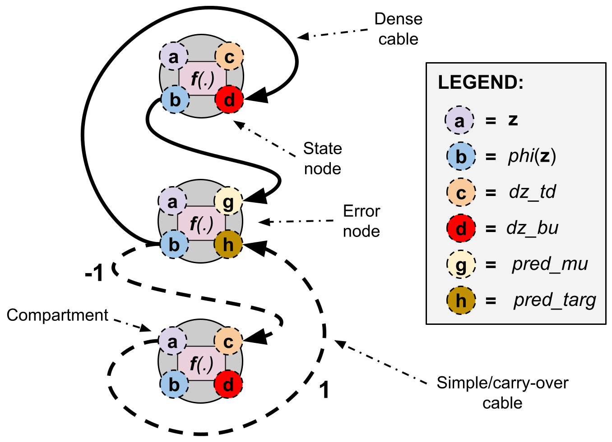
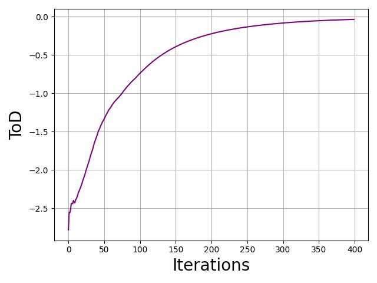
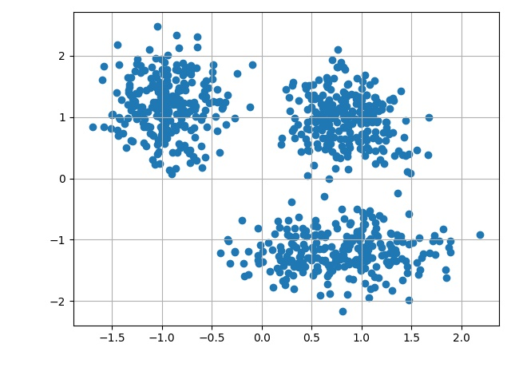
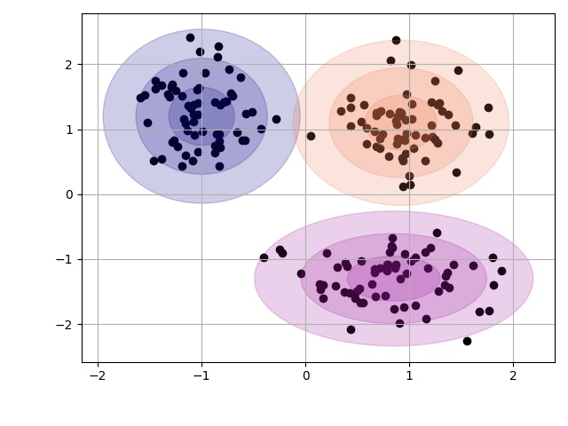
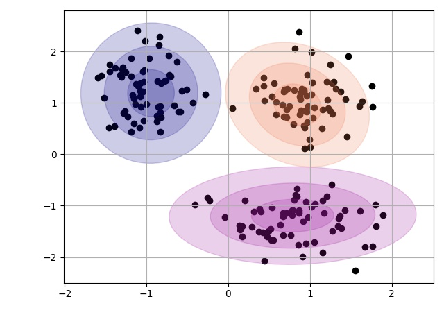

# Demo 2: Creating Custom NGC Predictive Coding Systems

In this demonstration, we will learn how to craft our own custom NGC system
using ngc-learn's fundamental building blocks -- nodes and cables. After going
through this demonstration, you will:

1. Be familiar with some of ngc-learn's basic theoretical motivations.
2. Understand ngc-learn's basic building blocks, nodes and cables, and how they
relate to each other and how they are put together in code. Furthermore, you will
learn how to place these connected building blocks into a simulation object to
implement inference and learning.
3. Craft and simulate a custom nonlinear NGC model based on exponential linear units
to learn how to mimic a streaming mixture-based data generating process. In this step,
you will learn how to design an ancestral projection graph to aid in fantasizing data
patterns that look like the target data generating process.

Note that the folder of interest to this demonstration is:
+ `demos/demo2/`: this contains the necessary simulation script

## Theoretical Motivation: Nodes, Compartments, and Cables
At its core, part of ngc-learn's fundamental design is inspired by (neural)
<a href="http://www.scholarpedia.org/article/Neuronal_cable_theory">cable theory </a>,
where neurons, arranged in complex connectivity structures, are viewed as
performing dendritic calculations. In other words, a particular neuron integrates
information from different input signals (for example, those from other neurons), in
often highly nonlinear ways through a complex dendritic tree.

Although modeling a neuronal system through the lens of cable theory is certainly
complex and intricate in of itself, ngc-learn is built in this direction, starting
with the idea a neuron (or a cluster of them) can be viewed as a node, or
[Node](ngclearn.engine.nodes.node) (also see {ref}`node-model`), and each bundle
of synapses that connect nodes can be viewed as a cable, or
[Cable](ngclearn.engine.cables.cable) (also see {ref}`cable-model`).
Each node has different, multiple "compartments" (which are named), which are regions
or slots inside the node that other nodes can deposit information/signals into.
These compartments allow a node to collect information from many different connected/related nodes
and then, within its integration routine (or `step()`), decide how to combine the
different signals in order to calculate its own activity (loosely corresponding to a
rate-coded firing rate -- we will learn how to model spike trains in a later
demonstration). As a result, many nodes and cables yield an NGC system where each
node is itself, in general, a stateful computation (even if we are processing static
data such as images).

## Building and Simulating NGC Systems

### The Building Blocks: Nodes and Cables
With the above aspect of ngc-learn's theoretical framing in mind, we can craft
connectivity patterns of our own by deciding the form that each node and cable
in our system will take. ngc-learn currently offers a few core nodes and cable types
(note ngc-learn is an evolving software framework, so more node/cable types are to come
in future releases, either through the NAC team or community contributions).
The core node type set currently includes `SNode`, `ENode`, and `FNode` (all inheriting
from the `Node` base class) while the current cable type set includes `DCable` and
`SCable` (all inherited from the `Cable` base class).

An `SNode` refers to a stateful node (see [SNode](ngclearn.engine.nodes.snode)),
which is one of the primary nodes you will
work with when crafting NGC systems. A stateful node contains inside of it a cluster
(or block) of neurons, the number of which is controlled through the `dim`
argument. To initialize a state node, we simply invoke the following:

```python
integrate_cfg = {"integrate_type" : "euler", "use_dfx" : True}
prior_cfg = {"prior_type" : "laplace", "lambda" : 0.001}
a = SNode(name="a", dim=64, beta=0.1, leak=0.001, act_fx="relu",
           integrate_kernel=integrate_cfg, prior_kernel=prior_cfg)
```

where we notice that the above creates a state node with `64` neurons that will
update themselves according to an Euler integration step (step size of `0.1` and
a leak of `0.001`) and apply a `relu` post-activation to compute their
post-activity values. Furthermore, notice that a Laplacian prior has been place
over the neural activities within the state `a` (weighted by the strength
coefficient `lambda`) -- such a prior is meant to encourage neural activity values
towards zero (yielding sparser patterns).
A state node, in ngc-learn 0.0.1, contains five key compartments: `dz_td`, `dz_bu`,
`z`, `phi(z)`, and `mask`. `z` represents the actual state values of the neurons
inside the node while the compartment `phi(z)` is the nonlinear transform of `z`
(indicating the application of the node's encoded activation/transfer function,
e.g., `relu` in the case of node `a` in the example above). `dz_td` and `dz_bu`
are state update compartments, where (vector) signals from other nodes are deposited
(and summed together vector-wise), with the notable exception that `dz_bu` can be
weighted by the first derivative of the activation function encoded into the
state node (for example, in `a` above, signals deposited into `dz_bu` are
element-wise multiplied by the `relu` derivative, or `d.phi(z)/d.z = d.relu(z)/d.z`).
While, in principle, any node can be made to deposit into any compartment of another
node, the intentional and primary use of an `SNode` entails letting the node itself
automatically update `z` and `phi(z)` according to the integration function configured
(such as Euler integration) while letting other nodes deposit signal values into
`dz_td` and `dz_bu`. (This demonstration will assume this form of operation.)

While a state node by itself is not all that interesting, when we connect it to
another node, we create a basic computation system where signals are passed from
a source node to a destination node. To connect a node to another node, we need
to wire them together with a `Cable`, which can transform signals between them
with a dense bundle of synapses (as in the case of a `DCable`) or simply carry
along and potentially weight by a fixed scalar multiplication (as in the case of
an `SCable`). For example, if we want to wire node `a` to a node `b` through a
dense bundle of synapses, we would do the following:

```python
a = SNode(name="a", dim=64, beta=0.1, leak=0.001, act_fx="relu",
          integrate_kernel=integrate_cfg, prior_kernel=prior_cfg)
b = SNode(name="b", dim=32, beta=0.05, leak=0.002, act_fx="identity",
          integrate_kernel=integrate_cfg, prior_kernel=None)

init_kernels = {"A_init" : ("gaussian",0.025)}
dcable_cfg = {"type": "dense", "init_kernels" : init_kernels, "seed" : 69}
a_b = a.wire_to(b, src_comp="phi(z)", dest_comp="dz_td", cable_kernel=dcable_cfg)
```

where we note that the cable/wire `a_b`, of type `DCable` (see [DCable](ngclearn.engine.cables.dcable)),
will pull a signal from the `phi(z)` compartment of node `a` and transmit/transform
this signal along the synaptic parameters it embodies (a dense matrix where each synaptic
value is randomly initialized from a zero-mean Gaussian distribution and
standard deviation of `0.025`) and place the resultant signal inside
the `dz_td` compartment of node `b`.

Currently, an `SNode` (in ngc-learn version 0.2.0), integrates over two
compartments -- `dz_td` (top-down pressure signals) and `dz_bu` (bottom-up
potentially weighted signals), and finally combines them through a linear combination
to produce a full update to the internal state compartment `z`. Note that many
external nodes can deposit signal values into each compartment `dz_td` and `dz_bu`
and each new deposit value is directly summed with the current value of the compartment.
For example, a five-node system/circuit could take the following form:

```python
carryover_cable_cfg = {"type": "simple", "coeff": 1.0} # an identity cable
a = SNode(name="a", dim=10, beta=0.1, leak=0.001, act_fx="identity")
b = SNode(name="b", dim=5, beta=0.05, leak=0.002, act_fx="identity")
c = SNode(name="c", dim=2, beta=0.05, leak=0.0, act_fx="identity")
d = SNode(name="d", dim=2, beta=0.05, leak=0.0, act_fx="identity")
e = SNode(name="e", dim=15, beta=0.05, leak=0.0, act_fx="identity")

a_c = a.wire_to(c, src_comp="phi(z)", dest_comp="dz_td", cable_kernel=dcable_cfg)
b_c = b.wire_to(c, src_comp="phi(z)", dest_comp="dz_td", cable_kernel=dcable_cfg)
d_c = d.wire_to(c, src_comp="phi(z)", dest_comp="dz_bu", cable_kernel=carryover_cable_cfg)
e_c = e.wire_to(c, src_comp="phi(z)", dest_comp="dz_bu", cable_kernel=dcable_cfg)
```

where `a` and `b` both deposit signals (which will be summed) into the `dz_td`
compartment of `c` while `d` and `e` deposit signals into the `dz_bu`
compartment of `c`. Crucially notice that we introduce the other type of cable from
`d` to `c`, i.e., an `SCable` (see [SCable](ngclearn.engine.cables.scable)), which
is a simple carry-over cable that we have merely
configured (in the dictionary `carryover_cable_cfg`) to only pass along information
information from node `d` to `c`, simply multiplying the vector by `1.0` (NOTE:
if a simple cable is being used, the dimensionality of the source node and the
destination node should be exactly the same).
Bear in mind that any general `Cable` object is directional -- it only
transmits in the direction of its set wiring pattern (from `src_comp` of its
source node to the `dest_comp` of the destination node). So if it is desired, for
instance, that information flows not only from `a` to `c` but from `c` to `a`,
then one would need to directly wire node `c` back to `a` following a similar
pattern as in the code snippet above. Finally, note that when you wire together
two nodes, they each become aware of this wiring relationship (i.e., node `a`
understands that it feeds into node `c` and node `c` knows that `a` feeds into it).

To learn or adjust the synaptic cables connecting the nodes in the five-node
system we created above, we need to configure the cables themselves to use
a local Hebbian-like update. For example, if we want the cable `a_c` to evolve
over time, we notify the node that it needs to update according to:

```python
a_c.set_update_rule(preact=(a,"phi(z)"), postact=(c,"phi(z)"), param=["A"])
```

where the above sets a (two-factor) Hebbian update that will compute an adjustment
matrix of the same shape as the underlying synaptic matrix that connects `a` to
`c` (essentially a product of post-activation values in `a` with post-activation
values in `c`). Notice that a pre-activation term (`preact`) requires a 2-tuple
containing a target node object and a string denoting which compartment within
that node to extract information from to create the pre-synaptic Hebbian term.
(`postact` refers to the post-activation term, the argument itself following the
same format at `preact`).

Beyond the `SNode`, we need to study one more important
type of node -- the `ENode` (see [ENode](ngclearn.engine.nodes.enode)). While,
in principle, one could build a complete NGC system with just state nodes and
cables (which will be the subject of future
demonstrations/tutorials), an important aspect of NGC computation we have not
addressed is that of the `error neuron`, represented in ngc-learn by an `ENode`.
An `ENode` is a special type of node that performs a mismatch calculation (or a
computation that compares how far off one quantity is from another) and is, in
fact, a mathematical simplification of a state node known as a fixed-point.
In short, one can simulate a mismatch calculation over time by simply modeling
the final result such as the (vector) subtraction of one value from another. In
ngc-learn (up and including version 0.2.0), in addition to `z` and `phi(z)`,
the `ENode` also contains the key following compartments: `pred_mu`, `pred_targ`,
and `L`. `pred_mu` is a compartment that contains a summation
of deposits that represent an external signals that form a "prediction" (or expectation)
while `pred_targ` is a compartment that contains a summation of external signals
that form a "target" (or desired value/signal). `L` is a useful compartment as
this is internally calculated by the error node to represent the loss function by which
the fixed-point calculation is derived, i.e., in the case of simple subtraction where
`pred_mu - pred_targ`, this would mean that the error node is calculating the first
derivative of the mean squared error (MSE).

Now that we know how an error node works, let us create a simple 3-node circuit
that leverages an error node mismatch computation:

```python
init_kernels = {"A_init" : ("gaussian",0.025)}
dcable_cfg = {"type": "dense", "init_kernels" : init_kernels, "seed" : 69}
pos_carryover = {"type": "simple", "coeff": 1.0}
neg_carryover = {"type": "simple", "coeff": -1.0}

# Notice that we make b and e have the same dimension (10) given that we
# want to wire their information exchange paths with SCable(s)

a = SNode(name="a", dim=20, beta=0.05, leak=0.001, act_fx="identity")
b = SNode(name="b", dim=10, beta=0.05, leak=0.002, act_fx="identity")
e = ENode(name="e", dim=10)

# wire the states a and b to error neurons/node e
a_e = a.wire_to(e, src_comp="phi(z)", dest_comp="pred_mu", cable_kernel=dcable_cfg)
b_e = b.wire_to(e, src_comp="z", dest_comp="pred_targ", cable_kernel=pos_carryover)

# wire error node e back to nodes a and b to provide feedback to their states
e.wire_to(a, src_comp="phi(z)", dest_comp="dz_bu", mirror_path_kernel=(a_e,"A^T"))
e.wire_to(b, src_comp="phi(z)", dest_comp="dz_td", cable_kernel=neg_carryover)

# set up local Hebbian updates for a_e
a_e.set_update_rule(preact=(a,"phi(z)"), postact=(e,"phi(z)"), param=["A"])
```

where we see that node `a` deposits a prediction signal into the `pred_mu`
compartment of `e` and node `b` deposits a target signal into the `pred_targ`
compartment of `e` (where a simple cable `pos_carryover` will just multiply
this signal by `1` and dump it into the appropriate compartment). Notice that we
have wired `e` back to `a` using a special flag/argument in the `wire_to()` routine,
i.e., `mirror_path_kernel`. This special argument simply takes in a 2-tuple where
the first element is the physical cable object we want to reuse while the second
is a string flag telling ngc-learn how to re-use the cable (in this case, `A^T`,
which means that we use the transpose of the underlying weight matrix contained
inside of the dense cable `a_e`). Also observe that `e` has been wired back to
node `b` with a simple cable that multiplies the post-activation of `e` by `-1`.
The above 3-node circuit we have built is illustrated in the diagram below.



Before we turn our attention to simulating the interactions/processing of the
above nodes and cables, there is one more specialized node worthy of mention --
the forward node or `FNode` (see [FNode](ngclearn.engine.nodes.fnode)).
This node is simple -- it only contains three
compartments: `dz`, `z`, and `phi(z)`. An `FNode` operates much like an `SNode`
except that it fundamentally is "stateless" -- external nodes deposit signals
into `dz` (where multiple deposits are vector summed) and then this value is
directly and automatically placed inside of `z` after which an encoded activation
function is applied to compute `phi(z)`. Note that an `SNode` can be modified
to also behave like an `FNode` by setting its argument `.zeta` (or the amount of
recurrent carry-over inside the neural state dynamics) equal to `0` and
setting `beta` to `1`. However, the `FNode` is a convenience node and is often
used to build an ancestral projection graph, of which we will describe later.

### Simulating Connected Nodes as Systems with the NGCGraph

Now that we have a basic grasp as to how nodes and cables can be instantiated
and connected to build neural circuits, let us examine the final key step required to
build an NGC system -- the simulation object `NGCGraph`
(see [NGCGraph](ngclearn.engine.ngc_graph)).

An `NGCGraph` is a general structure that will take in nodes that have been wired
together with cables and simulate their evolution/processing over time. This structure
crucially allows us to specify the execution sequence of nodes (or order of operations)
within a discrete step of simulation time.
It also provides several basic utility functions to facilitate analysis of the internal
nodes. In this demo, we will focus on the core primary low-level routines one will want
to conduct most simulations, i.e., `set_cycle()`, `settle()`, `apply_constraints()`,
`calc_updates()`, `clear()`, and `extract()`. (Note that higher-level convenience
functions that combine all of these functions together, like `evolve()`, could be used,
 but we will not cover them in this demonstration.)
Let us take the five node circuit we built earlier and place them in a system simulation:

```python
model = NGCGraph(K=5)
model.proj_update_mag = -1.0 # bound the calculated synaptic updates (<= 0 turns this off)
model.proj_weight_mag = 1.0 # constrain the Euclidean norm of the rows of each synaptic matrix
model.set_cycle(nodes=[a,b,c,d]) # execute nodes a through d (in order left to right)
model.set_cycle(nodes=[e]) # execute node e
model.apply_constraints() # immediately applies constraints to synapses after initialization
model.compile(batch_size=1)
```

where the above seven lines of code create a full NGC system using the nodes and cables
we set before. The `set_cycle()` function takes in a list/array of nodes and
tells the underlying `NGCGraph` system to execute them (in the order of their appearance
within the list) first at each step in time. Making multiple subsequent calls
to `set_cycle()` will add in addition execution cycles to an NGC system's step.
Note that one simulation step of an `NGCGraph` consists of multiple cycles, executed
in the order of their calls when the simulation object was initialized. For example,
one step of our "model" object above would first execute the internal `.step()`
functions of `a`, `b`, `c`, then `d` in the first cycle and then execute the
`.step()` of `e` in the second cycle. Also observe that in our `NGCGraph` constructor,
we have told ngc-learn that simulations are only ever to be `K=5` discrete time steps long.
Finally note that, when you set execution cycles for an `NGCGraph`, ngc-learn
will examine the cables you wired between nodes and extract any learnable
synaptic weight matrices into a parameter object `.theta`.

The final item to observe in the code snippet above is the call to `compile()`
routine. This function is run after putting together your `NGCGraph` in order
to ensure the entire system is self-coherent and set up to work correctly with
the underlying static graph compilation used by Tensorflow 2 to drastically
speed up your code (Note: the `compile()` routine and static graph optimization
was integrated into ngc-learn version 0.2.0 onward.) The only argument you
need to set for `compile()` is the `batch_size` argument -- you must decide
what fixed batch size you will use throughout simulation so that way ngc-learn
can properly compile a static graph in order to optimize the underlying code
for fast in-place memory calculations and other computation graph specific
items. Note that if you do not wish to use ngc-learn's static graph optimization, simply
set the `use_graph_optim` to `False` via `.compile(use_graph_optim=False)`, which
will allow you to use variable-length batch sizes (at the cost of a bit slower
computation).

With the above code, we are now done building the NGC system and can
begin using it to process and adapt to sensory data. To make our five-node circuit
process and learn from a single data pattern, we would then write the following:

```python
opt = # ... set some TF optimization algorithm, such as SGD, here ...
x = tf.ones([1,10])
readouts = model.settle(
                clamped_vars=[("c","z",x)],
                readout_vars=[("a","phi(z)"),("b","phi(z)"),("d","phi(z)"),("e","phi(z)")]
            )
print("The value of {} w/in Node {} is {}".format(readouts[0][0], readouts[0][1], readouts[0][2].numpy()))
# update synaptic parameters given current model internal state
delta = model.calc_updates()
opt.apply_gradients(zip(delta, model.theta)) # apply a TF optimizer here
model.apply_constraints()
model.clear() # reset the underlying node states back to resting values
```

where we have crafted a trivial example of processing a vector of ones (`x`),
clamping this value to node `c`'s compartment `z` (note that clamping means we
fix the node's compartment to a specific value and never let it evolve throughout
simulation), and then read out the value of the `phi(v)` compartment of nodes
`a`, `b`, `c`, and `e`. The `readout_vars` argument to `settle()` allows us to
tell an `NGCGraph` which nodes and which compartments we want to observe after it
run its simulated settling process over `K=5` steps. An `NGCGraph` saves the
output of `settle()` into the `readouts` variable which is a list of triplets
of the form `[(node_name, comp_name, value),...]` and, in the example, above we
are deciding to print out the first node's value (in its set `phi(z)` compartment).
After the `NGCGraph` executes its settling process, we can then tell it to update
all learnable synaptic weights (only for those cables that were configured to use a
Hebbian update with `set_update_rule()`) via the `calc_updates()`, which itself
returns a list of the synaptic weight adjustments, in the order of the synaptic
matrices the `NGCGraph` object placed inside of `.theta`.

Desirably, after you have obtained `delta` from `calc_updates()`, you can then use
it with a standard Tensorflow 2 adaptive learning rate such as stochastic gradient
descent or Adam. An important point to understand is that an NGC system attempts
to maximize its total discrepancy, which is a negative quantity that it would like
to be at zero (meaning all local losses within it have reached an equilibrium at zero) --
this is akin to optimizing the approximate free energy of the system. Internally,
an `NGCGraph` will multiply the Hebbian updates by a negative coefficient to allow
the user to directly use an external minimizer from a library such as Tensorflow.

After updating synaptic matrices using a Tensorflow optimizer, one then
calls `apply_constraints()` to ensure any weight matrix constraints are applied after
updating, finally ending with a call to `clear()`, which resets the values of all
nodes in the `NGCGraph` back to zero (or a resting state). (Note that if you do
not want the NGC system to reset its internal nodes back to resting zero states, then
simply do not call `clear()` -- for example, on a
long temporal data stream such as a video feed, you might not want to reset the
NGC system back to its zero-resting state until the video clip terminates).

## Learning a Data Generating Process: A Streaming NGC Model

Now that we familiarized ourselves with the basic mechanics of nodes and cables
as well as how they fit within a simulation graph, let us apply our knowledge to build
a nonlinear NGC generative model that learns to mimic a streaming data generating
process. Note that this part of the demonstration corresponds to the materials/scripts
provided within `demos/demo2/`.

In ngc-learn, within the `generator` module, there are a few data
generators to facilitate prototyping and simulation studies. Simulated data
generating processes can be used in lieu of real datasets and are useful for
early preliminary experimentation and proof-of-concept demonstrations (in statistics,
such experiments are called "simulation studies").
In this demonstration, we will take a look at the `MoG` (mixture of Gaussians, see
[MoG](ngclearn.generator.static.mog)) static data generating process.
Data generating processes in ngc-learn typically offer a method called `sample()` and,
depending on the type of process being used, with process-specific arguments.
In the `MoG` process, we can initialize a non-temporal (thus "static") process
as follows:

```python
# ...initialize mu1, mu2, mu3, cov1, cov2, cov3...
mu_list = [mu1, mu2, mu3]
sigma_list = [cov1, cov2, cov3]
process = MoG(means=mu_list, covar=sigma_list, seed=69)
```

where the above creates a fixed mixture model of three multivariate Gaussian
distributions (each component has an equal probability of being sampled by default
in the `MoG` object). In the demonstration script
`sim_dyn_train.py`, you can see what specific mean and covariance values we
have chosen (for simplicity, we set our problem space to be two-dimensional and
have each covariance matrix designed to be explicitly diagonal). The advantage
of a data generator that we will exploit in this demonstration
is the fact that it can be queried online, i.e., we can call its `sample()` function
to produce fresh data sampled from its underlying generative process. This will allow  
us to emulate the scenario of training an NGC system on a data stream (as opposed to
a fixed dataset like we did in the first demonstration).

With the data generating process chosen and initialized, we now turn to our NGC
generative model. The model we will construct will be a nonlinear model with
three layers -- a sensory layer `z0` and two latent neural variable layers `z1` and `z2`.
The post-activation for `z1` will be the exponential linear rectifier unit (ELU)
while the second layer will be set to the identity and bottle-necked to a two-dimensional
code so we can visualize the top-most latents easily later.
Our goal will be train our NGC model for several iterations and then use it to
synthesize/fantasize a new pool of samples, one for each known component of our
mixture model (since each component represents a "label") where we will finally estimate
the sample mean and covariance of each particular pool to gauge how well the model
has been fit to the mixture process.

We create the desired NGC model as follows:

```python
batch_size = 32
# create cable wiring scheme relating nodes to one another
wght_sd = 0.025 #0.025 #0.05
init_kernels = {"A_init" : ("gaussian",wght_sd)}
dcable_cfg = {"type": "dense", "init_kernels" : init_kernels, "seed" : 69}
pos_scable_cfg = {"type": "simple", "coeff": 1.0}
neg_scable_cfg = {"type": "simple", "coeff": -1.0}
constraint_cfg = {"clip_type":"norm_clip","clip_mag":1.0,"clip_axis":1}

z2_mu1 = z2.wire_to(mu1, src_comp="phi(z)", dest_comp="dz_td", cable_kernel=dcable_cfg)
z2_mu1.set_constraint(constraint_cfg)
mu1.wire_to(e1, src_comp="phi(z)", dest_comp="pred_mu", cable_kernel=pos_scable_cfg)
z1.wire_to(e1, src_comp="z", dest_comp="pred_targ", cable_kernel=pos_scable_cfg)
e1.wire_to(z2, src_comp="phi(z)", dest_comp="dz_bu", mirror_path_kernel=(z2_mu1,"A^T"))
e1.wire_to(z1, src_comp="phi(z)", dest_comp="dz_td", cable_kernel=neg_scable_cfg)

z1_mu0 = z1.wire_to(mu0, src_comp="phi(z)", dest_comp="dz_td", cable_kernel=dcable_cfg)
z1_mu0.set_constraint(constraint_cfg)
mu0.wire_to(e0, src_comp="phi(z)", dest_comp="pred_mu", cable_kernel=pos_scable_cfg)
z0.wire_to(e0, src_comp="phi(z)", dest_comp="pred_targ", cable_kernel=pos_scable_cfg)
e0.wire_to(z1, src_comp="phi(z)", dest_comp="dz_bu", mirror_path_kernel=(z1_mu0,"A^T"))
e0.wire_to(z0, src_comp="phi(z)", dest_comp="dz_td", cable_kernel=neg_scable_cfg)

# set up update rules and make relevant edges aware of these
z2_mu1.set_update_rule(preact=(z2,"phi(z)"), postact=(e1,"phi(z)"), param=["A"])
z1_mu0.set_update_rule(preact=(z1,"phi(z)"), postact=(e0,"phi(z)"), param=["A"])

# Set up graph - execution cycle/order
model = NGCGraph(K=K)
model.set_cycle(nodes=[z2,z1,z0])
model.set_cycle(nodes=[mu1,mu0])
model.set_cycle(nodes=[e1,e0])
model.apply_constraints()
model.compile(batch_size=batch_size)
```

which constructs the model the three-layer system, which we can also depict with
the following ngc-learn design shorthand:

```
Node Name Structure:
z2 -(z2-mu1)-> mu1 ;e1; z1 -(z1-mu0-)-> mu0 ;e0; z0
```

One interesting thing to note is that, in the `sim_dyn_train.py` script, we also
create an ancestral projection graph (or a co-model) in order to conduct the
sampling we want to do after training. An ancestral projection graph `ProjectionGraph`
(see [ProjectionGraph](ngclearn.engine.proj_graph)), which is
useful for doing things like ancestral sampling from a directed generative model,
should generally be created after an `NGCGraph` object has been instantiated.
Doing so, as seen in `sim_dyn_train.py`, entails writing the following:

```python
# build an ancestral sampling graph
z2_dim = model.getNode("z2").dim
z1_dim = model.getNode("z1").dim
z0_dim = model.getNode("z0").dim
# Set up complementary sampling graph to use in conjunction w/ NGC-graph
s2 = FNode(name="s2", dim=z2_dim, act_fx="identity")
s1 = FNode(name="s1", dim=z1_dim, act_fx="elu")
s0 = FNode(name="s0", dim=z0_dim, act_fx="identity")
s2_s1 = s2.wire_to(s1, src_comp="phi(z)", dest_comp="dz", mirror_path_kernel=(z2_mu1,"A"))
s1_s0 = s1.wire_to(s0, src_comp="phi(z)", dest_comp="dz", mirror_path_kernel=(z1_mu0,"A"))
sampler = ProjectionGraph()
sampler.set_cycle(nodes=[s2,s1,s0])
sampler.compile()
```

Creating a `ProjectionGraph` is rather similar to creating an `NGCGraph` (notice
that we chose to use `FNode`(s) since they work well for feedforward projection schemes).
However, we should caution that the design of a projection graph should meaningfully mimic
what one would envision is the underlying directed, acyclic generative model embodied  
by their `NGCGraph` (it helps to draw out/visualize the dot-and-arrow structure you
want graphically first, using similar shorthand as we presented for our model above,
in order to then extract the underlying generative model the system implicitly learns).
A few important points we followed for designing the projection graph above:
1) the number (dimensionality) of nodes should be the same as the state nodes in the NGC system,
i.e., `s2` corresponds to `z2`, `s1` corresponds to `z1`, and `s0` corresponds to `z0`;  
2) the cables connecting the nodes should directly share the exact synaptic matrices
between each key layer of the original NGC system, i.e., the cable `s2_s1` points
directly to/re-uses cable `z2_mu1` and cable `s1_s0` points
directly to/re-uses cable `z1_mu0` (note that we use the special argument `A` in the
`wire_to()` function that allows directly shallow-copying/linking between relevant cables).
Notice that we used another one of the `NGCGraph` utility functions -- `getNode()` --
which directly extracts a whole `Node` object from the graph, allowing one to
quickly call its internal data members such as its dimensionality `.dim`.

With the above `NGCGraph` and `ProjectionGraph` now created, we can now train
our model by sampling the `MoG` data generator online as follows:

```python
ToD = 0.0
Lx = 0.0
Ns = 0.0
alpha = 0.99 # fading factor
for iter in range(n_iterations):

    x, y = process.sample(n_s=batch_size)
    Ns = x.shape[0] + Ns * alpha

    # conduct iterative inference & update NGC system
    readouts, delta = model.settle(
                        clamped_vars=[("z0","z",x)],
                        readout_vars=[("mu0","phi(z)"),("mu1","phi(z)")]
                      )
    x_hat = readouts[0][2]

    ToD = calc_ToD(model) + ToD * alpha # calc ToD
    Lx = tf.reduce_sum( metric.mse(x_hat, x) ) + Lx * alpha
    # update synaptic parameters given current model internal state
    for p in range(len(delta)):
        delta[p] = delta[p] * (1.0/(x.shape[0] * 1.0))
    opt.apply_gradients(zip(delta, model.theta))
    model.apply_constraints()
    model.clear()

    print("\r{} | ToD = {}  MSE = {}".format(iter, ToD/Ns, Lx/Ns), end="")
print()
```

where we track the total discrepancy (via a custom `calc_ToD()` also written for
you in `sim_dyn_train.py`, much as we did in Demonstration \# 1) as well as the
mean squared error (MSE). Notably, for online streams, we track a particularly
useful form of both metrics -- prequential MSE and prequential ToD -- which are
essentially adaptations of the prequential error measurement [1] used to track
the online performance of classifiers/regressors on data streams. We will
plot the prequential ToD at the end of our simulation script, which will yield a plot
that should look similar to (where we see that ToD is maximized over time):



Finally, after training, we will examine how well our NGC system learned to
mimic the `MoG` by using the co-model projection graph we created earlier.
This time, our basic process for sampling from the NGC model is simpler than
in Demonstration \# 1 where we had to learn a density estimator to serve as our
model's prior. In this demonstration, we will approximate the modes of
our NGC's model's prior by feeding in batches of test samples drawn from the
`MoG` process, about `64` samples per component, running them through the `NGCGraph`
to infer the latent `z2` for each sample, estimate the latent mean and covariance
for mode, and then use these latent codes to sample from and project through
our `ProjectionGraph`. This will get us our system's fantasized samples
from which we can estimate the generative model's mean and
covariance for each pool, allowing us visually compare to the actual mean and covariance
of each component of the `MoG` process.
This we have done for you in the `sample_system()` routine, shown below:

```python
def sample_system(Xs, model, sampler, Ns=-1):
    readouts, _ = model.settle(
                    clamped_vars=[("z0","z",tf.cast(Xs,dtype=tf.float32))],
                    readout_vars=[("mu0","phi(z)"),("z2","z")],
                    calc_delta=False
                  )
    z2 = readouts[1][2]
    z = z2
    model.clear()
    # estimate latent mode mean and covariance
    z_mu = tf.reduce_mean(z2, axis=0, keepdims=True)
    z_cov = stat.calc_covariance(z2, mu_=z_mu, bias=False)
    z_R = tf.linalg.cholesky(z_cov) # decompose covariance via Cholesky
    if Ns > 0:
        eps = tf.random.normal([Ns, z2.shape[1]], mean=0.0, stddev=1.0, seed=69)
    else:
        eps = tf.random.normal(z2.shape, mean=0.0, stddev=1.0, seed=69)
    # use the re-parameterization trick to sample this mode
    Zs = z_mu + tf.matmul(eps,z_R)
    # now conduct ancestral sampling through the directed generative model
    readouts = sampler.project(
                    clamped_vars=[("s2","z", Zs)],
                    readout_vars=[("s0","phi(z)")]
                )
    X_hat = readouts[0][2]
    sampler.clear()
    # estimate the mean and covariance of the sensory sample space of this mode
    mu_hat = tf.reduce_mean(X_hat, axis=0, keepdims=True)
    sigma_hat = stat.calc_covariance(X_hat, mu_=mu_hat, bias=False)
    return (X_hat, mu_hat, sigma_hat), (z, z_mu, z_cov)
```

Note inside the `sim_dyn_train.py` script, we have also written several helper functions
for plotting the latent variables, input space samples, and the data generator and
model-estimated input means/covariances. We have set the number of training iterations
to be `400` and the online mini-batch size to be `32` (meaning that we draw `32` samples
from the `MoG` each iteration).

You can now execute the demonstration script as follows:

```console
$ python sim_dyn_train.py
```

and you will see that our exponential linear model produces the following samples:



and results in the following fit (Right) as compared to the original `MoG` process (Left):

Original Process           |  NGC Model Fit
:-------------------------:|:-------------------------:
  |  

We observe that the NGC model does a decent job of learning to mimic the underlying
data generating process, although we can see it is not perfect as a few data points
are not quite captured within its covariance envelope (notably in the orange
Gaussian blob in the top right of the plot).

Finally, we visualize our model's latent space to see how the 2D codes clustered up
and obtain the plot below:


Desirably, we observe that our latent codes have clustered together and yielded a
sufficiently separable latent space (in other words, the codes result in
distinct modes where each mode of the `MoG` is represented a specific blob/grouping
in latent space.).

As a result, we have successfully learned to mimic a synthetic mixture of Gaussians data
generating process with our custom, nonlinear NGC system.


## References
[1] Gama, Joao, Raquel Sebastiao, and Pedro Pereira Rodrigues. "On evaluating
stream learning algorithms." Machine learning 90.3 (2013): 317-346.
