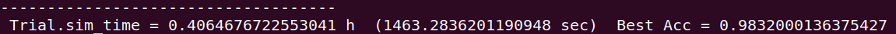
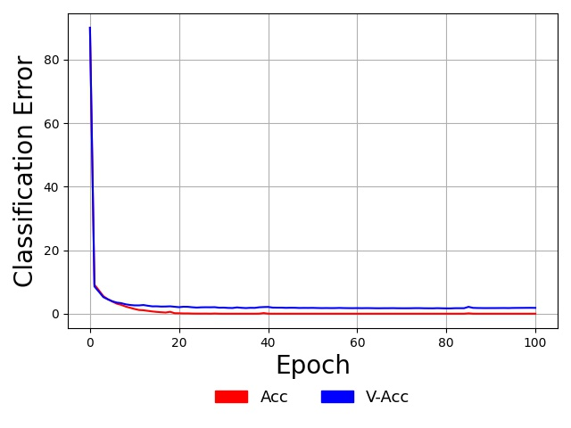

# Demo 3: Creating an NGC Classifier

<i>NOTE: This demonstration is under construction and thus incomplete at the moment...</i>

In this demonstration, we will learn how to create a classifier based on NGC.
After going through this demonstration, you will:

1.  Learn how to use a simple projection graph and the `extract()` routine to
initialize the simulated settling process of an NGC model.
2.  Craft and simulate an NGC model that can directly classify the image
patterns in the MNIST database (from Demonstration \# 1), producing results
comparable to what was reported in (Whittington &amp; Bogacz, 2017).

Note that the folder of interest to this demonstration is:
+ `examples/demo3/`: this contains the necessary simulation script
+ `examples/data`: this contains a zipped copy of the MNIST database arrays

## Using an Ancestral Projection Graph to Initialize the Settling Process

We will start by first discussing an important use-case of the `ProjectionGraph` --
to initialize the simulated iterative inference process of an `NGCGraph`. This is
contrast to the use-case we saw in the last two demonstrations where we used the
ancestral projection graph as a post-training tool, which allowed us to draw
samples from the underlying directed generative models we were fitting. This time,
we will leverage the power of an ancestral projection graph to serve as a
simple, progressively improving model of initial conditions for an iterative inference
process.

To illustrate the above use-case, we will focus on crafting an NGC model for
discriminative learning (as opposed to the generative learning models we built
Demonstrations \# 1 and \#2). Before working with a concrete application, as we
will do in the next section, let us just focus on crafting the NGC architecture
of the classifier as well as its ancestral projection graph.

Working with nodes and cables (see [the last demonstration for details](../demonstrations/demo2_create_ngc.md)),
we will build a simple hierarchical system that adheres to the following NGC shorthand:

```
Node Name Structure:
z2 -(z2-mu1)-> mu1 ;e1; z1 -(z1-mu0-)-> mu0 ;e0; z0
Note that z3 = x and z0 = y, which yields a classifier
```

where we see will design an NGC predictive processing model that contains three
state layers `z0`, `z1`, and `z2` with the special application-specific usage
that, during training, `z0` will be clamped to a label vector `y` (a one-hot encoding
of a single category out of a finite set -- `1`-of-`C` encoding, where `C` is the number of classes)
and `z2` will be clamped to a sensory input vector `x`.
Building the above NGC system entails writing the following:

```python
x_dim = # dimensionality of input space
y_dim = # dimensionality of output/target space
beta = 0.1
leak = 0.0
integrate_cfg = {"integrate_type" : "euler", "use_dfx" : True}
# set up system nodes
z2 = SNode(name="z2", dim=x_dim, beta=beta, leak=leak, act_fx="identity",
           integrate_kernel=integrate_cfg)
mu1 = SNode(name="mu1", dim=z_dim, act_fx="identity", zeta=0.0)
e1 = ENode(name="e1", dim=z_dim)
z1 = SNode(name="z1", dim=z_dim, beta=beta, leak=leak, act_fx="relu6",
           integrate_kernel=integrate_cfg)#, lateral_kernel=lateral_cfg)
mu0 = SNode(name="mu0", dim=y_dim, act_fx="softmax", zeta=0.0)
e0 = ENode(name="e0", dim=y_dim)
z0 = SNode(name="z0", dim=y_dim, beta=beta, integrate_kernel=integrate_cfg, leak=0.0)

# create cable wiring scheme relating nodes to one another
wght_sd = 0.02
dcable_cfg = {"type": "dense", "has_bias": True,
              "init" : ("gaussian",wght_sd), "seed" : 1234}
pos_scable_cfg = {"type": "simple", "coeff": 1.0} # a positive cable
neg_scable_cfg = {"type": "simple", "coeff": -1.0} # a negative cable

z2_mu1 = z2.wire_to(mu1, src_var="phi(z)", dest_var="dz_td", cable_kernel=dcable_cfg)
mu1.wire_to(e1, src_var="phi(z)", dest_var="pred_mu", cable_kernel=pos_scable_cfg)
z1.wire_to(e1, src_var="z", dest_var="pred_targ", cable_kernel=pos_scable_cfg)
e1.wire_to(z2, src_var="phi(z)", dest_var="dz_bu", mirror_path_kernel=(z2_mu1,"symm_tied"))
e1.wire_to(z1, src_var="phi(z)", dest_var="dz_td", cable_kernel=neg_scable_cfg)

z1_mu0 = z1.wire_to(mu0, src_var="phi(z)", dest_var="dz_td", cable_kernel=dcable_cfg)
mu0.wire_to(e0, src_var="phi(z)", dest_var="pred_mu", cable_kernel=pos_scable_cfg)
z0.wire_to(e0, src_var="phi(z)", dest_var="pred_targ", cable_kernel=pos_scable_cfg)
e0.wire_to(z1, src_var="phi(z)", dest_var="dz_bu", mirror_path_kernel=(z1_mu0,"symm_tied"))
e0.wire_to(z0, src_var="phi(z)", dest_var="dz_td", cable_kernel=neg_scable_cfg)

# set up update rules and make relevant edges aware of these
z2_mu1.set_update_rule(preact=(z2,"phi(z)"), postact=(e1,"phi(z)"))
z1_mu0.set_update_rule(preact=(z1,"phi(z)"), postact=(e0,"phi(z)"))

# Set up graph - execution cycle/order
model = NGCGraph(K=5)
model.set_cycle(nodes=[z2,z1,z0])
model.set_cycle(nodes=[mu1,mu0])
model.set_cycle(nodes=[e1,e0])
```

noting that `x_dim` and `y_dim` would be determined by your input dataset's
sensory input design matrix `X` and its corresponding label design matrix `Y`.
Also notice that, in our classifier above, because we will generally be clamping
an input data vector (or batch of them) to `z2`, we chose to encode an `identity`
activation function for that node (we do not want to arbitrarily apply a nonlinear
transform to the input). The activation function of the output prediction node
`mu0` (which will attempt to predict the value of data clamped at `z0`, i.e., the
"label node") has been set to be the `softmax` which will induce a soft form of
competition among the neurons in `mu0` and allow our NGC classifier to produce
probability distribution vectors in its output.

The architecture above could then be readily simulated assuming that we always
have an `x` and a `y` to clamp to its `z2` and `z0` nodes. While it is possible
to then run the same system in the absence of a `y` (as in test-time inference),
we would have to simulate the NGC system for a reasonable number of steps (which
might be greater than the number of steps `K` chosen to facilitate learning) or
until convergence to a fixed-point (or stable attractor). While this approach is
fine in principle, it would be ideal for downstream application use if we could
leverage the underlying directed generative model that the above architecture embodies.
Specifically, even though we crafted our model with discriminative learning as our goal,
the above system is still learning, "under the hood", a generative model, specifically
a conditional generative model of the form `p(y|x)`. Given this insight, we can
take advantage of the fact that ancestral sampling through our model is still possible, just
with the exception that our input samples do not need to come from a prior distribution
(as in the case of the models in Demonstrations \# 1 and \# 2) but instead from
data patterns directly.

To build the corresponding ancestral projection graph for the architecture above,
we would then (adhering to our NGC shorthand and ensuring this co-model graph
follows the information flow through our NGC system -- a design principle/heuristic we
discussed in Demonstration \# 2) write the following:

```python
# build this NGC model's sampling graph
z2_dim = ngc_model.getNode("z2").dim
z1_dim = ngc_model.getNode("z1").dim
z0_dim = ngc_model.getNode("z0").dim
# Set up complementary sampling graph to use in conjunction w/ NGC-graph
s2 = FNode(name="s2", dim=z2_dim, act_fx="identity")
s1 = FNode(name="s1", dim=z1_dim, act_fx=act_fx)
s0 = FNode(name="s0", dim=z0_dim, act_fx=out_fx)
s2_s1 = s2.wire_to(s1, src_var="phi(z)", dest_var="dz", point_to_path=z2_mu1)
s1_s0 = s1.wire_to(s0, src_var="phi(z)", dest_var="dz", point_to_path=z1_mu0)
sampler = ProjectionGraph()
sampler.set_cycle(nodes=[s2,s1,s0])
```

which explicitly instantiates the conditional generative embodied by the NGC
system we built earlier, allowing us to easily sample from it. If one wanted
NGC shorthand for the above conditional generative model, it would be:

```
Node Name Structure:
s2 -(s2-s1)-> s1 -(s1-s0-)-> s0
Note: z3 = x, which yields the model p(s0=y|x)
Note: s2-s1 = z2-mu1 and s1-s0 = z1-mu0
```

where we have highlighted that we are sharing (or shallow copying) the exact
synaptic connections (`z2-mu1` and `z1-mu0`) from the NGC system above into those
of our directed generative model (`s2-s1` and `s1-s0`). Note that, after training
the earlier NGC system on a database of images and their respective labels, we
could then classify, at test-time, each unseen pattern using the conditional
generative model directly (instead of the settling process of the original NGC system),
like so:

```python
y = # test label/batch sampled from the test-set
x = # test data point/batch sampled from the test-set
readouts = self.ngc_sampler.project(
                clamped_vars=[("s2","z",x)],
                readout_vars=[("s0","phi(z)")]
            )
y_hat = readouts[0][2] # get probability distribution p(y|x)
```

Given our ancestral projection graph, we can now revisit our original goal
of improving our NGC system's learning process by tying together our ancestral
projection graph back with the simulation system itself. To do so, all we need to
is make use of two functions, i.e., `extract()` and `inject()`, provided by
both the `ProjectionGraph` and `NGCGraph` objects. Tying together the two objects
would then work as follows (below we emulate one step of online learning):

```python
y = # test label/batch sampled from the test-set
x = # test data point/batch sampled from the test-set

# first, run the projection graph
readouts = self.ngc_sampler.project(
                clamped_vars=[("s2","z",x)],
                readout_vars=[("s0","phi(z)")]
            )

# second, extract data from the ancestral projection graph
s2 = sampler.extract("s2","z")
s1 = sampler.extract("s1","z")
s0 = sampler.extract("s0","z")

# third, initialize the simulated NGC system with the above information
model.inject("z2", ("z", s2)) # <-- this is redundant & can be omitted - we will be clamping x to it as below
model.inject("mu1", ("z", s1)) # initialize expectation of z2
model.inject("z1", ("z", s1))  # initialize z1
model.inject("mu0", ("z", s0))  # initialize expectation of z1

# finally, run/simulate the NGC system as normal
readouts = model.settle(
                clamped_vars=[("z2","z",x),("z0","z",y)],
                readout_vars=[("mu0","phi(z)"),("mu1","phi(z)")]
            )
y_hat = readouts[0][2]
delta = model.calc_updates()
for p in range(len(delta)):
    delta[p] = delta[p] * (1.0/(x.shape[0] * 1.0))
opt.apply_gradients(zip(delta, model.theta))
model.clear()
sampler.clear()
```

where we see that, after we first run the ancestral projection graph, we then
extract the internal values from the `s1` and `s0` nodes (from their `z` compartments)
and inject these into the relevant spots inside the NGC system, i.e., we place the
reading in the `z` compartment of `s1` into the `z` compartment of `mu1` and `z1`
(since we don't want the error neuron `e1` to find any mismatch in the first time step
of the settling process of `model`) and the `z` compartment of `s0` into the `z`
compartment of `mu0` (to ensure that, since we will be clamping `y` to the `z`
compartment of `z0`, we want the mismatch signal simulated to be the different
between bottom layer prediction `mu0` and the label at the very first time step
of the settling process of `model`).
In short, we just want the initial conditions of the settling process for `model`
to be such that its state `z1` matches the expectation `mu1` of `z2` (clamped to `x`)
and the expectation `mu0` of `z1` is being initially compared to the state of `z0`
(clamped to the label `y`).
Note that when values are "injected" into a NGC system through `inject()`, they will
not persist after the first step of its settling process -- they will evolve
according to its current node dynamics. If you did not want a node to evolve at all
remain fixed at the value you embed/insert, then you would use the `clamp()` function
instead (which is what is being used internally to clamp variables in the `clamped_vars`
argument of the `settle()` function above).

The three-layer hierarchical classifier above turns out to be very similar to the
one implemented in ngc-learn's Model Museum -- the [GNCN-t1-FFM](../museum/gncn_t1_ffm.md),
which is a four-layer discriminative NGC system that emulates the model investigated
in [1]. We will import and use this slightly deeper model in the next part of this
demonstration.

## Learning a Classifier

Now that we have seen how to design an NGC classifier and build a projection graph
that allows us to directly use the underlying conditional generative model of `p(y|x)`,  
we have a powerful means to initialize our system's internal nodes to something
meaningful and task-specific (instead of the default zero-vector initialization) as
well as a fast label prediction model as an important by-product of the discriminative
learning that our code will be doing. Having a fast model for test-time inference
is useful not only for quickly tracking generalization ability throughout training
(using a validation subset of data points) but also for downstream uses of the
learning generative model -- for example, one could extract the synaptic weight
matrices inside the ancestral projection graph, serialize them to disk, and place
them inside a multi-layer perceptron structure with the same layer sizes/architecture
built pure Tensorflow or Pytorch.

Specifically, we will fit a supervised NGC classifier using the labels that come
with the processed MNIST dataset, in `mnist.zip` (which you worked with in Demonstration \# 1).
For this part of the demonstration, we will import the full model of [1], You will
notice in the provided training script `sim_train.py`, we import the `GNCN-t1-FFM`
(the NGC classifier model) in the header:

```python
from ngclearn.museum.gncn_t1_ffm import GNCN_t1_FFM
```

which is initialized as later in the code as:

```python
args = # ...the Config object loaded in earlier...

agent = GNCN_t1_FFM(args) # set up NGC model
```

and then proceed to write/design a training process very similar in design to
the one we wrote in Demonstration \# 1. The key notable differences are now that
we are:

1.  using labels along with the input sensory samples, meaning we need to tell
the `DataLoader` management object that there is a label design matrix to sample
that maps one-to-one with the image design matrix, like so:

```python
xfname = # ...the design matrix X file name loaded in earlier...
yfname = # ...the design matrix Y file name loaded in earlier...
args = # ...the Config object loaded in earlier...
batch_size = # ... number of samples to draw from the loader per training step ...

# load data into memory
X = ( tf.cast(np.load(xfname),dtype=tf.float32) ).numpy()
x_dim = X.shape[1]
args.setArg("x_dim",x_dim) # set the config object "args" to know of the dimensionality of x
Y = ( tf.cast(np.load(yfname),dtype=tf.float32) ).numpy()
y_dim = Y.shape[1]
args.setArg("y_dim",y_dim) # set the config object "args" to know of the dimensionality of y
# build the training set data loader
train_set = DataLoader(design_matrices=[("z3",X),("z0",Y)], batch_size=batch_size)
```

2.  we are now using the NGC model's ancestral projection graph to make label predictions
in our `eval_model()` function and we now globally track `Acc` instead of `ToD` (since
the projection graph does not have a total discrepancy quantity that we can measure)
as well as `Ly` (the Categorical cross entropy of our model's label probabilities)
instead of `Lx`. This is done (in `eval_model()`) as follows:

```python
x = # ... image/batch drawn from data loader ...
y = # ... label/batch drawn from data loader ...

y_hat = agent.predict(x)

# update/track fixed-point losses
Ly = tf.reduce_sum( metric.cat_nll(y_hat, y) ) + Ly

# compute number of correct predictions in batch
y_ind = tf.cast(tf.argmax(y,1),dtype=tf.int32)
y_pred = tf.cast(tf.argmax(y_hat,1),dtype=tf.int32)
comp = tf.cast(tf.equal(y_pred,y_ind),dtype=tf.float32)
Acc += tf.reduce_sum( comp ) # update/track overall accuracy
```

3.  we finally tie together the ancestral projection graph with the NGC classifier's
settling process during training. This is done through the code snippet below:

```python
x = # ... image/batch drawn from data loader ...
y = # ... label/batch drawn from data loader ...

# run ancestral projection to get initial conditions
y_hat_ = agent.predict(x) # run p(y|x)
mu2 = agent.ngc_sampler.extract("s2","z") # extract value of s2
mu1 = agent.ngc_sampler.extract("s1","z") # extract value of s1
mu0 = agent.ngc_sampler.extract("s0","z") # extract value of s0

agent.ngc_model.inject("mu2", ("z", mu2)) # initialize expectation of z3
agent.ngc_model.inject("z2", ("z", mu2)) # initialize state of z2
agent.ngc_model.inject("mu1", ("z", mu1)) # initialize expectation of z2
agent.ngc_model.inject("z1", ("z", mu1)) # initialize state of z1
agent.ngc_model.inject("mu0", ("z", mu0)) # initialize expectation of z1

# conduct iterative inference/setting as normal
y_hat = agent.settle(x, y)
ToD_t = calc_ToD(agent) # calculate total discrepancy
Ly = tf.reduce_sum( metric.cat_nll(y_hat, y) ) + Ly

# update synaptic parameters given current model internal state
delta = agent.calc_updates()
opt.apply_gradients(zip(delta, agent.ngc_model.theta))
agent.ngc_model.apply_constraints()
agent.clear()
```

To train your NGC classifier, run the training script in `/examples/demo3/` as
follows:

```bash
$ python sim_train.py --config=gncn_t1_ffm/fit.cfg --gpu_id=0 --n_trials=1
```

which will execute a training process using the experimental configuration file
`/examples/demo3/gncn_t1_ffm/fit.cfg` written for you. After your model finishes
training you should see a validation score similar to the one below:



You will also notice that in your folder `/examples/demo3/gncn_t1_ffm/` several
arrays as well as your learned NGC classifier have been saved to disk for you.
To examine the classifier's performance on the MNIST test-set, you can execute
the evaluation script like so:

```bash
$ python eval_model.py --config=gncn_t1_ffm/fit.cfg --gpu_id=0
```

which should result in an output similar to the one below:


Desirably, our out-of-sample results on both the validation and
test-set corroborate the measurements reported in (Whittington &amp; Bogacz, 2017) [1],
i.e., a range of `1.7`-`1.8`\% validation error was reported and our
simulation yields a validation accuracy of `0.9832 * 100 = 98.32`\% (or `1.68`\% error)
and a test accuracy of `0.98099 * 100 = 98.0899`\% (or about `1.91`\% error),
even though our predictive processing classifier/set-up differs in a few small ways:
1) we induce soft competition in the label prediction `mu0` with the `softmax`
(whereas they used the `identity` function and softened the label vectors through
clipping),
2) we work directly with the normalized pixel data whereas [1] transforms the
data with an inverse logistic transform (you can find this function implemented
as `inverse_logistic()` in `ngclearn.utils.transform_utils` ), and
3) they initialize their weights using a scheme based on the Uniform distribution
(or the `classic_glorot` scheme in `ngclearn.utils.transform_utils`).
(Note that you can modify the scripts `sim_train.py`, `fit.cfg`, and `eval_model.py`
to incorporate these changes and obtain similar results under the same conditions.)

Finally, since we have collected our training and validation accuracy measurements
at the end of each pass through the data (or epoch/iteration), we can run the
following to obtain a plot of our model's learning curves:

```bash
$ python plot_curves.py
```

which, internally, has been hard-coded to point to the local directory
`examples/demo3/gncn_t1_ffm/` containing the relevant measurements/numpy arrays.
Doing so should result in a plot that looks similar to the one below:



As we can observe, this NGC overfits the training sample perfectly (reaching a
training error `0.0`\%) as indicated by the fact that the blue validation
`V-Acc` curve is a bit higher than the red `Acc` learning curve (which itself
converges to and remains at perfect training accuracy). Note that these
reported accuracy measurements come from the ancestral projection graph we used
to initialize the settling process of the discriminative NGC system, meaning
that we can readily deploy the projection graph itself as a direct probabilistic
model of `p(y|x)`.


**References:** <br>
Whittington, James CR, and Rafal Bogacz. "An approximation of the error
backpropagation algorithm in a predictive coding network with local hebbian
synaptic plasticity." Neural computation 29.5 (2017): 1229-1262.
