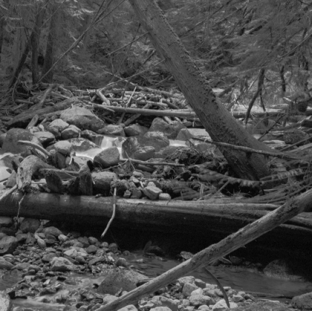
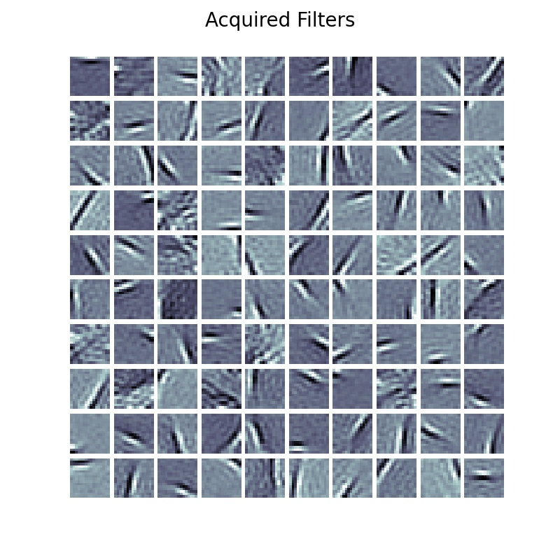
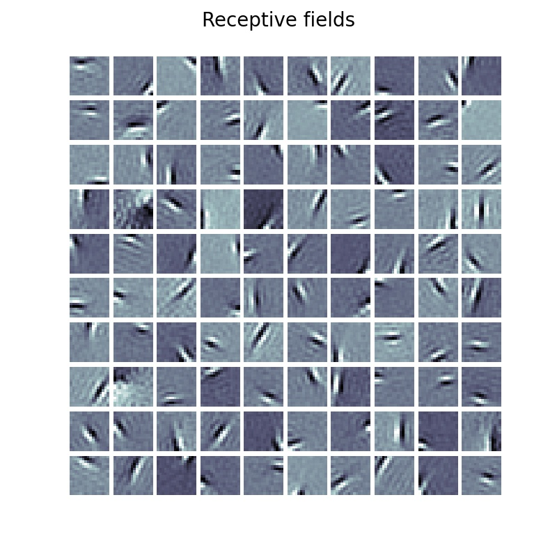

# Demo 4: Sparse Coding

In this demonstration, we will learn how to create, simulate, and visualize the
internally acquired filters/atoms of variants of a sparse coding system based
on the classical model proposed by (Olshausen &amp; Field, 1996) [1].
After going through this demonstration, you will:

1.  Learn how to build a 2-layer NGC sparse coding model of natural image patterns,
using the original dataset used in [1].
2.  Visualize the acquired filters of the learned dictionary models and examine
the results of imposing a kurtotic prior as well as a thresholding function
over latent codes.

Note that the folders of interest to this demonstration are:
+ `examples/demo4/`: this contains the necessary simulation scripts
+ `examples/data`: this contains the zipped copy of the natural image arrays

## On Dictionary Learning

Dictionary learning poses a very interesting question for statistical learning:
can we extract "feature detectors" from a given database (or collection of patterns)
such that only a few of these detectors play a role in reconstructing any given,
original pattern/data point?
The aim of dictionary learning is to acquire or learn a matrix, also called the
"dictionary", which is meant to contain "atoms" or basic elements inside this dictionary
(such as simple fundamental features such as the basic strokes/curves/edges
that compose handwritten digits or characters). Several atoms (or rows of this
matrix) inside the dictionary can then be linearly combined to reconstruct a
given input signal or pattern. A sparse dictionary model is able to reconstruct
input patterns with as few of these atoms as possible. Typical sparse dictionary
or coding models work with an over-complete spanning set, or, in other words,
a latent dimensionality (which one could think of as the number of neurons
in a single latent state node of an NGC system) that is greater than the
dimensionality of the input itself.

From a neurobiological standpoint, sparse coding emulates a fundamental property
of neural populations -- the activities among a neural population are sparse where,
within a period of time, the number of total active neurons (those that are firing)
is smaller than the total number of neurons in the population itself. When sensory
inputs are encoded within this population, different subsets (which might overlap) of
neurons activate to represent different inputs (one way to view this is that they
"fight" or compete for the right to activate in response to different stimuli).
Classically, it was shown in [1] that a sparse coding model trained on natural
image patches learned within its dictionary non-orthogonal filters that resembled
receptive fields of simple-cells (found in the visual cortex).

## Constructing a Sparse Coding System

To build a sparse coding model, we can, as we have in the previous three
demonstrations, manually craft one using nodes and cables. First, let us specify
the underlying generative model we aim to emulate.
In NGC shorthand, this means that we seek to build:

```
Node Name Structure:
p(z1) ; z1 -(z1-mu0-)-> mu0 ;e0; z0
Note: Cauchy prior applied for p(z1)
```

Furthermore, we further specify underlying directed generative model
(in accordance with the methodology in [Demonstration \#3](../demonstrations/demo3_classify.md)) as follows:

```
Node Name Structure:
s1 -(s1-s0-)-> s0
Note: s1 ~ p(s1), where p(s1) is the prior over s1
Note: s1-s0 = z1-mu0
```

where we see that we aim to learn a two-layer generative system that specifically
imposes a prior distribution `p(z1)` over the latent feature detectors that we hope
to extract in node `z1`. Note that this two-layer model (or single latent-variable layer
model) could either be the linear generative model from [1] or one similar to the
model learned through ISTA [2] if a (soft) thresholding function is used instead.

Constructing the above system for (Olshausen &amp; Field, 1996) is done,
using nodes and cables, as follows:

```python
x_dim = # ... dimension of patch data ...
# ---- build a sparse coding linear generative model with a Cauchy prior ----
K = 300
beta = 0.05
# general model configurations
integrate_cfg = {"integrate_type" : "euler", "use_dfx" : True}
prior_cfg = {"prior_type" : "cauchy", "lambda" : 0.14} # configure latent prior
# cable configurations
dcable_cfg = {"type": "dense", "init" : ("unif_scale",1.0), "seed" : seed}
pos_scable_cfg = {"type": "simple", "coeff": 1.0}
neg_scable_cfg = {"type": "simple", "coeff": -1.0}
constraint_cfg = {"clip_type":"forced_norm_clip","clip_mag":1.0,"clip_axis":1}

# set up system nodes
z1 = SNode(name="z1", dim=100, beta=beta, leak=leak, act_fx=act_fx,
           integrate_kernel=integrate_cfg, prior_kernel=prior_cfg)
mu0 = SNode(name="mu0", dim=x_dim, act_fx=out_fx, zeta=0.0)
e0 = ENode(name="e0", dim=x_dim)
z0 = SNode(name="z0", dim=x_dim, beta=beta, integrate_kernel=integrate_cfg, leak=0.0)

# create the rest of the cable wiring scheme
z1_mu0 = z1.wire_to(mu0, src_comp="phi(z)", dest_comp="dz_td", cable_kernel=dcable_cfg)
z1_mu0.set_constraint(constraint_cfg)
mu0.wire_to(e0, src_comp="phi(z)", dest_comp="pred_mu", cable_kernel=pos_scable_cfg)
z0.wire_to(e0, src_comp="phi(z)", dest_comp="pred_targ", cable_kernel=pos_scable_cfg)
e0.wire_to(z1, src_comp="phi(z)", dest_comp="dz_bu", mirror_path_kernel=(z1_mu0,"symm_tied"))
e0.wire_to(z0, src_comp="phi(z)", dest_comp="dz_td", cable_kernel=neg_scable_cfg)
z1_mu0.set_update_rule(preact=(z1,"phi(z)"), postact=(e0,"phi(z)"))
param_axis = 1

# Set up graph - execution cycle/order
model = NGCGraph(K=K, name="gncn_t1_sc", batch_size=batch_size)
model.set_cycle(nodes=[z1,z0])
model.set_cycle(nodes=[mu0])
model.set_cycle(nodes=[e0])
model.compile()
```

while building its ancestral sampling co-model is done with the following code block:

```python
# build this NGC model's sampling graph
z1_dim = ngc_model.getNode("z1").dim
z0_dim = ngc_model.getNode("z0").dim
s1 = FNode(name="s1", dim=z1_dim, act_fx=act_fx)
s0 = FNode(name="s0", dim=z0_dim, act_fx=out_fx)
s1_s0 = s1.wire_to(s0, src_comp="phi(z)", dest_comp="dz", mirror_path_kernel=(z1_mu0,"tied"))
sampler = ProjectionGraph()
sampler.set_cycle(nodes=[s1,s0])
sampler.compile()
```

Notice that we have, in our `NGCGraph`, taken care to set the `.param_axis`
variable to be equal to `1` -- this will, whenever we call `apply_constraints()`,
tell the NGC system to normalize the Euclidean norm of the columns
of each generative/forward matrix to be equal to `.proj_weight_mag` (which we set
to the typical value of `1`). This is a particularly important constraint to apply
to sparse coding models as this prevents the trivial solution of simply growing out
the magnitude of the dictionary synapses to solve the underlying constrained
optimization problem (and, in general, constraining the rows or
columns of NGC generative models helps to facilitate a more stable training process).

To build the version of our model using a thresholding function
(instead of using a factorial prior over the latents), we can write the following:

```python
x_dim = # ... dimension of image data ...
K = 300
beta = 0.05
# general model configurations
integrate_cfg = {"integrate_type" : "euler", "use_dfx" : True}
# configure latent threshold function
thr_cfg = {"threshold_type" : "soft_threshold", "thr_lambda" : 5e-3}
# cable configurations
dcable_cfg = {"type": "dense", "init" : ("unif_scale",1.0), "seed" : seed}
pos_scable_cfg = {"type": "simple", "coeff": 1.0}
neg_scable_cfg = {"type": "simple", "coeff": -1.0}
constraint_cfg = {"clip_type":"forced_norm_clip","clip_mag":1.0,"clip_axis":1}

# set up system nodes
z1 = SNode(name="z1", dim=100, beta=beta, leak=leak, act_fx=act_fx,
           integrate_kernel=integrate_cfg, threshold_kernel=thr_cfg)
mu0 = SNode(name="mu0", dim=x_dim, act_fx=out_fx, zeta=0.0)
e0 = ENode(name="e0", dim=x_dim)
z0 = SNode(name="z0", dim=x_dim, beta=beta, integrate_kernel=integrate_cfg, leak=0.0)

# create the rest of the cable wiring scheme
z1_mu0 = z1.wire_to(mu0, src_comp="phi(z)", dest_comp="dz_td", cable_kernel=dcable_cfg)
z1_mu0.set_constraint(constraint_cfg)
mu0.wire_to(e0, src_comp="phi(z)", dest_comp="pred_mu", cable_kernel=pos_scable_cfg)
z0.wire_to(e0, src_comp="phi(z)", dest_comp="pred_targ", cable_kernel=pos_scable_cfg)
e0.wire_to(z1, src_comp="phi(z)", dest_comp="dz_bu", mirror_path_kernel=(z1_mu0,"symm_tied"))
e0.wire_to(z0, src_comp="phi(z)", dest_comp="dz_td", cable_kernel=neg_scable_cfg)
z1_mu0.set_update_rule(preact=(z1,"phi(z)"), postact=(e0,"phi(z)"))

# Set up graph - execution cycle/order
model = NGCGraph(K=K, name="gncn_t1_sc", batch_size=batch_size)
model.set_cycle(nodes=[z1,z0])
model.set_cycle(nodes=[mu0])
model.set_cycle(nodes=[e0])
model.compile()
```

Note that the ancestral projection this model using thresholding would be the same
as the one we built earlier.
Notably, the above models can also be imported from the Model Museum,
specifically using [GNCN-t1/SC](../museum/gncn_t1_sc.md), which
internally implements the `NGCGraph`(s) depicted above.

Finally, for both the first model (which emulates [1]) and the second model
(which emulates [2]), we should define their total discrepancy (ToD) measurement
functions so we can track their performance throughout simulation:

```python
def calc_ToD(agent, lmda):
    """Measures the total discrepancy (ToD), or negative energy, of an NGC system"""
    z1 = agent.ngc_model.extract(node_name="z1", node_var_name="z")
    e0 = agent.ngc_model.extract(node_name="e0", node_var_name="phi(z)")
    z1_sparsity = tf.reduce_sum(tf.math.abs(z1)) * lmda # sparsity penalty term
    L0 = tf.reduce_sum(tf.math.square(e0)) # reconstruction term
    ToD = -(L0 + z1_sparsity)
    return float(ToD)
```

In fact, the above total discrepancy, in the case of a sparse coding model,
measures the negative of its underlying energy function, which is simply the
sum of its reconstruction error (or the sum of the square of the NGC
system's sensory error neurons `e0`) and the sparsity of its single latent state
layer `z1`.

## Learning Latent Feature Detectors

We will now simulate the learning of the feature detectors using the two
sparse coding models that we have built above. The code provided in
`sim_train.py` in `/examples/demo4/` will execute a simulation of the above
two models on the natural images found in `examples/data/natural_scenes.zip`),
which is a dataset composed of several images of the American Northwest.

First, navigate to the `examples/` directory to access the example/demonstration
code and further enter the `examples/data/` sub-folder. Unzip the file
`natural_scenes.zip` to create one more sub-folder that contains two numpy arrays,
the first labeled `natural_scenes/raw_dataX.npy` and another labeled as
`natural_scenes/dataX.npy`. The first one contains the original, `512 x 512` raw pixel
image arrays (flattened) while the second contains the pre-processed, whitened/normalized
(and flattened) image data arrays (these are the pre-processed image patterns used
in [1]). You will, in this demonstration, only be working with `natural_scenes/dataX.npy`.
Two (raw) images sampled from the original dataset (`raw_dataX.npy`) are shown below:

|   |   |
|---|---|
|   |   |

With the data unpacked and ready, we can now turn our attention to simulating the training process.
One way to write the training loop for our sparse coding models would be the following:

```python
args = # load in Config object with user-defined arguments
args.setArg("batch_size",num_patches)
agent = GNCN_t1_SC(args) # set up NGC model
opt = tf.keras.optimizers.SGD(0.01) # set up optimization process

############################################################################
# create a  training loop
ToD, Lx = eval_model(agent, train_set, calc_ToD, verbose=True)
vToD, vLx = eval_model(agent, dev_set, calc_ToD, verbose=True)
print("{} | ToD = {}  Lx = {} ; vToD = {}  vLx = {}".format(-1, ToD, Lx, vToD, vLx))

########################################################################
mark = 0.0
for i in range(num_iter): # for each training iteration/epoch
    ToD = Lx = 0.0
    n_s = 0
    # run single epoch/pass/iteration through dataset
    ####################################################################
    for batch in train_set:
        x_name, x = batch[0]
        # generate patches on-the-fly for sample x
        x_p = generate_patch_set(x, patch_size, num_patches)
        x = x_p
        n_s += x.shape[0] # track num samples seen so far
        mark += 1

        x_hat = agent.settle(x) # conduct iterative inference
        ToD_t = calc_ToD(agent, lmda) # calc ToD

        ToD = ToD_t + ToD
        Lx = tf.reduce_sum( metric.mse(x_hat, x) ) + Lx

        # update synaptic parameters given current model internal state
        delta = agent.calc_updates(avg_update=False)
        opt.apply_gradients(zip(delta, agent.ngc_model.theta))
        agent.ngc_model.apply_constraints()
        agent.clear()

        print("\r train.ToD {}  Lx {}  with {} samples seen (t = {})".format(
              (ToD/(n_s * 1.0)), (Lx/(n_s * 1.0)), n_s, (inf_time/mark)),
              end=""
              )
    ####################################################################
    print()
    ToD = ToD / (n_s * 1.0)
    Lx = Lx / (n_s * 1.0)
    # evaluate generalization ability on dev set
    vToD, vLx = eval_model(agent, dev_set, calc_ToD)
    print("-------------------------------------------------")
    print("{} | ToD = {}  Lx = {} ; vToD = {}  vLx = {}".format(
          i, ToD, Lx, vToD, vLx)
          )
```

notice that the training code above, which has also been integrated into
the provided `sim_train.py` demo file, looks very similar to how we trained our
generative models in [Demonstration \# 1](../demonstrations/demo1_gen_models.md).
In contrast to our earlier training loops, however, we have now written and
used patch creation function `generate_patch_set()` to sample image patches
of `16 x 16` pixels on-the-fly each time an image is sampled from the `DataLoader`.
Note that we have hard-coded this patch-shape, as well as the training `batch_size = 1`
(since mini-batches of data are supposed to contain multiple patches instead of images),
into `sim_train.py` in order to match the setting of [1].
As a result, the sparse coding training process consists of the following steps:
1) sample a random image from the image design matrix inside of the `DataLoader`,
2) generate a number of patches equal to `num_patches = 250` (which we have also
hard-coded into `sim_train.py`), and
3) feed this mini-batch of image patches to the NGC system to facilitate a learning step.

To train the first sparse coding model with the Cauchy factorial prior over `z1`,
run the following the script:

```console
$ python sim_train.py --config=sc_cauchy/fit.cfg --gpu_id=0 --n_trials=1
```

which will train a GNCN-t1/SC (with a Cauchy prior) on `16 x 16` pixel patches
from the natural image dataset in [1]. After the simulation terminates, i.e., once
`400` iterations/passes through the data have been made, you will notice in the
`sc_cauchy/` sub-directory you have several useful files.
Among these files, what we want is the serialized, trained sparse coding
model `model0.ngc`. To extract and visualize the learned filters of this NGC model,
you then need to run the final script, `viz_filters.py`, as follows:

```console
$ python viz_filters.py --model_fname=sc_cauchy/model0.ngc --output_dir=sc_cauchy/
```

which will iterate through your model's dictionary atoms (stored within its
single synaptic weight matrix) and ultimately produce a visual plot of the filters
which should look like the one below:



Now re-run the simulation but use the `sc_ista/fit.cfg` configuration
instead, like so:

```console
$ python sim_train.py --config=sc_ista/fit.cfg --gpu_id=0 --n_trials=1
```

and this will train your sparse coding using a latent soft-thresholding function
(emulating ISTA). After this simulated training process ends, again, like before,
run:

```console
$ python viz_filters.py --model_fname=sc_ista/model0.ngc --output_dir=sc_ista/
```

and you should obtain a filter plot like the one below:



The filter plots, notably, visually indicate that the dictionary atoms in both
sparse coding systems learned to function as edge detectors, each tuned to
a particular position, orientation, and frequency. These learned feature detectors,
as discussed in [1], appear to behave similar to the primary visual area (V1)
neurons of the cerebral cortex in the brain. Although, in the end, the edge
detectors learned by both our models qualitatively appear to be similar,
we should note that the latent codes (when inferring them given sensory input)
for the model that used the thresholding function are ultimately sparser.
Furthermore, the filters for the model with thresholding appear to smoother
and with fewer occurrences of less-than-useful slots than the Cauchy model
(or filters that did not appear to extract any particularly interpretable
features).

This difference in sparsity can be verified by examining the difference/gap
between the absolute value of the total discrepancy `ToD` and the reconstruction
loss `Lx` (which would tell us the degree of sparsity in each model since,
according to our energy function formulation earlier, `|ToD| = Lx + lambda * sparsity_penalty`).
In the experiment we ran for this demonstration, we saw that for the Cauchy prior model,
at the start of training, the `|ToD|` was `14.18` and `Lx` was `12.42` (in nats)
and, at the end of training,  the `|ToD|` was `5.24` and `Lx` was `2.13` with
the ending gap being `|ToD| -  Lx = 3.11` nats. With respect to the latent
thresholding model, we observed that, at the start, `|ToD|` was `-12.82` and
`Lx` was `12.77` and, at the end, the `|ToD|` was `2.59` and `Lx` was `2.50`
with the ending gap being `|ToD| -  Lx = 0.09` nats. The final gap of the
thresholding model is substantially lower than the one of the Cauchy prior model,
indicating that the latent states of the thresholding model are, indeed,
the sparsest.

## References
[1] Olshausen, B., Field, D. Emergence of simple-cell receptive field properties
by learning a sparse code for natural images. Nature 381, 607–609 (1996).<br>
[2] Daubechies, Ingrid, Michel Defrise, and Christine De Mol. "An iterative
thresholding algorithm for linear inverse problems with a sparsity constraint."
Communications on Pure and Applied Mathematics: A Journal Issued by the
Courant Institute of Mathematical Sciences 57.11 (2004): 1413-1457.
