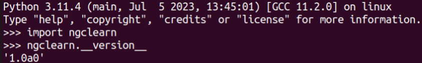

# Installation

**ngc-learn** officially supports Linux on Python 3. It can be run with or
without a GPU.

<i>Setup:</i> <a href="https://github.com/NACLab/ngc-learn">ngc-learn</a>,
in its entirety (including its supporting utilities),
requires that you ensure that you have installed the following base dependencies in
your system. Note that this library was developed and tested on Ubuntu 22.04 (and 18.04).
Specifically, ngc-learn requires:
* Python (>=3.10)
* ngcsimlib (>=0.2.b1), (<a href="https://github.com/NACLab/ngc-sim-lib">official page</a>)
* NumPy (>=1.26.0)
* SciPy (>=1.7.0)
* JAX (>= 0.4.18; and jaxlib>=0.4.18) <!--(tested for cuda 11.8)-->
* Matplotlib (>=3.4.2), (for `ngclearn.utils.viz`)
* Scikit-learn (>=1.3.1), (for `ngclearn.utils.patch_utils` and `ngclearn.utils.density`)

Note that the above requirements are taken care of if one installs ngc-learn
through either `pip`. One can either install the CPU version of ngc-learn (if no JAX is
pre-installed or only the CPU version of JAX is installed currently) via
```console
$ pip install ngclearn
```

or install the GPU version of ngc-learn by first installing the
<a href="https://jax.readthedocs.io/en/latest/installation.html">CUDA 11 or 12
version of JAX</a> before running the above pip command.

Alternatively, one may locally, step-by-step (see below), install and setup
ngc-learn from source after pulling from the repo.

Note that installing the official pip package without any form of JAX installed
on your system will default to downloading the CPU version of ngc-learn (see
below for installing the GPU version).

## Install from Source

0. Install ngc-sim-lib first (as an editable install); visit the repo 
https://github.com/NACLab/ngc-sim-lib for details.

1. Clone the ngc-learn repository:
```console
$ git clone https://github.com/NACLab/ngc-learn.git
$ cd ngc-learn
```

2. (<i>Optional</i>; only for GPU version) Install JAX for either CUDA 11 or 12 , depending
   on your system setup. Follow the
   <a href="https://jax.readthedocs.io/en/latest/installation.html">installation instructions</a>
   on the official JAX page to properly install the CUDA 11 or 12 version.

<!--
3. (<i>Optional</i>) Install, a pre-package installation step (for only the
   non-ngclearn dependencies), the base requirements (and a few extras for building
   the docs) with:
```console
$ pip install -r requirements.txt
```
-->

3. Install the ngc-learn package via:
```console
$ pip install .
```
or, to install as an editable install for development, run:
```console
$ pip install -e .
```

If the installation was successful, you should see the following if you test
it against your Python interpreter, i.e., run the <code>$ python</code> command
and complete the following sequence of steps as depicted in the screenshot below:<br>
<!---->

```console
Python 3.11.4 (main, MONTH  DAY YEAR, TIME) [GCC XX.X.X] on linux
Type "help", "copyright", "credits" or "license" for more information.
>>> import ngclearn
>>> ngclearn.__version__
'1.1b2'
```

<i>Note</i>: If you do not have a JSON configuration file in place (see tutorials
for details) locally where you call the import to ngc-learn, a warning will pop
up containing within it "<i>UserWarning: Missing file to preload modules from.</i>";
this still means that ngc-learn installed successfully but you will need to
point to a JSON configuration when building projects with ngc-learn.

