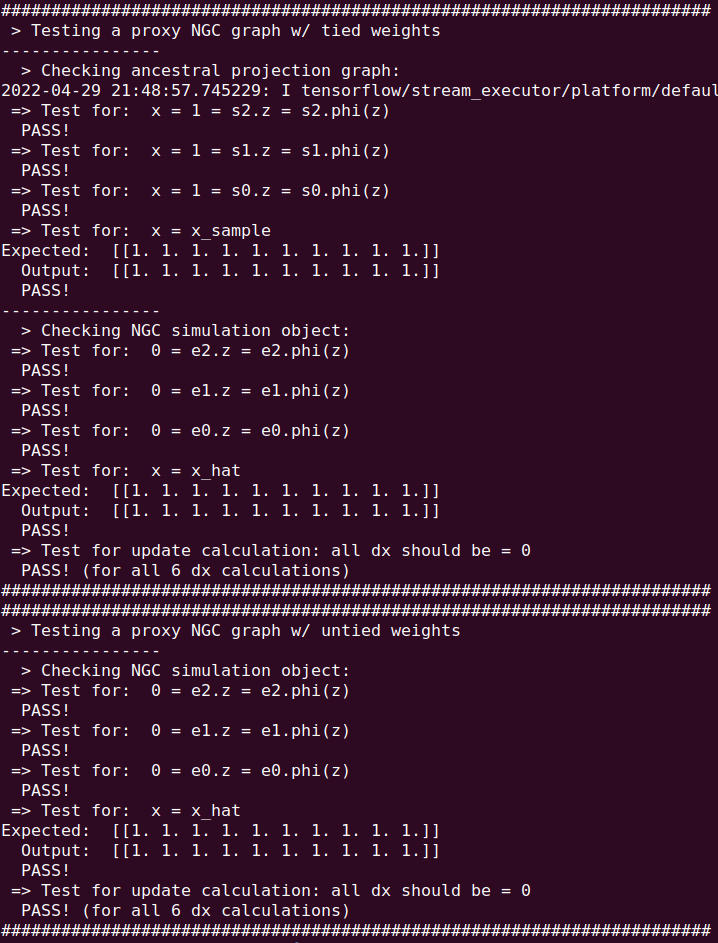

# Installation

**ngc-learn** officially supports Linux on Python 3. It can be run with or
without a GPU.

<i>Setup:</i> Ensure that you have installed the following base dependencies in
your system. Note that this library was developed and tested on Ubuntu 18.04.
Specifically, ngc-learn requires:
* Python (>=3.7)
* Numpy (>=1.20.0)
* Tensorflow 2.0.0, specifically, tensorflow-gpu>=2.0.0
* scikit-learn (>=0.24.2) (needed for the demonstrations in `examples/` as well as
     ngclearn.density)
* matplotlib (>=3.4.3) (needed for the demonstrations in `examples/`)


## Install from Source

1. Clone the ngc-learn repository:
```console
$ git clone https://github.com/ago109/ngc-learn.git
$ cd ngc-learn
```

2. Install the base requirements (and a few extras for building the docs) with:
```console
$ pip3 install -r requirements.txt
```

3. Install the ngc-learn package via:
```console
$ python setup.py install
```

If the installation was successful, you should see the following if you test
it against your Python interpreter, i.e., run the <code>$ python</code> command
and complete the following sequence of steps as depicted in the screenshot below:<br>


After installation, you can also the tests in the directory `/tests/`, specifically
```console
$ python test_fun_dynamics.py
```
and should see that all the basic assertion tests yield pass as follows:




## A Note on Simulating with the GPU or CPU

Simulations using ngc-learn can be run on either the CPU or GPU (currently, in this
version of ngc-learn, there is no multi-CPU/GPU support) by writing code near
the top of your general simulation scripts as follows:

```python
mid = -1 # the gpu_id (run nivida-smi to find your system's GPU identifiers)
if mid >= 0:
    print(" > Using GPU ID {0}".format(mid))
    os.environ["CUDA_VISIBLE_DEVICES"]="{0}".format(mid)
    #gpu_tag = '/GPU:0'
    gpu_tag = '/GPU:0'
else:
    os.environ["CUDA_VISIBLE_DEVICES"]="-1"
    gpu_tag = '/CPU:0'

...other non-initialization/simulation code goes here...

with tf.device(gpu_tag): # forces code below here to reisde on GPU with identifer "mid"
    ...initialization and simulation code goes here...

```

where `mid = -1` triggers a CPU-only simulation while `mid >= 0` would trigger
a GPU simulation based on the identifier provided (an `mid = 0` would force the
simulation to take place on GPU with an identifier of `0` -- you can query the
identifiers of what GPUs your system houses with the bash command `$ nvidia-smi`).

Note that, as shown in the code snippet above, later on in your script, before the
code you write that executes things such as
initializing NGC graphs or simulating the NGC systems (learning, inference, etc.),
it is recommended to place a with-statement before the relevant code (which
forces the execution of the following code indented underneath the with-statement
to reside on the GPU with the identifier you provided.)
