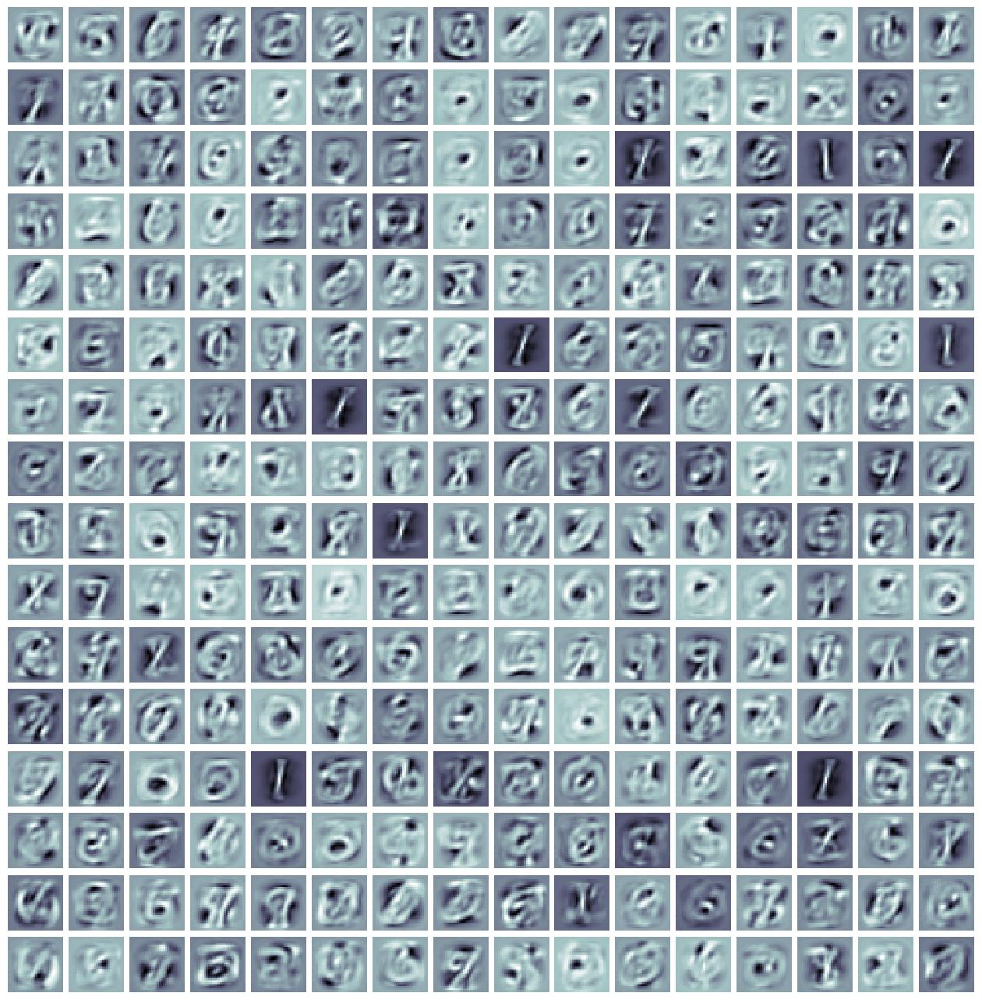
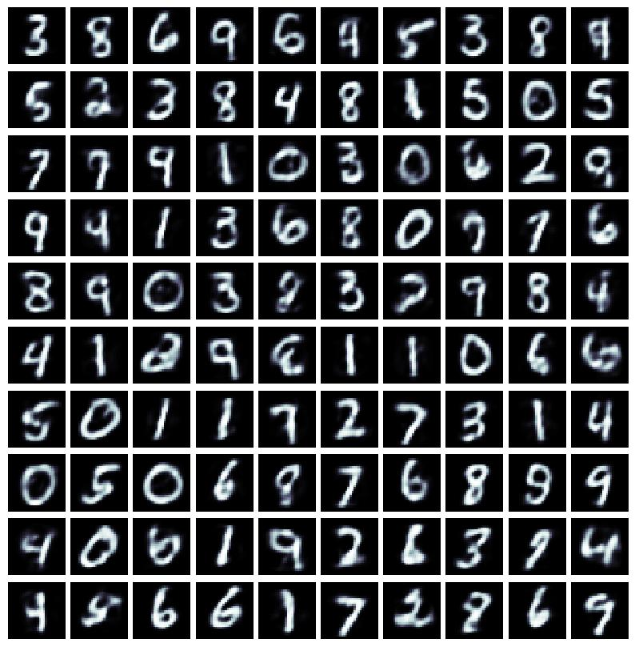

# Harmoniums and Contrastive Divergence

<!--
Although ngc-learn was originally designed with a focus on predictive processing neural systems, it is possible to simulate other kinds of neural systems with different dynamics and forms of learning.
-->
In NGC-Learn, it is possible to construct other forms of learning from the very base learning/plasticity components already in-built into the base library. Notably, a class of learning and inference systems that adapt through a process known as contrastive Hebbian learning (CHL) can be constructed and simulated with ngc-learn.

In this walkthrough, we will design a simple Harmonium, also known as the restricted Boltzmann machine (RBM). We will specifically focus on learning its synaptic connections with an algorithmic recipe known
as contrastive divergence (CD), which can be considered to be a stochastic form of CHL. After going through this exhibit, you will:

1.  Learn how to construct an `NGCGraph` that emulates the structure of an RBM and adapt the NGC settling process to calculate approximate synaptic weight gradients in accordance to contrastive divergence.
2.  Simulate fantasized image samples using the block Gibbs sampler implicitly defined by the negative phase graph.

Note that the folders of interest to this walkthrough are: 
+ `ngc-museum/exhibits/harmonium/`: this contains the necessary simulation scripts (which can be found [here](https://github.com/NACLab/ngc-museum/tree/main/exhibits/harmonium)); 
+ `ngc-museum/data/mnist/`: this contains the zipped copy of the MNIST digit image arrays

## On the Harmonium Probabilistic Graphical Model

A harmonium is a generative model implemented as a stochastic, two-layer neural system (a type of probabilistic graphic model; PGM) that attempts to learn a probability distribution over sensory input $\mathbf{x}$, i.e., the goal of a harmonium is to learn $p(\mathbf{x})$, the underlying probability/likelihood of a given (training) dataset. Fundamentally, the approach to estimating $p(\mathbf{x})$ that carried out by a harmonium is through the optimization of an energy function $E(\mathbf{x})$ (a concept motivated by statistical mechanics), where the system searches for an internal configuration, i.e., the values of its synapses, that assigns low energy (values) to sample patterns that come from the true data distribution $p(\mathbf{x})$ and high energy (values) to patterns that do not (or those that do not come from the training dataset).

```{eval-rst}
.. table::
   :align: center

   +-----------------------------------------------------------------+
   | .. image:: ../images/museum/harmonium/rbm_arch.jpg              |
   |   :scale: 65%                                                   |
   |   :align: center                                                |
   +-----------------------------------------------------------------+
```

The most common, simplest harmonium is one where input nodes (one per dimension of the data observation space) are modeled as binary/Boolean sensors -- or "visible units" $\mathbf{z}^0$ (observed variables) that are clamped to actual data patterns --  connected to a layer of (stochastic) binary latent feature detectors -- or "hidden units" $\mathbf{z}^1$ (unobserved or latent variables). Notably, the synaptic connections between the latent and visible units are symmetric. Furthermore, as a result of a key restriction imposed on the harmonium's network structure, i.e., no lateral connections between the neurons/units within $\mathbf{z}^0$ as well as those within $\mathbf{z}^1$, computing the latent and visible states is as straightforward as the following:

$$
p(\mathbf{z}^1 | \mathbf{z}^0) &= sigmoid(\mathbf{W} \cdot \mathbf{z}^0 + \mathbf{b}),
\; \mathbf{z}^1 \sim p(\mathbf{z}^1 | \mathbf{z}^0) \\
p(\mathbf{z}^0 | \mathbf{z}^1) &= sigmoid(\mathbf{W}^T \cdot \mathbf{z}^1 + \mathbf{c}),
\; \mathbf{z}^0 \sim p(\mathbf{z}^0 | \mathbf{z}^1)
$$

where $\mathbf{c}$ is the visible bias vector, $\mathbf{b}$ is the latent bias vector,
and $\mathbf{W}$ is the synaptic weight matrix that connects $\mathbf{z}^0$ to $\mathbf{z}^1$ (and its transpose $\mathbf{W}^T$ is used to make predictions of the input itself). Note that $\cdot$ means matrix/vector multiplication and $\sim$ denotes that we would sample from a probability (vector). In the above harmonium's case, samples will be drawn treating the conditionals such as $p(\mathbf{z}^1 | \mathbf{z}^0)$ as multivariate Bernoulli distributions. 
$\mathbf{z}^0$ would typically be clamped/set to the actual sensory input data $\mathbf{x}$.

The energy function of the harmonium's joint configuration $(\mathbf{z}^0,\mathbf{z}^1)$ (similar to that of a Hopfield network) is specified as follows:

$$
E(\mathbf{z}^0,\mathbf{z}^1) = -\sum_i \mathbf{c}_i \mathbf{z}^0_i -
\sum_j \mathbf{b}_j \mathbf{z}^1_j - \sum_i \sum_j \mathbf{z}^0_i \mathbf{W}_{ij} \mathbf{z}^1_j .
$$

Notice that, in the equation above, we sum over vector dimension indices, e.g., $\mathbf{z}^0_i$ retrieves the $i$th scalar element of (vector) $\mathbf{z}^0$ while $\mathbf{W}_{ij}$ retrieves the scalar element at position $(i,j)$ within matrix $\mathbf{W}$. With this energy function, one can write out the probability that a harmonium PGM assigns to a data point as:

$$
p(\mathbf{z}^0 = \mathbf{x}) = \frac{1}{Z} \exp( -E(\mathbf{z}^0,\mathbf{z}^1) ) 
$$

where $Z$ is the normalizing constant (or, in statistical mechanics, the <i>partition function</i>) needed to obtain proper probability values[^1]. 
When one works through the derivation of the gradient of the log probability $\log p(\mathbf{x})$ with respect to the synapses such as $\mathbf{W}$, they get a (contrastive) Hebbian-like update rule as follows: 

$$
\Delta \mathbf{W} = <\mathbf{z}^0_i \mathbf{z}^1_j>_{data} - <\mathbf{z}^0_i \mathbf{z}^1_j>_{model}
$$

where the angle brackets $< >$ tell us that we need to take the expectation of the values within the brackets under a certain distribution (such as the data distribution denoted by the subscript $data$). The above rule can also be considered to be a stochastic form of a general recipe known as contrastive Hebbian learning (CHL) [4]. 

Technically, to compute the update above, obtaining the first term
$<\mathbf{z}^0_i \mathbf{z}^1_j>_{data}$ is easy since we only need to take the product of a data point and its corresponding latent state under the harmonium. However, obtaining the second term $<\mathbf{z}^0_i \mathbf{z}^1_j>_{model}$ is very costly, since we would need to
initialize the value of $\mathbf{z}^0$ to a random initial state and then run a (block) Gibbs sampler for many iterations to accurately approximate the second term. Fortunately, it was shown in work such as [3], that learning a harmonium is still possible by replacing the term $<\mathbf{z}^0_i \mathbf{z}^1_j>_{model}$ with $<\mathbf{z}^0_i \mathbf{z}^1_j>_{recon}$, which is simply computed by using the
first term's latent state $\mathbf{z}^1$ to reconstruct the input and then using this reconstruction once more in order to obtain its corresponding binary latent state. This is known as "contrastive divergence" (CD-1), and, although this approximation has been shown to not actual follow the gradient of any known objective function, it works well in practice when learning a harmonium-based generative model. Finally, the vectorized form of the CD-1 update is:

$$
\Delta \mathbf{W} = \Big[ (\mathbf{z}^0_{pos})^T \cdot \mathbf{z}^1_{pos} \Big] - \Big[ (\mathbf{z}^0_{neg})^T \cdot \mathbf{z}^1_{neg} \Big]
$$

where the first term (in brackets) is labeled as the "positive phase" (or the positive, data-dependent statistics -- where $\mathbf{z}^0_{pos}$ denotes the positive phase sample of $\mathbf{z}^0$) while the second term is labeled as the "negative phase" (or the negative, data-independent statistics -- where $\mathbf{z}^0_{neg}$ denotes the negative phase sample of $\mathbf{z}^0$). Note that simpler rules of a similar form can be worked out for the latent/visible bias vectors as well.

In NGC-Learn, to simulate the above harmonium PGM and its CD-1 update, we will model the positive and negative phases as simulated co-models, each responsible for producing the relevant statistics that we will require in order to adjust synapses. Additionally, we will find that we can further re-purpose the created co-models to construct a block Gibbs sampler for confabulating "fantasized"
data patterns from a harmonium that has been fit to data.


## Boltzmann Machines: Positive and Negative Co-Models

We begin by first specifying the structure of the harmonium system that we would like to simulate. In NGC shorthand, the above positive and negative phase graphs would simply be (under one complete generative model):

```
z0 -(z0-z1)-> z1
z1 -(z1-z0) -> z0
Note: z1-z0 = (z0-z1)^T (transpose-tied synapses)
```

In order to construct the desired harmonium, particularly the structure needed to implement CD-1, we will need to break up the model into its key "phases", i.e., a positive phase and a negative phase. We will model each phase as its own simulated nodes-and-cables structure within one single model context, allowing us to craft a general approach that permits a CD-based learning. Notably, we will use the negative-phase co-model to emulate the crucial MCMC sampling step to synthesize data from the trained RBM.

Building the positive phase of our harmonium can be done as follows:

```python
with Context("Circuit") as self.circuit:
    ## set up positive-phase graph
    self.z0 = BernoulliStochasticCell("z0", n_units=obs_dim, is_stoch=False)
    self.z1 = BernoulliStochasticCell("z1", n_units=hid_dim, key=subkeys[0])

    self.W1 = HebbianSynapse(
        "W1", shape=(obs_dim, hid_dim), eta=0., weight_init=dist.gaussian(mean=0., std=sigma),
        bias_init=dist.constant(value=0.), w_bound=0., optim_type="sgd", sign_value=1., key=subkeys[1]
    )
    ## wire up z0 to z1 via synaptic project W1
    self.z0.s >> self.W1.inputs
    self.W1.outputs >> self.z1.inputs
```

To gather the rest of the statistics that we require, we will need to build the negative phase of our model (which is responsible for "dreaming up" or "confabulating" data samples from its internal model of the world). Constructing the negative-phase co-model, under the same model `Context` above can be done as follows:

```python 
    ## set up negative-phase graph
    self.z0neg = BernoulliStochasticCell("z0neg", n_units=obs_dim, key=subkeys[3])
    self.z1neg = BernoulliStochasticCell("z1neg", n_units=hid_dim, key=subkeys[4])

    self.E1 = DenseSynapse( ## E1 = W1.T
        "E1", shape=(hid_dim, obs_dim), weight_init=dist.gaussian(mean=0., std=sigma),
        bias_init=dist.constant(value=0.), resist_scale=1., key=subkeys[2]
    )
    self.E1.weights.set(self.W1.weights.get().T)
    self.V1 = HebbianSynapse( ## V1 = W1
        "V1", shape=(obs_dim, hid_dim), eta=0., weight_init=dist.gaussian(mean=0., std=sigma),
        bias_init=None, w_bound=0., optim_type="sgd", sign_value=1., key=subkeys[1]
    )
    self.V1.weights.set(self.W1.weights.get())
    self.V1.biases.set(self.W1.biases.get())

    ## wire up z1 to z0(neg) via E1=(W1)^T, and z0(neg) to z1(neg) via V1=W1
    self.z1.s >> self.E1.inputs
    self.E1.outputs >> self.z0neg.inputs
    self.z0neg.p >> self.V1.inputs ## drive hiddens by probs of visibles
    self.V1.outputs >> self.z1neg.inputs
```

The above chunk of code effectively sets up the propagation of information from the latent neurons `z1` back down to `z0` (obtaining the negative phase values of `z0`, i.e., `z0neg`) and then the propagation of the reconstructed values back up to `z1` one last time (obtaining the negative phase values of `z1`, i.e., `z0neg`). 

To build a CHL-based form of plasticity, allowing us to build the CD-1 learning process, we will then need to wire up a set of 2-factor Hebbian rules like so:

```python
    ## set up contrastive Hebbian learning rule (pos-stats - neg-stats)
    self.z0.s >> self.W1.pre ## positive-phase pre-synaptic term
    self.z1.p >> self.W1.post ## positive-phase post-synaptic term
    self.z0neg.p >> self.V1.pre ## negative-phase pre-synaptic term
    self.z1neg.p >> self.V1.post ## negative-phase pre-synaptic term
```

the results of these two Hebbian rules are then used in an exhibit-specific function (`_update_via_CHL()`) written in the [`Harmonium` class](https://github.com/NACLab/ngc-museum/blob/v3/exhibits/harmonium/harmonium.py). 
While we observe that our "negative phase" co-model allows us to emulate the CD learning recipe[^2], technically, the negative phase of a harmonium should be run for a very high value of steps (approaching infinity) in order to obtain a proper sample from the PGM's equilibrium/steady state distribution. However, this would be extremely costly to simulate and, as early studies [3] observed, often only a few or even a single step of this Markov chain proved to work quite well, approximating the contrastive divergence objective (the learning algorithm's namesake) instead of direct maximum likelihood.

Note that the full code, containing the snippets above, can be found in the Model Museum `Harmonium` model structure class. One could further generalize our CD-1 framework to variations, such as "persistent" CD (where we, instead of running `z1` back down through `E1` synapses, we inject random noise instead (to sample the harmonium's latent prior), or even an algorithm known as parallel tempering, where we would maintain multiple co-models and draw  samples from all of them to obtain negative-phase statistics.

Finally, within the `Harmonium` class, we have written a routine for drawing samples from the model directly, i.e., we implement a block Gibbs sampler in order synthesize data from the RBM's current set of parameters.

## Using the Harmonium to Dream Up Handwritten Digits

We finally take the harmonium that we have constructed above and fit it to some MNIST digits. Specifically, we will leverage the [Harmonium](https://github.com/NACLab/ngc-museum/blob/v3/exhibits/harmonium/harmonium.py), model in the Model Museum since it implements all of the above core mechanisms (and more) internally. In the  script `sim_harmonium.py`, you will find a general training that will fit our harmonium to the MNIST database (unzip the file `mnist.zip` in the `ngc-museum/exhibits/data/` directory if you have not already) by cycling through it several times, saving the final
(best) resulting to disk within the `exp/` sub-directory. Go ahead and execute the training process as follows:

```console
$ python sim_harmonium.py 
```

which will fit/adapt your harmonium to MNIST. This should produce per-training iteration output, printed to I/O, similar to the following:

```console
--- Initial RBM Synaptic Stats ---
W1:  min -0.0494 ;  max 0.0445  mu -0.0000 ;  norm 4.4734
b1:  min -4.0000 ;  max -4.0000  mu -4.0000 ;  norm 64.0000
c0:  min -11.6114 ;  max 0.0635  mu -3.8398 ;  norm 135.2238
-1| Test: E(X) = 99.8526  err(X) = 54.3889
0| Test: E(X) = 116.6596  err(X) = 46.8236; Train: E(X) = 112.0452  err(X) = 52.7418
1| Test: E(X) = 89.5413  err(X) = 36.8690; Train: E(X) = 102.4642  err(X) = 41.3630
2| Test: E(X) = 75.7558  err(X) = 31.8582; Train: E(X) = 82.9692  err(X) = 34.5511
3| Test: E(X) = 66.6632  err(X) = 28.6253; Train: E(X) = 72.1229  err(X) = 30.4615
4| Test: E(X) = 60.8256  err(X) = 26.2317; Train: E(X) = 64.3613  err(X) = 27.6882
5| Test: E(X) = 55.5070  err(X) = 24.3207; Train: E(X) = 58.9254  err(X) = 25.5485
6| Test: E(X) = 51.7455  err(X) = 22.8012; Train: E(X) = 54.4092  err(X) = 23.8361
7| Test: E(X) = 49.4866  err(X) = 21.6163; Train: E(X) = 51.1574  err(X) = 22.4523
8| Test: E(X) = 46.2826  err(X) = 20.5934; Train: E(X) = 48.2617  err(X) = 21.3355
9| Test: E(X) = 43.8611  err(X) = 19.7679; Train: E(X) = 46.0239  err(X) = 20.4297
10| Test: E(X) = 42.2886  err(X) = 19.0672; Train: E(X) = 44.3544  err(X) = 19.6835
11| Test: E(X) = 41.7468  err(X) = 18.4881; Train: E(X) = 42.9321  err(X) = 19.0372
...
<shortened for brevity>
...
91| Test: E(X) = 65.5179  err(X) = 11.0443; Train: E(X) = 65.0850  err(X) = 10.9832
92| Test: E(X) = 65.4790  err(X) = 11.0118; Train: E(X) = 64.8345  err(X) = 10.9820
93| Test: E(X) = 65.9917  err(X) = 11.0013; Train: E(X) = 64.4392  err(X) = 10.9586
94| Test: E(X) = 64.0737  err(X) = 10.9874; Train: E(X) = 64.2096  err(X) = 10.9312
95| Test: E(X) = 64.0479  err(X) = 10.9906; Train: E(X) = 63.8461  err(X) = 10.9274
96| Test: E(X) = 63.5719  err(X) = 10.9712; Train: E(X) = 63.3354  err(X) = 10.8940
97| Test: E(X) = 64.1757  err(X) = 10.9589; Train: E(X) = 62.8447  err(X) = 10.8960
98| Test: E(X) = 63.8886  err(X) = 10.9563; Train: E(X) = 62.6391  err(X) = 10.8727
99| Test: E(X) = 62.2265  err(X) = 10.9347; Train: E(X) = 62.3147  err(X) = 10.8671
--- Final RBM Synaptic Stats ---
W1:  min -1.8648 ;  max 1.3757  mu -0.0012 ;  norm 70.6230
b1:  min -7.5815 ;  max 0.2337  mu -2.3395 ;  norm 53.3993
c0:  min -11.6316 ;  max -2.4227  mu -5.3259 ;  norm 161.5646
```

You will find, after the training script has finished executing, several outputs in the `exp/filters/` model sub-directory that is created for you. Concretely, you will find a grid-plot of the (first `100` of the) harmonium's acquired filters (or "receptive fields"), much as we did for the sparse coding exhibit, that will look similar to the following:



Interestingly enough, we see that our harmonium/RBM has extracted what appears to be rough stroke features, which is what it uses when sampling its binary latent feature detectors to compose final synthesized image patterns (each binary feature detector serves as Boolean function that emits a decision of `1` if the filter is to be used and a `0` if not). In particular, we remark notice that the filters that our harmonium has acquired are a bit more prominent due to the fact our exhibit employs some weight decay (specifically,  Gaussian/L2 decay -- with intensity `l2_lambda=0.01` -- to the `W1` synaptic matrix of our RBM). 
Weight decay of this form is particularly useful to not only mitigate against the harmonium overfitting to its training data but also to ensure that the Markov chain inherent to its negative-phase mixes more effectively [5] (which ensures better-quality samples from the block Gibbs sampler, which we will use next).  

Finally, you will also find in the `exp/filters/` model sub-folder another grid-plot containing some (about `100`) of the RBM's reconstructions of held-out development data. This plot should look similar to the one below:



### Sampling the Harmonium

Once the training process has completed, you can then run the following to sample from trained model using block Gibbs sampling:

```console
$ python sample_harmonium.py 
```

which will take your trained harmonium's negative-phase co-model and use it to synthesize some digit patterns. You should see inside the `exp/samples/` sub-directory three sample-image grids (i.e., `samples_0.jpg`, `samples_1.jpg`, and `samples_2.jpg`) similar to what is shown below:

```{eval-rst}
.. image:: ../images/museum/harmonium/samples_0.jpg 
   :width: 30%
.. image:: ../images/museum/harmonium/samples_1.jpg
   :width: 30%
.. image:: ../images/museum/harmonium/samples_2.jpg
   :width: 30%
```

Furthermore, you will see three corresponding GIFs that have been generated for you that visualize how each of the three simulated sampling Markov chains change with time (i.e., these are the files: `markov_chain_0.gif`, `markov_chain_1.gif`, and `markov_chain_2.gif`).

<!--
 <br>

 <br>


-->

It is important to understand that the three grids of samples shown above come from particular points in the block Gibbs sampling process. 
(Note that one reads these sample grid plots left-column to right-column, and top-row to bottom-row; this way of reading the plot follows the ordering of samples extracted from the specific Markov chain sequence.) 
Note that, although each chain is run for many total steps, the `sample_harmonium.py` script "thins" out each Markov chain by only pulling out a fantasized pattern every `20` steps (further "burning" in each chain before collecting samples). Each chain is merely initialized with random Bernoulli noise. Note that higher-quality samples can be obtained if one modifies the earlier harmonium to learn with persistent CD or parallel tempering.

### Final Notes

The harmonium that we have built in this exhibit is a classical Bernoulli harmonium/RBM, which is a neural PGM that assumes that the input data features are binary in nature. If one wants to model data that is continuous/real-valued, then the harmonium model above would need to be extended to utilize visible units that follow a continuous distribution; for instance, if one modeled a multivariate Gaussian distribution, this would yield a Gaussian restricted Boltzmann machine (GRBM). 

<!-- references -->
## References
[1] Smolensky, P. "Information Processing in Dynamical Systems: Foundations of Harmony Theory" (Chapter 6). Parallel distributed processing: explorations in the microstructure of cognition 1 (1986). <br>
[2] Geoffrey Hinton. Products of Experts. International conference on artificial neural networks (1999).  <br>
[3] Hinton, Geoffrey E. "Training products of experts by maximizing contrastive likelihood." Technical Report, Gatsby computational neuroscience unit (1999). <br>
[4] Movellan, Javier R. "Contrastive Hebbian learning in the continuous Hopfield model." Connectionist models. Morgan Kaufmann, 1991. 10-17. <br> 
[5] Hinton, Geoffrey E. "A practical guide to training restricted Boltzmann machines." Neural networks: Tricks of the trade. Springer, Berlin, Heidelberg, 2012. 599-619.

<!-- footnotes -->
[^1]: In fact, it is intractable to compute the partition function $Z$ for any reasonably-sized harmonium; fortunately, we will not need to calculate $Z$ in order to learn and sample from a Harmonium. 
[^2]: In general, CD-1 means contrastive divergence where the negative phase is only run for one single step, i.e., `K=1`. The more general form of CD is known as CD-K, the K-step CD algorithm where `K > 1`. (Sometimes, CD-1 is just referred to as just "CD".)
