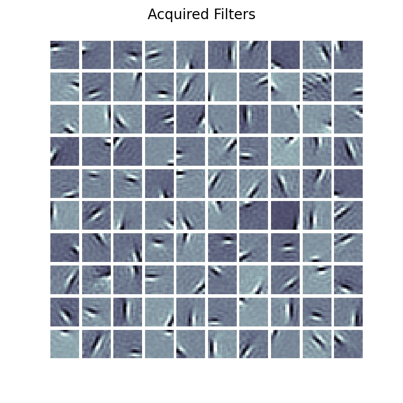

# Hierarchical Predictive Coding

In this exhibit, we create, simulate, and visualize the
internally acquired filters/atoms of variants of a sparse coding system based
on the classical model proposed by (Rao and Ballard, 1999) [1], a hierarchical predictive coding model for encoding natural images.
After going through this demonstration, you will:

1.  Learn how to build a 3-layer hierarchical sparse coding model of natural image patterns,
    using the original dataset used in [1].
2.  Visualize the acquired filters for hidden layers  (1st and 2nd) of the learned dictionary
    in a hierarchical encoding model and examine the results of imposing a cauchy prior over latent codes.
3.  How to make an arbitrary hierarchichal predictive coding model with number of layers, layers size, activation function, and input patches and theis       shapes and strides (horizontall and vertical) as hyper parameters.
4.  How to make overlapping patches with arbitraty patch shape and arbitraty overlap size
    and apply gaussian filter to natural images.

The model **code** for this exhibit can be found [here](https://github.com/NACLab/ngc-museum/tree/main/exhibits/patched_gpc).

**Note**: You will need to unzip the data arrays in `natural_image.zip` to the folder `exhibits/data/` to work through this exhibit.

To undrestand the **Dictionary Learning** concept please visit [here](https://ngc-learn.readthedocs.io/en/latest/museum/sparse_coding.html#on-dictionary-learning).

## Hierarchical Predictive Coding System

<p align="center">
  
</p>


### Image Patching for the Input Layer
<p align="center">
   &nbsp;&nbsp;&nbsp;&nbsp;&nbsp;&nbsp;&nbsp;&nbsp;
  
</p>


### Single Predictive Coding Network


## Constructing a Hierarchical Predictive Coding System

To build a hierarchical model, we can manually craft a model using ngc-learn's 
nodes-and-cables system. First, we specify the underlying generative model we 
aim to emulate. Formally, we seek to optimize sets of latent codes according 
to the following differential equation for each layer $ℓ$:


where we see that we aim to learn a 2-layer generative system that specifically
imposes a prior distribution `g(r)` over the latent feature detectors (via the 
constraint function $\ \Omega\big(\mathbf{z}(t)\big)$) that we hope
to extract in node `z`. Note that this two-layer model (or single latent-variable layer
model) could either be the linear generative model from <b>[1]</b> or one similar to the
model learned through ISTA <b>[2]</b> if a (soft) thresholding function is used instead.

Constructing the above system for (Olshausen &amp; Field, 1996) is done, much 
like we do in the `SparseCoding` agent constructor in the model museum exhibit 
code, as follows:

```python
from ngcsimlib.context import Context
from ngclearn.components import GaussianErrorCell as ErrorCell, RateCell, HebbianSynapse, StaticSynapse
from ngclearn.utils.model_utils import normalize_matrix

in_dim =  # ... dimension of patch data ...
hid_dim =  # ... number of atoms in the dictionary matrix
dt = 1.  # ms
T = 300  # ms # (OR) number of E-steps to take during inference
# ---- build a sparse coding linear generative model with a Cauchy prior ----
with Context("Circuit") as circuit:
    z1 = RateCell("z1", n_units=hid_dim, tau_m=20., act_fx="identity",
                  prior=("cauchy", 0.14), integration_type="euler")
    e0 = ErrorCell("e0", n_units=in_dim)
    W1 = HebbianSynapse("W1", shape=(hid_dim, in_dim),
                        eta=1e-2, wInit=("fan_in_gaussian", 0., 1.),
                        bInit=None, w_bound=0., optim_type="sgd", signVal=-1.)
    E1 = StaticSynapse("E1", shape=(in_dim, hid_dim),
                       wInit=("uniform", -0.2, 0.2), Rscale=1.)
    ## wire z1.zF to e0.mu via W1
    W1.inputs << z1.zF
    e0.mu << W1.outputs
    ## wire e0.dmu to z1.j
    E1.inputs << e0.dmu
    z1.j << E1.outputs
    ## Setup W1 for its 2-factor Hebbian update
    W1.pre << z1.zF
    W1.post << e0.dmu

    reset_cmd, reset_args = circuit.compile_by_key(
        W1, E1, z1, e0,
        compile_key="reset")
    advance_cmd, advance_args = circuit.compile_by_key(
        W1, E1, z1, e0,
        compile_key="advance_state")
    evolve_cmd, evolve_args = circuit.compile_by_key(W1, compile_key="evolve")
```

Notice that, in our model `circuit`, we have taken care to set the `.param_axis`
variable to be equal to `1` -- this will, whenever we call `apply_constraints()`,
tell the NGC system to normalize the Euclidean norm of the columns
of the dictionary matrix to be equal to a value of one. This is a particularly 
important constraint to apply to sparse coding models as this prevents the 
trivial solution of simply growing out 
the magnitude of the dictionary synapses to solve the underlying constrained
optimization problem (and, in general, constraining the rows or
columns of generative models helps to facilitate a more stable training process).
This norm constraint is configured in the agent constructor's dynamic 
compile function, specifically in the snippet below:

```python
@Context.dynamicCommand
def norm():
    W1.weights.set(normalize_matrix(W1.weights.value, 1., order=2, axis=1))
```

To build the version of our model (the ISTA model) using a thresholding function, 
instead of using a factorial prior over the latents, we can write the following:

```python
# ---- build a sparse coding generative model w/ a thresholding function ----
with Context("Circuit") as circuit:
    z1 = RateCell("z1", n_units=hid_dim, tau_m=20., act_fx="identity", 
                  threshold=("soft_threshold", 5e-3), integration_type="euler")
    e0 = ErrorCell("e0", n_units=in_dim)
    W1 = HebbianSynapse("W1", shape=(hid_dim, in_dim),
                             eta=1e-2, wInit=("fan_in_gaussian", 0., 1.),
                             bInit=None, w_bound=0., optim_type="sgd", signVal=-1.)
    E1 = StaticSynapse("E1", shape=(in_dim, hid_dim), 
                             wInit=("uniform", -0.2, 0.2), Rscale=1.)
    ## ...rest of the code is the same as the Cauchy prior model...
```

Note that the above two models are built and configured for you in the 
Model Museum, in the `museum/exhibits/olshausen_sc/sparse_coding.py` 
agent constructor, which internally implements the model contexts depicted above 
as well as the necessary task-specific functions needed to reproduce the 
correct experimental setup (these get compiled in the constructor's 
`dynamic()` method. For both the Cauchy prior model of <b>[1]</b> 
and the iterative thresholding model of <b>[2]</b>, we track, in the 
training script `train_patch_sc.py`, various dictionary synaptic  
statistics and a measurement of the model reconstruction loss. The 
reconstruction loss is a key part of the objective that both models 
optimize, i.e., both SC models effectively optimize an 
energy function that is a sum of its reconstruction error of its sensory 
input and the sparsity of its single latent state layer `z1`).

## Learning Latent Feature Detectors

We will now simulate the learning of feature detectors using the two
sparse coding models specified above. The code provided in
`train_patch_sc.py`  will execute a simulation of the above
two models on the natural images found in `exhibits/data/natural_scenes.zip`),
which is a dataset composed of several images of the American Northwest.

First, navigate to the `exhibits/` directory to access the example/demonstration
code and further enter the `exhibits/data/` sub-folder. Unzip the file
`natural_scenes.zip` to create one more sub-folder that contains two numpy arrays,
the first labeled `natural_scenes/raw_dataX.npy` and another labeled as
`natural_scenes/dataX.npy`. The first one contains the original, `512 x 512` raw pixel
image arrays (flattened) while the second contains the pre-processed, whitened/normalized
(and flattened) image data arrays (these are the pre-processed image patterns used
in <b>[1]</b>). You will, in this demonstration, only be working with `natural_scenes/dataX.npy`.
Two (raw) images sampled from the original dataset (`raw_dataX.npy`) are shown below:

|   |   |
|---|---|
|   |   |

With the data unpacked and ready, we can now run the training process in 
the model exhibit by either executing its Python simulation script like so:

```console
$ python train_patch_sc.py --dataX="$DATA_DIR/dataX.npy" \
                           --n_iter=200 --model_type="sc_cauchy"
```

or simply running the convenience Bash script `$ ./sim.sh` (which cleans up the model 
experimental output folder each time you call the training script in order 
to reduce memory clutter on your system). Running either the Python or Bash 
script will then train a sparse coding model with a Cauchy prior on `16 x 16` 
pixel patches from the natural image dataset in <b>[1]</b>.[^1] After the simulation 
terminates, i.e., once `200` iterations/passes through the data have been made, 
you will notice in the `exp/filters/` sub-directory a visual plot 
of your trained model's filters which should look like the one below:


If you modify either the Bash script or Python script call to use  
with a different model argument like so:

```console
$ python train_patch_sc.py --dataX="$DATA_DIR/dataX.npy" \
                           --n_iter=200 --model_type="sc_ista"
```

you will now train your sparse coding using a latent soft-thresholding function
(emulating ISTA). After this simulated training process ends, you should see 
in your `exp/filters/` sub-directory a filter plot like the one below:



The filter plots, notably, visually indicate that the dictionary atoms in both
sparse coding systems learned to function as edge detectors, each tuned to
a particular position, orientation, and frequency. These learned feature detectors,
as discussed in <b>[1]</b>, appear to behave similar to the primary visual area (V1)
neurons of the cerebral cortex in the brain. In the end, even though the edge
detectors learned by both our models qualitatively appear to be similar,
we should note that the latent codes (when inferring them given sensory input)
for the model that used the thresholding function will ultimately sparser 
(given the direct clamping to zero values it imposes mathematically).
Furthermore, the filters for the model with thresholding appear to smoother
and with fewer occurrences of less-than-useful slots than the Cauchy model
(or filters that did not appear to extract any particularly interpretable
features).

<!--
This difference in sparsity can be verified by examining the difference/gap
between the absolute value of the total discrepancy `ToD` and the reconstruction
loss `Lx` (which would tell us the degree of sparsity in each model since,
according to our energy function formulation earlier, `|ToD| = Lx + lambda * sparsity_penalty`).
In the experiment we ran for this demonstration, we saw that for the Cauchy prior model,
at the start of training, the `|ToD|` was `14.18` and `Lx` was `12.42` (in nats)
and, at the end of training,  the `|ToD|` was `5.24` and `Lx` was `2.13` with
the ending gap being `|ToD| -  Lx = 3.11` nats. With respect to the latent
thresholding model, we observed that, at the start, `|ToD|` was `-12.82` and
`Lx` was `12.77` and, at the end, the `|ToD|` was `2.59` and `Lx` was `2.50`
with the ending gap being `|ToD| -  Lx = 0.09` nats. The final gap of the
thresholding model is substantially lower than the one of the Cauchy prior model,
indicating that the latent states of the thresholding model are, indeed,
the sparsest.
-->

### Computing Hardware Note:

This tutorial was tested and run on an `Ubuntu 22.04.2 LTS` operating system 
using an `NVIDIA GeForce RTX 2070` GPU with `CUDA Version: 12.1` 
(`Driver Version: 530.41.03`). Note that the times reported in any tutorial 
screenshot/console snippets were produced on this system.

## References
<b>[1]</b> Rajesh PN Rao and Dana H Ballard. Predictive coding in the visual cortex: 
a functional interpretation of some extra-classical receptive-field effects. 
Nature neuroscience, 2(1), 1999.<br>


<!-- footnotes -->

<p align="justify">
[^1]: Ultimately, the sparse coding training process consists of the following 
steps: <i>1)</i> sample a random image from the image design matrix inside of 
the in-built ngc-learn `DataLoader`, <i>2)</i> generate a number of patches equal 
to `num_patches = 250` (which we have also hard-coded into `train_patch_sc.py`), 
and <i>3)</i> feed this mini-batch of image patches to the sparse coding model to 
facilitate an expectation-maximization (E-M) step, where we take `T=300` E-steps 
followed by one single M-step and a norm constraint application.
</p>
