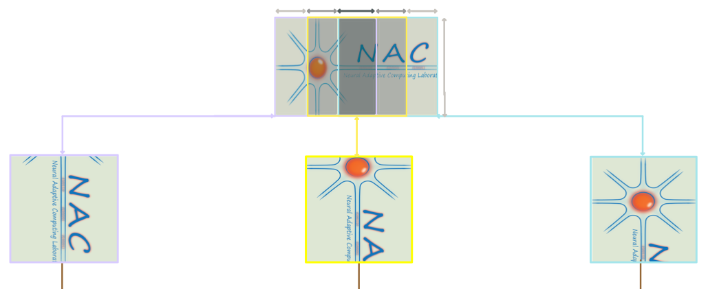

# Hierarchical Predictive Coding for Reconstruction (Rao &amp; Ballard; 1999)

In this exhibit, we create, simulate, and visualize the internally acquired receptive fields of the predictive coding 
model originally proposed in (Rao &amp; Ballard, 1999) [1]. 

The model code for this exhibit can be found 
[here](https://github.com/NACLab/ngc-museum/tree/main/exhibits/pc_recon).


## Setting Up Hierarchical Predictive Coding (HPC) with NGC-Learn


### The HPC Model for Reconstruction Tasks

To build an HPC model, you will first need to define all of the components inside of the model.
After doing this, you will next wire those components together under a specific configuration, depending
on the task. 
This setup process involves doing the following: 
1. **Create neural component**: instantiating neuronal unit (with dynamics) components. 
2. **Create synaptic component**: instantiating synaptic connection components. 
3. **Wire components**: defining how the components connect and interact with each other.

<!-- ################################################################################ -->

### 1: Create the Neural Component(s):

<!-- ################################################################################ -->


**Representation (Response) Neuronal Layers**
<br>

If we want to build an HPC model, which is a hierarchical neural network, we will need to set up a few neural layers. For predictive coding with real-valued (graded) dynamics, we will want to use the library's in-built `RateCell` components ([RateCell tutorial](https://ngc-learn.readthedocs.io/en/latest/tutorials/neurocog/rate_cell.html)). 
Since we want a 3-layer network (i.e., an HPC model with three hidden, or "representation", layers), we need to define three components, each with an `n_units` size for their respective hidden representations. This is done as follows:

```python
with Context("Circuit") as circuit: ## set up a (simulation) context for HPC model w/ 3 hidden layers
    z3 = RateCell("z3", n_units=h3_dim, tau_m=tau_m, act_fx=act_fx, prior=(prior_type, lmbda))
    z2 = RateCell("z2", n_units=h2_dim, tau_m=tau_m, act_fx=act_fx, prior=(prior_type, lmbda))
    z1 = RateCell("z1", n_units=h1_dim, tau_m=tau_m, act_fx=act_fx, prior=(prior_type, lmbda))
```

<!-- ################################################################################ -->

<br>
<br>


**Error Neuronal Layers**
<br>


For each (`RateCell`) layer's activation, we will also want to setup an additional set of neuronal 
layers -- with the same size as the representation layers -- to measure the prediction error(s) 
for the sets of individual `RateCell` components. The error values that this layers will emit  will 
be later used to calculate the (free) **energy** for each layer as well as the whole model. This is 
specified like so: 

```python
    e2 = GaussianErrorCell("e2", n_units=h2_dim)          ## e2_size == z2_size
    e1 = GaussianErrorCell("e1", n_units=h1_dim)          ## e1_size == z1_size
    e0 = GaussianErrorCell("e0", n_units=in_dim)          ## e0_size == z0_size (x size) (stimulus layer)
```

<br>
<br>

<!-- ################################################################################ -->

### 2: Create the Synaptic Component(s):

<!-- ################################################################################ -->

<br>
<br>

<!--  -->

**Forward Synaptic Connections**
<br>

To connect the layers of our model to each other, we will need to create synaptic components 
(which will project/propagate information across the layers); ultimately, this means we need 
to construct the message-passing scheme of our HPC model. In order to send information in a 
"forward pass" (from the stimulus/input layer into deeper hidden layers, in a bottom-up stream), 
we make use of `ForwardSynapse` components. Please check out 
[Brain's Information Flow](https://github.com/Faezehabibi/pc_tutorial/blob/main/information_flow.md#---information-flow-in-the-brain--) for a more detailed explanation of the flow of information that we use in the context 
of brain modeling. 
Setting up the forward projections/pathway is done like so: 

```python
    E3 = ForwardSynapse("E3", shape=(h2_dim, h3_dim))  ## pre-layer size  (h2) => (h3) post-layer size
    E2 = ForwardSynapse("E2", shape=(h1_dim, h2_dim))  ## pre-layer size (h1) => (h2) post-layer size
    E1 = ForwardSynapse("E1", shape=(in_dim, h1_dim))  ## pre-layer size (x) => (h1) post-layer size
```

<!-- ################################################################################ -->

<br>
<br>

<!--  -->

**Backward(s) Synaptic Connections**
<br>

For each `ForwardSynapse` component that sends information upward (i.e., the "bottom-up" stream), 
there exists a `BackwardSynapse` component that reverses the flow of information flow by sending 
signals back downwards (i.e., the "top-down" stream -- from the top layer to the bottom/input ones). 
Again, we refer you to this resource [Information Flow](https://github.com/Faezehabibi/pc_tutorial/blob/19b0692fa307f2b06676ca93b9b93ba3ba854766/information_flow.md) for more information. 
To set up the backwards/message-passing connections, you will write to the following:

```python
    W3 = BackwardSynapse("W3",
        shape=(h3_dim, h2_dim),          ## pre-layer size (h3) => (h2) post-layer size
        optim_type=opt_type,             ## optimization method (sgd, adam, ...)
        weight_init=w3_init,             ## W3[t0]: initial values before training at time[t0]
        w_bound=w_bound,                 ## -1 for deactivating the bouding synaptic value
        sign_value=-1.,                  ## -1 means M-step solve minimization problem
        eta=eta,                         ## learning-rate (lr)
    )
    W2 = BackwardSynapse("W2",
        shape=(h2_dim, h1_dim),          ## pre-layer size (h2) => (h1) post-layer size
        optim_type=opt_type,             ## Optimizer
        weight_init=w2_init,             ## W2[t0]
        w_bound=w_bound,                 ## -1: deactivate the bouding
        sign_value=-1.,                  ## Minimization
        eta=eta,                         ## lr
    )
    W1 = BackwardSynapse("W1",
        shape=(h1_dim, in_dim),          ## pre-layer size (h1) => (x) post-layer size
        optim_type=opt_type,             ## Optimizer
        weight_init=w1_init,             ## W1[t0]
        w_bound=w_bound,                 ## -1: deactivate the bouding
        sign_value=-1.,                  ## Minimization
        eta=eta,                         ## lr
    )
```

<br>
<br>
<!-- ----------------------------------------------------------------------------------------------------- -->

### Wiring the Component(s) Together:


The signaling pathway that we will create is in accordance with <b>[1]</b> (Rao and Ballard's classical model).
Error (mismatch signals) is information that goes from the bottom (layer) of the model to its top (layer) in 
the forward pass(es). 
Corrected prediction information will come back from the top (layer) to the bottom (layer) in the backward 
pass(es).

The following code block will set up the top-down projection message-passing pathway: 

```python
    ######### Feedback pathways (Top-down) #########
    ### Actual neural activations
    z2.z >> e2.target   ## Layer 2's target is z2's rate-value `z`
    z1.z >> e1.target  ## Layer 1's target is z1's rate-value `z`
    ## Note: e0.target will be clamped to input data `x`

    ### Top-down predictions 
    z3.zF >> W3.inputs   ## pass phi(z3) down W3
    W3.outputs >> e2.mu  ## prediction `mu` for (layer 2) z2's `z`
    z2.zF >> W2.inputs   ## pass phi(z2) down W2
    W2.outputs >> e1.mu  ## prediction `mu` for (layer 1) z1's `z`
    z1.zF >> W1.inputs   ## pass phi(z1) down W1
    W1.outputs >> e0.mu  ## prediction `mu` for (input layer) z0=x

    ### Top-down prediction errors
    e1.dtarget >> z1.j_td 
    e2.dtarget >> z2.j_td 
```

The following code-block will set up the error-feedback, bottom-up message-passing pathway:

```python
    ######### Forward propagation (Bottom-up) #########
    ## feedforward the errors via synapses
    e2.dmu >> E3.inputs
    e1.dmu >> E2.inputs
    e0.dmu >> E1.inputs

    ## Bottom-up modulated errors
    E3.outputs >> z3.j 
    E2.outputs >> z2.j 
    E1.outputs >> z1.j
```

Finally, to enable learning, we will need to set up simple 2-term/factor Hebbian rules like so: 

```python
    ########### Hebbian learning ############
    ### Set up terms for 2-term Hebbian rules
    ## Pre-synaptic activation (terms)
    z3.zF >> W3.pre
    z2.zF >> W2.pre 
    z1.zf >> W1.pre

    ## Post-synaptic residual error (terms)
    e2.dmu >> W3.post
    e1.dmu >> W2.post
    e0.dmu >> W1.post
```

<br>
<br>
<!-- ----------------------------------------------------------------------------------------------------- -->

#### Specifying the HPC Model's Process Dynamics:


```python
    ######### Process #########
  
    ########### reset/set all components to their resting values / initial conditions
    circuit.reset()
    
    circuit.clamp_input(obs)      ## clamp the signal to the lowest layer activation
    z0.z.set(obs)                 ## or directly put obs in e0.target.set(obs)
    
    ########### pin/tie feedback synapses to transpose of forward ones
    E1.weights.set(jnp.transpose(W1.weights.value))
    E2.weights.set(jnp.transpose(W2.weights.value))
    E3.weights.set(jnp.transpose(W3.weights.value))
    
    circuit.process(jnp.array([[dt * i, dt] for i in range(T)])) ## Perform several E-steps
    circuit.evolve(t=T, dt=1.)    ## Perform M-step (scheduled synaptic updates)
            
    obs_mu = e0.mu.value          ## get reconstructed signal
    L0 = e0.L.value               ## calculate reconstruction loss
```

<br>
<br>
<br>
<br>
<!-- ----------------------------------------------------------------------------------------------------- -->
<!-- ----------------------------------------------------------------------------------------------------- -->


### Train the PC model for Reconstructing the "Patched" Image 



<br>

This time, the input image is not the full scene while it is locally patched. This changes the processing
units among the network where local features are now important. The original models in Rao & ballard 1999
are also in patch format where similar to retina the processing units are localized. This also is results in
similar filters or receptive fields as in convolutional neural networks (CNNs).


<br>

```python
    for nb in range(n_batches):
        Xb = X[nb * images_per_batch: (nb + 1) * images_per_batch, :]               ## shape: (mb_size, 784)
        Xb = generate_patch_set(Xb, patch_shape, center=True)

        Xmu, Lb = model.process(Xb)
```


<!-- -------------------------------------------------------------------------------------
### Train PC model for reconstructing the full image

```python
    for nb in range(n_batches):
        Xb = X[nb * mb_size: (nb + 1) * mb_size, :]                                 ## shape: (mb_size, 784)
        Xmu, Lb = model.process(Xb)
```
------------------------------------------------------------------------------------- -->


<!-- references -->
## References
<b>[1]</b> Rao, Rajesh PN, and Dana H. Ballard. "Predictive coding in the visual cortex: a functional interpretation of 
some extra-classical receptive-field effects." Nature neuroscience 2.1 (1999): 79-87.
