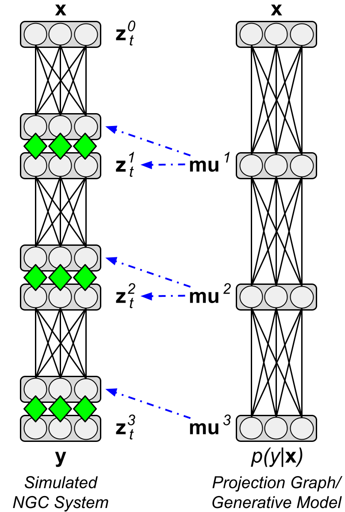
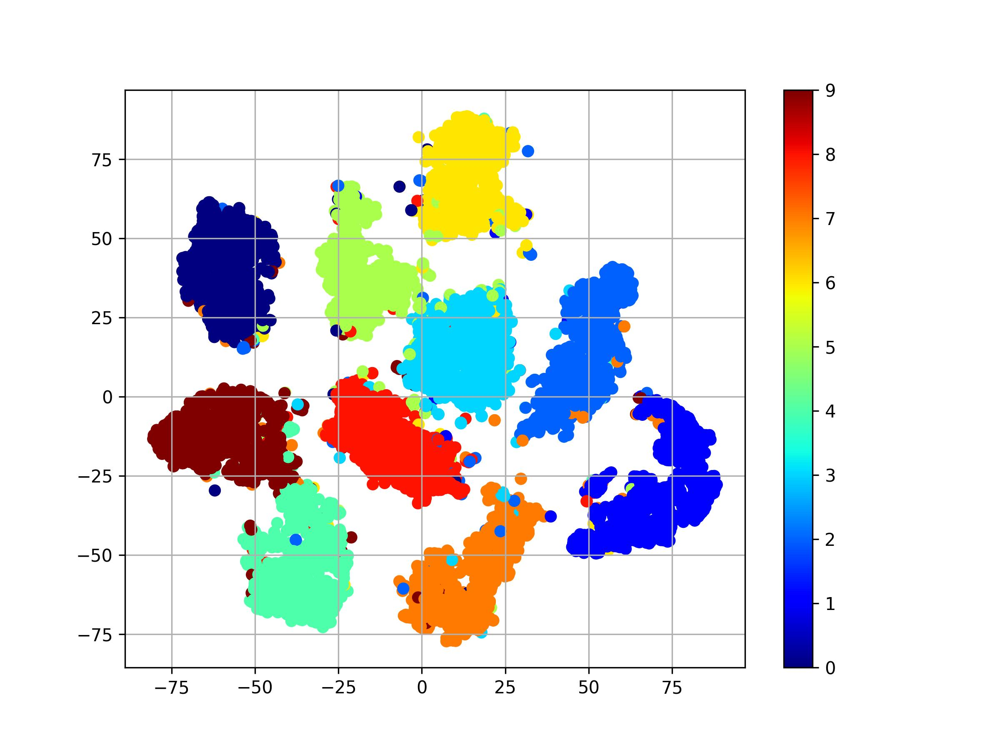
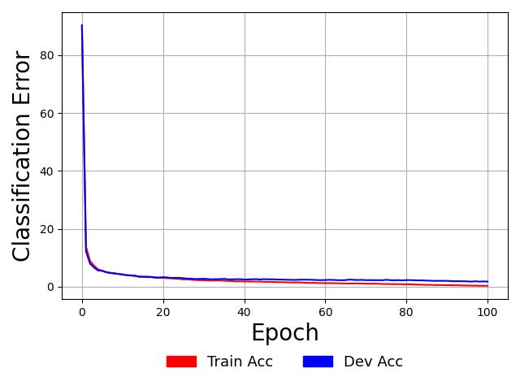
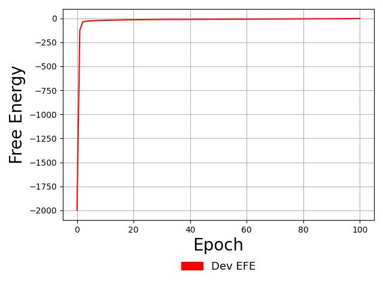

# Discriminative Predictive Coding

In this exhibit, we will see how a classifier can be created based on
predictive coding. This exhibit model effectively reproduces some of the results
reported (Whittington &amp; Bogacz, 2017) <b>[1]</b>. The model code for this
exhibit can be found
[here](https://github.com/NACLab/ngc-museum/tree/main/exhibits/pc_discrim).

Note: You will need to unzip the MNIST arrays in `exhibits/data/mnist.zip` to the
folder `exhibits/data/` to work through this exhibit/walkthrough.

## The Predictive Coding Network (PCN)

The discriminative predictive coding network (PCN) is a hierarchical neuronal
model that seeks to predict the label `y` ($\mathbf{y}$; typically a one-hot encoded label) of a
given sensory input data point `x` ($\mathbf{x}$). The PCN model of <b>[1]</b> showed that constructing
a multi-layer system composed of layers of stateful neural processing units, where one layer
of neurons would locally predict the activities of the ones (situated) above them,
resulted in an effective yet more biologically-plausible classifier,
as compared to deep neural networks trained with backpropagation of errors (or
backprop). Furthermore, <b>[1]</b> showed that the underlying dynamics of the PCN could
be shown to recover the updates to synaptic weights produced by backprop under
certain assumptions/conditions.

In ngc-learn, building the PCN requires working with the library's `graded` neurons,
i.e., those that follow dynamics without spikes/discrete action potentials,
specifically the [RateCell](ngclearn.components.neurons.graded.rateCell)
and the [GaussianErrorCell](ngclearn.components.neurons.graded.gaussianErrorCell)
components. In effect, to construct a two hidden layer model of the form of <b>[1]</b>, one will
wire together four layers of `RateCell`'s, i.e., `z0` ($\mathbf{z}^0$),
`z1` ($\mathbf{z}^1$), `z2` ($\mathbf{z}^2$), `z3` ($\mathbf{z}^3$), with
three [hebbian synapses](ngclearn.components.synapses.hebbian.hebbianSynapse),
i.e., `W1` ($\mathbf{W}^1$), `W2` ($\mathbf{W}^1$), `W3` ($\mathbf{W}^1$).
Inference conducted in accordance with predictive coding mechanics
generally follows a message-passing scheme where local prediction errors  -- the
error/mismatch activities associated with each layer's guess of the activities
of the one above it -- are passed up and down via local feedback synaptic
connections in order to produce updates to the neuronal activities themselves. Notice
that this is much akin to the E-step of expectation-maximization (E-M) <b>[2]</b>. This
message-passing is done typically for several steps in time and, after these
dynamics are iteratively run several times, the synaptic weight updates are computed for
each layer's associated predictive synapses (`W1`, `W2`, and `W3`) using
two-factor Hebbian rules.

Formally, the above means, in ngc-learn, that each layer of neuronal dynamics can
be characterized by the following single ordinary differential equation (ODE):

$$
\tau_m \frac{\partial \mathbf{z}^\ell_t}{\partial t} = (-\gamma \mathbf{z}^\ell_t + \mathbf{h}^\ell_t), \; \text{where} \;
\mathbf{h}^\ell_t = -\mathbf{e}^\ell_t + (\mathbf{W}^{\ell+1})^T \cdot \mathbf{e}^{\ell+1}_t
$$

where $()^T$ denotes the matrix transpose and $\cdot$ denotes matrix/vector
multiplication. Since there is no layer above it and it will only ever be
clamped to the label $\mathbf{y}$ (during training), $\mathbf{z}^\ell_t=3$'s
dynamics ultimately reduce to $\mathbf{z}^3_t = \mathbf{y}$, i.e.,
this means we set the target output activity to be equal to the label.
Furthermore, the bottom layer $\mathbf{z}^0_t$ will always be clamped to the
sensory input, e.g., a pixel image, so it also reduces to $\mathbf{z}^0 = \mathbf{x}$
(this means that we set the input layer to be equal to the data).[^1]
These two simplifications means we only need to run the dynamics for neuronal
layers $\mathbf{z}^1$ and $\mathbf{z}^2$ via Euler integration (which is what
the `RateCell` does by default).

The only other key aspect to define in the above ODE is what $\mathbf{e}^\ell_t$
means. This is known in ngc-learn as an "error cell", which is another type of
[graded neuron component](../modeling/neurons.md) and is, for the purposes of
constructing the model of <b>[1]</b>, defined as:

$$
\mathbf{e}^\ell_t = (\mathbf{z}^\ell_t - \mu^\ell_t), \; \text{where} \;
\mu^\ell_t = \mathbf{W}^\ell \cdot \phi^{\ell-1}(\mathbf{z}^{\ell-1})
$$

given that it is the first derivative (with respect to the prediction mean $\mu^\ell_t$)
of a Gaussian log likelihood functional $\mathcal{F}^\ell$, with fixed unit variance,
applied locally to measure the discrepancy between the actual neural activity
at layer $\ell$ -- $\mathbf{z}^\ell_t$ -- and the predicted neural activity
$\mu^\ell_t$. You will notice that the equation
$\mu^\ell_t = \mathbf{W}^\ell \cdot \phi^{\ell-1}(\mathbf{z}^{\ell-1})$ depicts
how a local prediction is made from layer $\ell-1$ about the activity values in
layer $\ell$, where $\phi^{\ell-1}$ is an elementwise activation function
applied to the neuronal activity values (note that the PCN model in ngc-learn sets
these to `sigmoid`).[^2]

The next important part in characterizing a PCN is its synaptic dynamics, which,
after running the above equations for several steps in time, amounts to a single
application of the following ODE (for each weight matrix `W1`, `W2`, and `W3`):

$$
\tau_w \frac{\partial \mathbf{W}^\ell_{t_j}}{\partial {t_j}} =
-\lambda \mathbf{W}^\ell_{t_j} + \mathbf{e}^\ell \cdot (\phi^{\ell-1}(\mathbf{z}^{\ell-1}))^T
$$

where we use $t_j$ to indicate that the time-scale of the updates for any
synaptic weight matrix $\mathbf{W}^\ell$ is slower than those of the neuronal
activities described earlier.

The last part for constructing an effective PCN for classification is simply
determining how the initial conditions are set for the neurons in layers
$\ell = 1$ and $\ell = 2$. Much as in <b>[1]</b, this is done by clamping the input
layer to sensory data, i.e., $\mathbf{z}^0 = \mathbf{x}$, clamping
the output layer to label data $\mathbf{z}^3 = \mathbf{y}$,
and initializing $\mathbf{z}^1$ and $\mathbf{z}^2$ to values that are produced
via feedforward pass/sweep (or "ancestral projection pass") from the input
layer to output layer via:

$$
\mu^1_t &= \mathbf{W}^1 \cdot \mathbf{z}^0, \; \mathbf{z}^1 = \phi^1(\mu^1_t) \\
\mu^2_t &= \mathbf{W}^2 \cdot \mathbf{z}^1, \; \mathbf{z}^2 = \phi^2(\mu^2_t) \\
\mu^3_t &= \mathbf{W}^3 \cdot \mathbf{z}^2
$$

which also gets us our initial local predictions for free (same goes for the
error values, which are, at initialization, $\mathbf{e}^1 = 0$,
$\mathbf{e}^2 = 0$, and $\mathbf{e}^3 = \mathbf{z}^3_t - \mu^3_t$). (Note: the
above equations are simply run for test-time when a label is not present to
obtain a fast prediction of input samples in the test-set and to measure
model generalization ability.)

In the figure below, we graphically depict what the simulated PCN and its
corresponding conditional generative model (ancestral projection graph) look like
(the blue dashed arrow just point outs that the layer `mu1` of the feedforward
sweep step is used initialize the neuronal activities of `z1` in the
PCN model's dynamics). Note that `mu1` is $\mu^1_t$, `mu2` is $\mu^2_t$, and
`mu3` is $\mu^3_t$ while `z^1_t` is $\mathbf{z}^1_t$, `z^2_t` is $\mathbf{z}^2_t$, and
`z^2_t` is $\mathbf{z}^3_t$ (`z^0_t` is the input layer $\mathbf{z}^0$).

<!--  -->

```{eval-rst}
.. table::
   :align: center

   +-----------------------------------------------------------------+
   | .. image:: ../images/museum/pcn_discrim/ngclearn_demo3_arch.png |
   |   :scale: 50%                                                   |
   |   :align: center                                                |
   +-----------------------------------------------------------------+
```

Constructing the above model dynamics and initial conditions, as well as simulating
these over multiple passes through the MNIST database, is what is done in the
[model exhibit code for the PCN](https://github.com/NACLab/ngc-museum/tree/main/exhibits/pc_discrim).
Effectively, most of the central configuration/hyper-parameters values
can be done through the model exhibit's constructor (relevant snippet from
`train_pcn.py` shown below):

```python
model = PCN(subkeys[1], x_dim, y_dim, hid1_dim=512, hid2_dim=512, T=20,
            dt=1., tau_m=20., act_fx="sigmoid", eta=0.001, exp_dir="exp",
            model_name="pcn")
```

where the integration time constant for the Euler integration of the neuronal
dynamics is set to `1` millisecond (ms) which are run for `T = 20` (E-)steps
before synaptic weights are updated with the Hebbian ODE shown above. Also,
much as in <b>[1]</b, the Adam adaptive learning rate (with global learning rate
`eta = 0.001`) is used to apply the Hebbian adjustments to the synaptic weight values.

Note that the `PCN` exhibit model constructor provides, among several model and
task-specific functions and convenience routines, a key function called `process`,
which takes in sensory input and labels and runs the full E-M dynamics described
earlier. In this function, there is an argument called `adapt_synapses` which, if set
to `True`, will run the model's settling dynamics and perform the synaptic update
steps after `T` E-steps have been simulated;
however, if it is set to `False`, the learning dynamics are turned off and only
the output prediction $\mu^3_t$ (`mu3`) is read out (the label is not used).

## Running the PCN Model

To train the PCN classifier described above, go to the `exhibits/pc_discrim`
sub-folder (this step assumes that you have git cloned the model museum repo
code), and execute the PCN's training script from the command line as follows:

```console
$ ./sim.sh ## default verbosity level set to 0
```

which will execute a training process using an experimental configuration very
similar to (Whittington &amp; Bogacz, 2017). After your model finishes
training you should see a validation score and output similar[^4] to the one below:

```console
------------------------------------
 Trial.sim_time = 0.21799945453802744 h  (784.7980363368988 sec)  Best Acc = 0.982400119304657
```

You will also notice that in the experimental output folder created for you
by the script -- `/exp/` -- which contains several saved arrays as well as your
learned ngc-learn model, saved to disk for you as follows:
1. `/exp/nll.npy` (the model's predictive output negative log likelihood measurements),
2. `/exp/efe.npy` (the PCN's free energy measurements),
3. `/exp/acc.npy` (the model's development accuracy measurements), and,  
4.  `/exp/trAcc.npy` (the model's training accuracy measurements)).

To use your saved model and examine its performance on the MNIST test-set, you
can execute the evaluation script like so:

```console
$ python analyze_pcn.py  --dataX="../data/mnist/testX.npy" \
                         --dataY="../data/mnist/testY.npy"
```

which should result in an output similar what is shown below:

```console
------------------------------------
=> NLL = 0.07531584054231644  Acc = 0.9803001284599304
```

Desirably, our out-of-sample results on both the validation and
test-set corroborate the measurements reported in (Whittington &amp; Bogacz, 2017) <b>[1]</b,
i.e., a range of `1.7`-`1.8`\% validation error was reported and our
simulation yields a validation accuracy of `0.9824 * 100 = 98.24`\% (or `1.76`\% error)
and a test accuracy of `0.9803 * 100 = 98.03`\% (or about `1.969`\% error),
even though our predictive processing classifier differs in a minor ways.[^3]

Furthermore, running the `analyze_pcn.py` script as above also produces,
locally in your experimental directory `exp/`, a t-SNE visualization of your
PCN's penultimate layer of neuronal activities (its "latent codes" in the layer
below the predictive output layer). You should see a t-SNE plot
(named `exp/pcn_latents.jpg`) similar to the one below:



As can be seen in the plot above, the PCN's latents look like they have roughly
clustered themselves based on digit category (i.e., where something is zero versus whether
it is a two, etc.), which is what we would expect given that the PCN directly
uses the labels to drive the error cells at the very top layer (at $\mathbf{e}^3)
during training.

Finally, since the model exhibit training code collects your model's training
and validation likelihood measurements at the end of each pass through the
data (i.e., "epoch"), you can write some Python code to plot the model's
learning curves like so:

```python
import matplotlib
import matplotlib.pyplot as plt
import matplotlib.patches as mpatches
import numpy as np

colors = ["red", "blue"]
# post-process learning curve data
y = (1.0 - np.load("exp/trAcc.npy")) * 100. ## training measurements
vy = (1.0 - np.load("exp/acc.npy")) * 100. ## dev measurements
x_iter = np.asarray(list(range(0, y.shape[0])))
## make the plots with matplotlib
fontSize = 20
plt.plot(x_iter, y, '-', color=colors[0])
plt.plot(x_iter, vy, '-', color=colors[1])
plt.xlabel("Epoch", fontsize=fontSize)
plt.ylabel("Classification Error", fontsize=fontSize)
plt.grid()
## construct the legend/key
loss = mpatches.Patch(color=colors[0], label='Train Acc')
vloss = mpatches.Patch(color=colors[1], label='Dev Acc')
plt.legend(handles=[loss, vloss], fontsize=13, ncol=2,borderaxespad=0, frameon=False,
           loc='upper center', bbox_to_anchor=(0.5, -0.175))
plt.tight_layout()
plt.savefig("exp/pcn_mnist_curves.jpg") ## save plot to disk
plt.clf()
```

which should produce a set of learning curves as below:



As observed in the plot above, this PCN classifier begins to overfit the
training sample nearly perfectly, as indicated by the fact that the blue validation
`Dev Acc` curve is a bit higher than the red `Acc` learning curve. Note that these
reported accuracy measurements come from using the ancestral projection graph
(the initialization step of the settling process) that we used
to start the E-M process of the discriminative PCN system, meaning
that we could deploy the projection graph itself as a probabilistic neuronal
model of `p(y|x)`.

### Aside: Inspecting the PCN's Free Energy

You will notice that, among your simulation code's outputs in the `/exp/`
folder, is an array called `efe.npy`. This contains the PCN's measured
(expected) free energy, tracked cumulatively across the entire training
dataset, at the end of each epoch. Plotting this array (with code similar
to what was shown above for the learning curves) gives:



This plot simply shows that the entire PCN system can be shown to optimizing a
global objective function, i.e., the full free energy
$\mathcal{F} = \mathcal{F}^1 + \mathcal{F}^2 + \mathcal{F}^3$ (more generally,
this $\mathcal{F} = \sum^L_{\ell=1} \mathcal{F}^\ell$, where we saw earlier that
the first derivative of $\mathcal{F}^\ell$ was what gave us  our error cell
equation for layer $\ell$). Indeed, since we see that our free energy curve approaches zero
(coming from very low negative values) in the above plot, our PCN is
optimizing the full free energy $\mathcal{F}$. Note that, while it would not be
easy to tell by visual inspection of the above plot, the final free energy
reached is `-1.9853954` (nats).

<!-- references -->
## References
<b>[1]</b> Whittington, James CR, and Rafal Bogacz. "An approximation of the error
backpropagation algorithm in a predictive coding network with local hebbian
synaptic plasticity." Neural computation 29.5 (2017): 1229-1262.<br>
<b>[2]</b> Dempster, Arthur P., Nan M. Laird, and Donald B. Rubin. "Maximum
likelihood from incomplete data via the EM algorithm." Journal of the royal
statistical society: series B (methodological) 39.1 (1977): 1-22.

<!-- footnotes -->
[^1]: If one inspects the constructor code of the `PCN`, one will also see that
the integration time constant `tau_m` for both layer/node `z0` and `z3` have been
set to zero -- this is effectively a shortcut in ngc-learn that tells those nodes
to run "stateless dynamics" or, in other words, to just employ a simple forwarding
operation that does not require integrating an ODE (this just reduces unused
calculations of little interest to the modeler).   
[^2]: Note that the bottom/input layer `z0`'s activation $\phi^0$ is set to the
identity function in both ngc-learn and in <b>[1]</b>. The same is done for the
PCN's top/layer `z1`'s activation $\phi^3$.
[^3]: The most notable difference is that our PCN model works directly with
the normalized pixel data whereas <b>[1]</b> transforms the
data with an inverse logistic transform. However, note that you can find this
function implemented in ngc-learn as `inverse_logistic()` in
`ngclearn.utils.model_utils` if you wanted to do this yourself.
[^4]: Simulation wall-clock time will vary depending on whether or not you are using
a CPU or GPU as well as the properties of your system's CPU/GPU.
