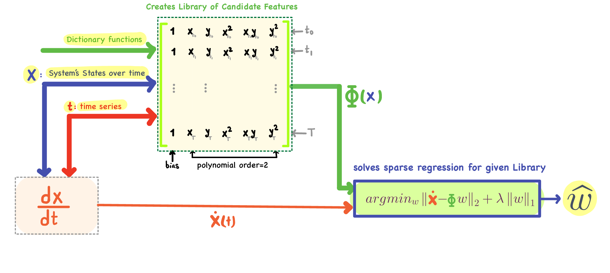

# Sparse Identification of Non-linear Dynamical Systems (SINDy)[]

In this section, we teach, create, simulate, and visualize SINDy model implemented in NGC-Learn library. 

The model **code** for this exhibit can be found [here](https://github.com/NACLab/ngc-museum/exhibits/sindy/sindy.py).

## SINDy 
SINDy is a data-driven algorithm that discovers the differential equation governing the dynamical systems. It uses symbolic regression to identify differential equation of the system and it solves sparse regression over the pre-defined library of candidate terms. It takes time series gathered dataset of the system and it gives you its describing differential equation.

  

### Inputs
Given a set of time-series measurements of a dynamical system state variables ($\mathbf{X}_{(m \times n)}$) we construct:

Time: $ts = [t_0, t_1, \dots,  T]$  (number of measurements)

State matrix: $\mathbf{X}_{(m \times n)}$  (t measurements of n variables)

### Data Matrix

Given a set of time-series measurements of a dynamical system state variables ($\mathbf{X}_{(m \times n)}$) we construct:
Derivative matrix: $\dot{\mathbf{X}}_{(m \times n)}$ (computed numerically)

Library of Candidate Functions: $\Theta(\mathbf{X}) = [\mathbf{1} \quad \mathbf{X} \quad \mathbf{X}^2 \quad \mathbf{X}^3 \quad \sin(\mathbf{X}) \quad \cos(\mathbf{X}) \quad ...]$

------------------

SINDy describes the derivative (linear operation acting on △t) as linear transformations
of a manually constructed dictionary from the state vector by a coefficient matrix.
Dictionary learning combined with LASSO (L1-norm) promotes the sparsity of the coefficient matrix
which allows only governing terms in the dictionary stay non-zero.

