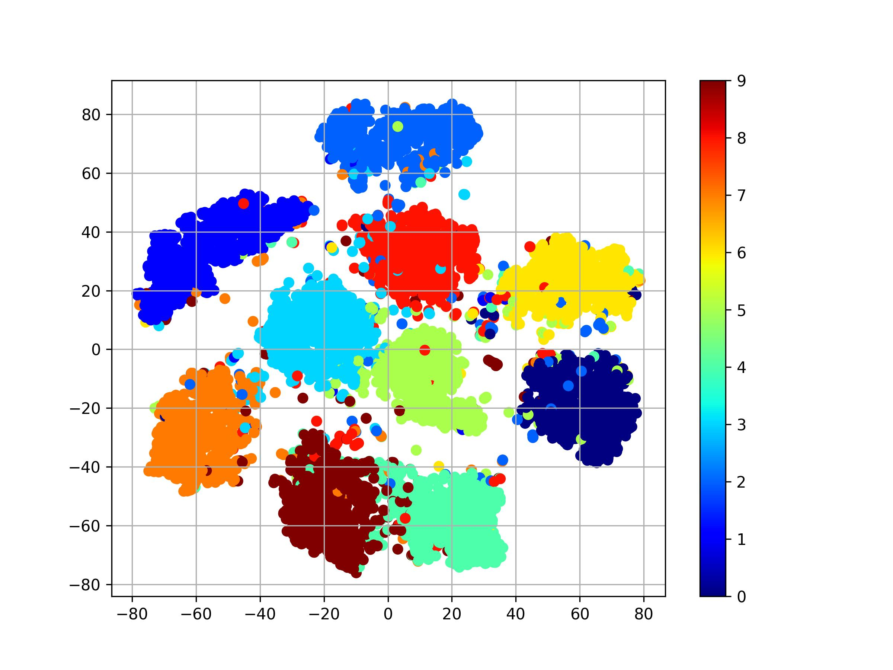
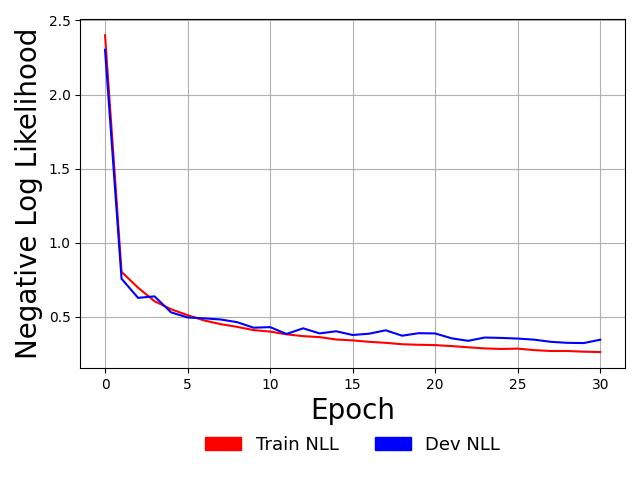

# Spiking Neural Networks: Learning with Broadcast Feedback Alignment

In this exhibit, we will see how one can train a spiking neural network model
using surrogate functions and a credit assignment scheme called broadcast
feedback alignment (BFA) <b>[1]</b>.
This exhibit model effectively reproduces some of the results
reported (Samadi et al., 2017) <b>[1]</b>. The model code for this
exhibit can be found
[here](https://github.com/NACLab/ngc-museum/tree/main/exhibits/bfa_snn).

Note: You will need to unzip the MNIST arrays in `exhibits/data/mnist.zip` to the
folder `exhibits/data/` to work through this exhibit/walkthrough.

<!-- ## Building with the Simplified Leaky-Integrate-and-Fire -->
## The Broadcast Feedback Alignment Spiking Network (BFA-SNN)

<!-- Building the SNN is no different than any other system in ngc-learn and is done as follows (note that the settings shown below follow closely those reported in [2]): -->

The model proposed and studied in <b>[1]</b> is a multi-layer spiking neural
network (SNN) composed of leaky integrators meant to engage in supervised learning,
specifically the task of classification. Concretely, this means that it takes
an image input $\mathbf{x}$ and tries to predict its label, the ground truth of
which is (one-hot) encoded in $\mathbf{y}$.
Additionally, the BFA-SNN exhibit is useful for thinking how one might
craft and apply backprop-alternative, biologically-plausible credit
assignment schemes to spiking neuronal networks; for instance, broadcast
feedback alignment (BFA), as was done in <b>[1]</b>. Note that we, in this
exhibit, abbreviate the SNN trained with BFA to "BFA-SNN" (and the constructor
inside of the `bfasnn_model.py` file is named `BFA_SNN`).

The BFA-SNN model instantiated in this exhibit is made up of three layers:
1. a sensory input layer made up of [Bernoulli encoding](ngclearn.components.input_encoders.bernoulliCell)
neuronal cells, where the probability of firing for any pixel within in an image
(yielding a value of one) is taken to be the normalized, scaled pixel intensity[^1];
2. one hidden layer of leaky integrate-and-fire (LIF) cells; and,
3. one output layer of LIF cells (`10` LIFs specifically, one per class category in MNIST).

### Neuronal Dynamics

The sensory input layer of the BFA-SNN is rather simple -- it assumes
that input values are probabilities (specifically, the observed input image
vector is assumed to be a collection of spike probabilities that drive a set
of Bernoulli distributions, where each pixel represents a Bernoulli distribution
$\mathcal{B}(\mathbf{x}_i(t) = 1; p=\mathbf{x}_i); note this means your image
pixel values should be scaled to be between `[0,1]`). The hidden and output
layers are made up leaky integrate-and-fire (LIF) neuronal cells; specifically,
the BFA-SNN model utilizes ngc-learn's simplified LIF[^2] (i.e., the
[SLIF](ngclearn.components.neurons.spiking.sLIFCell)).
The `SLIF` model simulates the core dynamics of what we would want from leaky
integration and further sports a few conveniences useful for recovering
certain modeling choices made by different research studies, such as the use
of surrogate functions for approximating partial derivatives of non-differentiable
spike emission functions (which will be touched on below).

The SLIF component, in effect, adheres to the following dynamics:

$$
\tau_m \frac{\partial \mathbf{v}_t}{\partial t} =
(-\mathbf{v}_t + R \mathbf{j}_t) \odot \mathbf{m}_{rfr}
$$

where $\mathbf{j}_t$ is the set of electrical current values fed into the group of
neuronal units within the component, $\mathbf{v}_t$ is the membrane potentials
of the component's internal neural population, $\tau_m$ (`tau_m`) is the membrane
time constant (shared for all units inside the component), $R_m$ (`R`) is the
membrane resistance factor (shared for all units), and $\mathbf{m}_{rfr}$ is a
mask produced by the cell's refractory variable -- if any cell within the component
is in its refractory period, it will be clamped to a resting potential of
$0$ milliVolts (mV). Note that Euler integration is used to get from
$\mathbf{v}_t$ to $\mathbf{v}_{t+\Delta t}$.

To emit (binary) spikes in the hidden and output layer, each voltage value
within $\mathbf{v}_t$ is compared to a (scalar) threshold value $v_{thr}$ (`thr`)[^3].
Specifically, a spike is emitted if $\mathbf{s}_{t+\Delta} = \mathbf{v}_{t+\Delta t} > v_{thr}$ and,
if any cell $i$ emits a spike its specific voltage value is hyperpolarized back
to a base value of `0` mV.

### Broadcast Feedback Alignment (and In-Built Surrogate Functions)

Adaptation in our BFA-SNN model, under the above neuronal dynamics described
above, requires combining two simple mechanisms together:
1) we introduce a feedback synaptic cable, `E2`, which will be randomly
initialized and fixed (the feedback synapses will not be changed throughout
the course of simulation), and
2) the forward synaptic cables, `W1` and `W2`, will be adjusted with simple multi-factor
Hebbian rules.
These two mechanisms can also be illustrated with the architecture of our
BFA-SNN model, as shown below.

```{eval-rst}
.. table::
   :align: center

   +-------------------------------------------------------+
   | .. image:: ../images/museum/bfa_snn/bfa_snn.png       |
   |   :scale: 85%                                         |
   |   :align: center                                      |
   +-------------------------------------------------------+
```


Specifically, this means we will instantiate `W1` ($\mathbf{W}^1$),  `W2` ($\mathbf{W}^2$),
and  `E2` ($\mathbf{E}^2$) as [Hebbian synapses](ngclearn.components.synapses.hebbian.hebbianSynapse).
For `E2`, the learning rate argument `eta_w` is set to zero, so no learning rule
will ever applied to the feedback synapses. For `W1` and `W2`, the learning rules
will effectively become:

$$
\Delta \mathbf{W}^1 &= \mathbf{d}^1 \cdot (\mathbf{s}^0(t+\Delta t))^T \\
\Delta \mathbf{W}^2 &= \mathbf{e}^2 \cdot (\mathbf{s}^1(t+\Delta t))^T
$$

where $\mathbf{s}^0(t+\Delta t)$ contains the binary spikes produced from the
`BernoulliCell` units in the input layer, $\mathbf{s}^1(t+\Delta t)$ contains the
spikes produced by the hidden layer of `SLIF` units, and $\mathbf{e}^2$ is a
set of [Gaussian error neuron cells](ngclearn.components.neurons.graded.gaussianErrorCell)
placed at the output layer to measure the mismatch between the output layer
spikes (stored in a vector $\mathbf{s}^2(t+\Delta t)$) and some target spike
train spikes, i.e., in this exhibit's case, the target spike train is simple as
it is merely copying the one-hot encoding of the label for `T` steps or
$\mathbf{s}_y(t) = \mathbf{y}$. $\mathbf{e}^2$ is specifically computed as follows:

$$
\mathbf{e}^2 = -\big( \mathbf{s}_y(t) - \mathbf{s}^2(t) \big)
$$

which, as described in [the Gaussian error cell API](ngclearn.components.neurons.graded.gaussianErrorCell),
is effectively the first derivative of a Gaussian (with unit variance) distribution
with respect to the output spike vector. This means that the output layer synaptic efficacies
in `W2` are adapted with a simple two-factor Hebbian rule where the first term
(the pre-synaptic term) is the incoming spikes from the hidden layer and
the second term (the post-synaptic term) is the mismatch values produced by
comparing the output layer spikes against the target spikes.

Finally, the last part to take notice of is the first synaptic update rule for `W1`,
i.e., $\Delta \mathbf{W}^1$; the first term is similar to the one for the
rule for `W2` as it is the pre-synaptic spikes $\mathbf{s}^0(t+\Delta t)$ produced by the input layer of
`BernoulliCell` units. It is the second, post-synaptic term that is most interesting
-- it is a "teaching signal"  $\mathbf{d}^1$ produced by using the feedback synapses `E2` we
mentioned earlier in this tutorial. Formally, the teaching signals $\mathbf{d}^1$
are computed as follows:

$$
 \mathbf{d}^1 = \big( \mathbf{E}^2 \cdot \mathbf{e}^2 \big) \odot
                f_{surr}(\mathbf{j}^1_{t+\Delta t})
$$

where the first term of the Hadamard product (i.e., the $\odot$) is merely
a transmission of error neuron values down along the `E2` synaptic cable
while the second term is known as a [surrogate function](ngclearn.utils.surrogate_fx).
A surrogate function is, mathematically, a substitute derivative function for the
true derivative of some typically non-differentiable function, such as the
binary spike emission function typically used in spiking networks. Since
BFA as an algorithm can be likened to performing backpropagation of errors (backprop;
an algorithm typically used to train deep neural networks) on spiking neural
network without reusing the synapses to back-transmit error/teaching signals
(a biological criticism of backprop known as the "weight transport problem"
<b>[2]</b>), we still need derivatives of most of the mathematical operations we took
to get to the output. In a spiking network's case, this would be its spike emission
functions and the (integration of the) its differential equations for updating the
voltage values. If we do not use surrogate functions for differentiation-based
credit assignment, we either omit the function $f_{surr}$ above -- which leads
to degraded generalization performance as was investigated in <b>[1]</b> -- or
we face the "dead neuron problem", where effectively means that the true derivative
of the spike function is zero, resulting in multiplications by zero.
While surrogate functions and gradients for spiking networks are covered
in [more detail elsewhere](https://arxiv.org/pdf/2109.12894.pdf), ngc-learn
contains several useful [in-built surrogate routines](ngclearn.utils.surrogate_fx)
for dealing with the "dead neuron problem" and among them is the very one
utilized in <b>[1]</b> for their BFA-SNN model, i.e., ngc-learn's
`secant_lif_estimator()`.[^4] In effect, the secant LIF estimator is essentially
a specialized mathematical approximation to LIF spiking dynamics/emission patterns,
producing a value of $(c_1 * c_2) \text{sech}^2(c_2 * \mathbf{j}_{t + \Delta t})$ for
electrical current values $\mathbf{j}_{t + \Delta t}$ greater than zero and zero
otherwise.

Using this as the `secant_lif_estimator()` for the surrogate $f_{surr}$ is the
last core detail needed for implementing BFA in ngc-learn, completing the picture
of what the BFA-SNN exhibit does under the hood.


## Running the BFA-SNN Model

To fit the BFA-SNN model described above, go to the `exhibits/bfa_snn`
sub-folder (this step assumes that you have git cloned the model museum repo
code), and execute the BFA-SNN's simulation script from the command line as follows:

```console
$ ./sim.sh
```

which will execute a training process using an experimental configuration very
similar to (Samadi et al., 2017).  Specifically, the Bash script executes
`train_bfasnn.py` which simulates a SNN-BA on the MNIST database for `30`
epochs. This script will also save your trained SNN model to the `/exp/`
sub-directory (which is what the `analyze_bfsnn.py` script, used below, looks for).
After your model finishes training you should see output similar to the one below:

```console
------------------------------------
 Trial.sim_time = 0.31237981763150957 h  (1124.5673434734344 sec)  Best Acc = 0.9668000340461731
```

The above simulation output of our SNN displays the wall-clock simulation time
(i.e., about `18` minutes for a three-year old NVIDIA GPU when producing the
example above) as well as the MNIST development/validation set accuracy.
To use your saved/trained model and examine its performance on the MNIST test-set, you
can execute the evaluation script like so:

```console
$ python analyze_bfsnn.py --dataX=../data/mnist/testX.npy --dataY=../data/mnist/testY.npy
```

while will evaluate your BFA-SNN's performance on the MNIST test-set, reporting
its (negative) log likelihood[^5] and label accuracy as follows:

```console
=> NLL = 0.3721860647201538  Acc = 0.9628000259399414
```

In effect, we approximately recover the test performance of the single hidden
layer model (with `1000` LIF units), trained with BFA (using ngc-learn's
in-built implementation of the secant surrogate function `E(x)` of <b>[1]</b>),
as reported in <b>[1]</b>. Specifically, we observe the BFA-SNN reaches
`96`% test classification accuracy (bear in mind, we are counting spikes and,
for each row in an evaluated test mini-batch matrix, the output LIF node with the
highest spike count at the end of `T * dt` ms is chosen as the SNN's predicted label).

Finally, running the above analysis script also produces a (t-SNE) visualization
of the estimated rate codes related to the model's internal/hidden layer (made up
of $1000$ `SLIF` cells) similar to the one below:



Intriguingly, we see that the latent codes represented by the BFA-SNN's hidden
layer spikes yield a rather (piecewise) linearly-separable transformation
of the input digits, making the process of mapping inputs to label vectors
much easier for the model's second layer of classification LIF units.
Note that, in the `BFA_SNN` model exhibit class, we estimated
rate codes to produce this plot by converting a spike train of the SNN for each
and every sample as follows:

$$
\mathbf{z}^{1,i} = \frac{\gamma}{(T-T_{nl})} \sum^T_{t=T_{nl}} \mathbf{s}^{1,i}(t).
$$

where the superscript $i$ indexes the $i$ sample sensory data pattern.

One particularly noteworthy difference between the exhibit model and
the one reported in <b>[1]</b> is that our BFA-SNN directly processes
Bernoulli spike trains whereas the original focused on processing the raw
real-valued pattern vectors, i.e., copying the input x to each time step (note
that this could be done by replacing our input `BernoulliCell` with a `RateCell`
that has its `tau_m` time constant set to `0`). One notable limitation of both
our model and the <b>[1]</b> model is that both allow the signs of synaptic weights
to change throughout the course of learning, i.e., an initially non-negative
valued synapse could, at one point in training, become negative, which is
biologically-implausible as synapses should have positive values and
a fixed population of excitatory and inhibitory neurons should do the work
of amplification and depression (something that our
[Diehl and Cook model](../museum/snn_dc.md) exhibit directly adheres to).
<!-- Furthermore, our SNN processing loop usefully approximates an output distribution by averaging over electrical current inputs (allowing us to measure its predictive log likelihood). -->

<!-- There is certainly more to the story of spike trains far beyond the model of
leaky integrate-and-fire neurons and Bernoulli spike train encoding. Notably,
there are many, many more neurobiological details that this type of modeling omits
and one of the many exciting paths in ngc-learn's continual development
is to continue to incorporate and test its dynamics simulator on an
ever-increasing collection of standard spike-based cell models of increasing
complexity and biological faithfulness. -->

### Aside: Plotting the BFA-SNN's Negative Log Likelihood

The training script `train_bfasnn.py` also saves for you, in the `/exp/` several
Numpy arrays, containing measurements of the model's training and development accuracy
and negative log likelihoods.
You can plot the values in these numpy arrays like to produce a nice visualization
of the BFA-SNN's learning curves like so:

```python
import matplotlib
import matplotlib.pyplot as plt
import matplotlib.patches as mpatches
import numpy as np

colors = ["red", "blue"]
# post-process likelihood learning curve data
y = np.load("exp/trNll.npy") ## training measurements
vy = np.load("exp/nll.npy") ## dev measurements
x_iter = np.asarray(list(range(0, y.shape[0])))
## make the plots with matplotlib
fontSize = 20
plt.plot(x_iter, y, '-', color=colors[0])
plt.plot(x_iter, vy, '-', color=colors[1])
plt.xlabel("Epoch", fontsize=fontSize)
plt.ylabel("Negative Log Likelihood", fontsize=fontSize)
plt.grid()
## construct the legend/key
loss = mpatches.Patch(color=colors[0], label='Train NLL')
vloss = mpatches.Patch(color=colors[1], label='Dev NLL')
plt.legend(handles=[loss, vloss], fontsize=13, ncol=2,borderaxespad=0, frameon=False,
           loc='upper center', bbox_to_anchor=(0.5, -0.175))
plt.tight_layout()
plt.savefig("exp/bfasnn_mnist_likelihood.jpg") ## save plot to disk
plt.clf()
```

which would produce a plot much like below:



where we see that the SNN has decreased its approximate negative log likelihood
from a starting point of about `2.30` nats to about `0.32` nats (on the
validation dataset). This is bearing in mind that we have estimated class
probabilities output by our SNN by probing and averaging over electrical current
values from `25` simulated milliseconds per mini-batch of test patterns.
We remark that this constructed SNN is not particularly deep and with additional
layers of `SLIF` nodes, improvements to its accuracy and approximate log
likelihood would be possible.[^6]

<!-- references -->
## References
<b>[1]</b> Samadi, Arash, Timothy P. Lillicrap, and Douglas B. Tweed. "Deep
learning with dynamic spiking neurons and fixed feedback weights." Neural
computation 29.3 (2017): 578-602. <br>
<b>[2]</b> Grossberg, Stephen. "Competitive learning: From interactive activation
to adaptive resonance." Cognitive science 11.1 (1987): 23-63.
<!-- [3] Hodgkin, Alan L., and Andrew F. Huxley. "A quantitative description of membrane current and its application to conduction and excitation in nerve." The Journal of physiology 117.4 (1952): 500. -->

<!-- footnotes -->
[^1]: In the model constructor code in `bfasnn_model.py`, there is a small
co-routine called `scale_input()` which will multiply pixel inputs, assuming
they are normalized between `[0,1]`, by a default factor of `input_gain = 0.25`.
[^2]: The simplified LIF is also covered in a more detail in the tutorial on
the [SLIF component](../tutorials/neurocog/simple_leaky_integrator.md).
[^3]: Note that it is possible to configure this threshold to be a per-adaptive
neuronal unit threshold that adapts/decays with time; see the API of the
[SLIF component](../tutorials/neurocog/simple_leaky_integrator.md) for details.
This modeling decision was not used in the source work <b>[1]</b> that proposed the BFA-SNN.
[^4]: Surrogate routines in ngc-learn take on the
$f_{surr}(\mathbf{x}, \text{other args})$ function format to create approximate
derivatives; some functions, like the secant estimator use electrical current
for $\mathbf{x}$ while others might use the voltage/membrane potential and/or
voltage threshold.
[^5]: Inside of the `BFA_SNN` exhibit class, we, unlike <b>[1]</b> also report and track
the negative Categorical log likelihood (`NLL`) by approximating the SNN's
label distribution using spike outputs (from the second `SLIF` layer `z2`) and
applying a softmax function to a simple temporal average (over `T` time
steps). However, actual classification in the `BFA_SNN` does not use this approximate
label distribution; instead, to produce label predictions, we simply take the
argmax of a final output spike count/frequency vector produced at the end
of `T` time steps..
[^6]: The BFA learning approach would, in principle, work well for any
number of layers. This is motivated by the results reported in <b>[1]</b>, where
additional layers were found to, experimentally on MNIST, improve generalization
a bit more.
<!-- and, as reported in [3], using layers with many more LIF neurons were
demonstrated to boost predictive accuracy (with nearly 6400 LIF neurons). -->
