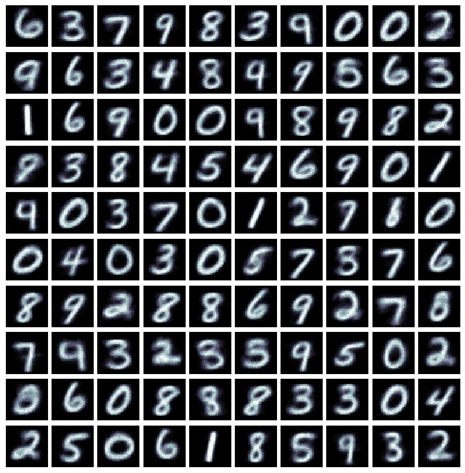
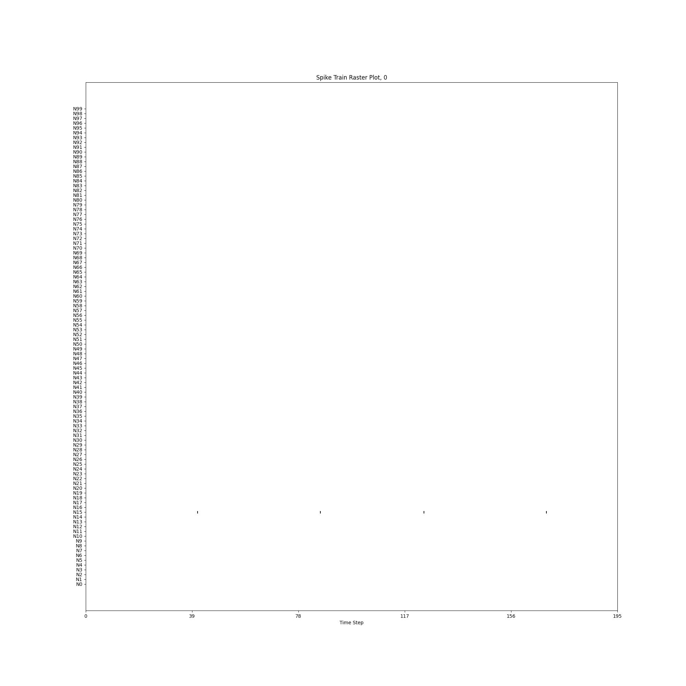

# The Diehl and Cook Spiking Neuronal Network

In this exhibit, we will see how a spiking neural network model that adapts
its synaptic efficacies via spike-timing-dependent plasticity can be created.
This exhibit model effectively reproduces some of the results
reported (Diehl &amp; Cook, 2015) <b>[1]</b>. The model code for this
exhibit can be found
[here](https://github.com/NACLab/ngc-museum/tree/main/exhibits/diehl_cook_snn).

## The Diehl and Cook Spiking Network (DC-SNN)

The Diehl and Cook spiking neural network <b>[1]</b> (which we abbreviate to "DC-SNN")
is an important model of spiking neuronal dynamics that crucially demonstrated
effective unsupervised learning on MNIST digit patterns. Furthermore, it is a
rather useful model for getting a handle on the interaction between explicit
excitatory neurons and inhibitory neurons (where cell in both populations/groups
are leaky integrators). In ngc-learn, constructing a DC-SNN is straightforward
using its in-built leaky integrator, the [LIFCell](ngclearn.components.neurons.spiking.LIFCell),
which is what this model exhibit does for you in the `DC_SNN` model constructor.[^1]
The DC-SNN model in this exhibit also makes use of one of ngc-learn's in-built
[spike-timing-dependent plasticity synapses](ngclearn.components.synapses.hebbian.traceSTDPSynapse)
in order to recover one of the ways that <b>[1]</b> adapted its synaptic strengths.

### Neuronal Dynamics

The DC-SNN is effectively made up of three layers:
1. a sensory input layer made up of [Poisson encoding](ngclearn.components.input_encoders.poissonCell)
neuronal cells (which are configured in the exhibit model to fire spikes at a
maximal frequency of `63.75` Hertz as in <b>[1]</b>),
2. one hidden layer of excitatory leaky integrate-and-fire (LIF) cells, and,
3. one (laterally-wired) hidden layer of inhibitory LIF cells.

The sensory input layer connects to excitatory layer with a synaptic cable `W1` ($\mathbf{W}^1_t$) --
which will be adapted with (traced-based) spike-timing-dependent plasticity as we
will describe in the next section.
The excitatory layer of the model connects to the inhibitory layer with a fixed
identity synaptic cable (ensuring that all excitatory neurons map one-to-one to
the inhibitory ones) while the inhibitory layers are connected to the excitatory layer
via a fixed, negatively scaled hollow synaptic cable.

The dynamics on the structure described above result in a form of sensory input-driven
excitatory LIF dynamics that are recurrently inhibited by the laterally-wired
inhibitory LIF cells (or LIFs). Formally, the excitatory and inhibitory neurons in the
DC-SNN exhibit both adhere to the following ordinary differential equation (ODE):

$$
\tau_m \frac{\partial \mathbf{v}_t}{\partial t} = (v_{rest} -\mathbf{v}_t + R \mathbf{j}_t) \odot \mathbf{m}_{rfr}
$$

where $v_{rest}$ is the resting potential (in milliVolts, mV) and
$\mathbf{m}_{rfr}$ is a binary mask where any element is zero if the
neuronal cell is in its refractory period (meaning that it will be clamped
to its resting/reset potential for so many milliseconds). Note that $odot$ denotes
an elementwise multiplication (Hadamard product) and $\cdot$ denotes a matrix-vector
multiplication. Spikes are emitted from any cell within $\mathbf{v}_t$
according to the following piecewise function:

$$
\mathbf{s}_{t, i} = \begin{cases}
                       1 & \mathbf{v}_{t, i} > \theta_{t, i} \\
                       0 & \mbox{otherwise.}
                    \end{cases}
$$

and any neuron that breached its threshold value and emitted a (binary) spike
is immediately set to its $v_{reset}$ potential (mV); note that $v_{reset}$ might
not be the same as the $v_{rest}. $\theta_t$ contains all of the current
voltage threshold values (and is the same shape as $\mathbf{v}_t). In ngc-learn,
the `LIFCell` component also evolves $\theta_t$ to its own set of dynamics as
follows:

$$
\tau_\delta \frac{\partial \delta}{\partial t} &= -\delta + \alpha \mathbf{s}_t \\
\theta &= \theta + \delta
$$

where $\delta$ is a "homeostatic variable" that essentially increments (any
dimension $i$) by a small constant amount every time a particular cell $i$ emits
a spike (setting $\tau_\delta = 0$ turns off the threshold dynamics). With
the above knowledge, we can now effectively recreate the setup of <b>[1]</b>
by using a value greater than zero for $\tau_\delta$ for the excitatory LIFs
and a value of zero for the inhibitory ones.

Finally, the last key item to specify is how the electrical current is produced
along synapses for the excitatory and inhibitory neurons. For the excitatory
LIFs, the electrical currents can be produced either as their own evolving
ODE (as in <b>[1]</b>) or simplified to pointwise currents[^2]. This entails,
in the `DC_SNN` exhibit class, the following (synaptic) wiring scheme:

$$
\mathbf{j}^e_t &= \mathbf{W}^1_t \cdot \mathbf{s}^{inp}_t - \big((1 - \mathbf{I}) \odot \mathbf{W}^{ie}\big) \cdot \mathbf{s}^i_t \\
\mathbf{j}^i_t &= \big(\mathbf{I} \odot \mathbf{W}^{ei}\big) \cdot \mathbf{s}^e_t
$$

where we denote an excitatory spike vector as $\mathbf{s}^e_t$, an inhibitory
spike vector as $\mathbf{s}^i_t$, and an input (Poisson) spike vector as
$\mathbf{s}^{inp}_t$. As mentioned earlier, $\mathbf{W}^1_t$ is the input-to-excitatory
synaptic cable while $\mathbf{W}^{ei}$ is the excitatory-to-inhibitory synaptic
cable $\mathbf{W}^{ie}$ is the inhibitory-to-excitatory synaptic cable; the
subscript $t$ has been dropped for these cables because they are held fixed
to a constant value <b>[1]</b>. Ultimately, the inhibitory neurons will emit
spikes once enough voltage has been built up as they receive enough electrical
current driven by the excitatory neurons -- once the inhibitory neurons fire,
they will laterally inhibit/suppress the activities of other excitatory cells
(besides the one they receive electrical current directly from). This type/pattern of
cross-layer inhibition will induce a form of "lateral competition" in the dynamics
of the excitatory neural units, where few units specialize represent particular
types/kinds of input patterns (these competitive dynamics are important for
effective adaptation of synapses via STDP).

The spiking neural system that the above specifies will engage in a form of
unsupervised representation learning, simply resulting in sparse spike-train
patterns that correlate with different input digit patterns sampled from the
MNIST database. All that remains is to specify the synaptic plasticity dynamics
for the DC-SNN, which we do next.

### Spike-Timing-Dependent Plasticity (STDP)

Adaptation/plasticity in our DC-SNN is rather simple -- in this model exhibit,
a form of STDP is used to adapt the synaptic weight values (specifically, it
is [trace-based STDP](ngclearn.components.synapses.hebbian.traceSTDPSynapse)),
which models a form of long-term depression (LTD) and long-term potentiation
(LTP) to adjust synapses according to a Hebbian-like rule as follows
(in matrix-vector format):

$$
\tau_{syn} \frac{\partial \mathbf{W}^1_t}{\partial t} =
A_{+} \Big(\mathbf{s}^e_t \cdot (\mathbf{z}^{inp}_t - z_{tar})^T\Big)
- A_{-} \Big(\mathbf{z}^e_t \cdot (\mathbf{s}^{inp}_t)^T\Big)
$$

where we see that LTP is modeled by the first term (to the left of the minus
sign) -- a product of the (excitatory) post-synaptic spike(s)/event(s) that
might have occurred at time $t$ and the value of the pre-synaptic trace[^3] at
the occurrence of spikes at $t$ -- and that LTD is modeled by the second term
-- a product of the (excitatory) post-synaptic trace at time $t$ and the
pre-synaptic spike(s)/event(s) that might have happened at $t$. $A_{+}$ is the
scaling factor controlling how much LTP is applied to a synaptic update
and $A_{-}$ controls how LTD would be applied to the update. $()^T$ denotes
the matrix/vector transpose while $z_{tar}$ is a pre-synaptic trace target
value and set to $0$ in the default configuration of
the DC-SNN (in <b>[1]</b>, this value was used in one of the variants of STDP
investigated; if it is set to be $> 0$, then rarely spiking neurons in the
input layer will be effectively disconnected from the excitatory layer,
effectively fading away to zero).
Roughly speaking, the above in-built STDP rule in ngc-learn effectively applies
the idea that, for a pre-synaptic neurons $i$ in the input layer and a post-synaptic neuron $j$
in the excitatory layer (in our DC-SNN model), we increase the efficacy value of
the synapse $W^1_{ij}$ (that connects them; that integers $i$ and $j$ retrieve
a specific scalar within our synaptic cable $\mathbf{W}^1_t$) if neuron $j$ spikes
after neuron $i$ and we decrease the efficacy value $W^1_{ij}$ if neuron $i$ spikes
before neuron $j$.

There a few other small details beyond the trace-based STDP rule that is applied
to this model, such as a synaptic rescaling step applied at particular steps
in time (as was done in <b>[1]</b>). Notes on these minor extra mechanisms can
be found in the DC-SNN's `README`.

## ## Running the DC-SNN Model

To fit the DC-SNN model described above, go to the `exhibits/diehl_cook_snn`
sub-folder (this step assumes that you have git cloned the model museum repo
code), and execute the DC-SNN's simulation script from the command line as follows:

```console
$ ./sim.sh
```

which will execute a training process using an experimental configuration very
similar to (Diehl &amp; Cook, 2015). Note that since STDP-adaptation of
synapses is unsupervised, there really is no known objective function or cost
functional for us to track (this is an ongoing topic of research in the fields
of brain-inspired computing and computational neuroscience); as a result, the
`train_dcsnn.py` script prints out every `500` digits processed some synaptic
statistics that demonstrate learning is occurring.[^4] After your model finishes
training you should see output similar to the one below:

```console
------------------------------------
 Trial.sim_time = 0.7072688111994001 h  (2546.1677203178406 sec)
```

To use your saved model and examine its performance on the MNIST test-set, you
can execute the evaluation script like so:

```console
$ python analyze_dcsnn.py --dataX=../data/mnist/testX.npy --sample_idx=0
```

while will produce a visualization of your DC-SNN's receptive fields (the
synaptic values inside of `W1`) in the `/exp/filters/` sub-directory:



After only seeing `10,000` digit patterns (online), the DC-SNN already seems to
have acquired representative synaptic "templates" or receptive fields that
correspond to digits across the class categories in the MNIST database (at least
one template for each of the ten unique classes).

Furthermore, running the `analyze_dcsnn.py` also produces a useful sample raster plot
of the DC-SNN's excitatory neurons for the default sampled test digit (index `99`)
in the `/exp/raster/` sub-directory. You should see a raster plot much like  
the one below:



As observed, due to the competitive dynamics of this model, the spike train for
this trained model end up being very sparse (and thus quite friendly for
neuromorphic platforms, where a hard zero means no computation needs to be
carried out, thus avoiding propagating zero values along synapses in
multi-layer neuronal models).

One final item you will notice produced by `analyze_dcsnn.py` are two small
images in `/exp/`, i.e., `digit0.png` and `syn<NUMBER>_digit0.png` -- these
particular images are created due to your choice of `sample_idx` (where you should
pick an integer between `0` and one less than the maximum number of images in
the dataset you are studying ). For instance, you might get the following
two images (if you use the same synaptic values as we obtained from training):


```{eval-rst}
.. image:: ../images/museum/dc_snn/digit0.png  
   :width: 30%
.. image:: ../images/museum/dc_snn/syn58_digit0.png
   :width: 30%
```

In the images above, we observe that synaptic slice (or receptive field) number
`58` (i.e., `<NUMBER> = 58`) was matched by model to image pattern `0`.

Changing the `sample_idx` argument to the `analyze_dcsnn.py` allows you, in
this model exhibit code, to query different image patterns against your
trained DC-SNN model (like it's a "neural lookup table"). Studying our trained
model from the exhibit code, (a zip containing the synapses our simulation
produced is included[^5]) we got some interesting successful matches:

```{eval-rst}
.. image:: ../images/museum/dc_snn/successes/digit222.png  
   :width: 30%
.. image:: ../images/museum/dc_snn/successes/digit2331.png
   :width: 30%
.. image:: ../images/museum/dc_snn/successes/digit3.png
   :width: 30%
.. image:: ../images/museum/dc_snn/successes/syn73_digit222.png
   :width: 30%
.. image:: ../images/museum/dc_snn/successes/syn93_digit2331.png
   :width: 30%
.. image:: ../images/museum/dc_snn/successes/syn78_digit3.png
   :width: 30%
```

as well as some interesting failures:

```{eval-rst}
.. image:: ../images/museum/dc_snn/failures/digit444.png
   :width: 30%
.. image:: ../images/museum/dc_snn/failures/digit6710.png
   :width: 30%
.. image:: ../images/museum/dc_snn/failures/digit7822.png
   :width: 30%
.. image:: ../images/museum/dc_snn/failures/syn63_digit444.png
   :width: 30%
.. image:: ../images/museum/dc_snn/failures/syn35_digit6710.png
   :width: 30%
.. image:: ../images/museum/dc_snn/failures/syn48_digit7822.png
   :width: 30%
```

Obviously, the DC-SNN we trained is rather small (only `100` neurons in the
exhibit file's default configuration) and was only trained online on the first
`10000` digits. Different results would be obtained if more digit patterns
were used and more excitatory neurons were utilized.


<!-- References/Citations -->
# References
<b>[1]</b> Diehl, Peter U., and Matthew Cook. "Unsupervised learning of digit
recognition using spike-timing-dependent plasticity." Frontiers in computational
neuroscience 9 (2015): 99.

<!-- Footnotes -->
[^1]: Note that the `LIFCell` is not the same as ngc-learn's
[sLIFCell](ngclearn.components.neurons.spiking.sLIFCell), which is a particular
cell that simplifies the spiking dynamics greatly and is not meant to operate
in the negative milliVolt range like the `LIFCell` does.
[^2]: While both forms of modeling electrical current are easily doable in
 ngc-learn, the `DC_SNN` exhibit model opts for the second approach for simplicity
 and additional simulation speed.
[^3]: Trace components have also been used in the `DC_SNN` exhibit model, specifically
those built with the [variable trace](ngclearn.components.other.varTrace) component.
Note that the variable trace effectively applies a low-pass filter iteratively
to the spikes produced by a spike train.
[^4]: In the <a href="https://www.cs.rit.edu/~ago/nac_lab.html">NAC group</a>'s
experience, observing the mean and Frobenius norm of synaptic values can a
useful starting point for determining unhealthy behavior or some degenerate cases
in the context of spiking neural network credit assignment.
[^5]: To load in the exact synaptic efficacies we obtained to get the images
above, you can unzip the folder `dcsnn_syn.zip`, which contains all of the
model's numpy array values, and simply copy all of the compressed numpy arrays
into your `exp/snn_stdp/custom/` folder, which is where ngc-learn/ngc-sim-lib
look for pre-trained value arrays when loading in a previously constructed model.
Once you do this, running `analyze_dcsnn.py` with the same arguments as above
should produce plots/images much like those in this walkthrough.
