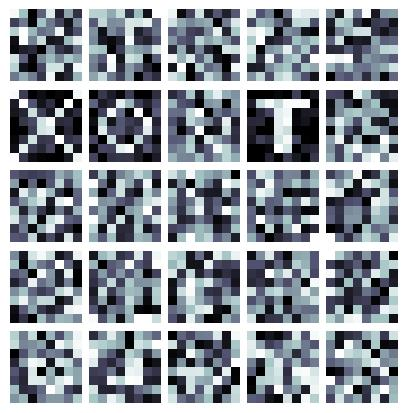
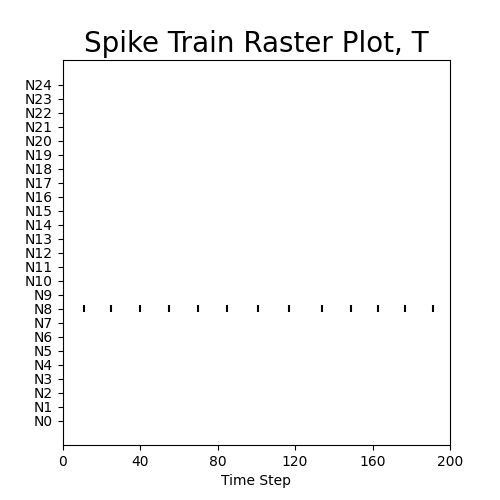
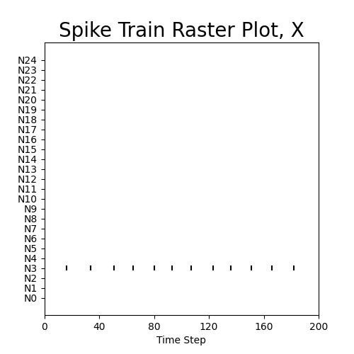

# Training a Spiking Network On-chip

In this tutorial we will build generate a simple dataset (consisting of binary
patterns of X's, O's, and T's) and train a model in the Loihi simulator
using Hebbian learning in the form of trace-based spike-timing-dependent
plasticity.

## Setting up ngc-learn

The first step of this project consist of setting up the configuration file for
ngc-learn. Create a folder in your project directory root called `json_files`
and
then create a `config.json` configuration inside of that folder.

Now for this project we will not be loading anything dynamically, so we can
simply add:

```json
{
  "modules": {
    "module_path": null
  }
}
```

The above configuration will skip the dynamic loading of modules, which is
important for Lava-based model transference and simulation.

Next, in order to run code with the Loihi simulator, the base version of numpy
needs to be used instead of JAX's wrapped numpy (which is what ngc-learn resorts
to by default). To change all of ngc-learn over to using the base version of
numpy, simply add the following to your configuration:

```json
"packages": {
  "use_base_numpy": true
}
```

Now your project is configured for ngc-lava and Lava usage and we can move on
to data generation.

## Generating Data

For this project we will be using three different patterns to train a simple
biophysical spiking neural network; the data will simply consist of binary
image patterns of either an `X`, `O`, and a `T`. To create the file needed to
generate these patterns, create a Python script named `data_generator.py` in
your project root. Next, we will import `numpy` and `random` and
define the following three generator methods:

```python
from ngclearn import numpy as np


def make_X(size):
    X = np.zeros((size, size))
    for i in range(0, size):
        X[i, i] = np.random.uniform(0.75, 1)
        X[i, size - 1 - i] = np.random.uniform(0.75, 1)
    return X


def make_O(size):
    O = np.zeros((size, size))
    for i in range(0, (size // 2) - 1):
        O[1 + i, (size // 2) - 1 - i] = np.random.uniform(0.75, 1)
        O[1 + i, (size // 2) + i] = np.random.uniform(0.75, 1)
        O[(size // 2) + i, 1 + i] = np.random.uniform(0.75, 1)
        O[(size // 2) + i, size - 2 - i] = np.random.uniform(0.75, 1)
    return O


def make_T(size):
    T = np.zeros((size, size))
    T[1, 1:size - 1] = np.random.uniform(0.75, 1, (1, size - 2))
    for i in range(2, size - 1):
        T[i, (size // 2) - 1: (size // 2) + 1] = np.random.uniform(0.75, 1,
                                                                   (1, 2))
    return T
```

Each of these methods will create a pattern of the desired size and shape.

## Building the Model

Found below is all of the imports that will be needed to run the model we desire
in Lava:

```python
from ngclava import LavaContext
from ngclearn import numpy as np
from ngclearn.components.lava import LIFCell, GatedTrace, TraceSTDPSynapse, StaticSynapse, Monitor
import ngclearn.utils.viz as viz_utils
import ngclearn.utils.weight_distribution as dist
from data_generator import make_X, make_O, make_T
```

To start off building this model, we will define all of the hyperparameters
needed to create the necessary model components:

```python
# Training Params
epochs = 35
view_length = 200
rest_length = 1000

# Model Params
n_in = 64  # Input layer size
n_hid = 25  # Hidden layer size
dt = 1.  # ms # integration time constant
np.random.seed(42)  ## seed the internal numpy calls
```

After this we will create the lava context, the components, as well as the
wiring:

```python
with LavaContext("Model") as model:
    z0 = LIFCell("z0", n_units=n_in, thr_theta_init=dist.constant(0.), dt=dt,
                 tau_m=50., v_decay=0., tau_theta=500.,
                 refract_T=0.)  ## IF cell
    z1e = LIFCell("z1e", n_units=n_hid,
                  thr_theta_init=dist.uniform(amin=-2, amax=2.),
                  dt=dt, tau_m=100., tau_theta=500.)  ## excitatory LIF cell
    z1i = LIFCell("z1i", n_units=n_hid,
                  thr_theta_init=dist.uniform(amin=-2, amax=2.),
                  dt=dt, tau_m=100., thr=-40., v_rest=-60., v_reset=-45.,
                  theta_plus=0.)  ## inhibitory LIF cell

    tr0 = GatedTrace("tr0", n_units=n_in, dt=dt, tau_tr=20.)
    tr1 = GatedTrace("tr1", n_units=n_hid, dt=dt, tau_tr=20.)

    W1 = TraceSTDPSynapse("W1", weight_init=dist.uniform(amin=0, amax=0.3),
                          shape=(n_in, n_hid), dt=dt, Aplus=0.011,
                          Aminus=0.0011,
                          preTrace_target=0.055)
    W1ie = StaticSynapse("W1ie", weight_init=dist.hollow(120.),
                         shape=(n_hid, n_hid), dt=dt)
    W1ei = StaticSynapse("W1ei", weight_init=dist.eye(22.5),
                         shape=(n_hid, n_hid), dt=dt)

    M = Monitor("M", default_window_length=view_length)

    ## wire z0 to z1e via W1 and z1i to z1e via W1ie
    W1.inputs << z0.s
    W1ie.inputs << z1i.s

    z1e.j_exc << W1.outputs
    z1e.j_inh << W1ie.outputs

    # wire z1e to z1i via W1ie
    W1ei.inputs << z1e.s
    z1i.j_exc << W1ei.outputs

    # wire cells z0 and z1e to their respective traces
    tr0.inputs << z0.s
    tr1.inputs << z1e.s

    # wire relevant compartment statistics to synaptic cable W1 (for STDP update)
    W1.x_pre << tr0.trace
    W1.pre << z0.s
    W1.x_post << tr1.trace
    W1.post << z1e.s

    # set up monitoring of z1e's spike output
    M << z1e.s
```

After the components have been set up, we have to "lag out" the synapses that
will cause recurrent (locking) problems when running on the Loihi2. This will
cause each of these synapses to run one time-step behind and fixes many
recurrency
issues (as described [here](lava_context.md)).

```python
    model.set_lag('W1')
    model.set_lag('W1ie')
    model.set_lag('W1ei')
```

Now that the model is all set up, we have to tell the Lava compiler to actually
build all the Lava objects with the following:

```python
    model.rebuild_lava()
```

This line will stop the automatic build of components when leaving this
with-block and provides access to all of the Lava components inside of this
with-block.

Next, we set up two methods, a `clamp` method to set the input data and
`viz` to visualize all of the different receptive fields of our model:

```python
    lz0, lW1 = model.get_lava_components('z0', 'W1')


    @model.dynamicCommand
    def clamp(x):
        model.pause()
        lz0.j_exc.set(x)
    
    
    @model.dynamicCommand
    def viz():
        viz_utils.synapse_plot.visualize([lW1.weights.get()], [(8, 8)], "lava_fields")
```

## Running The Model

Now that everything is set up to build the runtime and start training the model
inside of the Loihi simulator. To set up the runtime we call the following:

```python
    model.set_up_runtime("z0", rest_image=np.zeros((1, 64)))
```

This will set up a runtime with `z0` as the root node and also uses a resting
image of all zeros to allow the system to return to its resting state.

Now the training loop will be as follows:

```python
with model.runtime:
    for i in range(epochs):
        print(f"\rStarting Epoch: {i}", end="")
        X = np.reshape(make_X(8), (1, 64))
        O = np.reshape(make_O(8), (1, 64))
        T = np.reshape(make_T(8), (1, 64))

        model.view(X, view_length)
        model.rest(rest_length)

        model.view(O, view_length)
        model.rest(rest_length)

        model.view(T, view_length)
        model.rest(rest_length)
    print("\nDone Training")

```

## Evaluating the On-Chip Trained Model

The code above will work to train the model on a Loihi neuromorphic chip, but, 
currently, we do not have a way of viewing how effective the model learned 
really is. To set up this evaluation, we can call 
the `viz` method defined above to view the receptive fields that our spiking 
model has acquired:

```python
    model.viz()
```

Running this should produce a set of receptive fields that look like the
following:

 <br>

While viewing the receptive fields qualitatively tells us that our spiking 
model has trained, we may also want to view the 
[raster plots](ngclearn.utils.viz.raster) -- visual depictions of the 
underlying spike patterns acquired in the hidden layer of our model -- for each 
of our three image patterns (as they are fed into our trained model). To do 
this, we will make use of the monitor we defined above in the following manner:

```python
    ## Turning off learning
    lW1.eta.set(np.array([0]))
    
    model.view(np.reshape(make_T(8), (1, 64)), view_length)
    model.write_to_ngc()
    spikes = M.view(z1e.s)
    viz_utils.raster.create_raster_plot(spikes, tag="T", plot_fname="raster_T")
    model.rest(rest_length)
    print("Done T")
    
    model.view(np.reshape(make_X(8), (1, 64)), view_length)
    model.write_to_ngc()
    spikes = M.view(z1e.s)
    viz_utils.raster.create_raster_plot(spikes, tag="X", plot_fname="raster_X")
    model.rest(rest_length)
    print("Done X")
    
    model.view(np.reshape(make_O(8), (1, 64)), view_length)
    model.write_to_ngc()
    spikes = M.view(z1e.s)
    viz_utils.raster.create_raster_plot(spikes, tag="O", plot_fname="raster_O")
    model.rest(rest_length)
    print("Done O")
```

The above should result in raster plots where the spikes correspond to the 
receptive fields of each trained letter pattern. Specifically, you should see 
that the top left field is `N0` and the bottom right is `N24`. Your raster plots 
should look like the ones below:

 <br>
 <br>
 <br>

Finally to save the model to disk, you can call the following:

```python
    model.save_to_json(".", model_name="trained")
```

which will save your on-chip trained Loihi model to disk for later use.


