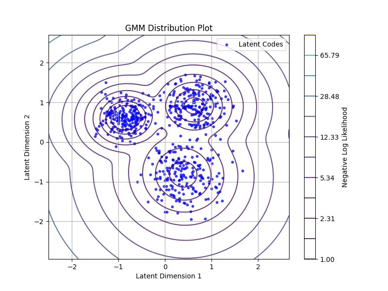
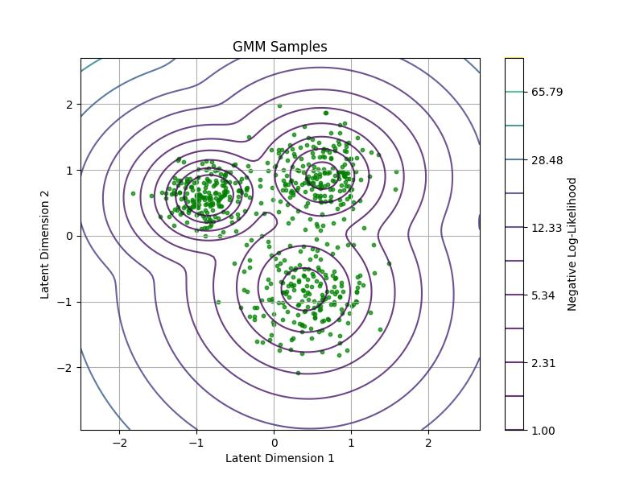

# Density Modeling and Analysis 

NGC-Learn offers some support for density modeling/estimation, which can be particularly useful in analyzing how internal properties of neuronal models' self-organized cell populations (e.g., how the distributed representations of a model might cluster into distinct groups/categories) or to draw samples from the underlying generative model implied by a particular neuronal structure (e.g., sampling a trained predictive coding generative model). 
Particularly, within `ngclearn.utils.density`, one can find implementations of mixture models -- such as mixtures of Bernoullis, Gaussians, and exponentials -- which might be employed to carry out such tasks. In this small lesson, we will demonstrate how to set up a Gaussian mixture model (GMM), fit it to some synthetic latent code data, and plot out the distribution it learns overlaid over the data samples as well as examine the kinds of patterns one may sample from the learnt GMM.

## Setting Up a Gaussian Mixture Model (GMM)

Let's say you have a two-dimensional dataset of neural code vectors collected from another model you have simulated -- here, we will artificially synthesize this kind of data in this lesson from an "unobserved" trio of multivariate Gaussians (as was done in the t-SNE tutorial) and pretend that this is a set of collected vector measurements. Furthermore, you decide that, after consideration that your data might follow a multi-modal distribution (and reasonably asssuming that multivariate Gaussians might capture most of the inherent structure/shape), you want to fit a GMM to these codes to later on sample from their underlying multi-modal distribution.

The following Python code will employ an NGC-Learn-in-built GMM density estimator for you (including setting up the data generator):

```python
from jax import numpy as jnp, random
from ngclearn.utils.density.gaussianMixture import GaussianMixture as GMM ## pull out density estimator

def gen_data(dkey, n_samp_per_mode): ## data generator (or proxy stochastic data generating process)
    scale = 0.3
    mu1 = jnp.asarray([[2.1, 3.2]]) * scale
    cov1 = jnp.eye(mu1.shape[1]) * 0.78 * scale * 0.5
    mu2 = jnp.asarray([[-2.8, 2.0]]) * scale
    cov2 = jnp.eye(mu2.shape[1]) * 0.52 * scale * 0.5
    mu3 = jnp.asarray([[1.2, -2.7]]) * scale
    cov3 = jnp.eye(mu3.shape[1]) * 1.2 * scale * 0.5
    params = (mu1,cov1 ,mu2,cov2,mu3,cov3)

    dkey, *subkeys = random.split(dkey, 7)
    samp1 = random.multivariate_normal(subkeys[0], mu1, cov1, shape=(n_samp_per_mode,))
    samp2 = random.multivariate_normal(subkeys[1], mu2, cov2, shape=(n_samp_per_mode,))
    samp3 = random.multivariate_normal(subkeys[2], mu3, cov3, shape=(n_samp_per_mode,))
    X = jnp.concatenate((samp1, samp2, samp3), axis=0)
    y1 = jnp.ones((n_samp_per_mode, 3)) * jnp.asarray([[1., 0., 0.]])
    y2 = jnp.ones((n_samp_per_mode, 3)) * jnp.asarray([[0., 1., 0.]])
    y3 = jnp.ones((n_samp_per_mode, 3)) * jnp.asarray([[0., 0., 1.]])
    lab = jnp.concatenate((y1, y2, y3), axis=0) ## one-hot codes

    ## shuffle the data 
    ptrs = random.permutation(subkeys[3], X.shape[0])
    X = X[ptrs, :]
    lab = lab[ptrs, :]

    return X, lab, params

## set up the GMM density estimator
key = random.PRNGKey(69)
dkey, *skey = random.split(key, 3)
X, y, params = gen_data(key, n_samp_per_mode=200) ## X is your "vector dataset"

n_iter = 100 ## maximum number of iterations to fit GMM to data
n_components = 3 ## number of mixture components w/in GMM
model = GMM(K=n_components, max_iter=n_iter, key=skey[0])
model.init(X) ## initailize the GMM to dataset X
```

The above will construct a GMM with three components (or latent variables of its own) and be configured to use a maximum of `100` iterations to fit itself to data. Note that the call to `init()` will "shape" the GMM according to the dimensionality of the data and pre-initialize its parameters (i.e., choosing random data vectors to initialize its means). 

To fit the GMM itself to your dataset `X`, you will then write the following: 

```python
## estimate GMM parameters over dataset via E-M
model.fit(X, tol=1e-3, verbose=True) ## set verbose to `False` to silence the fitting process
```

which should print to I/O something akin to: 

```console
0: Mean-diff = 1.4147894382476807  log(p(X)) = -1706.0753173828125 nats
1: Mean-diff = 0.14663299918174744  log(p(X)) = -1386.569091796875 nats
2: Mean-diff = 0.18331432342529297  log(p(X)) = -1359.6962890625 nats
3: Mean-diff = 0.17693905532360077  log(p(X)) = -1309.736083984375 nats
4: Mean-diff = 0.1494818776845932  log(p(X)) = -1250.130615234375 nats
5: Mean-diff = 0.11344392597675323  log(p(X)) = -1221.0008544921875 nats
6: Mean-diff = 0.07362686842679977  log(p(X)) = -1204.680419921875 nats
7: Mean-diff = 0.03828870505094528  log(p(X)) = -1192.706298828125 nats
8: Mean-diff = 0.025705577805638313  log(p(X)) = -1188.51123046875 nats
9: Mean-diff = 0.021316207945346832  log(p(X)) = -1187.055908203125 nats
10: Mean-diff = 0.019372563809156418  log(p(X)) = -1186.157470703125 nats
11: Mean-diff = 0.018868334591388702  log(p(X)) = -1185.443115234375 nats
...
<shortened for brevity>
...
46: Mean-diff = 0.017377303913235664  log(p(X)) = -1062.2596435546875 nats
47: Mean-diff = 0.007906327955424786  log(p(X)) = -1060.440185546875 nats
48: Mean-diff = 0.003615213558077812  log(p(X)) = -1060.09130859375 nats
49: Mean-diff = 0.0016773870447650552  log(p(X)) = -1060.0233154296875 nats
50: Mean-diff = 0.0007852672133594751  log(p(X)) = -1060.0093994140625 nats
Converged after 51 iterations.
```

In the above instance, notice that our GMM converged early, reaching a good, stable log likelihood in `51` iterations. We can further calculate our final model's log likelihood over the dataset `X` with the following in-built function:

```python
# Calculate the GMM log likelihood 
_, logPX = model.calc_log_likelihood(X) ## 1st output is log-likelihood per data pattern
print(f"log[p(X)] = {logPX} nats")
```

which will print out the following:

```console
log[p(X)] = -1060.006591796875 nats
```

(If you add a log-likelihood measurement before you call `.fit()`, you will see that your original log-likelihood is around `-1060.01 nats`.) 
Now, to visualize if our GMM actually capture the underlying multi-modal distribution of our dataset, we may visualize the final GMM with the following plotting code: 

```python
import matplotlib.pyplot as plt
x_min, x_max = X[:, 0].min() - 1, X[:, 0].max() + 1
y_min, y_max = X[:, 1].min() - 1, X[:, 1].max() + 1
xx, yy = jnp.meshgrid(jnp.linspace(x_min, x_max, 100), jnp.linspace(y_min, y_max, 100))
Xspace = jnp.c_[xx.ravel(), yy.ravel()]
Z, _ = model.calc_log_likelihood(Xspace) # Get log likelihood (LL)
Z = -Z ## flip sign of LL (to get negative LL)
Z = Z.reshape(xx.shape)

plt.figure(figsize=(8, 6))
plt.scatter(X[:, 0], X[:, 1], c="blue", s=10, alpha=0.7, label='Latent Codes')
plt.contour(xx, yy, Z, levels=jnp.logspace(0, 2, 12), cmap='viridis', alpha=0.8)
plt.colorbar(label='Negative Log Likelihood')

plt.title('GMM Distribution Plot')
plt.xlabel('Latent Dimension 1')
plt.ylabel('Latent Dimension 2')
plt.legend()
plt.grid(True)
plt.savefig("gmm_fit.jpg") #plt.show()

plt.close()
```

which should produce a plot similar to the one below: 




To draw samples from our fitted/learnt GMM, we may next call its in-built synthesizing routine as follows:

```python
## Examine GMM samples
Xs = model.sample(n_samples=200 * 3) ## draw 600 samples from fitted GMM
```

and then visualize the collected batch of samples with the following plotting code: 

```python

plt.figure(figsize=(8, 6))
plt.scatter(Xs[:, 0], Xs[:, 1], c="green", s=10, alpha=0.7, label='Sample Points')
plt.contour(xx, yy, Z, levels=jnp.logspace(0, 2, 12), cmap='viridis', alpha=0.8)
plt.colorbar(label='Negative Log-Likelihood')
plt.title('GMM Samples')
plt.xlabel('Latent Dimension 1')
plt.ylabel('Latent Dimension 2')
plt.grid(True) #plt.show()
plt.savefig("gmm_samples.jpg")

plt.close()
```

which will produce a plot similar to the one below: 



Notice that the green-colored data points roughly adhere to the contours of the GMM distribution and look much like the original (blue-colored) dataset we collected. In this example scenario, we see that we can successfully learn the density of our latent code dataset, facilitating some level of downstream distributional analysis and generative model sampling.
