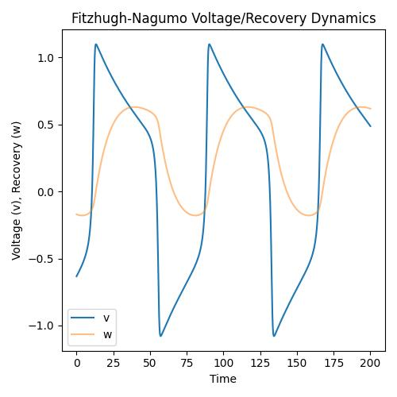

# Lecture 2C: The FitzHugh–Nagumo Neuronal Cell

In this tutorial, we will study one of ngc-learn's more complex spiking components,
the FitzHugh–Nagumo (FN) biophysical neuronal cell model.

## Using and Probing a FitzHugh–Nagumo Cell

### Instantiating the FitzHugh–Nagumo Neuronal Cell

Go ahead and make a new folder for this study and create a Python script,
i.e., `run_fncell.py`, to write your code for this part of the tutorial.

Now let's set up the controller for this lesson's simulation and construct a
single component system made up of the Fitzhugh-Nagumo (`F-N`) cell.

```python
from jax import numpy as jnp, random, jit
import numpy as np

from ngclearn.utils.model_utils import scanner
from ngcsimlib.compilers import compile_command, wrap_command
from ngcsimlib.context import Context
from ngcsimlib.commands import Command
## import model-specific mechanisms
from ngcsimlib.operations import summation
from ngclearn.components.neurons.spiking.fitzhughNagumoCell import FitzhughNagumoCell

## create seeding keys (JAX-style)
dkey = random.PRNGKey(1234)
dkey, *subkeys = random.split(dkey, 6)

## F-N cell hyperparameters
alpha = 0.3 ## recovery variable shift factor
beta = 1.4 ## recovery variable scale factor
gamma = 1. ## membrane potential power term denominator
tau_w = 20. ## recovery variable time constant
v0 = -0.63605838 ## initial membrane potential (for reset condition)
w0 = -0.16983366 ## initial recovery value (for reset condition)

## create simple system with only one F-N cell
with Context("Model") as model:
    cell = FitzhughNagumoCell("z0", n_units=1, tau_w=tau_w, alpha=alpha, beta=beta,
                              gamma=gamma, v0=v0, w0=w0, integration_type="euler")

    ## create and compile core simulation commands
    reset_cmd, reset_args = model.compile_command_key(cell, compile_key="reset")
    model.add_command(wrap_command(jit(model.reset)), name="reset")
    advance_cmd, advance_args = model.compile_command_key(cell, compile_key="advance_state")
    model.add_command(wrap_command(jit(model.advance_state)), name="advance")

    ## set up non-compiled utility commands
    @Context.dynamicCommand
    def clamp(x):
        cell.j.set(x)
```

In effect, the FitzHugh–Nagumo `F-N` two-dimensional differential
equation system (developed by [1] and [2]) is
a useful simplification of the more intricate Hodgkin–Huxley (H-H) squid axon
model, attempting to extract some of the benefits of its more detailed modeling
of the spiking cellular activation and deactivation dynamics (specifically
attempting to isolate the properties related to sodium/potassium ion flow
from cellular properties of excitation and propagation). Notably, the `F-N`
cell models membrane potential `v` with a cubic function (which facilitates
self-excitation through positive feedback) in tandem with a recovery variable `w`
that provides a slower form of negative feedback. The linear dynamics that govern
`w` are controlled by (dimensionless) coefficients `alpha` and  `beta`, which
control its shift and scale, respectively (another factor `gamma` is introduced
in our implementation, which divides the cubic term in the voltage dynamics, but
generally this can usually be set to either a value of `1` or `3` as in [1]).
The value `tau_w` controls the time constant for the recovery variable (and,
technically, ngc-learn implements `tau_m` to control the membrane potential,
but this is default set to `1` since [1] and [2] typically only use a time
constant for the recovery variable).

The initial conditions for the voltage (i.e., `v0`) and the recovery (i.e., `w0`)
have been set to particular interesting values above for the demonstration
purposes of this tutorial but, by default, are `0` in the `F-N` cell component.

Formally, the core dynamics of the `F-N` can be written out as follows:

$$
\tau_m \frac{\partial \mathbf{v}_t}{\partial t} &= -\frac{1}{g}(\mathbf{v}_t)^3 + \mathbf{v}_t - \mathbf{w}_t + R \mathbf{j}_t \\
\tau_w \frac{\partial \mathbf{w}_t}{\partial t} &= \mathbf{v}_t + a - b\mathbf{w}_t
$$

where $a$ and $b$ are factors that drive the recovery variable's dynamics
(shift and scaling, respectively), $R$ is the membrane resistance, $\tau_m$ is the
membrane time constant, and $\tau_w$ is the recovery time constant ($g$ is a
dividing constant meant to dampen the effects of the cubic term, but is generally
set to $g = 1$ to adhere to [1] and [2])


### Simulating a FitzHugh–Nagumo Neuronal Cell

Given that we have a single-cell dynamical system set up as above, we can next
write some code for visualizing how the `F-N` node's membrane potential and
coupled recovery variable evolve with time (specifically over a period of about
`200` milliseconds). We will, much as we did with the leaky integrators in
prior tutorials, inject an electrical current `j` into the `F-N` cell (this time
just a constant current value of `0.23` amperes) and observe how the cell
produces action potentials.
Specifically, we can plot the neuron's voltage `v` and recovery variable `w`
as follows:

```python
curr_in = []
mem_rec = []
recov_rec = []
spk_rec = []

i_app = 0.23 ## electrical current to inject into F-N cell
data = jnp.asarray([[i_app]], dtype=jnp.float32)

T = 1500 ## number of simulation steps to run
time_span = np.linspace(0, 200, num=T)

## compute integration time constant
dt = time_span[1] - time_span[0] # ~ 0.13342228152101404 ms

time_span = []
model.reset()
t = 0.
for ts in range(T):
    x_t = data
    ## pass in t and dt and run step forward of simulation
    model.clamp(x_t)
    model.advance(t, dt)
    t = t + dt

    ## naively extract simple statistics at time ts and print them to I/O
    v = cell.v.value
    w = cell.w.value
    s = cell.s.value
    curr_in.append(data)
    mem_rec.append(v)
    recov_rec.append(w)
    spk_rec.append(s)
    ## print stats to I/O (overriding previous print-outs to reduce clutter)
    print("\r {}: s {} ; v {} ; w {}".format(ts, s, v, w), end="")
    time_span.append((ts)*dt)
print()

import matplotlib #.pyplot as plt
matplotlib.use('Agg')
import matplotlib.pyplot as plt
cmap = plt.cm.jet
import matplotlib.patches as mpatches #used to write custom legends

## Post-process statistics (convert to arrays) and create plot
curr_in = np.squeeze(np.asarray(curr_in))
mem_rec = np.squeeze(np.asarray(mem_rec))
recov_rec = np.squeeze(np.asarray(recov_rec))
spk_rec = np.squeeze(np.asarray(spk_rec))

# Plot the F-N cell trajectory
n_plots = 1
fig, ax = plt.subplots(1, n_plots, figsize=(5*n_plots,5))

ax_ptr = ax
ax_ptr.set(xlabel='Time', ylabel='Voltage (v), Recovery (w)',
           title='Fitzhugh-Nagumo Voltage/Recovery Dynamics')

v = ax_ptr.plot(time_span, mem_rec, color='C0')
w = ax_ptr.plot(time_span, recov_rec, color='C1', alpha=.5)
ax_ptr.legend([v[0],w[0]],['v','w'])

plt.tight_layout()
plt.savefig("{0}".format("fncell_plot.jpg"))
```

You should get a plot that depicts the evolution of the voltage and recovery,
i.e., saved as `fncell_plot.jpg` locally to disk, like the one below:



A useful note is that the `F-N` above used Euler integration to step through its
dynamics (this is the default/base routine for all cell components in ngc-learn);
however, one could configure it to use the midpoint method for integration
by setting its argument `integration_type = rk2` in cases where more
accuracy in the dynamics is needed (at the cost of additional computational time).

## Optional: Setting Up The Components with a JSON Configuration

While you are not required to create a JSON configuration file for ngc-learn,
to get rid of the warning that ngc-learn will throw at the start of your
program's execution (indicating that you do not have a configuration set up yet),
all you need to do is create a sub-directory for your JSON configuration
inside of your project code's directory, i.e., `json_files/modules.json`.
Inside the JSON file, you would write the following:

```json
[
    {"absolute_path": "ngclearn.components",
        "attributes": [
            {"name": "FitzHughNagumoCell"}]
    },
    {"absolute_path": "ngcsimlib.operations",
        "attributes": [
            {"name": "overwrite"}]
    }
]
```

## References

<b>[1]</b> FitzHugh, Richard. "Impulses and physiological states in theoretical
models of nerve membrane." Biophysical journal 1.6 (1961): 445-466.

<b>[2]</b> Nagumo, Jinichi, Suguru Arimoto, and Shuji Yoshizawa. "An active
pulse transmission line simulating nerve axon." Proceedings of the IRE 50.10
(1962): 2061-2070.
