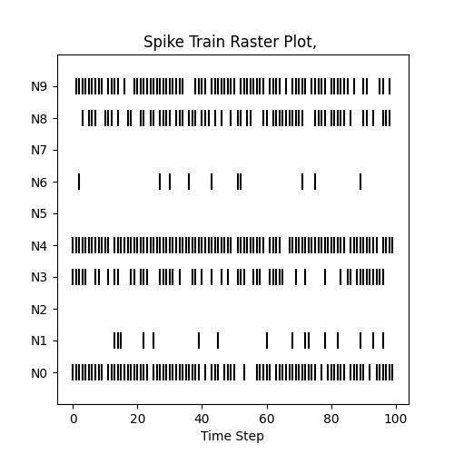
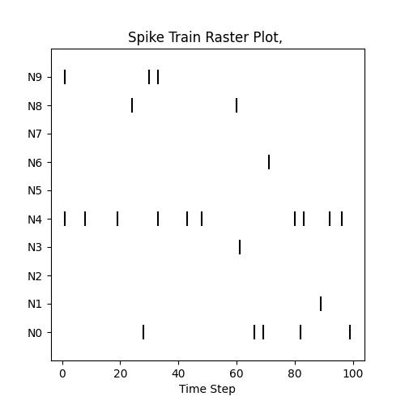

# Lecture 1A: Distributional Spike Train (Encoding) Models

In this small lesson, we will explore one of the simpler cell components
that ngc-learn has to offer -- the input encoder cell. These are particularly
useful for cases where one wants to (iteratively) process/transform sensory data
features in a certain way and, furthermore, this transform is considered part
of the neuronal system (dynamics) to be simulated. To this end, we will
study two particularly useful input encoding cells in the context of
spiking neural networks -- the Bernoulli cell, for producing Bernoulli
spike trains, and the Poisson cell, for producing Poisson spike trains.

## Bernoulli Spike Trains

Oftentimes, such as in the case of pixel-based image patterns, data is
available in continuous/real-valued form, i.e., pixel values normalized to the range of
$[0,1]$. While we could directly use them as input into a network of spiking cells --
meaning we would copy the literal data vector each step in time, much like what is done
with graded rate-cell models -- for spiking neuronal systems, it would be
biologically more realistic (and more akin to how sensory data is represented
in neuromorphic platforms) if we could first convert them to binary spike trains
themselves, especially given the fact that SNNs are technically meant to process
time-varying information. While there are many ways to encode the
data as spike trains, we start with the simplest approach in this lesson and
work with an encoding scheme known as (Bernoulli) rate encoding.

Specifically, rate encoding entails normalizing the original real-valued data vector
$\mathbf{x}$ to the range of $[0,1]$ and then treating each dimension $\mathbf{x}_i$
as the probability that a spike will occur, thus yielding (for each dimension) a rate code
with a value of $\mathbf{s}_i$. In other words, each feature drives a Bernoulli
distribution of the form where $\mathbf{s}_i \sim \mathcal{B}(n, p)$ where $n = 1$
and $p = \mathbf{x}_i$. This, over time, results in a binary spike process where the
rate of firing is dictated to be solely in proportion to a feature's value.

To rate code your data, let's start by using a simple function in ngc-learn's
[Bernoulli cell](ngclearn.components.input_encoders.bernoulliCell) component.
Assuming we have a simple $10$-dimensional data vector $\mathbf{x}$ (of
shape `1 x 10`) with values in the range of $[0,1]$, we can convert it to a
spike train over $100$ steps in time as follows:

```python
from ngcsimlib.controller import Controller
from jax import numpy as jnp, random
from ngclearn.utils.viz.raster import create_raster_plot

## create seeding keys (JAX-style)
dkey = random.PRNGKey(1234)
dkey, *subkeys = random.split(dkey, 2)

dt = 1. ## integration time constant
T = 100 ## number time steps to simulate

## create simple system with only one sLIF
model = Controller() ## the simulation object / controller
cell = model.add_component("bernoulli", name="z0", n_units=10, key=subkeys[0])
## configure desired commands for simulation object
model.add_command("reset", command_name="reset", component_names=[cell.name], reset_name="do_reset")
model.add_command("advance", command_name="advance", component_names=[cell.name])
model.add_command("clamp", command_name="clamp_data", component_names=[cell.name],
                  compartment=cell.inputCompartmentName(), clamp_name="x")
## pin the commands to the object
model.add_step("advance")

probs = jnp.asarray([[0.8, 0.2, 0., 0.55, 0.9, 0, 0.15, 0., 0.6, 0.77]],dtype=jnp.float32)

spikes = []
model.reset(True)
for ts in range(T):
    model.clamp_data(probs)
    model.runCycle(t=ts*1., dt=dt)
    s_t = model.components["z0"].outputCompartment
    spikes.append(s_t)
spikes = jnp.concatenate(spikes,axis=0)
create_raster_plot(spikes.T, plot_fname="bernoulli_raster.jpg")
```

where we notice that in the first dimension `[0,0]`, fifth dimension `[0,4]`,
and the final dimension `[0,9]` set to fairly high spike probabilities. This
code will produce and save locally to disk the following raster plot for
visualizing the resulting spike trains:

 <br>

where we see that the first, middle/fifth, and tenth dimensions do indeed
result in denser spike trains. A raster plots is a simple visualization tool in
computational neuroscience for examining the trial-by-trial variability of
neural responses, allowing us to graphically examine timing (or the frequency
of firing), one of the most important aspects of neuronal action potentials/spiking
patterns. Crucially notice that the function ngc-learn offers for converting
to spike trains does so on-the-fly, meaning that you can generate binary
spike pattern vectors from a particular normalized real-valued vector whenever you
need to (this facilitates online learning setups quite well).

## Poisson Spike Trains

While the Bernoulli cell above can go a long way to providing you with useful
input spike trains, there will be some instances, experimentally, where you
might want to control the firing rate of the neurons a little bit more. This
is where the [Poisson cell](ngclearn.components.input_encoders.poissonCell)
comes into play.

For instance, with a database such as MNIST, it is often desired that the input
firing rates (of the input encoding neurons you are trying to simulate) are
within the approximate range of $0$ to $63.75$ Hertz (Hz) (as in [2]).
To do this in ngc-learn, the Poisson cell is used instead, by modifying the
code above like so:

```python
model = Controller() ## the simulation object / controller
cell = model.add_component("poisson", name="z0", n_units=10, max_freq=63.75, key=subkeys[0])
```

Running the code with a Poisson cell instead of a Bernoulli one, under the same
raw input pattern data shown above, yields something like:

 <br>

The Poisson cell effectively ensures that, within the general time-scale
of ngc-learn's integration over time (milliseconds), the spike trains
iteratively produced over time will be approximately Poisson spike trains with
a maximum frequency `max_freq`.

To check that the Poisson rate approximately yields a frequency of `64` Hertz,
you could write the following bit of code to estimate what the firing rate
of the Poisson cell model is over a period of `1000` milliseconds like so:

```python
dt = 1. # ms
T = 1000 ## T * dt = 1000 ms
n_trials = 30
mu = 0.
for _ in range(n_trials):
    model.reset(True)
    spikes = []
    for ts in range(T):
        model.clamp_data(probs)
        model.runCycle(t=ts*1., dt=dt)
        s_t = model.components["z0"].outputCompartment
        spikes.append(s_t)
    count = jnp.sum(jnp.concatenate(spikes,axis=0))
    mu += count
    print(count)
print("Mean firing rate = {} Hertz".format(mu/n_trials))
```

which should print to I/O the following:

```console
Mean firing rate = 63.833336 Hertz
```

You now have two very useful input encoding cells to convert real-valued
data to spike trains. Note that both the Bernoulli and Poisson cell assume
that the dimensions of your input sensory patterns lie in the range of `[0,1]`,
so make sure that your data's values conform to this assumption (e.g., divide
the pixel values in MNIST by `255`).
