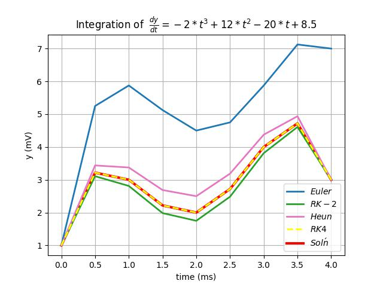

# Numerical Integration

In constructing one's own biophysical models, particularly those of phenomena that change with time, ngc-learn offers useful flexible tools for numerical integration that facilitate an easier time in constructing your own components that play well with the library's simulation backend. Knowing how things work beyond Euler integration -- the base/default form of integration often employed by ngc-learn -- might be useful for constructing and simulating dynamics more accurately (often at the cost of additional computational time).

## Euler Integration

Euler integration is very simple (and fast) way of using the ordinary differential equations you typically define for the cellular dynamics of various components in ngc-learn (which typically get called in any component's `advance_state()` command).

While utilizing the numerical integrator will depend on your component's design and the (biophysical) elements you wish to model, let's observe ngc-learn's base backend utilities (its integration backend `ngclearn.utils.diffeq`) in the context of numerically integrating a simple differential equation; specifically the autonomous (linear) ordinary differential equation (ODE): $\frac{\partial y(t)}{\partial t} = y(t)$. The analytic solution to this equation is also simple -- it is $y(t) = e^{t}$.

If you have defined your differential equation $\frac{\partial y(t)}{\partial t}$ in a rather simple format[^1], you can write the following code to examine how Euler integration approximates the analytical solution (in this example, we examine just two different step sizes, i.e., `dt = 0.1` and `dt = 0.09`)

```python
from jax import numpy as jnp, random, jit, nn
from functools import partial

import matplotlib #.pyplot as plt
matplotlib.use('Agg')
import matplotlib.pyplot as plt
cmap = plt.cm.jet

from ngclearn.utils.diffeq.ode_utils import step_euler

@jit
def soln(t): ## analytic solution
    ## Analytic solution to ODE y'(t) = y(t) is: y(t) = e^t.
    return jnp.exp(t)

@jit
def dfy(t, y, params): ## dynamics differential equation
    dy_dt = y ## y'(t) = y(t)
    return dy_dt

dt = 0.1 #0.1 # ms
T = 30 # num time steps to simulate
y0 = 1. ## initial conditions for ODE dy/dt
t = 0. ## initial time

## simulate and collect data from the parallel integration processes
t_values = [t]
euler_data = [y0]
euler2_data = [y0]
for i in range(0, T):
    _t, _y = step_euler(t, euler_data[-1], dfy, dt, (1,1))
    euler_data.append(_y)
    _t, _y = step_euler(t, euler2_data[-1], dfy, dt * 0.9, (1,1))
    euler2_data.append(_y)
    ## Note: we move time forward below only for demo-purposes since each
    ##       method increments and returns new time for you (e.g., "_t" as above)
    t = t + dt
    t_values.append(t)

t_values = jnp.asarray(t_values)
euler_data = jnp.asarray(euler_data)
euler2_data = jnp.asarray(euler2_data)
soln_values = soln(t_values)
fig, ax = plt.subplots()

sol = ax.plot(t_values, soln_values, '-.', color='C0')
eul = ax.plot(t_values, euler_data, color='C1')
eul2 = ax.plot(t_values, euler2_data, color='C2')

ax.set(xlabel='time (ms)', ylabel='y (mV)',
       title='Integration of: $\partial y/\partial t = y$')
ax.legend([sol[0],eul[0],eul2[0]],['sol\'n','euler (dt = 0.1)',"euler (dt = 0.09)"])
ax.grid()
fig.savefig("euler_integration.jpg")
```

which should yield you a plot like the one below:


Notice how the integration constant `dt` (or $\Delta t$) chosen affects the approximation of ngc-learn's Euler integrator and typically, when constructing your biophysical models, you will need to think about this constant in the context of your simulation time-scale and what you intend to model. Note that, in many biophysical component cells, you will have an integration time constant of some form, i.e., a $\tau$, that you can control, allowing you to fix your `dt` to your simulated time-scale (say to a value like `dt = 1` millisecond) while tuning/altering your time constant $\tau$ (since the differential equation will be weighted by $\frac{\Delta t}{\tau}$).

## Higher-Order Forms of (Explicit) Integration

Notably, ngc-learn has built-in several forms of (explicit) numerical integration beyond the Euler method, such as a second order Runge-Kutta (RK-2) method (also known as the midpoint method) and 4th-order Runge-Kutta (RK-4) method or an error-predictor method such as Heun's method (also known as the trapezoid method). These forms of integration might be useful particularly if a cell or plastic synaptic component you might be writing follows dynamics that are more nonlinear or biophysically complex (requiring a higher degree of simulation accuracy). For instance, ngc-learn's in-built cell components, particularly those of higher biophysical complexity -- like the [Izhikevich cell](ngclearn.components.neurons.spiking.izhikevichCell) or the [FitzhughNagumo cell](ngclearn.components.neurons.spiking.fitzhughNagumoCell) -- contain argument flags for switching their simulation steps to use RK-2.

To illustrate the value of higher-order numerical integration methods, let us examine a simple polynomial equation (thus nonlinear) that is further non-autonomous, i.e., it is a function of the time variable $t$ itself. A possible set of dynamics in this case might be: $\frac{\partial y(t)}{\partial t} = -2 t^3 + 12 t^2 - 20 t + 8.5$ which has the analytic solution $y(t) = -(1/2) t^4 + 4 t^3 - 10 t^2 + 8.5 t + C$ (where we will set $C = 1$). You can write code like below, importing from `ngclearn.utils.diffeq.ode_utils` the Euler routine (`step_euler`), the RK-2 routine (`step_rk2`), the RK-4 routine (`step_rk4`), and Heun's method (`step_heun`), and compare how these methods approximate the nonlinear dynamics inherent to our constructed $\frac{\partial y(t)}{\partial t}$ ODE below:

```python
from jax import numpy as jnp, random, jit, nn
import matplotlib #.pyplot as plt
matplotlib.use('Agg')
import matplotlib.pyplot as plt
cmap = plt.cm.jet

from ngclearn.utils.diffeq.ode_utils import step_euler, step_rk2 as step_midpoint, step_heun, step_rk4

@jit
def soln(t): ## analytic solution
    ## Analytic solution to ODE y'(t) is:
    ## y(t) = -1/2 * t^4 + 4 * t^3 - 10 * t^2 + 8.5 * t + 1
    return -0.5 * jnp.power(t, 4) + 4 * jnp.power(t, 3) - 10 * jnp.square(t) + 8.5 * t + 1.

@jit
def dfy(t, y, params):  ## dynamics differential equations y'(t)
    dy_dt = -2 * jnp.power(t, 3) + 12 * jnp.square(t) - 20 * t + 8.5
    return dy_dt

dt = 0.5 ## integration constant
T = 8 ## num integration (time) steps to simulate
y0 = 1. ## initial conditions for ODE dy/dt
t = 0. ## initial time

## simulate and collect data from the parallel integration processes
t_values = [t]
rk2_data = [y0]
heun_data = [y0]
euler_data = [y0]
rk4_data = [y0]
for i in range(0, T):
    _t, _y = step_heun(t, heun_data[-1], dfy, dt, (1,1))
    heun_data.append(_y)
    _t, _y = step_rk2(t, rk2_data[-1], dfy, dt, (1,1))
    rk2_data.append(_y)
    _t, _y = step_euler(t, euler_data[-1], dfy, dt, (1,1))
    euler_data.append(_y)
    _t, _y = step_rk4(t, rk4_data[-1], dfy, dt, (1,1))
    rk4_data.append(_y)
    ## Note: we move time forward below only for demo-purposes since each
    ##       method increments and returns new time for you (e.g., "_t" as above)
    t = t + dt
    t_values.append(t)

t_values = jnp.asarray(t_values)
rk2_data = jnp.asarray(rk2_data)
heun_data = jnp.asarray(heun_data)
euler_data = jnp.asarray(euler_data)
soln_values = soln(t_values)
fig, ax = plt.subplots()

sol = ax.plot(t_values, soln_values, color='r', lw=3)
eul = ax.plot(t_values, euler_data, color='C0', lw=2) #, alpha=.5)
rk2 = ax.plot(t_values, rk2_data, color='C2', lw=2)
heun = ax.plot(t_values, heun_data, color='C6', lw=2)
rk4 = ax.plot(t_values, rk4_data, '--', color='yellow', lw=2)

ax.set(xlabel='time (ms)', ylabel='y (mV)',
       title='Integration of  '  r'$\frac{dy}{dt} = -2 * t^3 + 12 * t^2 - 20 * t + 8.5$')
ax.legend([eul[0], rk2[0],heun[0], rk4[0], sol[0]],[r'$Euler$',r'$RK-2$', r'$Heun$', r'$RK4$', r'$Sol\'n$'])
ax.grid()
fig.savefig("ode_method_comparison.jpg")
```

which should yield you a plot like the one below:



As you might observe, RK-4 give the best approximation of the solution. In addition, when the integration step size is held constant, Euler integration does quite poorly over just a few steps while RK-2 and Heun's method do much better at approximating the analytical equation. In the end, the type of numerical integration method employed can matter depending on the ODE(s) you use in modeling, particularly if you seek higher accuracy for more nonlinear dynamics like in our example above.

[^1]: The format expected by ngc-learn's backend is that the differential equation
      provides a functional API/form like so: for instance `dy/dt = diff_eqn(t, y(t), params)`,
      representing $\frac{\partial \mathbf{y}(t, \text{params})}{\partial t}$,
      noting that you can name your 3-argument function (and its arguments) anything you like.
      Your function does not need to use all of the arguments (i.e., `t`, `y`, or `params`, the last of       which is a tuple containing any fixed constants your equation might need) to produce its output. 
      Finally, this function should only return the value(s) for `dy/dt` (vectors/matrices of values).
