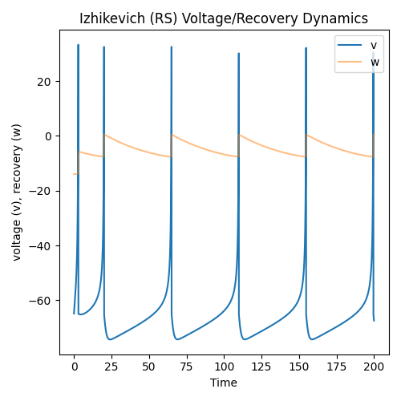

# Lecture 3B: The Izhikevich Neuronal Cell

In this tutorial, we will study another one of ngc-learn's more complex spiking
components, the Izhikevich (IZH) biophysical neuronal cell model, often a useful
model for capturing the behavioral properties of several classes of spiking
neurons.

## Setting/Configuring Up The Components

Create a new folder for this study, further creating within it a
sub-directory for your JSON configuration and create the configuration
file, i.e., `json_files/modules.json`.
Inside the JSON file, write the following:

```json
[
  {
    "absolute_path": "ngcsimlib.commands",
    "attributes": [
      {
        "name": "AdvanceState",
        "keywords": ["advance"]
      },
      {
        "name": "Clamp",
        "keywords": ["clamp"]
      },
      {
        "name": "Reset",
        "keywords": ["reset"]
      }
    ]
  },
  {
    "absolute_path": "ngclearn.components",
    "attributes": [
      {
        "name": "IzhikevichCell",
        "keywords": ["izhcell"]
      }
    ]
  }
]
```

## Using and Probing an Izhikevich Cell

### Instantiating the Izhikevich Neuronal Cell

With our JSON configuration now created, go ahead and create a Python script,
i.e., `run_izhcell.py`, to write your code for this part of the tutorial.

Now let's set up the controller for this lesson's simulation and construct a
single component system made up of the Izhikevich (`IZH`) cell.

```python
from ngcsimlib.controller import Controller
from jax import numpy as jnp, random, nn, jit
import numpy as np

import matplotlib #.pyplot as plt
matplotlib.use('Agg')
import matplotlib.pyplot as plt
cmap = plt.cm.jet
import matplotlib.patches as mpatches #used to write custom legends

## create seeding keys (JAX-style)
dkey = random.PRNGKey(1234)
dkey, *subkeys = random.split(dkey, 6)

## Izh cell hyperparameters
v0 = -65. ## initial membrane potential (for reset condition)
w0 = -14. ## initial recovery value (for reset condition)

## create 1-node system with IZH cell
model = Controller() ## the simulation object
a = model.add_component("izhcell", name="a", n_units=1, v0=v0, w0=w0, key=subkeys[0])

## configure desired commands for simulation object
model.add_command("reset", command_name="reset",
                  component_names=[a.name],
                  reset_name="do_reset")
model.add_command(
    "advance", command_name="advance",
    component_names=[a.name]
)
model.add_command("clamp", command_name="clamp_data",
                  component_names=[a.name], compartment=a.inputCompartmentName(),
                  clamp_name="x")
## pin the commands to the object
model.add_step("advance")
```

The Izhikevich `IZH`, much like the FitzHugh–Nagumo cell covered in
[a different lesson](../neurocog/fitzhugh_nagumo_cell.md), is two-dimensional
differential equation system (developed in [1]) that attempts to (approximately)
model spiking cellular activation and deactivation dynamics. Notably, the `IZH`
cell models membrane potential `v` (using a squared term) jointly with a
recovery variable `w` (which is meant to provide a slower form of negative feedback).
In his model, Izhikevich introduced four important control factors/coefficients,
the choices of values for each changes the behavior of the neuronal model and
thus recovering dynamics of different classes of neurons found in the brain.
Several of these control factors have been renamed and/or mapped to more
explicit descriptors in ngc-learn (for example, Izhikevich's original factor
`a` has been mapped to `a = 1/tau_w` allowing the user to define the time
constant for the recovery variable much in the same manner as the
FitzHugh–Nagumo cell). Also like the FitzHugh–Nagumo cell, the Izhikevich model
contains configurable initial conditions for its voltage (i.e., `v0`) and
recovery values (i.e., `w0`), which we see have been set to interesting values
for the purposes of this lesson (these are actually the default values of
the Izhikevich component, i.e., `v0=-65` and `w0=-14`).

### Simulating a Izhikevich Neuronal Cell

Given the single-cell dynamical system we set up above, we finally write
some code that uses and visualizes the flow of the `IZH` cell's membrane
potential and coupled recovery variable (specifically over a period of about
`200` milliseconds). We will, much as we did with the leaky integrators in
prior tutorials, inject an electrical current `j` into the `IZH` cell -- this
time with a constant current value of `10` amperes -- and observe how the cell
produces action potentials.
Specifically, we can plot the `IZH` neuron's voltage `v` and recovery variable `w`
in the following manner:

```python
curr_in = []
mem_rec = []
recov_rec = []
spk_rec = []

i_app = 10. # 0.23 ## electrical current to inject into F-N cell
data = jnp.asarray([[i_app]], dtype=jnp.float32)

T = 20000 ## number of simulation steps to run
dt = 0.01 # ms ## compute integration time constant

time_span = []
model.reset(do_reset=True)
for ts in range(T):
    x_t = data
    model.clamp_data(x=x_t)
    model.runCycle(t=ts*1., dt=dt)

    ## naively extract simple statistics at time ts and print them to I/O
    v = model.components["a"].voltage
    w = model.components["a"].recovery
    s = model.components["a"].outputCompartment
    curr_in.append(data)
    mem_rec.append(v)
    recov_rec.append(w)
    spk_rec.append(s)
    ## print stats to I/O (overriding previous print-outs to reduce clutter)
    print("\r {}: s {} ; v {} ; w {}".format(ts, s, v, w), end="")
    time_span.append((ts)*dt)
print()
time_span = np.asarray(time_span)

## Post-process statistics (convert to arrays) and create plot
curr_in = np.squeeze(np.asarray(curr_in))
mem_rec = np.squeeze(np.asarray(mem_rec))
recov_rec = np.squeeze(np.asarray(recov_rec))
spk_rec = np.squeeze(np.asarray(spk_rec))

# Plot the Izh cell trajectory
n_plots = 1
fig, ax = plt.subplots(1, n_plots, figsize=(5*n_plots,5))

ax_ptr = ax
ax_ptr.set(xlabel='Time', ylabel='voltage (v), recovery (w)',
           title='Izhikevich (RS) Voltage/Recovery Dynamics')

v = ax_ptr.plot(time_span, mem_rec, color='C0')
w = ax_ptr.plot(time_span, recov_rec, color='C1', alpha=.5)
ax_ptr.legend([v[0],w[0]],['v','w'])

plt.tight_layout()
plt.savefig("{0}".format("izhcell_plot.png"))
```

You should get a plot that depicts the evolution of the voltage and recovery of
the Izhikevich cell, i.e., saved as `izhcell_plot.png` locally to disk, much
like the one below:



The plot above actually depicts the dynamics for a specific type of spiking
neuron called the "regular spiking" (RS) neuron (the default configuration
for ngc-learn's neuronal cell implementation), which is only one of six
kinds of neurons you can emulate with Izhikevich's dynamics implemented in
ngc-learn. Try modifying your code above by exposing the Izhikevich component's
hyper-parameters and setting them to particular values (as noted in the
component's documentation) to recreate other possible neuron types. For
example, to obtain a "fast spiking" (FS) neuronal cell, all you would need to
do is modify the recovery variable's time constant like so:

```python
tau_w = 10. ## new recovery time constant
v_reset = -65. ## ngc-learn default
w_reset = 8.  ## ngc-learn default
coupling_factor=0.2  ## ngc-learn default

## create 1-node system with IZH cell
model = Controller() ## the simulation object
a = model.add_component("izhcell", name="a", n_units=1, tau_w=tau_w,
                        v_reset=v_reset, w_reset=w_reset,
                        coupling_factor=coupling_factor,
                        v0=v0, w0=w0, key=subkeys[0])
```

to obtain a voltage/recovery dynamics plot like so (if you also modify the
plot title of the plotting code accordingly):


Three other well-known classes of neural behaviors are possible to simulate
under the following hyper-parameter configurations (which produce the array
of three plots similar to those at the bottom of this lesson),
by simplifying modifying code snippet above for FS neurons to instead be one
of the following:

1. Chattering (CH) neurons:
```python
tau_w = 50.
v_reset = -50.
w_reset = 2.
coupling_factor=0.2
```

2. Intrinsically bursting (IB) neurons:
```python
tau_w = 50.
v_reset = -55.
w_reset = 4.
coupling_factor=0.2
```
3. Low-threshold spiking (LTS) neurons:
```python
tau_w = 50.
v_reset = -65.
w_reset = 2.
coupling_factor = 0.25
```

The above three hyper-parameter settings produce, from top-to-bottom, the
plots shown below (from left-to-right):


```{eval-rst}
.. table::
   :align: center

   +-------------------------------------------------------+-------------------------------------------------------+--------------------------------------------------------+
   | .. image:: ../../images/tutorials/neurocog/ch_izh.png | .. image:: ../../images/tutorials/neurocog/ib_izh.png | .. image:: ../../images/tutorials/neurocog/lts_izh.png |
   |   :scale: 40%                                         |   :scale: 40%                                         |   :scale: 40%                                          |
   |   :align: center                                      |   :align: center                                      |   :align: center                                       |
   +-------------------------------------------------------+-------------------------------------------------------+--------------------------------------------------------+
```

## References

<b>[1]</b> Izhikevich, Eugene M. "Simple model of spiking neurons." IEEE
Transactions on neural networks 14.6 (2003): 1569-1572.
