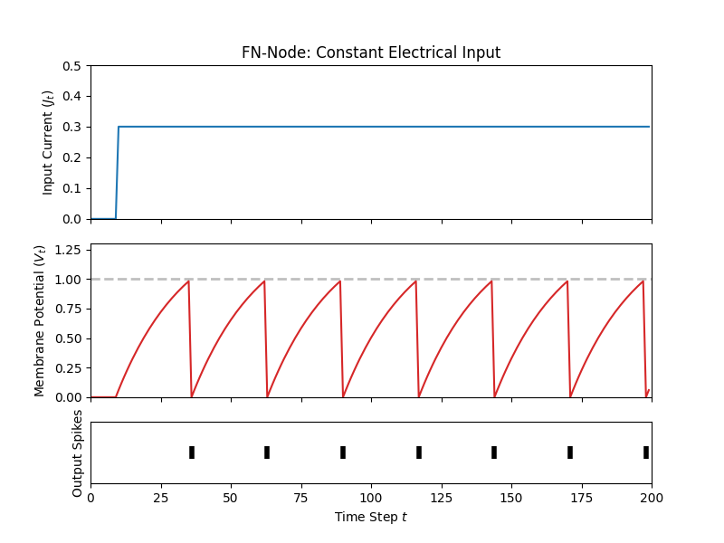
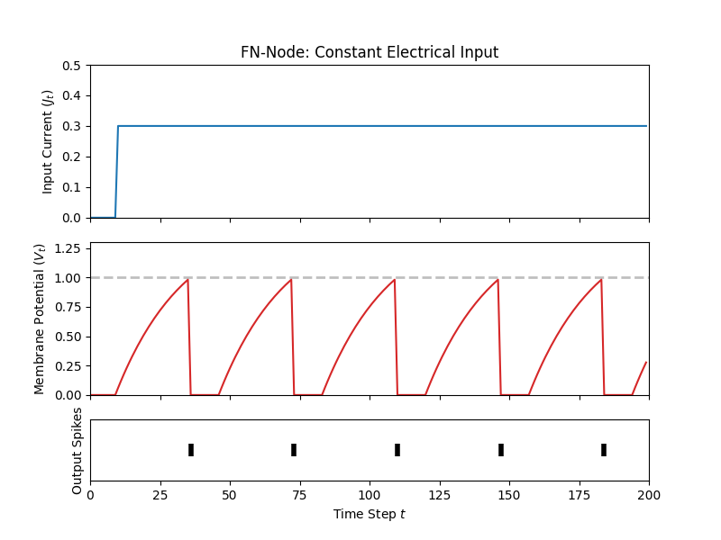

# Lecture 1A: The Leaky Integrate-and-Fire Cell

In this tutorial, we will study one of ngc-learn's (simplest) in-built leaky
integrator components, the simplified leaky integrate-and-fire (SLIF).

## Setting/Configuring Up The Components

Create a new folder for this study and further create within it a
sub-directory for your JSON configuration and create the configuration
file, i.e., `json_files/modules.json`.
Inside the JSON file, write the following:

```json
[
  {
    "absolute_path": "ngcsimlib.commands",
    "attributes": [
      {
        "name": "AdvanceState",
        "keywords": ["advance"]
      },
      {
        "name": "Clamp",
        "keywords": ["clamp"]
      },
      {
        "name": "Reset",
        "keywords": ["reset"]
      }
    ]
  },
  {
    "absolute_path": "ngclearn.components",
    "attributes": [
      {"name": "SLIFCell",
       "keywords": ["SLIF"]
      },
      {
        "name": "LIFCell",
        "keywords": ["LIF"]
      }
    ]
  }
]
```

## Creating and Using a Leaky Integrator

### Instantiating the Leaky Integrate-and-Fire Cell

With our JSON configuration in place, go ahead and create a Python script,
i.e., `run_slif.py`, to write your code for this part of the tutorial.

Now let's go ahead and set up the controller for this lesson's simulation,
where we will a dynamical system with only a single component,
specifically the simplified LIF (sLIF), like so:

```python
from ngcsimlib.controller import Controller
from jax import numpy as jnp, random
from ngclearn.utils.viz.spike_plot import plot_spiking_neuron

## create seeding keys (JAX-style)
dkey = random.PRNGKey(1234)
dkey, *subkeys = random.split(dkey, 2)

dt = 1e-3 # integration time constant
R_m = 5.0 ## input resistance (to sLIF cell)
C = 5e-3 ## capacitance, in picofarads
V_thr = 1.0 ## voltage threshold
ref_T = 0.0 ## length of absolute refractory period
tau_m = R_m * C ## membrane time constant

## create simple system with only one sLIF
model = Controller() ## the simulation object / controller
cell = model.add_component("sLIF", name="z0", n_units=1, tau_m=tau_m, R_m=R_m,
                           thr=V_thr, refract_T=ref_T, key=subkeys[0])
```

This node has quite a few compartments and constants but only a handful are important
for understanding how this model governs spiking/firing rates during
a controller's simulation window. Specifically, in this lesson, we will focus on
its electrical current `j` (formally labeled here as $\mathbf{j}_t$),
its voltage `v` (formally labeled: $\mathbf{v}_t$), its spike emission
(or action potential) `s` (formally $\mathbf{s}_t$), and its refractory
variable/marker (formally $\mathbf{r}_t$). The subscript $t$ indicates
that this compartment variable takes on a certain value at a certain time step
$t$ and we will refer to the ngc-learn controller's integration time constant,
the amount of time we move forward by, as $\Delta t$. The constants or
hyper-parameters we will be most interested in are the cell's membrane resistance
`R_m` (formally $R$ with its capacitance $C$ implied), its membrane time
constant `tau_m` (formally $\tau_m$), its refractory period time
`refract_T` (formally $T_{ref}$), and its voltage threshold `v_thr`
(formally $V_thr$). (There are other constants inherent to the
sLIF, but these are sufficient for this exercise.)

Later on, towards the end of this tutorial, we provide some theoretical
exposition and explanation of the above constants/compartments
(see `On the Dynamics of Leaky Integrators`); for practical
purposes we will now move on to using your `sLIF` node in a simple simulation
to illustrate some of its dynamics.

Let's finish up setting up the single-node dynamical system before we move on
to simulating it:

```python
## configure desired commands for simulation object
model.add_command("reset", command_name="reset",
                  component_names=[cell.name],
                  reset_name="do_reset")
model.add_command(
    "advance", command_name="advance",
    component_names=[cell.name]
)
model.add_command("clamp", command_name="clamp_data",
                  component_names=[cell.name], compartment=cell.inputCompartmentName(),
                  clamp_name="x")
## pin the commands to the object
model.add_step("advance")
```

### Simulating a Leaky Integrator

<!--
Now that we understand the key compartments and constants inherent to an `sLIF`
node, we can start simulating one.-->
Given our single-cell dynamical system above, let us write some code to use
our `sLIF` node and visualize its spiking pattern of our LIF node by feeding
into it a step current, where the electrical current `j` starts at $0$ then
switches to $0.3$ at $t = 10$ (ms). Specifically, we can plot the input current,
the neuron's voltage `v`, and its output spikes as follows:

```python
# create a synthetic electrical step current
current = jnp.concatenate((jnp.zeros((1,10)), jnp.ones((1,190)) * 0.3), axis=1)

curr_in = []
mem_rec = []
spk_rec = []

model.reset(True)
for ts in range(current.shape[1]):
    j_t = jnp.expand_dims(current[0,ts], axis=0) ## get data at time ts
    model.clamp_data(j_t)
    model.runCycle(t=ts*1., dt=dt)
    ## naively extract simple statistics at time ts and print them to I/O
    v = model.components["z0"].voltage
    s = model.components["z0"].spikes
    curr_in.append(j_t)
    mem_rec.append(v)
    spk_rec.append(s)
    print(" {}: s {} ; v {}".format(ts, s, v))

import numpy as np
curr_in = np.squeeze(np.asarray(curr_in))
mem_rec = np.squeeze(np.asarray(mem_rec))
spk_rec = np.squeeze(np.asarray(spk_rec))
plot_spiking_neuron(curr_in, mem_rec, spk_rec, None, dt, thr_line=V_thr, min_mem_val=0.,
                    max_mem_val=1.3, title="FN-Node: Constant Electrical Input",
                    fname="cell_plot.png")
```

which produces the following plot (saved as `lif_plot.png` locally to disk):



where we see that, given a build-up over time in the neuron's membrane potential
(since the current is constant and non-zero after $10$ ms), a spike is emitted
once the value of the membrane potential exceeds the threshold (indicated by
the dashed horizontal line in the middle plot) $V_{thr} = 1$.
Notice that if we play with the value of `ref_T` (the refactory period $T_{ref}$)
and change it to something like `ref_T = 10 * dt` (ten times the integration time
constant), we get the following neuronal dynamics plot:



where we see that after the LIF neuron fires, it remains stuck at its resting
potential for a period of $0.01$ ms (the short flat periods in the red curve
starting after the first spike).

## On the Dynamics of Leaky Integrators

Now let us unpack this component by first defining the relevant compartments:

+ $\mathbf{j}_t$: the current electrical current of the neurons within this node
  (note that this current could be the summation of multiple step/pointwise
   current sources or be the current sample of an electrical current, itself
   modeled by a differential equation);
+ $\mathbf{v}_t$: the current membrane potential of the neurons within this node;
+ $\mathbf{s}_t$: the current recording/reading of any spikes produced by this
  node's neurons;
+ $\mathbf{r}_t$: the current value of the absolute refractory variables - this
  accumulates with time (and forces neurons to rest)

and finally the constants:

+ $V_{thr}$: threshold that a neuron's membrane potential must overcome before
  a spike is transmitted;
+ $\Delta t$: the integration time constant, on the order of milliseconds (ms);
+ $R$: the neural (cell) membrane resistance, on the order of mega Ohms ($M \Omega$);
+ $C$: the neural (cell) membrane capacitance, on the order of picofarads ($pF$);
+ $\tau_{m}$: membrane potential time constant (also $\tau_{m} = R * C$  -
  resistance times capacitance);
+ $T_{ref}$: the length of a neuron's absolute refractory period.

With above defined, we can now explicitly lay out the underlying (linear) ordinary
differential equation that the `sLIF` evolves according to:

$$
\tau_m \frac{\partial \mathbf{v}_t}{\partial t} = (-\mathbf{v}_t + R \mathbf{j}_t), \; \mbox{where, } \tau_m = R C
$$

and with some simple mathematical manipulations (leveraging the method of finite differences),
we can derive the Euler integrator employed by the `sLIF` as follows:

$$
\tau_m \frac{\partial \mathbf{v}_t}{\partial t} &= (-\mathbf{v}_t + R \mathbf{j}_t) \\
\tau_m \frac{\mathbf{v}_{t + \Delta t} - \mathbf{v}_t}{\Delta t} &= (-\mathbf{v}_t + R \mathbf{j}_t) \\
\mathbf{v}_{t + \Delta t} &= \mathbf{v}_t + (-\mathbf{v}_t + R \mathbf{j}_t) \frac{\Delta t}{\tau_m }
$$

where we see that above integration tells us that the membrane potential of this node varies
over time as a function of the sum of its input electrical current $\mathbf{j}_t$
(multiplied by the cell membrane resistance) and a leak (or decay) $-\mathbf{v}_t$
modulated by the integration time constant divided by the membrane time constant.
The `sLIF` allows you to control the value of $\tau_m$ either directly (and
will tell the node to set $R=1$ and $C=\tau_m$ and the node will ignore any
argument values provided for $R$ and $C$) or via $R$ and $C$.
<!--(Notice that this default state of the `sLIF` assumes that the input spike
signals from external nodes that feed into $\mathbf{dz}_{bu}$ and $\mathbf{dz}_{td}$
result in an instantaneous jump in each neuron's synaptic current $\mathbf{J}_t$.-->
<!-- but
this assumption/simplification can be removed by setting `sLIF`'s argument
`zeta` to any non-zero value in order to tell the node that it needs to integrate
its synaptic current over time - we will not, however, cover this functionality
in this walkthrough.)-->

In effect, given the above, every time the `sLIF`'s `.advanceState()` function is
called within a simulation controller (`Controller()`), the above Euler integration of
the membrane potential differential equation is happening each time step. Knowing this,
the last item required to understand ngc-learn's `sLIF` node's computation is
related to its spike $\mathbf{s}_t$. The spike reading is computed simply by
comparing the current membrane potential $\mathbf{v}_t$ to the constant threshold
defined by $V_{thr}$ according to the following piecewise function:

$$
\mathbf{s}_{t, i} = \begin{cases}
                       1 & \mathbf{v}_{t, i} > V_{thr} \\
                       0 & \mbox{otherwise.}
                    \end{cases}
$$

where we see that if the $i$th neuron's membrane potential exceeds the threshold
$V_{thr}$, then a voltage spike is emitted. After a spike is emitted, the $i$th
neuron within the node needs to be reset to its resting potential and this is done
with the final compartment that we mentioned, i.e., the refractory
variable $\mathbf{r}_t$.
The refractory variable $\mathbf{r}_t$ is important for hyperpolarizing the
$i$th neuron back to its resting potential (establishing a critical reset mechanism
-- otherwise, the neuron would fire out of control after overcoming its
threshold) and reducing the amount of spikes generated over time. This reduction
is one of the key factors behind the power efficiency of biological neuronal systems.
Another aspect of ngc-learn's refractory variable is the temporal length of the reset itself,
which is controlled by the $T_{ref}$ (`T_ref`) constant -- this yields what is known as the
absolute refractory period, or the interval of time at which a second action potential
absolutely cannot be initiated. If $T_{ref}$ is set to be greater than
zero, then the $i$th neuron that fires will be forced to remain at its resting
potential of zero for the duration of this refractory period.

Note that the reason the `sLIF` contains simplified in its name is that its
internal dynamics and parameterization have been drastically simplified in
comparison to ngc-learn's more standard `LIF` component. Furthermore, the
`sLIF` operates assuming a resting membrane potential of `0` (milliVolts) whereas,
for more intricate leaky integrator models, the resting potential is often
negative, requiring a different and more careful setting of hyper-parameters
(such as the voltage threshold). Nevertheless, although `sLIF` is a simpler
model, it can be used as a rational first step for crafting very useful spiking
neural networks and offers other aspects of functionality not used in this tutorial,
such as adaptive threshold functionality and fast approximate lateral inhibition/recurrence.
