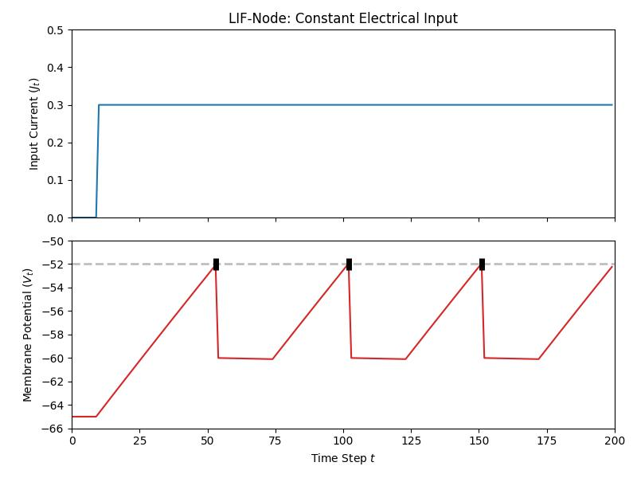

# Lecture 2B: The Leaky Integrate-and-Fire Cell

The leaky integrate-and-fire (LIF) cell component in ngc-learn is a stepping
stone towards working with more biophysical intricate cell components when crafting
your neuronal circuit models. This
[cell](ngclearn.components.neurons.spiking.LIFCell) is markedly different from the
[simplified LIF](ngclearn.components.neurons.spiking.sLIFCell) in both its
implemented dynamics as well as what modeling routines that it offers, including
the fact that it does not offer implicit fixed lateral inhibition like the
`SLIF` does (one would need to explicitly model the lateral inhibition as a
separate population of `LIF` cells, as we do in the
[Diehl and Cook model museum spiking network](../../museum/snn_dc.md)). Furthermore,
using this neuronal cell is a useful transition to using the more complicated and
biophysically more accurate neuronal models such as the
[adaptive exponential integrator cell](ngclearn.components.neurons.spiking.adExCell)
or the
[Izhikevich cell](ngclearn.components.neurons.spiking.izhikevichCell).

## Instantiating the LIF Neuronal Cell

To implement a single-component dynamical system made up of a single LIF
cell, you would write code akin to the following:

```python
from jax import numpy as jnp, random, jit
import numpy as np

from ngclearn.utils.model_utils import scanner
from ngcsimlib.compilers import compile_command, wrap_command
from ngcsimlib.context import Context
from ngcsimlib.commands import Command
## import model-specific mechanisms
from ngclearn.operations import summation
from ngclearn.components.neurons.spiking.LIFCell import LIFCell
from ngclearn.utils.viz.spike_plot import plot_spiking_neuron

## create seeding keys (JAX-style)
dkey = random.PRNGKey(1234)
dkey, *subkeys = random.split(dkey, 3)

T = 100  ## number of simulation steps to run
dt = 0.1  # ms ## compute integration time constant
V_thr = -52.  ## mV
V_rest = -65  ## mV
tau_m = 100.

## create simple system with only one AdEx
with Context("Model") as model:
    cell = LIFCell("z0", n_units=1, tau_m=tau_m, resist_m=tau_m/dt, thr=V_thr,
                   v_rest=V_rest, v_reset=-60., tau_theta=300., theta_plus=0.05,
                   refract_time=2., key=subkeys[0])

    ## create and compile core simulation commands
    reset_cmd, reset_args = model.compile_by_key(cell, compile_key="reset")
    model.add_command(wrap_command(jit(model.reset)), name="reset")
    advance_cmd, advance_args = model.compile_by_key(cell,
                                                     compile_key="advance_state")
    model.add_command(wrap_command(jit(model.advance_state)), name="advance")


    ## set up non-compiled utility commands
    @Context.dynamicCommand
    def clamp(x):
        cell.j.set(x)
```

## Simulating the LIF on Stepped Constant Electrical Current

Given our single-LIF dynamical system above, let us write some code to use
our `LIF` node and visualize the resultant spiking pattern super-imposed
over its membrane (voltage) potential by feeding
into it a step current, where the electrical current `j` starts at $0$ then
switches to $0.3$ at $t = 10$ ms (much as we did for the `SLIF` component
in the previous lesson). We craft the simulation portion of our code like so:


```python
# create a synthetic electrical step current
current = jnp.concatenate((jnp.zeros((1,10)), jnp.ones((1,190)) * 0.3), axis=1)

curr_in = []
mem_rec = []
spk_rec = []

model.reset()
for ts in range(current.shape[1]):
    j_t = jnp.expand_dims(current[0,ts], axis=0) ## get data at time ts
    model.clamp(j_t)
    model.advance(t=ts*1., dt=dt)
    ## naively extract simple statistics at time ts and print them to I/O
    v = cell.v.value
    s = cell.s.value
    curr_in.append(j_t)
    mem_rec.append(v)
    spk_rec.append(s)
    print(" {}: s {} ; v {}".format(ts, s, v))
```

Then, we can plot the input current, the neuron's voltage `v`, and its output
spikes as follows:

```python
import numpy as np
curr_in = np.squeeze(np.asarray(curr_in))
mem_rec = np.squeeze(np.asarray(mem_rec))
spk_rec = np.squeeze(np.asarray(spk_rec))
plot_spiking_neuron(curr_in, mem_rec, spk_rec, None, dt, thr_line=V_thr, min_mem_val=V_rest-1.,
                    max_mem_val=V_thr+2., spike_loc=V_thr, spike_spr=0.5, title="LIF-Node: Constant Electrical Input", fname="lif_plot.jpg")
```

which should produce the following plot (saved to disk):



As we might observe, the LIF operates very differently from the SLIF, notably
that its dynamics live in the different space of values (one aspect of the
SLIF is that its dynamics are effectively normalized/configured to live
a non-negative membrane potential number space), specifically values that
are a bit better aligned with those observed in experimental neuroscience.
While more biophysically more accurate, the `LIF` typically involves consideration
of multiple additional hyper-parameters/simulation coefficients, including
the resting membrane potential value `v_rest` and the reset membrane value
`v_reset` (upon occurrence of a spike/emitted action potential); the `SLIF`,
in contrast, assumed a `v_reset = v_reset = 0.`. Note that the `LIF`'s
`tau_theta` and `theta_plus` coefficients govern its particular adaptive threshold,
which is a particular increment variable (one per cell in the `LIF` component)
that gets adjusted according to its own dynamics and added to the fixed constant
threshold `thr`, i.e., the threshold that a cell's membrane potential must
exceed for a spike to be emitted.

The `LIF` cell component is particularly useful when more flexibility is required/
desired in setting up neuronal dynamics, particularly when attempting to match
various mathematical models that have been proposed in computational neuroscience.
This benefit comes at the greater cost of additional tuning and experimental planning,
whereas the `SLIF` can be a useful go-to initial spiking cell for building certain spiking
models such as those proposed in machine intelligence research (we demonstrate
one such use-case in the context of the
[feedback alignment-trained spiking network](../../museum/snn_bfa.md) that we offer in the model museum).
