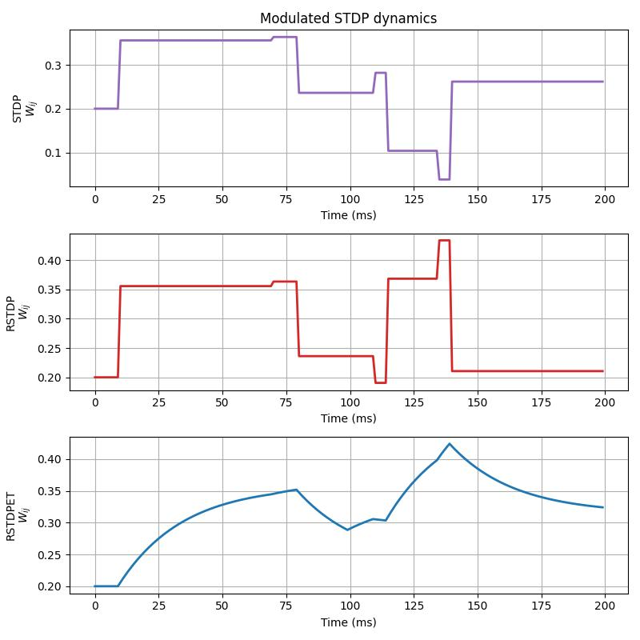
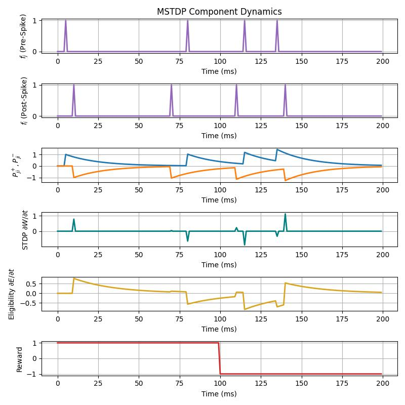

# Lecture 4C: Reward-Modulated Spike-Timing-Dependent Plasticity

In this lesson, we will build on the notions of spike-timing-dependent 
plasticity (STDP), covered [earlier here](../neurocog/stdp.md), to construct 
an important form of biological credit assignment in spiking neural networks 
known as reward-modulated STDP (sometimes abbreviated to R-STDP). Specifically, 
we will simulate and plot the underlying plasticity dynamics associated with 
this form of change in synaptic efficacy, specifically studying two in-built 
schemes of STDP: modulated STDP (MSTDP) and modulated STDP with eligibility 
traces (MSTDP-ET).

## Probing Modulated STDP and Eligibility Traces

Go ahead and make a new folder for this study and create a Python script,
i.e., `run_reward_stdp.py`, to write your code for this part of the tutorial.

Much as we did in the STDP lesson, we will build a 3-component dynamical system 
-- two spiking neurons (represented by traces) that are connected with a single 
synapse -- but, this time, we will simulate three variations of this system in 
parallel. Each one of these variants will evolve its single synapse according 
to a different condition of STDP: 
1. the first one will change its synapse's strength in accordance with trace-based STDP; 
2. the second one will change its synapse's strength via modulated STDP (MSTDP); and, 
3. the third and final one will change its synapse's strength via modulated STDP 
   equipped with an eligibility trace (MSTDP-ET). 
The second and third model above will make use of ngc-learn's in-built 
[MSTDPETSynapse](ngclearn.components.synapses.modulated.MSTDPETSynapse), which 
is an STDP cable component that sub-classes the `TraceSTDPSynapse` cable component 
and will offer the additional machinery we will need to carry out modulated 
forms of STDP. 
All three of these variant STDP-evolved systems will make use of the same set 
of variable traces (the `VarTrace` object introduced in the previous STDP lesson), 
and we will control the spike trains by providing a specific set of pre-synaptic 
spike times and a corresponding set of post-synaptic spike times ( both in 
milliseconds). Furthermore, we will insert a convenience cell in-built 
to ngc-learn called the `RewardErrorCell`, which is generally use to produce 
what is known in neuroscience literature as "reward prediction error" (RPE).

Writing the above three parallel single synapse systems, including meta-parameters 
and the required compiled simulation and dynamic commands, can be done as follows:

```python 
from jax import numpy as jnp, random, jit
from ngcsimlib.context import Context
from ngclearn.utils import JaxProcess
## import model-specific mechanisms
from ngclearn.components import (TraceSTDPSynapse, MSTDPETSynapse,
                                 RewardErrorCell, VarTrace)
import ngclearn.utils.weight_distribution as dist

## create seeding keys (JAX-style)
dkey = random.PRNGKey(231)
dkey, *subkeys = random.split(dkey, 2)

dt = 1. # ms # integration time constant
T_max = 200  ## number time steps to simulate
tau_pre = tau_post = 20. # ms
tau_elg = 25.
Aplus = Aminus = 1. ## in ngc-learn, Aplus/Aminus are magnitudes (signs are handled internally)
gamma = 0.2
gamma_0 = 0.2/tau_elg

with Context("Model") as model:
    W_stdp = TraceSTDPSynapse(  ## reward-STDP (RSTDP)
        "W1_stdp", shape=(1, 1), eta=gamma, A_plus=Aplus, A_minus=Aminus,
        weight_init=dist.constant(value=0.2), key=subkeys[0])
    W_mstdp = MSTDPETSynapse( ## reward-STDP (RSTDP)
        "W1_rstdp", shape=(1, 1), eta=gamma, A_plus=Aplus, A_minus=Aminus,
        tau_elg=0., weight_init=dist.constant(value=0.2), key=subkeys[0])
    W_mstdpet = MSTDPETSynapse( ## reward-STDP w/ eligibility traces
        "W_mstdpet", shape=(1, 1), eta=gamma_0, A_plus=Aplus, A_minus=Aminus,
        tau_elg=tau_elg, weight_init=dist.constant(value=0.2), key=subkeys[0])
    ## set up pre- and -post synaptic trace variables
    tr0 = VarTrace("tr0", n_units=1, tau_tr=tau_pre, a_delta=Aplus)
    tr1 = VarTrace("tr1", n_units=1, tau_tr=tau_post, a_delta=Aminus)
    rpe = RewardErrorCell("r", n_units=1, alpha=0.)

    evolve_process = (JaxProcess()
                      >> W_stdp.evolve
                      >> W_mstdp.evolve
                      >> W_mstdpet.evolve)
    model.wrap_and_add_command(jit(evolve_process.pure), name="evolve")

    advance_process = (JaxProcess()
                       >> tr0.advance_state
                       >> tr1.advance_state
                       >> rpe.advance_state
                       >> W_stdp.advance_state
                       >> W_mstdp.advance_state
                       >> W_mstdpet.advance_state)
    model.wrap_and_add_command(jit(advance_process.pure), name="advance")

    reset_process = (JaxProcess()
                     >> W_stdp.reset
                     >> W_mstdp.reset
                     >> W_mstdpet.reset
                     >> rpe.reset
                     >> tr0.reset
                     >> tr1.reset
                     )
    model.wrap_and_add_command(jit(reset_process.pure), name="reset")

    @Context.dynamicCommand
    def clamp_spikes(f_j, f_i):
        tr0.inputs.set(f_j)
        tr1.inputs.set(f_i)

    @Context.dynamicCommand
    def clamp_stdp_stats(f_j, f_i, trace_j, trace_i):
        W_stdp.preSpike.set(f_j)
        W_stdp.postSpike.set(f_i)
        W_stdp.preTrace.set(trace_j)
        W_stdp.postTrace.set(trace_i)

    @Context.dynamicCommand
    def clamp_mstdp_stats(f_j, f_i, trace_j, trace_i, reward):
        W_mstdp.preSpike.set(f_j)
        W_mstdp.postSpike.set(f_i)
        W_mstdp.preTrace.set(trace_j)
        W_mstdp.postTrace.set(trace_i)
        W_mstdp.modulator.set(reward)

    @Context.dynamicCommand
    def clamp_mstdpet_stats(f_j, f_i, trace_j, trace_i, reward):
        W_mstdpet.preSpike.set(f_j)
        W_mstdpet.postSpike.set(f_i)
        W_mstdpet.preTrace.set(trace_j)
        W_mstdpet.postTrace.set(trace_i)
        W_mstdpet.modulator.set(reward)
```

Given our three parallel models constructed above, we ready to write some code 
to use our simulation setup. Before we do, however, notice that we have 
configured the simulation 
time `T_max` to be `200` milliseconds (ms), the integration time constant 
`dt` to be `1` ms, and the time constant for both our pre-synaptic and 
post-synaptic spiking neuron traces to be `20` ms. Two final points to notice 
about the models we have constructed above are:
1. the RPE cell `rpe` has been configured to only output a given clamped 
   reward signal via `alpha = 0`; this, according to the internal design of the 
   `RewardErrorCell`, just effectively shuts off the moving average prediciton 
   of reward signals that the cell encounters over time (in most practical 
   cases, you will not want this set to zero as we are often interested in 
   the difference between a reward prediction and a target reward value);
2. for the third model, the MSTDP-ET model, we have configured an eligibility 
   trace to be used by setting the eligibility time constant `tau_elg` to be 
   be non-zero, i.e., it was set to `25` ms. An eligibility trace, in the context 
   STDP/Hebbian synaptic updates, simply another set of dynamics (i.e., another 
   ordinary differential equation) that we maintain as STDP synaptic updates 
   are computed. 

With respect to the second point made about eligibility traces, formally, we note 
that under MSTDP-ET, instead of computing a trace-based STDP update at 
each and every single time step `t` and updating the synapses immediately, 
we first aggregate each STDP into another variable (the eligibility) according 
to the following ODE:

$$
\tau_{elg} \frac{\partial \mathbf{E}_{ij}}{\partial t} = -\mathbf{E}_{ij} + 
\beta \frac{\partial \mathbf{W}_{ij}}{\partial t}
$$

where $i$ denotes the index of the post-synpatic spiking neuron (which emits 
a spike we label as $f_i$) and $j$ denotes the index of the pre-synaptic 
spiking neuron (which emits a spike we label as $f_j$), $\mathbf{W}_{ij}$ is 
the synapse that connects neuron $j$ to $i$, $\mathbf{E}_{ij}$ is the eligibility 
trace we maintain for synapse $\mathbf{W}_{ij}$, and $\beta$ is control factor
(typically set to one) for scaling the magnitude of the STDP update's effect. 
Finally, note that $\frac{\partial \mathbf{W}_{ij}}{\partial t}$ is the actual 
synaptic update produced by our trace-based STDP at time $t$.

Given the idea of the eligibility trace above, and how our RPE cell has been 
configured, we can write down simply what kind of synaptic update ]
$\Delta \mathbf{W}_{ij}(t)$ that each of 
our three dynamical systems will yield once we simulate them. 
1. Trace-based STDP will produce an update to the synapse according to the combined 
   products of a paired pre-synaptic trace and post-synaptic spike (long-term 
   potentiation) and a paired pre-synaptic spike and post-synaptic trace 
   (long-term depression), i.e, 
   $\Delta \mathbf{W}_{ij}(t) = \gamma \frac{\partial \mathbf{W}_{ij}}{\partial t}$; 
2. MSTDP -- the second/middle model with the `MSTDPETSynapse` with its 
   `tau_elg = 0` -- will produce a modulated update to the synapse at each 
   time step as follows: 
   $\Delta \mathbf{W}_{ij}(t) = \gamma r(t) \frac{\partial \mathbf{W}_{ij}}{\partial t}$; 
3. MSTDP-ET -- the third and final model that uses an eligiblity trace -- will 
   produce a modulated update to the synapse at each time step via: 
   $\Delta \mathbf{W}_{ij}(t) = \gamma r(t) \mathbf{E}_{ij}(t)$.
Note that $r(t)$ is the reward administered at each time step `t` and $\gamma$ 
is just an additional dampening factor to control how much of the STDP update 
is applied at each time step (i.e., a global learning rate).

Armed with our knowledge of the plasticity dynamics above, we next write down 
what we want our model simulations to do:

```python 
# synthetic spike times of pre and post synaptic neurons
spike_times_post = [10., 70., 110., 140.]
spike_times_pre = [5., 80., 115., 135.]

t_vals = []
r_vals = []
tr0_vals = []
tr1_vals = []
pre_spikes = []
post_spikes = []
dWstdp_vals = []
elg_vals = []
W_stdp_vals = []
W_mstdp_vals = []
W_mstdpet_vals = []
model.reset()
for i in range(T_max):
    f_j = jnp.zeros((1, 1)) ## pre-syn spike
    if (i * dt) in spike_times_pre:
        f_j = f_j + 1
    f_i = jnp.zeros((1, 1)) ## post-syn spike
    if (i * dt) in spike_times_post:
        f_i = f_i + 1
    ## produce a reward signal/scale factor
    reward = jnp.ones((1, 1))
    if i >= int(T_max/2):
        reward = -reward
    rpe.reward.set(reward)

    model.clamp_spikes(f_j, f_i) ## clamp pre/post spikes to traces
    model.advance(t=i * dt, dt=dt)

    model.clamp_stdp_stats(f_j, f_i, tr0.trace.value, tr1.trace.value)
    model.clamp_mstdp_stats(
        f_j, f_i, tr0.trace.value, tr1.trace.value, rpe.reward.value)
    model.clamp_mstdpet_stats(
        f_j, f_i, tr0.trace.value, tr1.trace.value, rpe.reward.value)
    model.evolve(t=i * dt, dt=dt)

    ## record statistics for plotting
    pre_spikes.append(jnp.squeeze(f_j))
    post_spikes.append(jnp.squeeze(f_i))
    r_vals.append(jnp.squeeze(reward))
    tr0_vals.append(jnp.squeeze(tr0.trace.value))
    tr1_vals.append(jnp.squeeze(-tr1.trace.value))
    dWstdp_vals.append(jnp.squeeze(W_stdp.dWeights.value))
    elg_vals.append(jnp.squeeze(W_mstdpet.eligibility.value))
    W_stdp_vals.append(jnp.squeeze(W_stdp.weights.value))
    W_mstdp_vals.append(jnp.squeeze(W_mstdp.weights.value))
    W_mstdpet_vals.append(jnp.squeeze(W_mstdpet.weights.value))
    t_vals.append(i * dt)
```

which will run all three models simultaneously for `200` simulated milliseconds 
and collect statistics of interest. We may then finally make several 
plots of what happens under each STDP mode. First, we will plot the resulting  
synaptic magnitude over time, like so:

```python 
import matplotlib.pyplot as plt
from matplotlib import gridspec

## create STDP synaptic dynamics plots (figure 1)
fig1 = plt.figure(figsize=(8, 8))
gs = gridspec.GridSpec(3, 1)

ax1 = fig1.add_subplot(gs[0, 0])
_stdp = ax1.plot(t_vals, W_stdp_vals, '-', lw=2, color='tab:purple')
ax1.set_xlabel('Time (ms)')
ax1.set_ylabel('STDP' + '\n' + '$W_{ij}$')
ax1.set_title('Modulated STDP dynamics')

ax2 = fig1.add_subplot(gs[1, 0])
_mstdp = ax2.plot(t_vals, W_mstdp_vals, '-', lw=2, color='tab:red')
ax2.set_xlabel('Time (ms)')
ax2.set_ylabel('RSTDP' + '\n' + '$W_{ij}$')

ax3 = fig1.add_subplot(gs[2, 0])
_mstdpet = ax3.plot(t_vals, W_mstdpet_vals, '-', lw=2, color='tab:blue')
ax3.set_xlabel('Time (ms)')
ax3.set_ylabel('RSTDPET' + '\n' + '$W_{ij}$')

fig1.subplots_adjust(top=0.3)
plt.tight_layout()
ax1.grid()
ax2.grid()
ax3.grid()
fig1.savefig("modstdp_syn_dynamics.jpg")
```

which should produce a plot like the one below:



Notice, first, that the middle plot for MSTDP (the red curve in the middle plot) 
essentially mimics the update produced by STDP for the first `100` ms and then 
flips (becomes a mirror image) of the STDP trajectory; this is due to the fact 
that, as you can see in the code you wrote earlier for the spike train simulation, 
the reward signal changes sign after `100` ms and since MSTDP is effectively 
the product of the reward and an STDP synaptic update the sign of the synaptic 
change will flip as well. Finally, notice that the MSTDP-ET yields a 
smoothened change in synaptic efficacy (the blue curve in the bottom plot); 
this is due to the eligibility trace leakily integrating the STDP updates 
over time (and ultimately multiplying the trace by the reward at time `t`).

We will then plot the dynamics of important compartments the drive the operation 
of the various STDP models with the following code block:

```python 
## create STDP synaptic dynamics plots (figure 1)
fig2 = plt.figure(figsize=(8, 8))
gs = gridspec.GridSpec(6, 1)

ax1 = fig2.add_subplot(gs[0, 0])
ax1.plot(t_vals, pre_spikes, '-', lw=2, color='tab:purple')
ax1.set_xlabel('Time (ms)')
ax1.set_ylabel('$f_{j}$ (Pre-Spike)')
ax1.set_title('MSTDP Component Dynamics')

ax2 = fig2.add_subplot(gs[1, 0])
ax2.plot(t_vals, post_spikes, '-', lw=2, color='tab:purple')
ax2.set_xlabel('Time (ms)')
ax2.set_ylabel('$f_{i}$ (Post-Spike)')

ax3 = fig2.add_subplot(gs[2, 0])
ax3.plot(t_vals, tr0_vals, '-', lw=2, color='tab:blue')
ax3.plot(t_vals, tr1_vals, '-', lw=2, color='tab:orange')
ax3.set_xlabel('Time (ms)')
ax3.set_ylabel('$P_{ji}^+, P_{ji}^-$')

ax4 = fig2.add_subplot(gs[3, 0])
ax4.plot(t_vals, dWstdp_vals, '-', lw=2, color='teal')
ax4.set_xlabel('Time (ms)')
ax4.set_ylabel('STDP $\\partial W / \\partial t$')

ax5 = fig2.add_subplot(gs[4, 0])
ax5.plot(t_vals, elg_vals, '-', lw=2, color='goldenrod')
ax5.set_xlabel('Time (ms)')
ax5.set_ylabel('Eligibility $\\partial E / \\partial t$')

ax6 = fig2.add_subplot(gs[5, 0])
ax6.plot(t_vals, r_vals, '-', lw=2, color='tab:red')
ax6.set_xlabel('Time (ms)')
ax6.set_ylabel('Reward')

fig1.subplots_adjust(top=0.3)
plt.tight_layout()
ax1.grid()
ax2.grid()
ax3.grid()
ax4.grid()
ax5.grid()
ax6.grid()
fig2.savefig("stdp_component_dynamics.jpg")
```

which should yield the following component dynamics plot:



This plot usefully breaks down the plasticity dynamics of all three STDP models 
into the core component dynamics. The top two plots illustrate the emissions 
of spikes over time (the pre-synaptic spike plot followed by the post-synaptic 
spike plot) while underneath these -- the third plot -- is a visualization 
of these spikes respective traces multiplied by their corresponding sign 
that is used in STDP, i.e., the blue pre-synaptic curve is positive as it 
represents synaptic potentiation over time (pre occurs before post) while the 
orange post-synaptic curve is negative as it represents synaptic depression 
over time (post occurs after pre). The teal curve in the fourth plot 
illustrates what kind of updates that typical trace-based STDP would produce, 
in the absence of a reward signal, whereas the yellow-ish/goldenrod curve 
underneath shows the eligibilty trace that smoothens out the more pulse-like 
adjustments that STDP yields. In the very bottom plot, we see the red piecewise 
function that characterizes our reward signal -- for the first `100` ms it 
is simply one whereas for the last `200` ms it is negative one. In general, 
one will not likely have access to a clean dense reward in most control 
problems, i.e., the reward signal is typically sparse, which will mean that 
modulated STDP updates will only occur when the signal is non-zero; this is 
the advantage that MSTDP-ET offers over MSTDP as the synaptic change 
dynamics persist (yet decay) in between reward presentation times and thus 
MSTDP-ET will be more effective in cases when the reward signal is delayed.
