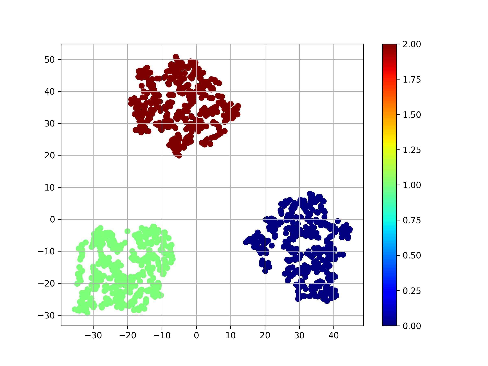

# Plotting and Visualization

While writing one's own custom task-specific matplotlib visualization code
might be needed for specific experimental setups, there are several useful tools
already in-built to ngc-learn, organized under the package sub-directory
`ngclearn.utils.viz`, including utilities for generating raster plots and
synaptic receptive field views (useful for biophysical models such as spiking
neural networks) as well as t-SNE plots of model latent codes. While the other
lesson/tutorials demonstrate some of these useful routines (e.g., raster plots
for spiking neuronal cells), in this small lesson, we will demonstrate how to
produce a t-SNE plot using ngc-learn's in-built tool.

## Generating a t-SNE Plot

Let's say you have a labeled five-dimensional (5D) dataset -- which we will
synthesize artificially in this lesson from an "unobserved" trio of multivariate
Gaussians -- and wanted to visualize these "model outputs" and their
corresponding labels in 2D via ngc-learn's in-built t-SNE.

The following bit of Python code will do this for you (including the artificial
data generator):

```python
from jax import numpy as jnp, random
from ngclearn.utils.viz.dim_reduce import extract_tsne_latents, plot_latents

dkey = random.PRNGKey(1234)

def gen_data(dkey, N): ## artificial data generator (or proxy model)
    mu1 = jnp.asarray([[2.1, 3.2, 0.6, -4., -2.]])
    cov1 = jnp.eye(5) * 0.78
    mu2 = jnp.asarray([[-1.8, 0.2, -0.1, 1.99, 1.56]])
    cov2 = jnp.eye(5) * 0.52
    mu3 = jnp.asarray([[0.3, -1.2, -0.56, -4., 3.6]])
    cov3 = jnp.eye(5) * 1.2

    dkey, *subkeys = random.split(dkey, 7)
    samp1 = random.multivariate_normal(subkeys[0], mu1, cov1, shape=(N,))
    samp2 = random.multivariate_normal(subkeys[0], mu2, cov2, shape=(N,))
    samp3 = random.multivariate_normal(subkeys[0], mu3, cov3, shape=(N,))
    X = jnp.concatenate((samp1, samp2, samp3), axis=0)
    y1 = jnp.ones((N, 3)) * jnp.asarray([[1., 0., 0.]])
    y2 = jnp.ones((N, 3)) * jnp.asarray([[0., 1., 0.]])
    y3 = jnp.ones((N, 3)) * jnp.asarray([[0., 0., 1.]])
    lab = jnp.concatenate((y1, y2, y3), axis=0) ## one-hot codes
    return X, lab

## generate data or theoretical "model outputs"
data, lab = gen_data(dkey, 400)

## visualize the above data via the t-SNE algorithm
print("data.shape = ",data.shape)
codes = extract_tsne_latents(data)
print("code.shape = ",codes.shape)
plot_latents(codes, lab, plot_fname="codes.jpg")
```

which should produce a plot, i.e., `codes.jpg`, similar to the one below:



In this example scenario, we see that we can successfully map the 5D model output
data to a plottable 2D space, facilitating some level of downstream qualitative
interpretation of the model.
