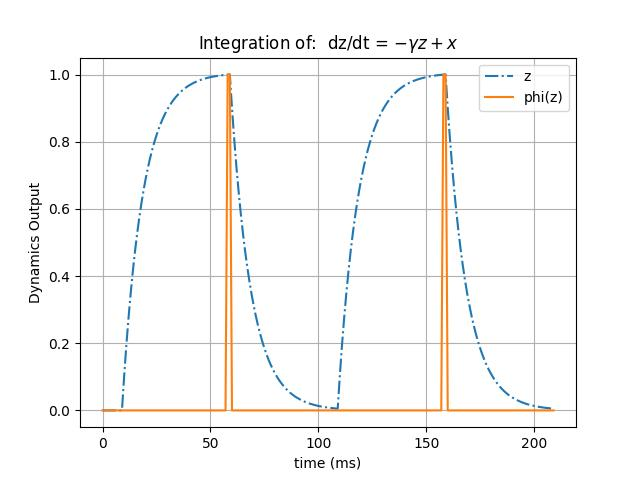

# Lecture 3A: The Rate Cell Model

Graded neurons are one of the main classes/collections of cell components
in ngc-learn. These specifically offer cell models that operate under real-valued
dynamics -- in other words, they do not spike or use discrete pulse-like
values in their operation. These are useful for building biophysical systems
that evolve under continuous, time-varying dynamics, e.g., continuous-time
recurrent neural networks, various kinds of predictive coding circuit models,   
as well as for continuous components in discrete systems, e.g. electrical
current differential equations in spiking networks.

In this tutorial, we will study one of ngc-learn's workhorse in-built graded
cell components, the rate cell ([RateCell](ngclearn.components.neurons.graded.rateCell)).

## Creating and Using a Rate Cell

### Instantiating the Rate Cell

Let's go ahead and set up the controller for this lesson's simulation,
where we will a dynamical system with only a single component,
specifically the rate-cell (RateCell), like so:

```python
from ngcsimlib.controller import Controller
from jax import numpy as jnp, random

## create seeding keys (JAX-style)
dkey = random.PRNGKey(1234)
dkey, *subkeys = random.split(dkey, 2)

dt = 1. # ms # integration time constant
tau_m = 10. # ms ## membrane time constant
act_fx = "unit_threshold"
gamma = 1.

## create simple system with only one sLIF
model = Controller() ## the simulation object / controller
cell = model.add_component("Rate", name="z0", n_units=1, tau_m=tau_m,
                           act_fx=act_fx, prior=("gaussian",gamma),
                           integration_type="euler", key=subkeys[0])
```

A notable argument to the rate-cell, beyond some of its differential equation
constants (`tau_m` and `gamma`), is its activation function choice (default is
the `identity`), which we have chosen to be a discrete pulse emitting function
known as the `unit_threshold` (which outputs a value of one for any input that
exceeds the threshold of one and zero for anything else).

Mathematically, under the hood, a rate-cell evolves according to the
ordinary differential equation (ODE):

$$
\tau_m \frac{\partial \mathbf{z}}{\partial t} =
-\gamma \text{prior}\big(\mathbf{z}\big) + (\mathbf{x} + \mathbf{x}_{td})
$$

where $\mathbf{x}$ is external input signal and $\mathbf{x}_{td}$ (default
value is zero) is an optional additional input pressure signal (`td` stands for "top-down",
its name motivated by predictive coding literature).
A good way to understand this equation is in the context of two examples:
1. in a biophysically more realistic spiking network, $\mathbf{x}$ is the
total electrical input into the cell from multiple injections produced
by transmission across synapses ($\mathbf{x}_{td} = 0)) and the $\text{prior}$
is set to `gaussian` ($\gamma = 1$), yielding the equation
$\tau_m \frac{\partial \mathbf{z}}{\partial t} = -\mathbf{z} + \mathbf{x}$ for
a simple model of synaptic conductance, and
2. in a predictive coding circuit, $\mathbf{x}$ is the sum of input projections
(or messages) passed from a "lower" layer/group of neurons while $\mathbf{x}_{td}$
is set to be the sum of (top-down) pressures produced by an "upper" layer/group
such as the value of a pair of nearby error neurons multiplied by $-1$.[^1] In
this example, $0 \leq \gamma \leq 1$ and $\text{prior}$ could be set to one
of any kind of kurtotic distribution to induce a soft form of sparsity in
the dynamics, e.g., such as "cauchy" for the Cauchy distribution.

Let's finish up setting up the single-node dynamical system before we move on
to simulating it:

```python
## configure desired commands for simulation object
model.add_command("reset", command_name="reset",
                  component_names=[cell.name],
                  reset_name="do_reset")
model.add_command(
    "advance", command_name="advance",
    component_names=[cell.name]
)
model.add_command("clamp", command_name="clamp_data",
                  component_names=[cell.name], compartment=cell.inputCompartmentName(),
                  clamp_name="x")
## pin the commands to the object
model.add_step("advance")
```

### Simulating a Rate Cell

Given our single rate-cell dynamical system above, let us write some code to use
our `Rate` node and visualize its dynamics by feeding
into it a pulse current (a piecewise input function that is an alternating
sequence of intervals of where nothing is input and others where a non-zero
value is input) for a small period of time (`dt * T = 1 * 210` ms). Specifically,
we can plot the input current, the neuron's linear rate activity `z` and its
nonlinear activity `phi(z)` as follows:

```python
# create a synthetic electrical pulse current
current = jnp.concatenate((jnp.zeros((1,10)),
                           jnp.ones((1,50)) * 1.006,
                           jnp.zeros((1,50)),
                           jnp.ones((1,50)) * 1.006,
                           jnp.zeros((1,50))), axis=1)

lin_out = []
nonlin_out = []
t_values = []

model.reset(True)
t = 0.
for ts in range(current.shape[1]):
    j_t = jnp.expand_dims(current[0,ts], axis=0) ## get data at time ts
    model.clamp_data(j_t)
    model.runCycle(t=ts*1., dt=dt)
    t_values.append(t)
    t += dt

    ## naively extract simple statistics at time ts and print them to I/O
    linear_z = model.components["z0"].rateActivity
    nonlinear_z = model.components["z0"].activity
    lin_out.append(linear_z)
    nonlin_out.append(nonlinear_z)
    print(" {}: s {} ; v {}".format(ts, linear_z, nonlinear_z))

import numpy as np
lin_out = np.squeeze(np.asarray(lin_out))
nonlin_out = np.squeeze(np.asarray(nonlin_out))
t_values = np.squeeze(np.asarray(t_values))

import matplotlib #.pyplot as plt
matplotlib.use('Agg')
import matplotlib.pyplot as plt
cmap = plt.cm.jet

fig, ax = plt.subplots()

zLin = ax.plot(t_values, lin_out, '-.', color='C0')
zNLin = ax.plot(t_values, nonlin_out, color='C1') #, alpha=.5)

ax.set(xlabel='time (ms)', ylabel='Dynamics Output',
       title='Integration of:  d\mathbf{z}/dt = $-\gamma \mathbf{z} + \mathbf{x}$')
ax.legend([zLin[0],zNLin[0]],['z','phi(z)'])
ax.grid()
fig.savefig("rate_cell_integration.jpg")
```

which should yield a dynamics plot similar to the one below:



<!-- footnotes -->
[^1]: [error neurons](ngclearn.components.neurons.graded.gaussianErrorCell)
produce this kind of "top-down" value, which is technically the first derivative
of a local cost function with respect to the target value. In the literature,
this is sometimes referred to as a top-down expectation or "pressure".
