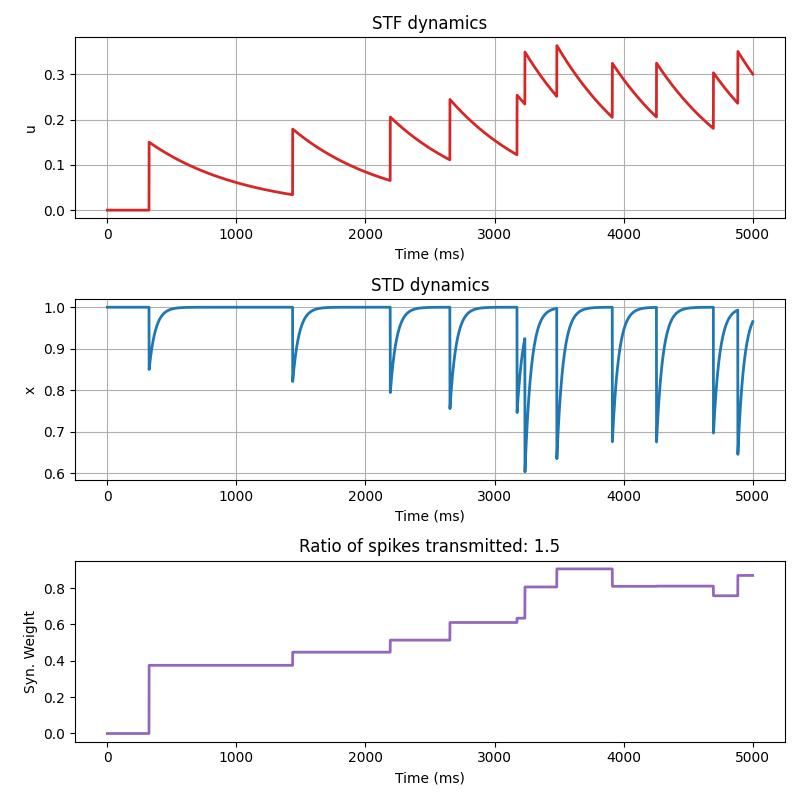
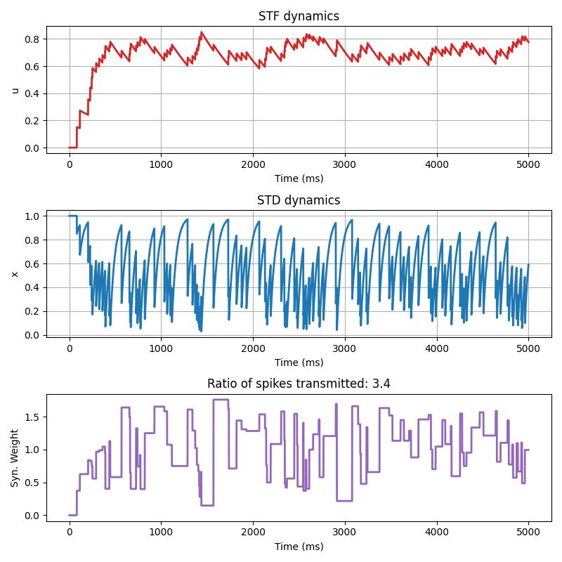
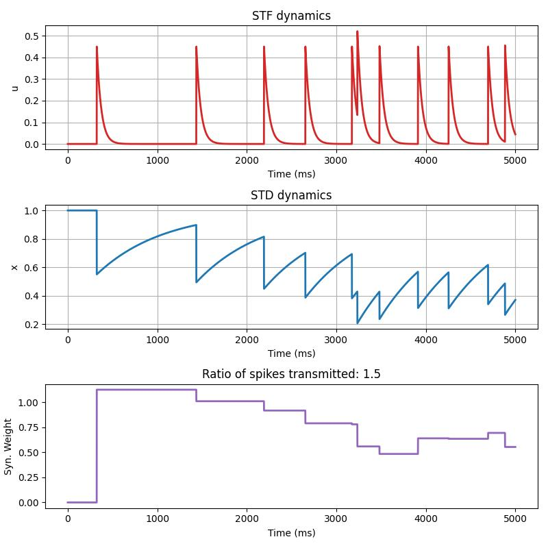
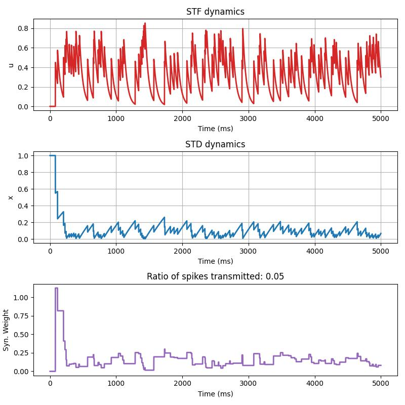

# Lecture 4D: Short-Term Plasticity

In this lesson, we will study how short-term plasticity (STP) <b>[1]</b> dynamics 
-- where synaptic efficacy is cast in terms of the history of presynaptic activity -- 
using ngc-learn's in-built `STPDenseSynapse`. 
Specifically, we will study how a dynamic synapse may be constructed and 
examine what short-term depression (STD) and short-term facilitation
(STF) dominated configurations of an STP synapse look like. 

## Probing Short-Term Plasticity

Go ahead and make a new folder for this study and create a Python script,
i.e., `run_shortterm_plasticity.py`, to write your code for this part of the 
tutorial. 

We will write a 3-component dynamical system that connects a Poisson input 
encoding cell to a leaky integrate-and-fire (LIF) cell via a single dynamic 
synapse that evolves according to STP. We will first write our 
simulation of this dynamic synapse from the perspective of STF-dominated 
dynamics, plotting out the results under two different Poisson spike trains 
with different spiking frequencies. Then, we will modify our simulation 
to emulate dynamics from a STD-dominated perspective.

### Starting with Facilitation-Dominated Dynamics

One experimental goal with using a "dynamic synapse" <b>[1]</b> is often to computationally 
model the fact that synaptic efficacy (strength/conductance magnitude) is 
not a fixed quantity -- even in cases where long-term adaptation/learning is 
absent -- and instead a time-varying property that depends on a fixed 
quantity of biophysical resources. Specifically, biological neuronal networks, 
synaptic signaling (or communication of information across synaptic connection 
pathways) consumes some quantity of neurotransmitters -- STF results from an 
influx of calcium into an axon terminal of a pre-synaptic neuron (after 
emission of a spike pulse) whereas STD occurs after a depletion of 
neurotransmitters that is consumed by the act of synaptic signaling at the axon 
terminal of a pre-synaptic neuron. Studies of cortical neuronal regions have 
empirically found that some areas are STD-dominated, STF-dominated, or exhibit 
some mixture of the two.

Ultimately, the above means that, in the context of spiking cells, when a 
pre-synaptic neuron emits a pulse, this act will affect the relative magnitude 
of the synapse's efficacy; 
in some cases, this will result in an increase (facilitation) and, in others, 
this will result in a decrease (depression) that lasts over a short period 
of time (several hundreds to thousands of milliseconds in many instances). 
As a result of considering synapses to have a dynamic nature to them, both over 
short and long time-scales, plasticity can now be thought of as a stimulus and 
resource-dependent quantity, reflecting an important biophysical aspect that 
affects how neuronal systems adapt and generalize given different kinds of 
sensory stimuli.

Writing our STP dynamic synapse can be done by importing 
[STPDenseSynapse](ngclearn.components.synapses.STPDenseSynapse)  
from ngc-learn's in-built components and using it to wire the output 
spike compartment of the `PoissonCell` to the input electrical current
compartment of the `LIFCell`. This can be done as follows (using the 
meta-parameters we provide in the code block below to ensure 
STF-dominated dynamics):

```python 
from jax import numpy as jnp, random, jit
from ngcsimlib.context import Context
from ngcsimlib.compilers.process import Process
## import model-specific mechanisms
from ngclearn.components import PoissonCell, STPDenseSynapse, LIFCell
import ngclearn.utils.weight_distribution as dist

## create seeding keys (JAX-style)
dkey = random.PRNGKey(231)
dkey, *subkeys = random.split(dkey, 2)

firing_rate_e = 2 ## Hz (of Poisson input train)

dt = 1. ## ms # integration time constant
T_max = 5000 ## number time steps to simulate

tau_e = 5. # ms
tau_m = 20. # ms
R_m = 12. #8 .

## STF-dominated dynamics
tag = "stf_dom"
Rval = 0.15 ## resource value magnitude
tau_f = 750. # ms
tau_d = 50. # ms

plot_fname = "{}Hz_stp_{}.jpg".format(firing_rate_e, tag)

with Context("Model") as model:
    W = STPDenseSynapse("W", shape=(1, 1), weight_init=dist.constant(value=2.5),
                        resources_init=dist.constant(value=Rval),
                        tau_f=tau_f, tau_d=tau_d, key=subkeys[0])
    z0 = PoissonCell("z0", n_units=1, target_freq=firing_rate_e, key=subkeys[0])
    z1 = LIFCell("z1", n_units=1, tau_m=tau_m, resist_m=(tau_m / dt) * R_m,
                 v_rest=-60., v_reset=-70., thr=-50.,
                 tau_theta=0., theta_plus=0., refract_time=0.)

    W.inputs << z0.outputs ## z0 -> W
    z1.j << W.outputs ## W -> z1

    advance_process = (Process()
                       >> z0.advance_state
                       >> W.advance_state
                       >> z1.advance_state)
    model.wrap_and_add_command(jit(advance_process.pure), name="advance")

    reset_process = (Process()
                     >> z0.reset
                     >> z1.reset
                     >> W.reset)
    model.wrap_and_add_command(jit(reset_process.pure), name="reset")

    @Context.dynamicCommand
    def clamp(obs):
        z0.inputs.set(obs)
```

Notice that the `STPDenseSynapse` has two important time constants to configure; 
`tau_f` ($\tau_f$), the facilitation time constant, and `tau_d` ($\tau_d$), the 
depression time constant. In effect, it is these two constants that you will 
want to set to obtain different desired behavior from this in-built dynamic 
synapse: 
1. setting $\tau_f > \tau_d$ will result in STF-dominated behavior; whereas 
2. setting $\tau_f < \tau_d$ will produce STD-dominated behavior. 

Note that setting $\tau_d = 0$ will result in short-term depression being turned off 
completely (and $\tau_f = 0$ disables STF). 

Formally, given the time constants above the dynamics of the `STPDenseSynapse` 
operate according to the following coupled ordinary differential equations (ODEs):

$$
\tau_f \frac{\partial u_j(t)}{\partial t} &= -u_j(t) + N_R \big(1 - u_j(t)\big) s_j(t) \\
\tau_d \frac{\partial x_j}{\partial t} &= \big(1 - x_j(t)\big) - u_j(t + \Delta t) x_j(t) s_j(t) \\
$$

and the resulting (short-term) synaptic efficacy:

$$
W^{dyn}_{ij}(t + \Delta t) = \Big( W^{max}_{ij} u_j(t + \Delta t) x_j(t) s_j(t) \Big) 
+ W^{dyn}_{ij} (1 - s_j(t))
$$

where $N_R$ represents an increment produced by a pre-synaptic spike $\mathbf{s}_j(t)$ 
(and in essence, the neurotransmitter resources available to yield facilitation), 
$W^{max}_{ij}$ denotes the absolute synaptic efficacy (or maximum response 
amplitude of this synapse in the case of a complete release of all 
neurotransmitters; $x_j(t) = u_j(t) = 1$) of the connection between pre-synaptic 
neuron $j$ and post-synaptic neuron $i$, and $W^{dyn}_{ij}(t)$ is the value 
of the dynamic synapse's efficacy at time `t`. 
$\mathbf{x}_j$ is a variable (which lies in the range of $[0,1]$) that indicates 
the fraction of (neurotransmitter) resources available after a depletion of the 
neurotransmitter resource pool. $\mathbf{u}_j$, on the hand, 
represents the neurotransmitter "release probability", or the fraction of available 
resources ready for the dynamic synapse's use.

### Simulating and Visualizing STF

Now that we understand the basics of how an ngc-learn STP works, we can next 
try it out on a simple pre-synaptic Poisson spike train.  Writing out the 
simulated input Poisson spike train and our STP model's processing of this 
data can be done as follows:

```python 
t_vals = []
u_vals = []
x_vals = []
W_vals = []
num_z1_spikes = 0.
model.reset()
obs = jnp.asarray([[1.]])
ts = 1.
ptr = 0 # spike time pointer
for i in range(T_max):
    model.clamp(obs)
    model.advance(t=dt * ts, dt=dt)
    u = jnp.squeeze(W.u.value)
    x = jnp.squeeze(W.x.value)
    Wexc = jnp.squeeze(W.Wdyn.value)
    s0 = jnp.squeeze(W.inputs.value)
    s1 = jnp.squeeze(z1.s.value)
    num_z1_spikes = s1 + num_z1_spikes
    u_vals.append(u)
    x_vals.append(x)
    W_vals.append(Wexc)
    t_vals.append(ts)
    print("{}|  u: {}  x: {}  W: {} pre: {}  post {}".format(ts, u, x, Wexc, s0, s1))
    ts += dt
    ptr += 1
print("Number of z1 spikes = ",num_z1_spikes)

u_vals = jnp.squeeze(jnp.asarray(u_vals))
x_vals = jnp.squeeze(jnp.asarray(x_vals))
t_vals = jnp.squeeze(jnp.asarray(t_vals))
```

We may then plot out the result of the STF-dominated dynamics we 
simulate above with the following code:

```python 
import matplotlib.pyplot as plt
from matplotlib import gridspec

fig1 = plt.figure(figsize=(8,8))
gs = gridspec.GridSpec(3, 1)

# show dynamics for one example synapse
ex_syn  = 0
ax1 = fig1.add_subplot(gs[0, 0])
_u = ax1.plot(t_vals, u_vals, '-', lw=2, color='tab:red')
#ax1.plot(range(int(round((t_max-t_0)/time_step_sim))+1),u_storage[:,ex_syn],lw=2,color='k')
ax1.set_xlabel('Time (ms)')
ax1.set_ylabel('u')
ax1.set_title('STF dynamics')

ax2 = fig1.add_subplot(gs[1, 0])
_x = ax2.plot(t_vals, x_vals, '-', lw=2, color='tab:blue')
ax2.set_xlabel('Time (ms)')
ax2.set_ylabel('x')
ax2.set_title('STD dynamics')

ax3 = fig1.add_subplot(gs[2, 0])
_W = ax3.plot(t_vals, W_vals, lw=2, color='tab:purple')
ax3.set_xlabel('Time (ms)')
ax3.set_ylabel('Syn. Weight')
ax3.set_title('Ratio of spikes transmitted: ' + str(num_z1_spikes/firing_rate_e))

fig1.subplots_adjust(top=0.3)
plt.tight_layout()
ax1.grid()
ax2.grid()
fig1.savefig(plot_fname)
```

Under the `2` Hertz Poisson spike train set up above, the plotting 
code should produce (and save to disk) the following:



Note that, if you change the frequency of the input Poisson spike train to `20` 
Hertz instead, like so:

```python 
firing_rate_e = 20 ## Hz (of Poisson input train)
```

and re-run your simulation script, you should obtain the following:



Notice that increasing the frequency in which the pre-synaptic spikes occur 
results in more volatile dynamics with respect to the effective synaptic 
efficacy over time.

### Depression-Dominated Dynamics

With your code above, it's simple to reconfigure the model to emulate 
the opposite of STF dominated dynamics, i.e., short-term depression (STD) 
dominated dynamics. 
Modify your meta-parameter values like so:

```python 
firing_rate_e = 2 ## Hz (of Poisson input train)
tag = "std_dom"
Rval = 0.45 ## resource value magnitude
tau_f = 50. # ms
tau_d = 750. # ms
```

and re-run your script to obtain an output akin to the following:



Now, modify your meta-parameters one last time to use a higher-frequency 
input spike train, i.e., `firing_rate_e = 20 ## Hz`, to obtain a plot similar 
to the one below: 



You have now successfully simulated a dynamic synapse in ngc-learn across 
several different Poisson input train frequencies under both STF and 
STD-dominated regimes. In more complex biophysical models, it could prove useful 
to consider combining STP with other forms of long-term experience-dependent 
forms of synaptic adaptation, such as spike-timing-dependent plasticity.

## References

<b>[1]</b> Tsodyks, Misha, Klaus Pawelzik, and Henry Markram. "Neural networks 
with dynamic synapses." Neural computation 10.4 (1998): 821-835.
