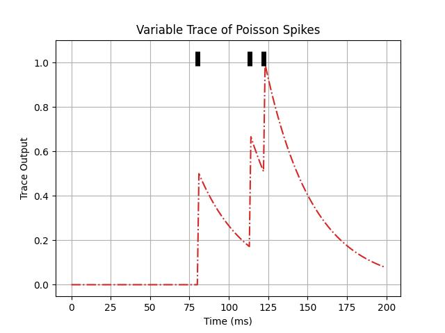
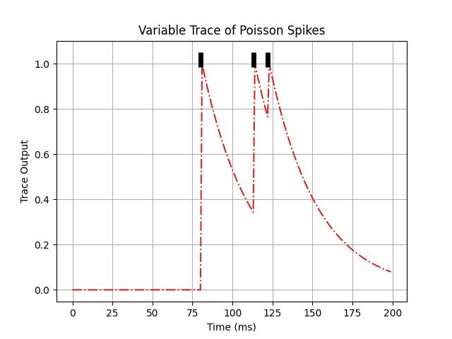

# Lecture 1B: Trace Variables and Filtering

Traces represent one very important component tool in ngc-learn as these are
often, in biophysical model simulations, used to produce real-valued
representations of often discrete-valued patterns, e.g., spike vectors within
a spike train, that can facilitate mechanisms such as online biological credit
assignment. In this lesson, we will observe how one of ngc-learn's core
trace components -- the `VarTrace` -- operates.

## Setting Up a Variable Trace for a Poisson Spike Train

To observe the value of a variable trace, we will pair it to another in-built
ngc-component; the `PoissonCell`, which will be configured to emit spikes
approximately at `63.75` Hertz (yielding a fairly sparse spike train). This means
we will construct a two-component dynamical system, where the input
compartment `outputs` of the `PoissonCell` will be wired directly into the
`inputs` compartment of the `VarTrace`. Note that a `VarTrace` has an `inputs`
compartment -- which is where raw signals typically go into -- and a `trace`
output compartment -- which is where filtered signal values/by-products are emitted from.

The code below will instantiate the paired Poisson cell and corresponding variable trace:

```python
from jax import numpy as jnp, random, jit
import time

from ngcsimlib.context import Context
from ngcsimlib.commands import Command
from ngcsimlib.compilers import compile_command, wrap_command
from ngclearn.utils.viz.raster import create_raster_plot
## import model-specific mechanisms
from ngclearn.operations import summation
from ngclearn.components.input_encoders.poissonCell import PoissonCell
from ngclearn.components.other.varTrace import VarTrace

## create seeding keys (JAX-style)
dkey = random.PRNGKey(231)
dkey, *subkeys = random.split(dkey, 2)

with Context("Model") as model:
    cell = PoissonCell("z0", n_units=1, max_freq=63.75, key=subkeys[0])
    trace = VarTrace("tr0", n_units=1, tau_tr=30., a_delta=0.5)

    ## wire up cell z0 to trace tr0
    trace.inputs << cell.outputs

    reset_cmd, reset_args = model.compile_by_key(cell, trace, compile_key="reset")
    advance_cmd, advance_args = model.compile_by_key(cell, trace, compile_key="advance_state")

    model.add_command(wrap_command(jit(model.reset)), name="reset")
    model.add_command(wrap_command(jit(model.advance_state)), name="advance")


    @Context.dynamicCommand
    def clamp(x):
        cell.inputs.set(x)
```

## Running the Paired Cell-Trace System

We can then run the above two-component dynamical system by injecting a fixed
(valid) probability value into the Poisson input encoder and then record the
resulting spikes and trace values. We will do this for `T = 200` milliseconds (ms)
with the code below:

```python
dt = 1. # ms # integration time constant
T = 200 ## number time steps to simulate

probs = jnp.asarray([[0.35]],dtype=jnp.float32)
time_span = []
spikes = []
traceVals = []
model.reset()
for ts in range(T):
    model.clamp(probs)
    model.advance(t=ts*1., dt=dt)

    print("{}  {}".format(cell.outputs.value, trace.trace.value))
    spikes.append( cell.outputs.value )
    traceVals.append( trace.trace.value )
    time_span.append(ts * dt)
spikes = jnp.concatenate(spikes,axis=0)
traceVals = jnp.concatenate(traceVals,axis=0)
```

We can plot the above simulation's trace outputs with the discrete spikes
super-imposed at their times of occurrence with the code below:

```python
import matplotlib #.pyplot as plt
matplotlib.use('Agg')
import matplotlib.pyplot as plt
cmap = plt.cm.jet

fig, ax = plt.subplots()

zTr = ax.plot(time_span, traceVals, '-.', color='tab:red')
stat = jnp.where(spikes > 0.)
indx = (stat[0] * 1. - 1.).tolist()
spk = ax.vlines(x=indx, ymin=0.985, ymax=1.05, colors='black', ls='-', lw=5)

ax.set(xlabel='Time (ms)', ylabel='Trace Output',
      title='Variable Trace of Poisson Spikes')
#ax.legend([zTr[0],spk[0]],['z','phi(z)'])
ax.grid()
fig.savefig("poisson_trace.jpg")
```

to get the following output saved to disk:



Notice that every time a spike is produced by the Poisson encoding cell, the trace
increments by `0.5` -- the result of the `a_delta` hyper-parameter we set when
crafting the model and simulation object -- and then exponentially decays in
the absence of a spike (with the time constant of `tau_tr = 30` milliseconds).

The variable trace can be further configured to filter signals in different ways
if desired; specifically by manipulating its `decay_type` and `a_delta` arguments.
Notably, if a piecewise-gated variable trace is desired (a very common choice
in some neuronal circuit models), then all one would have to do is set `a_delta = 0`,
yielding the following line in the model creation code earlier in this tutorial:

```python
trace = VarTrace("tr0", n_units=1, tau_tr=30., a_delta=0., decay_type="exp")
```

Running the same code from before but with the above alteration would yield the
plot below:



Notice that, this time, when a spike is emitted from the Poisson cell, the trace
is "clamped" to the value of one and then exponentially decays. Such a trace
configuration is useful if one requires the maintained trace to never increase
beyond a value of one, preventing divergence or run-away values if a spike train
is particularly dense and yielding friendlier values for biological learning
rules.
