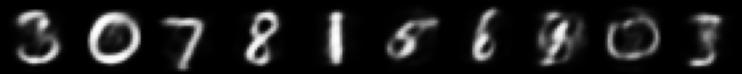
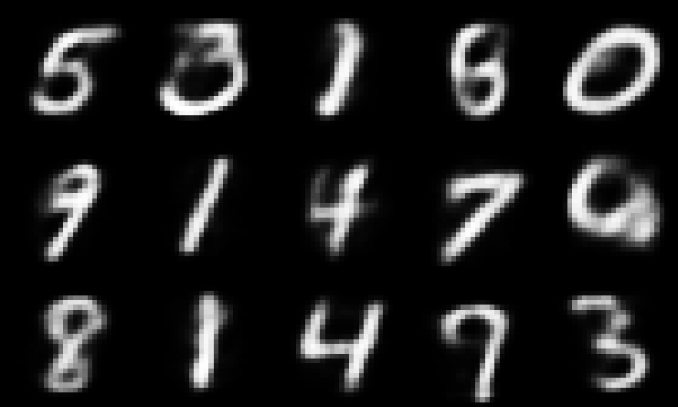

# Demo 1: Learning NGC Generative Models

In this demonstration, we will learn how to use ngc-learn's Model Museum to fit an
NGC generative model, which is also called a generative neural coding network (GNCN),
to the MNIST database. Specifically, we will focus on training three key models,
each from different points in history, and estimate their marginal log likelihoods.
Along the way, we will see how to fit a prior to our models and examine how a simple
configuration file can be set up to allow for easy recording of experimental
settings.

Concretely, after going through this demonstration, you will:

1.  Understand how to import and train models from ngc-learn's Model Museum.
2.  Fit a density estimator to an NGC model's latent space to create a prior.
3.  Estimate the marginal log likelihood of three GNCNs using the prior-fitting
scheme designed in this demonstration.

Note that the two folders of interest to this demonstration are:
+ `walkthroughs/demo1/`: this contains the necessary scripts and configuration files
+ `walkthroughs/data`: this contains a zipped copy of the MNIST database arrays

## Setting Up and Training a Generative System

To start, navigate to the `walkthroughs/` directory to access the example/demonstration
code and further enter the `walkthroughs/data/` sub-folder. Unzip the file
`mnist.zip` to create one more sub-folder that contains a set of numpy arrays each house
a different slice of the MNIST database, i.e., `trainX.npy` and `trainY.npy` compose
the training set (image patterns and their labels), `validX.npy`and `validY.npy` make
up the development/validation set, and `testX.npy`and `testY.npy` compose the test set.
Note that pixels in all image vectors have been normalized for you, to the range of [0,1].

Next, in `walkthroughs/demo1/`, observe the provided script `sim_train.py`, which contains the
code to execute the training process of an NGC model. Inside this file, we can export
one of three possible GNCNs from ngc-learn's Model Museum, i.e., the
[GNCN-t1](../museum/gncn_t1.md) (which
is an instantiation of the model proposed in Rao &amp; Ballard, 1999 [1]),
the [GNCN-t1-Sigma](../museum/gncn_t1_sigma.md) (an instantiation of the model proposed in Friston
2008 [2]), and the [GNCN-PDH](../museum/gncn_pdh.md) (one of the models proposed in
Ororbia &amp; Kifer 2022 [3]).

Importing models from the Model Museum is straightforward and only
requires a few lines to be placed in the header of a training script. Notice
that we import several items besides the models, including a [DataLoader](ngclearn.utils.data_utils),
like so:

```python
from ngclearn.utils.data_utils import DataLoader
```

some metrics, transformations, and other I/O tools, as follows:

```python
from ngclearn.utils.config import Config
import ngclearn.utils.transform_utils as transform
import ngclearn.utils.metric_utils as metric
import ngclearn.utils.io_utils as io_tools
```

where [Config](ngclearn.utils.config) is an argument configuration object that
reads in values set by the user in a `*.cfg` configuration file, `transform_utils`
contains mathematical functions to alter vectors/matrices (we will use the `binarize()`
function, which, inside of `sim_train.py`, will convert the MNIST image patterns
to their binary equivalents), and `metric_utils` contains measurement
functions (we will use the binary cross entropy routine `bce()`).
Finally, we import the models themselves, as shown below:

```python
from ngclearn.museum.gncn_t1 import GNCN_t1
from ngclearn.museum.gncn_t1_sigma import GNCN_t1_Sigma
from ngclearn.museum.gncn_pdh import GNCN_PDH
```

With the above imported from ngc-learn, we have everything we need to craft a
full training cycle as well as track a model's out-of-sample inference ability
on validation data.

Notice in the script, at the start of our with-statement (which is used to force
the following computations to reside in a particular GPU/CPU), before initializing
a chosen model, we define a second special function to track another important
quantity special to NGC models -- the total discrepancy (ToD) -- as follows:

```python
def calc_ToD(agent):
    """Measures the total discrepancy (ToD) of a given NGC model"""
    ToD = 0.0
    L2 = agent.ngc_model.extract(node_name="e2", node_var_name="L")
    L1 = agent.ngc_model.extract(node_name="e1", node_var_name="L")
    L0 = agent.ngc_model.extract(node_name="e0", node_var_name="L")
    ToD = -(L0 + L1 + L2)
    return float(ToD)
```

This function is used to measure the internal disorder, or approximate free energy,
within an NGC model based on its error neurons (since, internally, our imported models
use the specialized [ENode](ngclearn.engine.nodes.enode) to create error neuron
nodes, we retrieve each node's specialized compartment known as the scalar local
loss `L` -- for details on nodes and their compartments, see
[Demonstration \# 2](../walkthroughs/demo2_create_ngc.md) for details -- but you
could also compute each local loss with distance functions, e.g.,
`L2 = tf.norm( agent.ngc_model.extract(node_name="e2", node_var_name="phi(z)"), ord=2 )`).
Measuring ToD allows us to monitor the entire NGC system's optimization
process and make sure it is behaving correctly, making progress towards reaching
a stable fixed-point.

Next, we write an evaluation function that leverages a `DataLoader` and a NGC model
and returns some useful problem-specific measurements. In this demo's case,
we want to measure and track binary cross entropy across training iterations/epochs.
The evaluation loop can be written like so:

```python
def eval_model(agent, dataset, calc_ToD, verbose=False):
    """
        Evaluates performance of agent on this fixed-point data sample
    """
    ToD = 0.0 # total disrepancy over entire data pool
    Lx = 0.0 # metric/loss over entire data pool
    N = 0.0 # number samples seen so far
    for batch in dataset:
        x_name, x = batch[0]
        N += x.shape[0]
        x_hat = agent.settle(x) # conduct iterative inference
        # update tracked fixed-point losses
        Lx = tf.reduce_sum( metric.bce(x_hat, x) ) + Lx
        ToD = calc_ToD(agent) + ToD # calc ToD
        agent.clear()
        if verbose == True:
            print("\r ToD {0}  Lx {1} over {2} samples...".format((ToD/(N * 1.0)), (Lx/(N * 1.0)), N),end="")
    if verbose == True:
        print()
    Lx = Lx / N
    ToD = ToD / N
    return ToD, Lx
```

Notice that, in the above code snippet, we pass in the current NGC model (`agent`),
the DataLoader (`dataset`), and the ToD function we wrote earlier.
Now we have a means to measure some aspect of the generalization
ability of our NGC model, all that remains is to craft a training process loop
for NGC model. This loop could take the following form:

```python
# create a  training loop
ToD, Lx = eval_model(agent, train_set, calc_ToD, verbose=True)
vToD, vLx = eval_model(agent, dev_set, calc_ToD, verbose=True)
print("{} | ToD = {}  Lx = {} ; vToD = {}  vLx = {}".format(-1, ToD, Lx, vToD, vLx))

sim_start_time = time.time()
########################################################################
for i in range(num_iter): # for each training iteration/epoch
    ToD = 0.0 # estimated ToD over an epoch (or whole dataset)
    Lx = 0.0 # estimated total loss over epoch (or whole dataset)
    n_s = 0
    # run single epoch/pass/iteration through dataset
    ####################################################################
    for batch in train_set:
        n_s += batch[0][1].shape[0] # track num samples seen so far
        x_name, x = batch[0]
        x_hat = agent.settle(x) # conduct iterative inference
        ToD_t = calc_ToD(agent) # calc ToD
        Lx = tf.reduce_sum( metric.bce(x_hat, x) ) + Lx
        # update synaptic parameters given current model internal state
        delta = agent.calc_updates()
        opt.apply_gradients(zip(delta, agent.ngc_model.theta))
        agent.ngc_model.apply_constraints()
        agent.clear()

        ToD = ToD_t + ToD
        print("\r train.ToD {0}  Lx {1}  with {2} samples seen...".format(
              (ToD/(n_s * 1.0)), (Lx/(n_s * 1.0)), n_s),
              end=""
              )
    ####################################################################
    print()
    ToD = ToD / (n_s * 1.0)
    Lx = Lx / (n_s * 1.0)
    # evaluate generalization ability on dev set
    vToD, vLx = eval_model(agent, dev_set, calc_ToD)
    print("-------------------------------------------------")
    print("{} | ToD = {}  Lx = {} ; vToD = {}  vLx = {}".format(
          i, ToD, Lx, vToD, vLx)
          )
```

The above code block represents the core training process loop but you will also
find in `sim_train.py` a few other mechanisms that allow for:
1) model saving/check-pointing,
2) an early-stopping mechanism based on patience, and
3) some metric/ToD tracking by storing and saving updated sets of scalar lists to disk.
Taking all of the above together, you can simulate the NGC training process after setting
some chosen values in your `*.cfg` configuration file, which is read in near the beginning
of your training script. For example, in `train_sim.py`, you will see some basic
code that reads in an external experimental configuration `*.cfg` file:

```python
options, remainder = getopt.getopt(sys.argv[1:], '', ["config=","gpu_id=","n_trials="])
# GPU arguments and configuration
cfg_fname = None
use_gpu = False
n_trials = 1
gpu_id = -1
for opt, arg in options:
    if opt in ("--config"):
        cfg_fname = arg.strip()
    elif opt in ("--gpu_id"):
        gpu_id = int(arg.strip())
        use_gpu = True
    elif opt in ("--n_trials"):
        n_trials = int(arg.strip())
mid = gpu_id
if mid >= 0:
    print(" > Using GPU ID {0}".format(mid))
    os.environ["CUDA_VISIBLE_DEVICES"]="{0}".format(mid)
    #gpu_tag = '/GPU:0'
    gpu_tag = '/GPU:0'
else:
    os.environ["CUDA_VISIBLE_DEVICES"]="-1"
    gpu_tag = '/CPU:0'

save_marker = 1

# load in and build the configuration object
args = Config(cfg_fname) # contains arguments for the simulation
```

Furthermore, notice that the above code snippet contains a bit of setup to allow you
to switch to a GPU of your choice (if you set `gpu_id` to a value `>= 0`)
or a CPU if no GPU is available (`gpu_id` should be set to `-1`). Notice that the
`Config` object reads in a `/path/to/file_name.cfg` text file and produces a
queryable object that is backed by a dictionary/hash-table.

The above code blocks/snippets can be found in `train_sim.py` which has been written
for you to study and use/run along with the provided example configuration scripts
(notice for each model there one subfolder in `/walkthroughs/demo1/` for each of the
three models for you to train, each with their own training script `fit.cfg` and
`analysis.cfg` script).
Let us go ahead and train one of each the three models that we imported into our
training script at the start of this demonstration.
Run the following three commands as shown below:
```console
$ python sim_train.py --config==gncn_t1/fit.cfg --gpu_id=0 --n_trials=1
```
```console
$ python sim_train.py --config==gncn_t1_sigma/fit.cfg --gpu_id=0 --n_trials=1
```
```console
$ python sim_train.py --config==gncn_pdh/fit.cfg --gpu_id=0 --n_trials=1
```
Alternatively, you can also just run the global bash script `exec_experiments.sh`
that we have also provided in `/walkthroughs/demo1/`, which will just simply execute the above
three experiments sequentially for you. Run this bash script like so:
```console
$ ./exec_experiments.sh
```

As an individual script runs, you will see printed to the terminal, after each epoch,
an estimate of the ToD and the BCE over the full training sample as well as the
measured validation ToD and BCE over the full development data subset. Note that our
training script retrieves from the `walkthroughs/data/mnist/` folder (that you unzipped earlier)
only the training arrays, i.e., `trainX.npy` and `trainY.npy`, and the
validation set arrays, i.e., `validX.npy` and `validY.npy`. We will use the
test set arrays `testX.npy` and `testY.npy` in a follow-up analysis once we have
trained each of our models above. After all the processes/scripts terminate, you can
check inside each of the model folders, i.e., `walkthroughs/demo1/gncn_t1/`, `walkthroughs/demo1/gncn_t1_sigma/`,
and `walkthroughs/demo1/gncn_pdh/`, and see that your script(s) saved/serialized to disk a
few useful files:

+ `Lx0.npy`: the BCE training loss for the training set over epoch
+ `ToD0.npy`: the ToD measurement for the training set over epoch
+ `vLx0.npy`: the validation BCE loss over epoch
+ `vToD0.npy`: the validation ToD measurement loss over epoch
+ `model0.ngc`: your saved/serialized NGC model (with best validation performance)

You can use then plot the numpy arrays using `matplotlib` or your favorite
visualization library/package to create curves for each measurement over epoch.
The final object, the model object `model0.ngc`, is what we will use in the next section to
quantitatively evaluate how well our NGC models work as a generative models.

## Analyzing a Trained Generative Model

Now that you have trained three NGC generative models, we now want to analyze them a
bit further, beyond just the total discrepancy and binary cross entropy (the latter
of which just tells you how good the model is at auto-associative reconstruction
of samples of binary-valued data).

In particular, we are interested in measuring the marginal log likelihood of
our models, or `log p(x)`. In general, calculating such a quantity exactly is
intractable for any reasonably-sized model since we would have marginalize out
the latent variables `Z = {z1, z2, z3}` of each our generative models, requiring
us to evaluate an integral over a continuous space. However, though things seem
bleak, we can approximate this marginal by resorting to a Monte Carlo estimate and
simply draw as many samples as we need (or can computationally handle) from the
underlying prior distribution inherent to our NGC model in order to calculate `log p(x)`.
Since the NGC models that we have designed/trained in this demo embody an underlying
directed generative model, i.e., `p(x,Z) = p(x|z1) p(z1|z2) p(z2|z3) p(z3)`, we
can use efficient ancestral sampling to produce fantasy image samples after we
query the underlying latent prior `p(z3)`.

Unfortunately, unlike models such as the variational autoencoder (VAE), we do not
have an explicitly defined prior distribution, such as a standard multivariate Gaussian,
that makes later sampling simple (the VAE is trained with an encoder that
forces the generative model to stick as close as it can to this imposed prior).
An NGC model's latent prior is, in contrast to the VAE, multimodal and thus
simply using a standard Gaussian will not quite produce the fantasized samples
we would expect.
Nevertheless, we can, in fact, far more accurately capture an NGC model's prior `p(z3)`
by treating it as a mixture of Gaussians and instead estimate its multimodal density
with a Gaussian mixture model (GMM). Once we have this learned GMM prior, we can
sample from this model of `p(z3)` and run these samples through the NGC graph
via ancestral sampling (using the prebuilt ancestral projection function `project()`).

ngc-learn is designed to offer some basic support for density estimation, and
for this demonstration, we will import and use its GMM density estimator (which
builds on top of scikit-learn's GMM base model), i.e., `ngclearn.density.gmm`.
First, we will need to extract the latent variables from the trained NGC model,
which simply requires us to adapt our `eval_model()` function in our training script
to also now return a design matrix where each row contains one latent code vector produced
by our model per data point in a sample pool.
Specifically, all we need to write is the following:

```python
def extract_latents(agent, dataset, calc_ToD, verbose=False):
    """
        Extracts latent activities of an agent on a fixed-point data sample
    """
    latents = None
    ToD = 0.0
    Lx = 0.0
    N = 0.0
    for batch in dataset:
        x_name, x = batch[0]
        N += x.shape[0]
        x_hat = agent.settle(x) # conduct iterative inference
        lats = agent.ngc_model.extract(node_name, cmpt_name)
        if latents is not None:
            latents = tf.concat([latents,lats],axis=0)
        else:
            latents = lats
        ToD_t = calc_ToD(agent) # calc ToD
        # update tracked fixed-point losses
        Lx = tf.reduce_sum( metric.bce(x_hat, x) ) + Lx
        ToD = calc_ToD(agent) + ToD
        agent.clear()
        print("\r ToD {0}  Lx {1} over {2} samples...".format((ToD/(N * 1.0)), (Lx/(N * 1.0)), N),end="")
    print()
    Lx = Lx / N
    ToD = ToD / N
    return latents, ToD, Lx
```

Notice we still keep our measurement of the ToD and BCE just as an extra
sanity check to make sure that any model we de-serialize from disk yields values
similar to what we measured during our training process.
Armed with the extraction function above, we can gather the latent codes of
our NGC model. Notice that in the provided `walkthroughs/demo1/extract_latents.py` script,
you will find the above function fully integrated and used.
Go ahead and run the extraction script for the first of your three models:
```console
$ python extract_latents.py --config==gncn_t1/analyze.cfg --gpu_id=0
```
and you will now find inside the folder `walkthroughs/demo1/gncn_t1/` a new numpy array
file `z3_0.npy`, which contains all of the latent variables for the top-most layer
of your `GNCN-t1` model (you can examine the configuration file `analyze.cfg` to see
what arguments we set to achieve this).

Now it is time to fit the GMM prior. In the `fit_gmm.py` script, we have set
up the necessary framework for you to do so (using `18,000` samples from the
training set to speed up calculations a bit). All you need to do at this point,
still using the `analyze.cfg` configuration, is execute this script like so:
```console
$ python fit_gmm.py --config==gncn_t1/analyze.cfg --gpu_id=0
```
and after your fitting process script terminates, you will see inside your model
directory `walkthroughs/demo1/gncn_t1/` that you have a de-serialized learned
prior `prior0.gmm`.

With this prior model `prior0.gmm` and your previously trained NGC system
`model0.ngc`, you are ready to finally estimate your marginal log likelihood `log p(x)`.
The final script provided for you, i.e., `walkthroughs/demo1/eval_logpx.py`, will
do this for you. It simply takes your full system -- the prior and the model -- and
calculates a Monte Carlo estimate of its log likelihood using the test set.
Run this script as follows:
```console
$ python eval_logpx.py --config==gncn_t1/analyze.cfg --gpu_id=0
```
and after it completes (this step can take a bit more time than the other steps,
since we are computing our estimate over quite a few samples), in addition to
outputting to I/O the calculated `log p(x)`, you will see two more items in your
model folder `walkthroughs/demo1/gncn_t1/`:

+ `logpx_results.txt`: the recorded marginal log likelihood
+ `samples.png`: some visual samples stored in an image array for you to view/assess

If you `cat` the first item, you should something similar to the following (which
should be the same as what was printed to I/O when you evaluation script finished):
```console
$ cat gncn_t1/logpx_results.txt
Likelihood Test:
  log[p(x)] = -103.63043212890625
```
and if you open and view the image samples, you should see something similar to:<br>



Now go ahead and re-run the same steps above but for your other two models, using
the final provided configuration scripts, i.e., `gncn_t1_sigma/analyze.cfg` and
`gncn_pdh/analyze.cfg`. You should see similar outputs as below.

For the GNCN-t1-Sigma, you get a log likelihood of:
```console
$ cat gncn_t1_sigma/logpx_results.txt
Likelihood Test:
  log[p(x)] = -99.73319244384766
```
with images as follows:<br>



For the GNCN-PDH, you get a log likelihood of:
```console
$ cat gncn_t1_sigma/logpx_results.txt
Likelihood Test:
  log[p(x)] = -97.39334106445312
```
with images as follows:<br>


For the three models above, we get log likelihood measurements that are desirably
within the right ballpack of those reported in related literature [3].

You have now successfully trained three different, powerful NGC generative models
using ngc-learn's Model Museum and analyzed their log likelihoods. While these models
work/perform well, there is certainly great potential for further improvement, extensions,
and alternative ideas and it is our hope that future research developments will take
advantage of the tools/framework provided by ngc-learn to produce even better results.

**Note:** Setting the `--n_trials` flag to a number greater than one for the
above training scripts to run each simulation for multiple, different experimental
trials (each set of files/objects will be indexed by its trial number).


## References
[1] Rao, Rajesh PN, and Dana H. Ballard. "Predictive coding in the visual cortex:
a functional interpretation of some extra-classical receptive-field effects."
Nature Neuroscience 2.1 (1999): 79-87. <br>
[2] Friston, Karl. "Hierarchical models in the brain." PLoS Computational
Biology 4.11 (2008): e1000211. <br>
[3] Ororbia, A., and Kifer, D. The neural coding framework for learning
generative models. Nature Communications 13, 2064 (2022).
