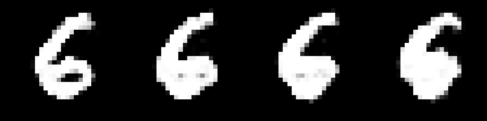
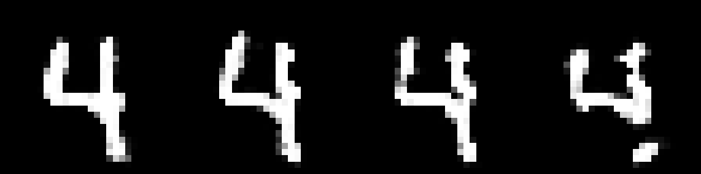
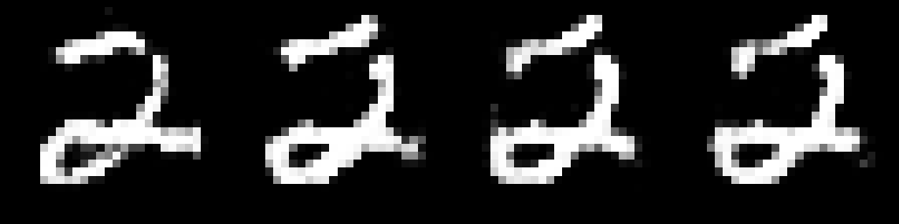

# Walkthrough 6: Harmoniums and Contrastive Divergence

Although ngc-learn was originally designed with a focus on predictive
processing neural systems, it is possible to simulate other kinds of neural
systems with different dynamics and forms of learning. Notably, a class of
learning and inference systems that adapt through a process known as
contrastive Hebbian learning (CHL) can be constructed and simulated with
ngc-learn.

In this demonstration, we will design a simple (single-wing) Harmonium, also
known as the restricted Boltzmann machine (RBM). We will specifically
focus on learning its synaptic connections with an algorithmic recipe known
as Contrastive Divergence (CD).
After going through this demonstration, you will:

1.  Learn how to construct an `NGCGraph` that emulates the structure of an RBM and
adapt the NGC settling process to calculate approximate synaptic weight gradients
in accordance to Contrastive Divergence.
2.  Simulate fantasized image samples using the block Gibbs sampler implicitly
defined by the negative phase graph.

Note that the folders of interest to this demonstration are:
+ `walkthroughs/demo6/`: this contains the necessary simulation scripts
+ `walkthroughs/data`: this contains the zipped copy of the digit image arrays

## On Single-Wing Harmoniums

A Harmonium is a generative model implemented as a stochastic, two-layer neural system
that attempts to learn a probability distribution over sensory input $\mathbf{x}$, i.e.,
the goal of a Harmonium is to learn $p(\mathbf{x})$, much like the models we were learning
in Walkthrough \#1. Fundamentally, the approach to estimating $p(\mathbf{x})$ that is
taken by a Harmonium is through optimizing an energy function $E(\mathbf{x})$ (a
concept motivated by statistical mechanics), where the system searches for an
internal configuration, i.e., the values of its synapses, has low energy (values)
for patterns that lie come from the true data distribution $p(\mathbf{x})$ and high energy
(values) for patterns that do not (or those that do not come from the training dataset).

The most common, standard Harmonium is one where input nodes (one per dimension
of the data observation space) are modeled as binary/Boolean sensors, or "visible
units" $\mathbf{z}^0$ (which are clamped to actual data patterns), connected to a layer of
(stochastic) binary latent feature detectors, or "hidden units" $\mathbf{z}^1$. Notably,
the connections between the latent and visible units are symmetric. As a result
of a key restriction imposed on the Harmonium's network structure, i.e., no
lateral connections between the neurons in $\mathbf{z}^0$ as well as those in $\mathbf{z}^1$,
computing the latent and visible states is simple:

<!--
```
p(z1 | z0) = sigmoid(W * z0 + c), z1 ~ p(z1 | z0)
p(z0 | z1) = sigmoid(W^T * z1 + b), z0 ~ p(z0 | z1)
```
-->
$$
p(\mathbf{z}^1 | \mathbf{z}^0) &= sigmoid(\mathbf{W} \cdot \mathbf{z}^0 + \mathbf{c}),
\; \mathbf{z}^1 \sim p(\mathbf{z}^1 | \mathbf{z}^0) \\
p(\mathbf{z}^0 | \mathbf{z}^1) &= sigmoid(\mathbf{W}^T \cdot \mathbf{z}^1 + \mathbf{b}),
\; \mathbf{z}^0 \sim p(\mathbf{z}^0 | \mathbf{z}^1)
$$

where $\mathbf{b}$ is the visible bias vector, $\mathbf{c}$ is the latent bias vector,
and $\mathbf{W}$ is the synaptic weight matrix that connects $\mathbf{z}^0$ to $\mathbf{z}^1$
(and its transpose $\mathbf{W}^T$ is
used to make predictions of the input itself). Note that $\cdot$ means matrix/vector multiplication and
$\sim$ denotes that we would sample from a probability (vector) and, in the above Harmonium's case,
samples will be drawn treating conditionals such as $p(\mathbf{z}^1 | \mathbf{z}^0)$
as multivariate Bernoulli distributions.
$\mathbf{z}^0$ would typically be clamped/set to the actual sensory input data $\mathbf{x}$.

The energy function of the Harmonium's joint configuration $(\mathbf{z}^0,\mathbf{z}^1)$
(similar to that of a Hopfield network) is specified as follows:

<!--
```
E(z0, z1) = -Sum_i b_i * z0_i - Sum_j c_j * z1_j - Sum_i Sum_j z0_i * W_ij * z1_j
```
-->
$$
E(\mathbf{z}^0,\mathbf{z}^1) = -\sum_i \mathbf{b}_i \mathbf{z}^0_i -
\sum_j \mathbf{c}_j \mathbf{z}^1_j - \sum_i \sum_j \mathbf{z}^0_i \mathbf{W}_{ij} \mathbf{z}^1_j
$$

Notice in the equation above, we sum
over indices, e.g., $\mathbf{z}^0_i$ retrieves the $i$th scalar element of (vector)
$\mathbf{z}^0$ while $\mathbf{W}_{ij}$ retrieves the scalar element at position
$(i,j)$ within matrix $\mathbf{W}$. With this energy function, one can write out
the probability that a Harmonium assigns to a data point:

<!--
```
p(z0 = x) = [ Sum_z1 exp(-E(z0, z1)) ] * 1/Z
```
-->
$$
p(\mathbf{z}^0 = \mathbf{x}) = \frac{1}{Z} \exp( -E(\mathbf{z}^0,\mathbf{z}^1) )
$$

where $Z$ is the normalizing constant (or, in statistics mechanics, the partition
function) needed to obtain proper probability values (and is, in fact, intractable
to compute for any reasonably-sized Harmonium -- fortunately, we will not need to
calculate it in order to learn a Harmonium). When one works through the derivation
of the gradient of the log probability $\log p(\mathbf{x})$ with respect to the synapses
such as $\mathbf{W}$, they get a (contrastive) Hebbian-like update rule as follows:

<!--
```
Delta W = <z0_i * z1_j>_data - <z0_i * z1_j>_model
```
-->
$$
\Delta \mathbf{W} = <\mathbf{z}^0_i \mathbf{z}^1_j>_{data} - <\mathbf{z}^0_i \mathbf{z}^1_j>_{model}
$$

where the angle brackets $< >$ tell us that we need to take the expectation of the
values within the brackets under a certain distribution (such as the data distribution
denoted by the subscript $data$).

Technically, to compute the update above, obtaining the first term
$<\mathbf{z}^0_i \mathbf{z}^1_j>_{data}$ is easy since we take the product of a
data point and its corresponding hidden state under the Harmonium but obtaining
$<\mathbf{z}^0_i \mathbf{z}^1_j>_{model}$ is very costly, as we would need to
initialize the value of $\mathbf{z}^0$ to a random initial
sate and then run a Gibbs sampler for many iterations to accurately approximate
the second term. Fortunately, it was shown in work such as [3], that learning
a Harmonium is still possible by replacing the term $<\mathbf{z}^0_i \mathbf{z}^1_j>_{model}$
with $<\mathbf{z}^0_i \mathbf{z}^1_j>_{recon}$, which is simply computed by using the
first term's latent state $\mathbf{z}^1$ to reconstruct the input and then using this reconstruction one
more to obtain its corresponding binary latent state. This is known as
"Contrastive Divergence", and, although this approximation has been shown
to not actual follow the gradient of any known objective function, it works
well in practice when learning a generative model based on a Harmonium. Finally,
the vectorized form of the Contrastive Divergence update is:

<!--
```
Delta W = [ (z0)^T * z1 ] - [ (z0)^T * z1 ]
```
-->
$$
\Delta \mathbf{W} = \Big[ (\mathbf{z}^0_{pos})^T \cdot \mathbf{z}^1_{pos} \Big]
- \Big[ (\mathbf{z}^0_{neg})^T \cdot \mathbf{z}^1_{neg} \Big]
$$

where the first term (in brackets) is labeled as the "positive phase" (or the
positive, data-dependent statistics -- where $\mathbf{z}^0_{pos}$ denotes the
positive phase sample of $\mathbf{z}^0$) while the
second term is labeled as the "negative phase" (or the negative, data-independent
statistics -- where $\mathbf{z}^0_{neg}$ denotes the negative phase sample of
$\mathbf{z}^0$). Note that simpler rules of a similar form can be worked out for the
latent/visible bias vectors as well.

In ngc-learn, to simulate the above Harmonium generative model and its Contrastive
Divergence update, we will model the positive and negative phases as simulated
`NGCGraph`s, each responsible for producing the relevant statistics we need
to adjust synapses. In addition, we will find that we can further re-purpose
the created graphs to construct a block Gibbs sampler needed to create "fantasized"
data patterns from a trained Harmonium.


## Restricted Boltzmann Machines: Positive &amp; Negative Graphs

We begin by first specifying the structure of the Harmonium system we would like to
simulate. In NGC shorthand, the above positive and negative phase graphs would
simply be (under one complete generative model):

```
z0 -(z0-z1)-> z1
z1 -(z1-z0) -> z0
Note: z1-z0 = (z0-z1)^T (transpose-tied synapses)
```

To construct the desired Harmonium model, particularly the structure needed to
simulate Contrastive Divergence, we will need to break up the model into its
key "phases", i.e., a positive phase and a negative phase. We will model each
phase as its own simulated NGC graph, allowing us to craft a general approach
that permits a K-step Contrastive Divergence learning process. In particular,
we will use the negative graph to emulate the crucial MCMC sampling step.

Building the positive phase of our Harmonium is simple and straightforward and
could be written as follows:

```python
integrate_cfg = {"integrate_type" : "euler", "use_dfx" : False}
init_kernels = {"A_init" : ("gaussian",wght_sd), "b_init" : ("zeros")}
dcable_cfg = {"type": "dense", "init_kernels" : init_kernels, "seed" : seed}
pos_scable_cfg = {"type": "simple", "coeff": 1.0}

## set up positive phase nodes
z1 = SNode(name="z1", dim=z_dim, beta=1, act_fx=act_fx, zeta=0.0,
             integrate_kernel=integrate_cfg, samp_fx="bernoulli")
z0 = SNode(name="z0", dim=x_dim, beta=1, act_fx="identity", zeta=0.0,
             integrate_kernel=integrate_cfg)
z0_z1 = z0.wire_to(z1, src_comp="phi(z)", dest_comp="dz_bu", cable_kernel=dcable_cfg)
z1_z0 = z1.wire_to(z0, src_comp="phi(z)", dest_comp="dz_bu", mirror_path_kernel=(z0_z1,"A^T"),
                   cable_kernel=dcable_cfg)
z0_z1.set_decay(decay_kernel=("l1",0.00005))

## set up positive phase update
z0_z1.set_update_rule(preact=(z0,"phi(z)"), postact=(z1,"phi(z)"), param=["A","b"])
z1_z0.set_update_rule(postact=(z0,"phi(z)"), param=["b"])

# build positive graph
print(" > Constructing Positive Phase Graph")
pos_phase = NGCGraph(K=1, name="rbm_pos")
pos_phase.set_cycle(nodes=[z0, z1]) # z0 -> z1
pos_phase.apply_constraints()
pos_phase.set_learning_order([z1_z0, z0_z1])
pos_phase.compile(batch_size=batch_size)
```

which amounts to simply simulating the projection of `z0` to latent state `z1`.
The key to ensuring we simulate this simple function properly is to effectively
"turn off" key parts of the neural state dynamics. Specifically, we see in the
above code-snippet we set the state update `beta = 1`  -- this means that the full
value of the deposits in `dz_bu` and `dz_bu` will be added to the current
value of the compartment `z` within `z1` -- and `zeta = 0` -- which means
that the amount of recurrent carryover is completely zeroed out (yielding a
stateless node). Notice we have created a "dummy" or ghost connection via the cable
`z1_z0` even though our positive phase graph will NOT actually execute the
transform. However, this ghost connection is needed so that way our positive
phase graph contains a visible unit bias vector (which will receive a full
Hebbian update equal to the clamped visible value in the compartment `phi(z)`
of `z0`).

When we trigger the `.settle()` routine for the above model given some observed
data (e.g., an image or image patch), we will obtain our single-step positive phase
(sufficient) statistics which include the clamped observed value of `z0 = x` as
well as its corresponding latent activity `z1`. This gives us half of what we need
to learn a Harmonium.

To gather the rest of the statistics that we require, we need to build the negative
phase of our model (to emulate its ability to "dream" up or confabulate
samples from its internal model of the world). While constructing the negative
phase is not that much more difficult than crafting the positive phase, it does
take a bit of care to emulate the underlying "cycle" that occurs in a Harmonium
when it synthesizes data when using ngc-learn's stateful dynamics. In short, we
need three nodes to explicitly simulate the negative phase -- a `z1n_i` intermediate
variable that we can clamp on the positive phase value of the latent state `z1`,
a generation output node `z0n` (where `n` labels this node as a "negative phase statistic"),
and finally a generated latent state `z1n` that corresponds to the output node.
The simulated cycle `z1n_i => z0n => z1n` can then be written as:

```python
# set up negative phase nodes
z1n_i = SNode(name="z1n_i", dim=z_dim, beta=1, act_fx=act_fx, zeta=0.0,
             integrate_kernel=integrate_cfg, samp_fx="bernoulli")
z0n = SNode(name="z0n", dim=x_dim, beta=1, act_fx=out_fx, zeta=0.0,
             integrate_kernel=integrate_cfg, samp_fx="bernoulli")
z1n = SNode(name="z1n", dim=z_dim, beta=1, act_fx=act_fx, zeta=0.0,
             integrate_kernel=integrate_cfg, samp_fx="bernoulli")
n1_n0 = z1n_i.wire_to(z0n, src_comp="S(z)", dest_comp="dz_td", mirror_path_kernel=(z0_z1,"A^T"),
                    cable_kernel=dcable_cfg) # reuse A but create new b
n0_n1 = z0n.wire_to(z1n, src_comp="phi(z)", dest_comp="dz_bu", mirror_path_kernel=(z0_z1,"A+b")) # reuse A  & b
n1_n1 = z1n.wire_to(z1n_i, src_comp="z", dest_comp="dz_bu", cable_kernel=pos_scable_cfg)

# set up negative phaszupdate
n0_n1.set_update_rule(preact=(z0n,"phi(z)"), postact=(z1n,"phi(z)"), param=["A","b"])
n1_n0.set_update_rule(postact=(z0n,"phi(z)"), param=["b"])

# build negative graph
print(" > Constructing Negative Phase Graph")
neg_phase = NGCGraph(K=1, name="rbm_neg")
neg_phase.set_cycle(nodes=[z1n_i, z0n, z1n]) # z1 -> z0 -> z1
neg_phase.set_learning_order([n1_n0, n0_n1]) # forces order: c, W, b
neg_phase.compile(batch_size=batch_size)
```

where we observe that the above "negative phase" graph allows us to emulate the
general K-step Contrastive Divergence algorithm (CD-K, where the commonly-used
single step approximation, or `K=1` is denoted as CD-1 or just "CD"). Technically,
a Harmonium should be run for a very high value of `K` (approaching infinity) in
order to obtain a proper sample from the Harmonium's equilibrium/steady state
distribution. However, this would be extremely costly to simulate and, as early studies [3]
observed, often only a few or even a single step of this Markov chain proved to
work quite well, approximating the contrastive divergence objective (the learning
algorithm's namesake) instead of direct maximum likelihood.

Notice we utilize a special helper function `set_learning_order()` in both the
positive and negative phase graphs. This function allows us to
impose an explicit order (by taking in a list of the explicit cables we have created
for a particular graph) in the synaptic adjustment matrices that the `NGCGraph`
simulation object will return (we do this to ensure that the delta matrices
exactly mirror the order of those that will be returned by the positive phase
graph). This is important to do when you need to coordinate the returned learning
products of two or more `NGCGraph` objects, as we will do shortly. The order we
have imposed above ensures that we return a positive delta list and a negative
delta list that both respect the following ordering: `db, dW, dc`.

Now that we have the two graphs above, we can write the routine that will
explicitly calculate the approximate synaptic weight gradients as follows:

```python
x = # ... sampled data pattern (or batch of patterns) ...
Ns = x.shape[0]
## run positive phase
readouts, pos_delta = pos_phase.settle(
                        clamped_vars=[("z0","z", x)],
                        readout_vars=[("z1","S(z)")],
                        calc_delta=calc_update
                      )
z1_pos = readouts[0][2] # get positive phase binary latent state z1
## run negative phase
readouts, neg_delta = neg_phase.settle(
                        init_vars=[("z1n_i","S(z)", z1_pos)],
                        readout_vars=[("z0n","phi(z)"),("z1n","phi(z)")],
                        calc_delta=calc_update
                      )
x_hat = readouts[0][2] # return reconstruction (from negative phase)

## calculate the full Contrastive Divergence updates
delta = []
for i in range(len(pos_delta)):
    pos_dx = pos_delta[i]
    neg_dx = neg_delta[i]
    dx = ( pos_dx - neg_dx ) * (1.0/(Ns * 1.0))
    delta.append(dx) # multiply CD update by -1 to allow for minimization

opt.apply_gradients(zip(delta, pos_phase.theta))
neg_phase.set_theta(pos_phase.theta)
```

where we see that our synaptic update code carefully coordinates the positive
and negative "halves" of our Harmonium by not only combining their returned local updates
to compute full/final weight adjustments
but also ensures that we set/point the synaptic parameters inside of the `.theta` of
the negative graph to those in the `.theta` of the positive graph.

Note that one could adapt the code above (or what is found in the Model Museum
`Harmonium` model structure) to emulate more advanced/powerful forms of
Contrastive Divergence such as "persistent" Contrastive Divergence, where we,
instead of clamping the value of `z1` to `z1n_i`, we inject random noise (or to
a sample of the Harmonium's latent prior), and even an algorithm known as
parallel tempering, where we would emulate multiple "negative graphs" and use
samples from all of them.

Before we go and fit our Harmonium to actual data, we need to write one final bit
of functionality for our model -- the block Gibbs sampler to synthesize data
samples given the model's current set of synaptic parameters.
This is simply done as follows:

```python
def sample(pos_phase, neg_phase, K, x_sample=None, batch_size=1):
    samples = []
    z1_sample = None
    ## set up initial condition for the block Gibbs sampler (use positive phase)
    readouts, _ = pos_phase.settle(
                    clamped_vars=[("z0","z", x_sample)],
                    readout_vars=[("z1","S(z)")],
                    calc_delta=False
                  )
    z1_sample = readouts[0][2]
    pos_phase.clear()

    ## run block Gibbs sampler to generate a chain of sampled patterns
    neg_phase.inject([("z1n_i", "S(z)", z1_sample)]) # start chain at sample
    for k in range(K):
        readouts, _ = neg_phase.settle(
                        readout_vars=[("z0n", "phi(z)"), ("z1n", "phi(z)")],
                        calc_delta=False, K=1
                      )
        z0_prob = readouts[0][2] # the "sample" of z0
        z1_prob = readouts[1][2]
        samples.append(z0_prob) # collect output sample
        neg_phase.clear()
        neg_phase.inject([("z1n_i", "phi(z)", z1_prob)])
    return samples
```

Notice that this sampling function produces a list/array of samples in the order
in which they were produced by the Markov chain constructed above.

## Using the Harmonium to Dream Up Handwritten Digits

We finally take the Harmonium that we have constructed above and fit it to
some MNIST digits (the same dataset we used in Demonstration \#1). Specifically,
we will leverage the [Harmonium](../museum/harmonium.md), model in the Model Museum
as it implements the above core components/functions internally. In the  
script `sim_train.py`, you will find a general simulated training loop similar to
what we have developed in previous walkthroughs that will fit our Harmonium
to the MNIST database by cycling through it several times, saving the final
(best) resulting to disk within the `rbm/` sub-directory. Go ahead and execute
the training process as follows:

```console
$ python sim_train.py --config=rbm/fit.cfg --gpu_id=0
```

which will fit/adapt your Harmonium to MNIST. Once the training process has
finished, you can then run the following to sample from Harmonium using
block Gibbs sampling:

```console
$ python sample_rbm.py --config=rbm/fit.cfg --gpu_id=0
```

which will take your trained Harmonium's negative phase and use it to synthesize
some digits. You should see inside the `rbm/` sub-directory something similar to:

 <br>

 <br>



It is important to understand that the three rows of samples shown above come
from particular points in the block Gibbs sampling process. Specifically, the
script that you ran sets the number of steps to be `K=80` and stores/visualizes
a fantasized image every `8` steps. Furthermore, we initialize each of the three
above Markov chains with a randomly sampled image from the MNIST training dataset.
Note that higher-quality samples can be obtained if one modifies the earlier
Harmonium to learn with persistent Contrastive Divergence or parallel tempering.

Finally, you can also run the `viz_filters.py` script to extract the acquired filters/
receptive fields of your trained Harmonium, much as we did for the sparse
coding and hierarchical ISTA models in Walkthroughs \#4 and \#5, as follows:

```console
$ python viz_filters.py --config=rbm/fit.cfg --gpu_id=0
```

to obtain a plot similar to the one below:


Interestingly enough, we see that our Harmonium has extracted what appears to be
rough stroke features, which is what it uses when sampling its binary latent feature
detectors to compose final synthesized image patterns (each binary feature
detector serves as Boolean function that emits a `1` if the feature/filter is
to be used and a `0` if not). In particular, notice that the filters our Harmonium
has acquired are a bit more prominent due to the weight decay we applied earlier
via `z0_z1.set_decay(decay_kernel=("l1",0.00005))` (which tells the `NGCGraph`
simulation object to apply Laplacian/L1 decay to the `W` matrix of our RBM).

On a final note, the Harmonium we have built in this demonstration is a classical
Bernoulli Harmonium and thus assumes that the input data features are binary in
nature. If one wants to model data that is continuous/real-valued, then the
Harmonium model above would need to be adapted to utilize visible units that
follow a distribution such as the multivariate Gaussian distribution, yielding,
for example, a Gaussian restricted Boltzmann machine (GRBM).


## References
[1] Smolensky, P. "Information Processing in Dynamical Systems: Foundations of
Harmony Theory." Parallel distributed processing: explorations in the
microstructure of cognition 1 (1986). <br>
[2] Geoffrey Hinton. Products of Experts. International conference on artificial
neural networks (1999).  <br>
[3] Hinton, Geoffrey E. "Training products of experts by maximizing contrastive
likelihood." Technical Report, Gatsby computational neuroscience unit (1999).
