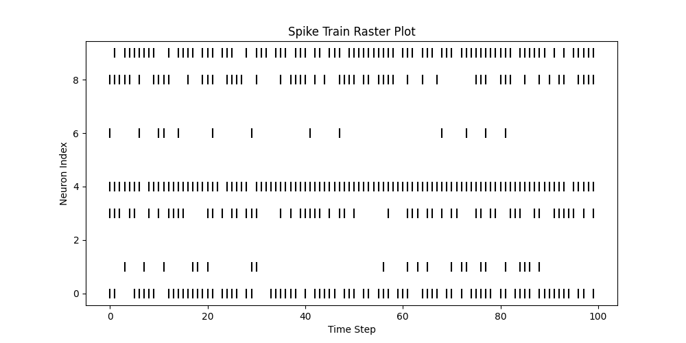
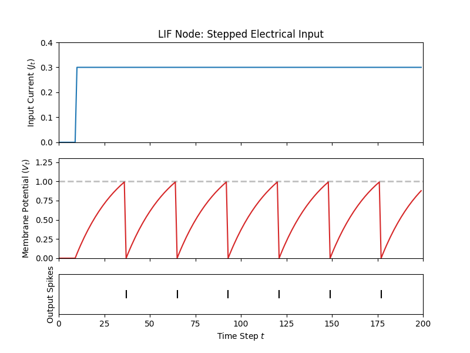
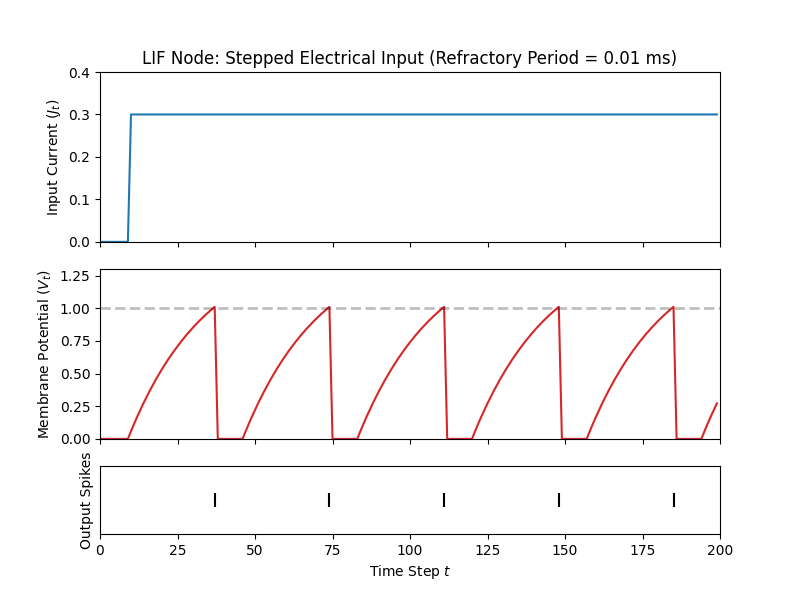
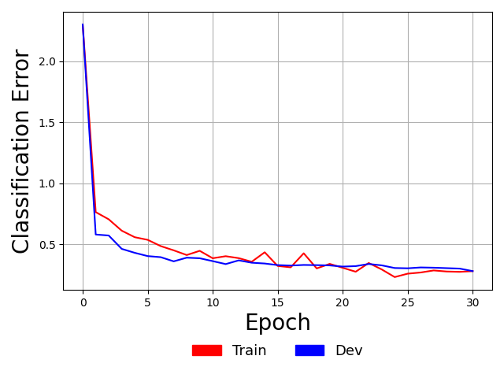

# Walkthrough 7: Spiking Neural Networks

In this demonstration, we will design a three layer spiking neural network (SNN).
We will specifically cover the special base spiking node classes within ngc-learn's
nodes-and-cables system, particularly examining the properties of the leaky
integrate-and-fire (LIF) node with respect to modeling voltage and spike trains.
In addition, we will cover how to set up a simple online learning process for
training the SNN on the MNIST database.
After going through this demonstration, you will:

1.  Learn how to use/setup the `SpNode_LIF` (the LIF node class) and the
`SpNode_Enc` (the Poisson spike train node class) and visualize the voltage
as a function of input current and the resulting spikes in a raster plot.
2.  Build a spiking network using the `SpNode_LIF` and the `SpNode_Enc` nodes
and simulate its adaptation to MNIST image patterns by setting up a simple
algorithm known as broadcast feedback alignment.

Note that the folders of interest to this demonstration are:
+ `walkthroughs/demo7/`: this contains the necessary simulation scripts
+ `walkthroughs/data/`: this contains the zipped copy of the digit image arrays

## Encoding Data Patterns as Poisson Spike Trains

Before we start crafting a spiking neural network (SNN), let us first turn our
attention to the data itself. Currently, the patterns in the MNIST database
are in continuous/real-valued form, i.e., pixel values normalized to the range of
$[0,1]$. While we could directly use them as input into a network of LIF neurons,
as was done in [1] (meaning we would copy the literal data vector each step in
time, much as we have done in previous walkthroughs), it would be better if we
could first convert them to binary spike trains themselves given that SNNs are technically
meant to process time-varying information. While there are many ways to encode the
data as spike trains, we will take the simplest approach in this walkthrough and
work with an encoding scheme known as rate encoding.

Specifically, rate encoding entails normalizing the original real-valued data vector
$\mathbf{x}$ to the range of $[0,1]$ and then treating each dimension $\mathbf{x}_i$
as the probability that a spike will occur, thus yielding (for each dimension) a rate code
with a value of $\mathbf{s}_i$. In other words, each feature drives a Bernoulli
distribution of the form where $\mathbf{s}_i \sim \mathcal{B}(n, p)$ where $n = 1$
and $p = \mathbf{x}_i$. This, over time, results in a Poisson process where the
rate of firing is dictated to be solely in proportion to a feature's value.

To rate code your data, let's start by using a simple function in ngc-learn's
`ngclearn.utils.stat_utils` module. Assuming we have a simple $10$-dimensional
data vector $\mathbf{x}$ (of shape `1 x 10`) with values in the range of
$[0,1]$, we can convert it to a spike train over $100$ steps in time as follows:

```python
import tensorflow as tf
import numpy as np
from ngclearn.utils import stat_utils as stat
import ngclearn.utils.viz_utils as viz

seed = 1990
tf.random.set_seed(seed=seed)
np.random.seed(seed)

z = np.zeros((1,10),dtype=np.float32)
z[0,0] = 0.8
z[0,1] = 0.2
z[0,3] = 0.55
z[0,4] = 0.9
z[0,6] = 0.15
z[0,8] = 0.6
z[0,9] = 0.77
spikes = None
for t in range(100):
    s_t = stat.convert_to_spikes(z, gain=1.0)
    if t > 0:
        spikes = tf.concat([spikes, s_t],axis=0)
    else:
        spikes = s_t
spikes = spikes.numpy()

viz.create_raster_plot(spikes, s=100, c="black")
```

where we notice that in the first dimension `[0,0]`, fifth dimension `[0,4]`,
and the final dimension `[0,9]` set to fairly high spike probabilities. This
code will produce and save locally to disk the following raster plot for
visualizing the resulting spike trains:

 <br>

where we see that the first, middle/fifth, and tenth dimensions do indeed
result in denser spike trains. Raster plots are simple visualization tool in
computational neuroscience for examining the trial-by-trial variability of
neural responses and allow us to graphically examine timing (or the frequency
of firing), one of the most important aspects of neuronal action potentials/spiking
patterns. Crucially notice that the function ngc-learn offers for converting
to Poisson spike trains does so on-the-fly, meaning that you can generate binary
spike pattern vectors from a particular normalized real-valued vector whenever you
need to (this facilitates online learning setups quite well). If you examine
the API for the `convert_to_spikes()` routine, you will also notice that you can
also control the firing frequency further with the `gain` argument -- this is
useful for recreating certain input spike settings report in certain computational
neuroscience publications. For example, with MNIST, it is often desired that
the input firing rates are within the approximate range of $0$ to $63.75$ Hertz (Hz)
(as in [2]) and this can easily be recreated for data normalized to $[0,1]$ by setting
the `gain` parameter to `0.25` (we will also do this for this walkthrough
for the model we will build later).

Note that another method offered by ngc-learn for converting your real-valued
data vectors to Poisson spike trains is through the
[SpNode_Enc](ngclearn.engine.nodes.spnode_enc). This node is a convenience node
that effectively allows us to do the same thing as the code snippet above
(for example, upon inspecting its API, you will see an argument to its constructor
is the `gain` that you can set yourself). However, the `SpNode_Enc` conveniently allows
the spike encoding process to be directly integrated into the `NGCGraph` simulation  
object that you will ultimately want to create (as we will do later in this walkthrough).
Furthermore, internally, this node provides you with some useful optional
compartments that are calculated during simulation such as variable traces/filters.

## The Leaky Integrate-and-Fire Node

Now that we have considered how to transform our data into Poisson spike trains
for use with an SNN we can move on to building the SNN itself. One of the core
nodes offered by ngc-learn to do this is the
[SpNode_LIF](ngclearn.engine.nodes.spnode_lif), or the leaky integrate-and-fire (LIF)
node (also referred to as the leaky integrator in some papers). This node
has quite a few compartments and constants but only a handful are important
for understanding how this model governs spiking/firing rates during
an `NGCGraph`'s simulation window. Specifically, in this walkthrough, we will
examine the following compartments -- `dz_bu, dz_td, Jz, Vz, Sz, ref` formally
labeled as $\mathbf{dz}_{bu}$, $\mathbf{dz}_{td}$, $\mathbf{j}_t$,
$\mathbf{v}_t$, $\mathbf{s}_t$, and $\mathbf{r}_t$ (the subscript $t$ indicates
that this compartment variable takes on a certain value at a certain time step
$t$)-- and the following constants -- `V_thr, dt, R, C, tau_m, ref_T` formally labeled
as $V_{thr}$, $\Delta t$, $R$, $C$, $\tau_{m}$, and $T_{ref}$. (The other compartments
and constants that we do not cover here are useful for more advanced
simulations/other situations and will be discussed in future tutorials/walkthroughs.)

Now let us unpack this node by first defining the compartments:

+ $\mathbf{dz}_{bu}$ and $\mathbf{dz}_{td}$ are where signals from external sources
(such as other nodes) are to be deposited (much like the state node [SNode](ngclearn.engine.nodes.snode)) -
note these signals contribute directly to the electrical current of the neurons within this node
+ $\mathbf{j}_t$: the current electrical current of the neurons within this node (specifically
computed in this node's default state as $\mathbf{j}_t = \mathbf{dz}_{bu} + \mathbf{dz}_{td}$)
+ $\mathbf{v}_t$: the current membrane potential of the neurons within this node
+ $\mathbf{S}_t$: the current recording/reading of any spikes produced by this node's neurons
+ $\mathbf{r}_t$: the current value of the absolute refractory variables - this accumulates with time (and forces neurons to rest)

and finally the constants:

+ $V_{thr}$: threshold that a neuron's membrane potential must overcome before a spike is transmitted
+ $\Delta t$: the integration time constant, on the order of milliseconds (ms)
+ $R$: the neural (cell) membrane resistance, on the order of mega Ohms ($M \Omega$)
+ $C$: the neural (cell) membrane capacitance, on the order of picofarads ($pF$)
+ $\tau_{m}$: membrane potential time constant (also $\tau_{m} = R * C$  - resistance times capacitance)
+ $T_{ref}$: the length of a neuron's absolute refractory period

With above defined, we can now explicitly lay out the underlying (linear) ordinary
differential equation that the `SpNode_LIF` evolves according to:

$$
\tau_m \frac{\partial \mathbf{v}_t}{\partial t} = (-\mathbf{v}_t + R \mathbf{j}_t), \; \mbox{where, } \tau_m = R C
$$

and with some simple mathematical manipulations (leveraging the method of finite differences),
we can derive the Euler integrator employed by the `SpNode_LIF` as follows:

$$
\tau_m \frac{\partial \mathbf{v}_t}{\partial t} &= (-\mathbf{v}_t + R \mathbf{j}_t) \\
\tau_m \frac{\mathbf{v}_{t + \Delta t} - \mathbf{v}_t}{\Delta t} &= (-\mathbf{v}_t + R \mathbf{j}_t) \\
\mathbf{v}_{t + \Delta t} &= \mathbf{v}_t + (-\mathbf{v}_t + R \mathbf{j}_t) \frac{\Delta t}{\tau_m }
$$

where we see that above integration tells us that the membrane potential of this node varies
over time as a function of the sum of its input electrical current $\mathbf{j}_t$
(multiplied by the cell membrane resistance) and a leak (or decay) $-\mathbf{v}_t$
modulated by the integration time constant divided by the membrane time constant.
The `SpNode_LIF` allows you to control the value of $\tau_m$ either directly (and
will tell the node to set $R=1$ and $C=\tau_m$ and the node will ignore any
argument values provided for $R$ and $C$) or via $R$ and $C$.
(Notice that this default state of the `SpNode_LIF` assumes that the input spike
signals from external nodes that feed into $\mathbf{dz}_{bu}$ and $\mathbf{dz}_{td}$)
result in an instantaneous jump in each neuron's synaptic current $\mathbf{J}_t$ but
this assumption/simplification can be removed by setting `SpNode_LIF`'s argument
`zeta` to any non-zero value in order to tell the node that it needs to integrate
its synaptic current over time - we will not, however, cover this functionality
in this walkthrough.)

In effect, given the above, every time the `SpNode_LIF`'s `.step()` function is
called within an `NGCGraph` simulation object, the above Euler integration of
the membrane potential differential equation is happening each time step. Knowing this,
the last item required to understand ngc-learn's LIF node's computation is
related to its $\mathbf{s}_t$. The spike reading is computed simply by
comparing the current membrane potential $\mathbf{v}_t$ to the constant threshold
defined by $V_{thr}$ according to the following piecewise function:

$$
\mathbf{s}_{t, i} = \begin{cases}
                       1 & \mathbf{v}_{t, i} > V_{thr} \\
                       0 & \mbox{otherwise.}
                    \end{cases}
$$

where we see that if the $i$th neuron's membrane potential exceeds the threshold
$V_{thr}$, then a voltage spike is emitted. After a spike is emitted, the $i$th
neuron within the node needs to be reset to its resting potential and this done
with the final compartment we mentioned, i.e., the refractory variable $\mathbf{r}_t$.
The refractory variable $\mathbf{r}_t$ is important for hyperpolarizing the
$i$th neuron back to its resting potential (establishing a critical reset mechanism
-- otherwise, the neuron would fire out of control after overcoming its
threshold) and reducing the amount of spikes generated over time. This reduction
is one of the key factors behind the power efficiency of actual neuronal systems.
Another aspect of ngc-learn's refractory variable is the temporal length of the reset itself,
which is controlled by the $T_{ref}$ (`T_ref`) constant -- this yields what is known as the
absolute refractory period, or the interval of time at which a second action potential
absolutely cannot be initiated. If $T_{ref}$ is set to be greater than
zero, then the $i$th neuron that fires will be forced to remain at its resting
potential of zero for the duration of this refractory period.

Now that we understand the key compartments and constants inherent to an LIF
node, we can start simulating one.
Let us visualize the spiking pattern of our LIF node by feeding into it
a step current, where the electrical current starts at $0$ then switches to
$0.3$ at $t = 10$ (ms). Specifically, we can plot the input current, the neuron's
voltage, and its output spikes as follows:

```python
import os
import tensorflow as tf
import numpy as np
import matplotlib.pyplot as plt

# import general simulation utilities
import ngclearn.utils.viz_utils as viz
from ngclearn.engine.nodes.spnode_lif import SpNode_LIF
from ngclearn.engine.ngc_graph import NGCGraph

seed = 1990 # 69
os.environ["CUDA_VISIBLE_DEVICES"]="0"
tf.random.set_seed(seed=seed)
np.random.seed(seed)

dt = 1e-3 # integration time constant
R = 5.0 # in mega Ohms
C = 5e-3 # in picofarads
V_thr = 1.0
ref_T = 0.0 # length of absolute refractory period
leak = 0
beta = 0.1
z1_dim = 1
integrate_cfg = {"integrate_type" : "euler", "dt" : dt}
# set refractory period to be really short
spike_kernel = {"V_thr" : V_thr, "ref_T" : ref_T, "R" : R, "C" : C}
trace_kernel = {"dt" : dt, "tau" : 5.0}

# set up a single LIF node system
lif = SpNode_LIF(name="lif_unit", dim=z1_dim, integrate_kernel=integrate_cfg,
                 spike_kernel=spike_kernel, trace_kernel=trace_kernel)
model = NGCGraph()
model.set_cycle(nodes=[lif])
info = model.compile(batch_size=1, use_graph_optim=False)

# create a synthetic electrical step current
current = tf.concat([tf.zeros([1,10]),tf.ones([1,190])*0.3],axis=1)

curr_rec = []
voltage = []
refract = []
spike_train = []

# simulate the LIF node
model.set_to_resting_state()
for t in range(current.shape[1]):
    I_t = tf.ones([1,1]) * current[0,t]
    curr_rec.append(float(I_t))
    model.clamp([("lif_unit", "Jz", I_t)])
    model.step(calc_delta=False)
    J_t = model.extract("lif_unit", "Jz")
    V_t = model.extract("lif_unit", "Vz")
    S_t = model.extract("lif_unit", "Sz")
    ref = model.extract("lif_unit", "ref")

    refract.append(float(ref))
    voltage.append(float(V_t))
    spike_train.append(float(S_t))

cur_in = np.asarray(curr_rec)
mem_rec = np.asarray(voltage)
spk_rec = np.asarray(spike_train)
viz.plot_lif_neuron(cur_in, mem_rec, spk_rec, refract, dt, thr_line=V_thr, max_mem_val=1.3,
                    title="LIF Node: Stepped Electrical Input")
```

which produces the following plot (saved as `lif_plot.png` locally to disk):



where we see that, given a build-up over time in the neuron's membrane potential
(since the current is constant and non-zero after $10$ ms), a spike is emitted
once the value of the membrane potential exceeds the threshold (indicated by
the dashed horizontal line in the middle plot) $V_{thr} = 1$.
Notice that if we play with the value of `ref_T` (the refactory period $T_{ref}$)
and change it to something like `ref_T = 10 * dt` (ten times the integration time
constant), we get the following plot:



where we see that after the LIF neuron fires, it remains stuck at its resting
potential for a period of $0.01$ ms (the short flat periods in the red curve
starting after the first spike).

## Learning a Spiking Network with Broadcast Alignment

Now that we examined the `SpNode_Enc` and analyzed a single `SpNode_LIF`, we
can now finally build a complete SNN model to simulate. Building the SNN is
no different than any other system in ngc-learn and is done as follows (note that
the settings shown below follow closely those reported in [2]):

```python
x_dim = # dimensionality of input data
z_dim = # number of neurons for the internal layer
y_dim = # dimensionality of output space (or number of classes)
dt = 0.25 # integration time constant
tau_mem = 20 # membrane potential time constant
V_thr = 0.4 # spiking threshold
# Default for rec_T of 1 ms will be used - this is the default for SpNode_LIF(s)
integrate_cfg = {"integrate_type" : "euler", "dt" : dt}
spike_kernel = {"V_thr" : V_thr, "tau_mem" : tau_mem}
trace_kernel = {"dt" : dt, "tau" : 5.0}

# set up system -- notice for z2, a gain of 0.25 yields spike frequency of 63.75 Hz
z2 = SpNode_Enc(name="z2", dim=x_dim, gain=0.25, trace_kernel=trace_kernel)
mu1 = SNode(name="mu1", dim=z_dim, act_fx="identity", zeta=0.0)
z1 = SpNode_LIF(name="z1", dim=z_dim, integrate_kernel=integrate_cfg,
                spike_kernel=spike_kernel, trace_kernel=trace_kernel)
mu0 = SNode(name="mu0", dim=y_dim, act_fx="identity", zeta=0.0)
z0 = SpNode_LIF(name="z0", dim=y_dim, integrate_kernel=integrate_cfg,
                spike_kernel=spike_kernel, trace_kernel=trace_kernel)
e0 = ENode(name="e0", dim=y_dim)
t0 = SNode(name="t0", dim=y_dim, beta=beta, integrate_kernel=integrate_cfg, leak=0.0)
d1 = FNode_BA(name="d1", dim=z_dim, act_fx="identity") # BA teaching node

# create cable wiring scheme relating nodes to one another
init_kernels = {"A_init" : ("gaussian", wght_sd), "b_init" : ("zeros",)}
dcable_cfg = {"type": "dense", "init_kernels" : init_kernels, "seed" : seed}
pos_scable_cfg = {"type": "simple", "coeff": 1.0}
neg_scable_cfg = {"type": "simple", "coeff": -1.0}

z2_mu1 = z2.wire_to(mu1, src_comp="Sz", dest_comp="dz_td", cable_kernel=dcable_cfg)
mu1.wire_to(z1, src_comp="phi(z)", dest_comp="dz_td", cable_kernel=pos_scable_cfg)
z1_mu0 = z1.wire_to(mu0, src_comp="Sz", dest_comp="dz_td", cable_kernel=dcable_cfg)
mu0.wire_to(z0, src_comp="phi(z)", dest_comp="dz_td", cable_kernel=pos_scable_cfg)
z0.wire_to(e0, src_comp="Sz", dest_comp="pred_mu", cable_kernel=pos_scable_cfg)
t0.wire_to(e0, src_comp="phi(z)", dest_comp="pred_targ", cable_kernel=pos_scable_cfg)
e0.wire_to(t0, src_comp="phi(z)", dest_comp="dz_td", cable_kernel=neg_scable_cfg)
```

this sets up an SNN structure with three layers -- an input layer `z2` containing
the Poisson spike train nodes (which will be driven by input data `x`), an internal
layer of LIF nodes, and an output layer of LIF nodes. We have also opted to
simplify the choice of meta-parameters and directly set the membrane potential
constant `tau_mem` directly (instead of messing with membrane resistance and capacitance).
Nothing else is out of the ordinary in creating an `NGCGraph` except that we have
also included a simple specialized convenience node `d1`, which will serve as a special part
of our SNN structure that will naturally give us an easy way to adapt this SNN's
parameters with an online learning process. This convenience node is not all
too different from a forward node (`FNode`) except it has been adapted to a sort of
"teaching node" format that effectively takes in its input signals in its `dz`
compartment and multiplicatively combines them with the special approximate
derivative (or dampening) function developed in [1] (see
[FNode_BA](ngclearn.engine.nodes.fnode_ba) for the details of this special
dampening function).

With the above nodes and cables set up all the remains is to define the SNN's
synaptic learning/adjustment rules. Given our special teaching node `d1`, we
can directly construct a simple learning scheme based on an algorithm known
as broadcast alignment (BA) [1], which, in short, posits that a special set of
error feedback synapses (that a randomly initialized and never adjusted
during simulation) can directly transform and carry error signals from a particular
spot (such as the output layer of an SNN) back to any internal layer as needed.
These backwards transmitted signals only need to travel down a very short feedback
pathway and the outputs of these randomly projected error signals (when combined
with the special dampening function mentioned above) can serve as powerful
teaching signals to drive change in synaptic efficacy. To craft the BA
approach to learning an SNN, we can then utilize the feedback pathway created
by `d1` to drive learning through ngc-learn's typical Hebbian updates as shown
below:

```python
# set up the SNN update rules and make relevant edges aware of these
from ngclearn.engine.cables.rules.hebb_rule import HebbRule

rule1 = HebbRule() # create a local weighted Hebbian rule for internal layer
rule1.set_terms(terms=[(z2,"z"), (d1,"phi(z)")], weights=[1.0, (1.0/(x_dim * 1.0))])
z2_mu1.set_update_rule(update_rule=rule1, param=["A", "b"])

rule2 = HebbRule() # create a local weighted Hebbian rule for output layer
rule2.set_terms(terms=[(z1,"Sz"), (e0,"phi(z)")], weights=[1.0, (1.0/(z_dim * 1.0))])
z1_mu0.set_update_rule(update_rule=rule2, param=["A", "b"])
```

where we notice two special things that the above code is doing in contrast to
prior walkthroughs: 1) we have exposed the lower-level local rule system of
ngc-learn which allows the user/experimenter to define their own custom
local updates if needed (the default in ngc-learn is a simple two-term,
unweighted Hebbian adjustment rule, which is what you have been using in all
prior walkthroughs without knowing it), and 2) we have modified the typical
Hebbian update rule to be a weighted Hebbian update by setting the weights
of the post-activation terms to be a function of the number of pre-synaptic neurons
for a given layer (this is akin to a layer-wise learning rate and provided a simple
means of initializing the step size for gradient descent as in [1]).

With the learning rules, we can continue as normal and initialize and compile
our the `NGCGraph` for our desired SNN as follows:

```python
# Set up graph - execution cycle/order
model = NGCGraph(name="snn_ba")
model.set_cycle(nodes=[z2, mu1, z1, mu0, z0, t0])
model.set_cycle(nodes=[e0])
model.set_cycle(nodes=[d1])
info = model.compile(batch_size=batch_size)
opt = tf.keras.optimizers.SGD(1.0) # create an SGD optimization rule with no learning rate
```

only noting that, because we have set our `NGCGraph` to use weighted Hebbian updates,
we do not need to specify a learning rate for our stochastic gradient descent
optimization rule (as the learning rates are baked into the Hebbian rules now).

The last item we would like to cover is how specifically the SNN system we have
created above will be simulated. Normally, after building an `NGCGraph`, you
would generally use its `.settle()` function to simulate the processing of
data over a window of time (of length `K`). Although you could technically do
this with the SNN too, since the SNN is meant to learn online across spike
trains, it is simpler and more appropriate to use ngc-learn's lower-level online
simulation API (which was discussed in [Tutorial \#1](../tutorials/lesson1.md)).
This will specifically allow us to integrate our SGD optimization rule directly into
and extract some special statistics from the step-by-step evolution process of our
SNN as it processes data-driven Poisson spike trains. The code we would need to
do this is below:

```python
x = # input pattern vector/matrix (real-valued & normalized to [0,1])
y = # labels/one-hot encodings associated with x

T = 100 # ms (length of simulation window)

model.set_to_resting_state() # set all neurons to their resting potentials
y_count = y * 0
y_hat = 0.0
for t in range(T):
    model.clamp([("z2", "z", x), ("t0", "z", y_)])
    delta = model.step(calc_delta=True)
    y_hat = model.extract("z0", "Jz") + y_hat
    y_count += model.extract("z0", "Sz")
    if delta is not None:
        opt.apply_gradients(zip(delta, model.theta)) # update synaptic efficacies
model.clear() # clear simulation object memory
# compute approximate Multinoulli distribution
y_hat = tf.nn.softmax(y_hat/T)
# get predicted labels from spike counts
y_pred = tf.cast(tf.argmax(y_count,1),dtype=tf.int32)
```

where we see that we have explicitly designed the simulation loop by hand,
giving us the flexibility to introduce the synaptic updates at each time step.
Notice that we also added in some extra statistics `y_hat` and `y_count` -- `y_hat`
is the approximate label distribution produced by our SNN over a stimulus window
of `T = 100` milliseconds and `y_count` stores the spike counts (one per class
label/output node) for us to finally extract the model's global predicted labels
(by taking the argmax of `y_count` to get `y_pred`).

The above code (as well as a few extra convenience utilities/wrapper functions)
has been integrated into the Model Museum as the official [SNN_BA](../museum/snn_ba.md),
which is the model that is imported for you in the provided `train_sim.py` script
(Note: unzip the file `mnist.zip` in the `/walkthroughs/data/` directory if you have
not already.)
Go ahead and run `train_sim.py` as follows:

```console
$ python sim_train.py --config=snn/fit.cfg --gpu_id=0
```

which will simulate the training of your SNN-BA on the MNIST database for $30$
epochs. This script will save your trained SNN model to the `/snn/` sub-directory
from which you can then run the evaluation script (which simply simulates your
trained SNN on the MNIST test set but with the synaptic adjustment turned off).
You should get an output similar to the one below:

```console
Ly = 0.32633236050605774  Acc = 0.963699996471405
```

meaning that our three-layer SNN has greater than `96`\% test classification
accuracy (recall that we are counting spikes and, for each row in an evaluated
test mini-batch matrix, the output LIF node with the highest spike count at the end
of `100` ms  is chosen as the SNN's predicted label). This evaluation script
also generates and saves to the `/snn/` sub-directory a learning curve plot
(recorded during the simulated training process) shown below:



where we see that the SNN has decreased its approximate negative log likelihood
from a starting point of about `2.30` nats to about `0.35` nats. This is bearing
in mind that we have estimated class probabilities output by our SNN by
probing and averaging over electrical current values from `100` simulated milliseconds
per test pattern mini-batch. We remark that this constructed SNN is not particularly
deep and with additional layers of `SpNode_LIF` nodes, improvements to its accuracy
and approximate log likelihood would be possible (the BA learning approach would,
in principle, work well for any number of layers). This is motivated by the results
reported in [1], where additional layers were found to improve generalization a
bit more and, as reported in [2], using layers with many more LIF neurons
were demonstrated to boost predictive accuracy (with nearly `6400` LIF neurons).

With that, you have now walked through the process of constructing a full SNN
and fit it to an image pattern dataset.
Note that our `SNN_BA` offers a bit more functionality than the SNN designed in [1]
given that ours directly processes Poisson spike trains while the one in [1]
focused on processing the raw real-valued pattern vectors (copying the input
`x` to each time step). Furthermore, our SNN processing loop usefully approximates
an output distribution by averaging over electrical current inputs (allowing us
to measure its predictive log likelihood).

There is certainly more to the story of spike trains far beyond the model of leaky
integrate-and-fire neurons and Poisson spike train encoding. Notably, there are many,
many more neurobiological details that this type of modeling omits and one
exciting continual development of ngc-learn is to continue to incorporate and test
its dynamics simulator on an ever-increasing swath of spike-based nodes of
increasing complexity and biological faithfulness, such as the Hodgkin–Huxley model [3],
as well as other learning mechanisms it is capable of simulating, such as
spike-timing-dependent plasticity (or STDP, which will be discussed in later
tutorials/walkthroughs) as was used in [2]).


[1] Samadi, Arash, Timothy P. Lillicrap, and Douglas B. Tweed. "Deep learning with
dynamic spiking neurons and fixed feedback weights." Neural computation 29.3
(2017): 578-602. <br>
[2] Diehl, Peter U., and Matthew Cook. "Unsupervised learning of digit recognition
using spike-timing-dependent plasticity." Frontiers in computational
neuroscience 9 (2015): 99. <br>
[3] Hodgkin, Alan L., and Andrew F. Huxley. "A quantitative description of membrane
current and its application to conduction and excitation in nerve." The Journal of
physiology 117.4 (1952): 500.
